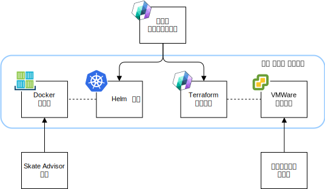
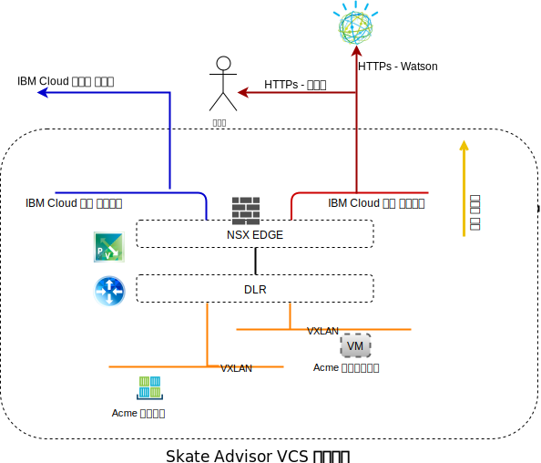
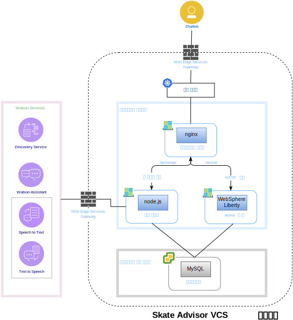

---

copyright:

  years:  2016, 2019

lastupdated: "2018-01-14"

---

# Skate Advisor 컴포넌트

{{site.data.keyword.vmwaresolutions_full}}은 VMware 기술 컴포넌트를 전세계에 있는
{{site.data.keyword.CloudDataCents_notm}}에 배치하는 자동화 기능을 제공합니다. 이 아키텍처는 단일 클라우드 지역으로 구성되며 다음 옵션 중 하나에 있는 여러 클라우드 지역으로 확장하는 기능을
지원합니다.

1. 다른 지역.
2. 동일한 데이터 센터 내에 있는 다른 {{site.data.keyword.cloud_notm}} 팟(Pod).
3. 다른 지역 및 동일한 데이터 센터 내에 있는 다른 {{site.data.keyword.cloud_notm}} 팟(Pod).

{{site.data.keyword.icpfull_notm}} 및 CAM(Cloud Automation Manager) 제품은
온프레미스 가상화 플랫폼에 수동으로 배치할 수 있으며 온프레미스 위치에서 클라우드를
관리할 수 있습니다. 또는 {{site.data.keyword.icpfull_notm}} 및
CAM은 자동화를 통해 기존 또는 새로운 VMware vCenter Server on {{site.data.keyword.cloud_notm}}
배치에 대한 서비스 확장으로 제공되며 {{site.data.keyword.cloud_notm}}에서
클라우드를 관리할 수 있습니다.

{{site.data.keyword.icpfull_notm}}는 컨테이너화된 온프레미스 애플리케이션의
개발 및 관리를 위한 애프리케이션 플랫폼입니다. 컨테이너 오케스트레이터 Kubernetes, 개인용 이미지 저장소, 관리 콘솔 및 모니터링 프레임워크를 포함하는 컨테이너 관리를 위한 통합 환경입니다.

IBM Multi-Cluster Manager는 클라우드 및 클러스터에서 사용자 가시성, 애플리케이션 중심 관리(정책, 배치, 상태, 운영) 및 정책 기반 준수를 제공합니다. IBM Multi-Cluster Manager를 사용하면 Kubernetes 클러스터를 제어할 수 있습니다. 클러스터가 안전하고 효율적으로 작동하며 애플리케이션에서 예상하는 서비스 수준을 제공하는지 확인할 수 있습니다.

{{site.data.keyword.cloud_notm}} Automation Manager는 개발자와 관리자가 비즈니스 요구를 충족시킬 수 있는 {{site.data.keyword.cloud_notm}} Private에서 실행되는 다중 클라우드의 셀프 서비스 관리 플랫폼입니다. Cloud Automation Manager Service Composer를
통해 {{site.data.keyword.icpfull_notm}} 카탈로그에서 하이브리드 클라우드 서비스를 노출시킬 수 있습니다.

## Skate Advisor 물리적 컴포넌트

다음 다이어그램은 애플리케이션 현대화 인프라 구현에서 Acme Skate Advisor 애플리케이션의 참조 구현을 설명합니다.

그림 1. Skate Advisor 물리적 컴포넌트

Skate Advisor 애플리케이션은 웹과 마이크로 서비스 컨테이너에 요청을 프록시하기 위해 nginx 컨테이너 및 Watson과 상호작용하는
마이크로 서비스 기반 컴포넌트로 기존 Acme 웹 애플리케이션을 확장합니다.

Skate Advisor 애플리케이션은 필수 호스팅 인프라를 제공하는 애플리케이션 현대화 플랫폼을 활용합니다.

### 애플리케이션 패키징 및 배치

애플리케이션은 다음 요소가 포함된 CAM Orchestration으로 배치됩니다.
* 서비스 오케스트레이션 - CAM 서비스 오케스트레이션은 서비스 패싯으로 배치할 Terraform 템플리트 및 Helm 차트를 설명하는 워크플로우 리소스입니다. 서비스는 공개될 수 있고 전체 배치를 오케스트레이션하는 제어 아티팩트입니다.
* Helm 차트 - Helm 차트는 로컬 {{site.data.keyword.icpfull_notm}} 저장소에 상주하며 컨테이너와 기타 리소스를 {{site.data.keyword.icpfull_notm}}에 배치합니다. Helm 차트는
포함된 Kubernetes 리소스를 설명합니다.
  - 컨테이너 배치
  - 서비스
  - Ingress
  - 규칙
  - 엔드포인트

* Docker 이미지 - Docker 이미지에는 운영 체제(ubuntu), 미들웨어(WebSphere Liberty, nginx) 및
Skate Advisor와 Skate Store 코드가 포함됩니다. Docker 이미지는 실행 중인 컨테이너에 배치되는 정적 오브젝트입니다.
* Terraform 템플리트 - Terraform 템플리트는 배치될 클라우드 리소스를 설명하는 파일입니다. Skate Advisor의 경우, mysql로 사전 설치되는 ubuntu 템플리트와 데이터베이스 스키마에 대해 설명합니다.
* VMWare 템플리트 - VMWare 템플리트는 mysql과 데이터베이스 스키마가 사전 설치된 Ubuntu 템플리트입니다.

그림 2. CAM 오케스트레이션

### 로드 밸런싱 및 프록싱

로드 밸런싱과 프록싱은 {{site.data.keyword.icpfull_notm}} Ingress 제어기 컴포넌트를
통해 구현됩니다. 이 컴포넌트는 컨테이너 스케일링과 장애 복구를 원활하게 처리합니다.

애플리케이션 프록싱은 다음과 같이 로드 밸런싱되는 nginx 컨테이너에 의해 제공됩니다.

표 1. Skate Advisor 역방향 프록시 규칙

URL	|엔드포인트
---|---
/acme	|Acme Web Container 서비스
/acme/api	|Skate Advisor 서비스
/acme/api/explorer	|Skate Advisor 서비스

컨테이너에는 시스템 요구에 따라 스케일 축소 및 확장될 수 있는 예측 불가능한 IP 주소가 있습니다. 이 문제를 해결하기 위해 {{site.data.keyword.icpfull_notm}} 서비스는 시스템 내에서
실시간 IP 주소 분석을 수행하는 데 사용됩니다. 

### Acme Skate 웹 애플리케이션
Acme Skate 웹 애플리케이션은 Spring Framework를 기반으로 하는 Java 플랫폼, 엔터프라이즈 에디션(Java 플랫폼, 엔터프라이즈 에디션)
애플리케이션입니다. 이 애플리케이션은 WebSphere Liberty 컨테이너에 배치됩니다.

### Acme Skate Advisor 애플리케이션
Acme Skate Advisor 애플리케이션은 WebSphere Liberty 컨테이너에 배치되는 마이크로 서비스 기반 애플리케이션입니다. nginx 웹 서버는 마이크로 서비스에 프론트 엔드를 제공합니다.

### Acme Skate 데이터베이스
Acme Skate 데이터베이스는 vSphere 관리 가상 머신에 배치되는 MySQL 데이터베이스입니다.

### 통신 개요
Skate Advisor에는 다음 통신이 필요합니다.
-	웹 컨테이너에서 시스템 사용자로의 통신.
-	Advisor 및 웹 컨테이너에서 Watson 서비스로의 통신.
-	컨테이너와 구현의 가상 머신 측면 사이의 통신.

애플리케이션 현대화 플랫폼은 이러한 목표를 달성하기 위해 다음 컴포넌트를 사용하여 설계되었습니다.

그림 3. 공용 네트워크 액세스

{{site.data.keyword.cloud_notm}}에는 두 가지 네트워크가 있습니다. 공용 네트워크를 사용하면 인터넷에서 서버에 도달할 수 있으며 사설 네트워크를 사용하면 서버가 모든 {{site.data.keyword.CloudDataCents_notm}}의
고속 백본을 통해 서로 통신할 수 있습니다.

VRA(Virtual Routing Appliance)를 사용하면 고객이 VLAN을 어플라이언스와 연관시켜 사설 및 공용 네트워크 트래픽을
라우팅할 수 있습니다.
vCenter Server 서버 NSX Edge와 {{site.data.keyword.containerlong_notm}} 인프라 모두 공용
네트워크를 기본 라우트로 설정하고 사설 네트워크를 표준 10.0.0.0/8 라우트로 설정하여
구성됩니다.

정적 라우트는 정의된 NSX VXLAN을 위한 VRA 어플라이언스에 대한 {{site.data.keyword.containerlong_notm}}
인프라에 필수적입니다. NSX Edge에서, 사설 네트워크를 통한 VRA로 BGP 피어링을 구성하면 NSX VXLANs의 라우트 알림 및 간섭이 가능합니다. 이 피어링을 사용하면 NSX VXLAN 오버레이 네트워크가 {{site.data.keyword.cloud_notm}}
백본으로 그리고 그 반대로 통신할 수 있습니다.

### 소프트웨어 컴포넌트 맵핑

Skate Advisor 애플리케이션은 다음 소프트웨어 컴포넌트를 사용합니다.

그림 4. Skate Advisor 소프트웨어 맵핑

다음 소프트웨어 컴포넌트가 사용됩니다.

* nginx - 역방향 프록시 서비스를 애플리케이션에 제공합니다.
마이크로 서비스와 애플리케이션 요청은 정확한 컨테이너 엔드포인트로 분배됩니다.
* WebSphere Liberty - Spring 기반
Java 플랫폼, 엔터프라이즈 에디션 애플리케이션인 Acme 애플리케이션을 호스트합니다.
* Node.js - 마이크로 서비스 프레임워크를 챗봇에 제공합니다. 이 애플리케이션은 Watson의 서비스를 사용합니다.
* mysql - 이 애플리케이션 데이터베이스는 Oracle Mysql에서 제공됩니다.
* JavaScript - 챗봇은 클라이언트 브라우저에 호스트되는 JavaScript 기반 애플리케이션입니다. 챗봇은 Node.js 기반 마이크로 서비스를 통해 Watson과 통신합니다.

## 관리 개요

Acme Skate Advisor는 {{site.data.keyword.cloud_notm}}에 상주하며
Architecture의 중요한 부분입니다. {{site.data.keyword.cloud_notm}}에는 다음 아키텍처가 있습니다.

그림 5. 클라우드 관리

이 다이어그램은 온프레미스 vCenter 및 {{site.data.keyword.containerlong_notm}} 서비스에 대한 연결을 통해 vCenter
Server 인스턴스에 배치된 {{site.data.keyword.icpfull_notm}} 및 CAM을 나타냅니다.
CAM을 사용하면, 시스템 관리자와 개발자가 가상 머신을 온프레미스로 또는
{{site.data.keyword.icpfull_notm}} 및 {{site.data.keyword.containerlong_notm}}
클러스터에 대한 vCenter Server 인스턴스에 배치할 수 있습니다. 

다이어그램에서 CAM은 vCenter, 클라우드 제공자, {{site.data.keyword.icpfull_notm}} 및
{{site.data.keyword.containerlong_notm}} 환경에 클라우드 연결을 논리적으로 작성합니다. {{site.data.keyword.icpfull_notm}}
클러스터는 각 데이터 센터/클라우드 환경에 배치되며, MCM은 {{site.data.keyword.icpfull_notm}} 클러스터를 단일 관리 보기에
연결하는 메커니즘을 제공합니다.

### 관련 링크

* [vCenter Server on {{site.data.keyword.cloud_notm}} with Hybridity Bundle 개요](../vcs/vcs-hybridity-intro.html)
