---

copyright:

  years:  2016, 2019

lastupdated: "2019-02-15"

---

# 머리말
{: #vcscar-preface}

그림 1. 자체적으로 고안한 언어

## 스케이트보딩 언어 소개
{: #vcscar-preface-intro}

스케이트 보더가 움직임과 하위 움직임을 트릭에 결합하는 방식은 현재 일어나고 있는 일에 대한 물리학적인 면을 기반으로 일종의 문법이나 구문을 부과합니다. 유사한 이유로 발전된 화학에 대한 명명법이 있습니다. 요즘에는 한 지역에 있는 스케이터가 다른 지역에 있는 스케이터에게 트릭의 이름을 텍스트로 보낼 수 있으며, 이를 통해 복잡한 움직임을 이해할 수 있습니다.

언어의 풍부함은 스케이트보딩 자체의 복잡함에 의한 것입니다. 보드의 움직임은 복잡하여 수십 여개의 기본 트릭을 여러 방식으로 수행할 수 있으므로 엄청난 수의 조합이 생성됩니다. 각 구성요소에 대한 접두부-루트-접미부 구조는 보드와 라이더 모두의 실제 운동량 세트에 해당하는 모든 요소나 움직임이 연결되는 방식을 나타냅니다. 힘의 물리적인 방향과 역학은 서로 맞거나 맞지 않는 것을 판별하고, 이것이 해당 구문을 부과하는 방식입니다.

트릭은 라이더의 보드의 테일이나 노즈에서 이루어지는 *알리(Ollie)* 또는
*널리(Nollie)*(앞쪽 발 또는 뒷쪽 발에 해당)로 수행됩니다. 보드는 시계 방향이나 시계 반대 방향으로 세 축에서 반복되는 조합으로 플립하고 롤링하고 텀블링합니다. 그런 다음 라이더는 움직임을 보드 움직임과 쌍으로 만듭니다. 이는 방향, 회전, "스탠스" 및 보드의 플립 방향으로 회전하는지 아니면 반대로 회전하는지에 따라 여러 차원을 반복에 추가합니다.

마지막 두 변수는 추가 설명이 필요합니다. 먼저
*스탠스(stance)*는 직선적인 방향과 쉽게 혼동됩니다. 스케이터는 모두
왼발을 앞쪽에 두는지 또는 오른발을 앞쪽에 두는지와 같은 기본적인 스탠스를 가지고 있습니다.
*스위치*(스위치-스탠스) 트릭을 수행한다는 것은 야구의 스위치-타자와 유사하게 미러 이미지임을 의미합니다. 역방향은 부수적인 것입니다. 주요한 차이점은 주로 사용하는 손 또는 "주로 사용하는 발" 중 하나입니다.  따라서
*스위치*를 수행한 트릭은 그것이 역방향이기 때문이 아니라 모든 운동 기능이 약한 쪽 또는
"잘못된" 발로 수행된다는 것 때문에 더 많은 크레딧을 받을 가치가 있습니다. 단순히 역방향 트릭 또는 "페이키(fakie)"를 수행한다는 것은
단순히 방향에 마이너스 기호를 붙이는 것이며 단지 조금 더 어려운 동일한 모든 운동 기능을 포함합니다.

상위 레벨의 스케이터에게 중요한 두 번째 묘미는 몸과 관련하여 보드를 플립하고 회전(2축)하는 방법에 따라
*인워드* 또는 *아웃워드* 플립에 적용됩니다. 플립 트릭은
보드의 한쪽 에지에서 한 발을 굴리는 것입니다.
*킥플립(kickflip)*은 발끝에서 시계 방향으로 굴리는 것이지만 *힐플립(heelflip)*은
움직임의 자연스러운 흐름에 따라 또는 그 반대 방향으로 플립하는 것입니다. 이와 같이 인워드 플립은 부자연스럽기 때문에
*하드플립(hard-flip)*이라는 별도의 용어를 사용합니다. 
*널리-인워드-킥플립(nollie-inward-kickflip)*은 *널리-하드플립(nollie-hardflip)*과 같은 말이며
이는 자연스러운 것에서 어긋난 동작을 수행하므로 보다 정밀함이 요구됩니다.

그러므로 이 접두부-루트-접미부 구조의 각 구성요소는
회전, 방향 및 스탠스라는 3가지 추가 2진 요소로 분할될 수 있습니다.
일부 트릭에서는 플립이 인워드인지 아웃워드인지도 지정해야 합니다. 반복 횟수가 눈덩이처럼 불어나는 트릭 결합 가능성이 없다면 스케이팅은 어린이들의 놀이가 될 것입니다. 여러 개의 기본 트릭을 이중, 삼중 또는 상위 프로 선수의 경우 5중 또는 6중으로 구성된 단일 클러스터로 함께 변환할 수 있습니다.

지금까지 실제적인 반복 횟수는 수백 여개로 잘 변환되었으며, 이는 우리를 위한 테이블을 설정합니다.
실제 복잡도는 *스트리트스케이팅*에서 보여지며 이는 조합 수를 수천 개로 확장합니다.

90년대 초반에 스케이터는 일찌감치 플랫 그라운드 트릭을 완성했으며
이를 계단, 선반, 난간, 둑, 힙, 플랫 바, 피크닉 테이블, 화분 등의 "유기적" 환경에 투영했습니다.
이들 모두는 정의한 것의 차원을 열었습니다. 트릭과 지형을 조화롭게 결합할 수 있는 무수한 방법을 통해 스케이터들은 수십년간 기술을 발전시켜 왔습니다. Tony Hawk가 경사로와 풀에서 만들어낸 *버트-스케이팅(vert-skating)*에도 적용됩니다.

가장 기본이 되는 트릭은 수년에 걸쳐 확립되었지만
이를 결합하여 적용하는 능력은 종종 프로 선수의 타고난 재능을 더욱 빛나게 합니다. 이는 스케이팅이 스포츠보다 더 예술적인 또 다른 이유입니다. 개개인의 표현은 항상 원시적인 성능보다 우선합니다. 이는 엄청난 성공을 거둔 Activision의 비디오 게임 프랜차이즈인
*Tony Hawk Pro Skater*를 만든 예술가들을 뒷받침하여
게임을 *전자 예술*에 필적할 만한 위치로 올려놓기도 했습니다.

상위 레벨 프로 선수의 프로세스를 흉내내도록 Watson Assistant를 훈련시키면
스케이터의 창의적인 사고(특히 최상위 레벨)를 발전시키는 강력한 도구를 제공할 수 있게 됩니다. 보드 스포츠의 나머지 부분은 훨씬 덜 복잡하지만 이 또한 규칙(convention)을 채택한다는 점에서
스케이트보딩이 생각할 수 없을 정도로 많은 영향을 미칠 수 있다는 증거가 됩니다. 그러므로 Watson Assistant는 새롭게 채택된 이 올림픽 스포츠의
창의적인 표현을 변형시키지 않고 다른 예술적인 노력에도 영향을 줄 수 있으며,
단지 도움을 주는 것만이 아닌 다른 잠재력을 가집니다.

## 언어의 체계화
{: #vcscar-preface-codification}

다른 언어와 마찬가지로 이 언어는 시간의 경과에 따라 점차적으로 발전되었으며, 새로운 단어와 사용법을 익히고
그 과정에서 때로 중복과 예외를 만들어냈습니다. 즉, 이 명명법은 매우 일관되고 지속 가능하며 특수합니다. 이러한 명백한 엄격함과 일관성은 기계 학습이 어떤 장면을 텍스트로 변환하는,
외견상 불가능해 보이는 문제를 변환하는 요인이 됩니다. 스케이터의 경우, 복잡한 움직임의 모든 뉘앙스가 명칭 자체에 포함됩니다. 사실 이 언어는 매우 강력하여 스노우 보더 뿐 아니라 서퍼에게도 채택되었습니다.

그러나 이 모든 복잡성과 힘에 대한 언어의 체계화는 간단하고 간결합니다. 모든 *기본 트릭*에는 *방향*과
*회전* 구성요소 뿐 아니라 *랜딩* 요소와
조합을 구성하기 위해 다음 기본 트릭과 연결할지 여부와 그 방법에 대한 요소도 있습니다.
이를 네 가지 *핵심 요소*라고 합니다. 다음 2개의 추가 *수정자*도 추가됩니다.
하나는 *회전 접두부*로 라이더의 회전 방향(시계 방향 또는 시계 반대 방향)이며,
다른 하나는 *베리에이션(varial)* 구성요소로 몸과 관련하여 보드가 회전하는 방법(인워드 또는 아웃워드)을 지정합니다. 이 체계화를 사용할 때 간결한 규칙 세트를 반복적으로 적용하여
어떤 길이의 조합도 허용할 수 있습니다.

## 추가 환경 변수
{: #vcscar-preface-env-var}

요즘의 프로 선수들은 종종 트릭을 연습할 때 장소를 찾기 위해 많은 노력을 기울이고 있습니다. 사실 스케이터를 구별 짓는 부분은 트릭을 새롭고 상상력이 풍부한 방식으로 적용하는 창의적인 능력입니다. 이것이 스케이터를 세계적인 선수로 만드는 요인입니다. 지역 사회에서 제공하는 장소를 카탈로그화하는 스케이트 애플리케이션은 있지만
이러한 창의적인 과정에서 스케이터, 그 중에서도 특히 프로 선수들을 도울 수 있는 애플리케이션을 만들기 위한 아이디어나 기술은 없었습니다.

이 참조 아키텍처는 Watson과 클라우드가 YouTube, Google 이미지,
온라인 매거진(Thrasher, Transworld), 스케이터 및 비디오 게임 포럼에 있는
엄청난 수의 온라인 스케이터들을 어떻게 활용하는지를 보여줍니다.
가장 중요한 것은 소셜 미디어(특히 인스타그램)를 통해 매일 전세계에서 끝없이 많은 새로운 트릭이 만들어지고 있다는 것입니다. 그 외에, 번역과 관련된 문제는 없습니다. 이는 컴퓨터 언어나 수학과 같이 세계에서 동일한 이름과 규칙이
원활하게 사용되는 국제 언어입니다.

Watson Knowledge Studio는 특정 스케이터의 질의에 따라 트릭 설명, 매체 아티팩트, 위치(장소) 정보 등으로 Discovery Service를 업데이트합니다. 챗봇은 노련한 프로 스케이터의 창의적이고 실용적인 추론 과정을 기반으로 하여
어떤 트릭의 기본이 되는 제한된 수의 대화를 가지고 있습니다. 이와 같이 Assistant는 특정한 트릭을 수행할 수 있는 최적의 장소(위치) 또는 그에 근접한 장소를 안내하거나
해당 트릭만이 아니라 동일한 루트로 수행되는 다른 트릭(즉, 베리에이션)을 위한 광범위한 지형을 안내할 수 있습니다.

예를 들어 스케이터는 Watson Assistant에
*하드플립-투-백사이드-5-0*의 가능한 모든 베리에이션을 나열하도록 요청할 수 있습니다. 이 요청은
음성에서 문자로 변환되어 Discovery Service로 전달됩니다. 이는
*하드플립-투-그라인드* 베리에이션 뿐 아니라 이 베리에이션이 캡처하는 여러 지형 목록을 알려줍니다.
Discovery Service에는 지역 우편 번호, 크기 또는 사용 가능 여부(예: 학교 운동장 또는 비즈니스 공간)로 분류되는 핸드레일 목록이 포함될 수 있어 더욱 유용합니다. 시스템은 침입에 대한 위험을 평가하는 기존 애플리케이션 데이터 내에 있습니다. 이러한 지원은 모든 프로 스케이터의 창의적인 일상에 도움이 되는 해당 변수들로 인한 연쇄적인 결과에 엄청난 영향을 줄 수 있습니다.

## 클라우드 플랫폼
{: #vcscar-preface-cloud-platform}

새로운 조합을 만들기 위한 IT 시스템의 창의적인 계층화는 스케이트보딩의 핵심입니다. 이는 전세계 어디에서든지 혁신에 영감을 주는 창의적인 삶에 파급되는 영향력을 가지고 있습니다.
이 중 어느 것도 {{site.data.keyword.cloud}} 없이는 이루어지지 않을 것입니다.

## 관련 링크
{: #vcscar-preface-related}

* [vCenter Server on {{site.data.keyword.cloud_notm}} with Hybridity Bundle 개요](/docs/services/vmwaresolutions/archiref/vcs?topic=vmware-solutions-vcs-hybridity-intro)
