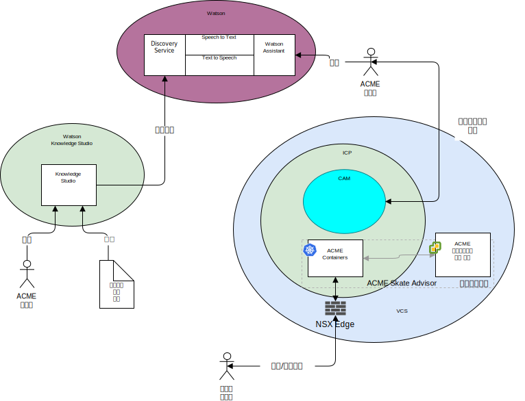

---

copyright:

  years:  2016, 2019

lastupdated: "2019-06-26"

subcollection: vmware-solutions

---

# 시스템 컨텍스트
{: #vcscar-syscontext}

다음 다이어그램은 이 참조 아키텍처를 위한 시스템 컨텍스트를 보여줍니다. 시스템 컨텍스트 다이어그램은 시스템의 핵심 요소, 시스템의 경계, 상호작용과 함께 상호작용하는 엔티티를 정의하는 다이어그램입니다. 독자에게 시스템에 대한 초기 보기를 제공하는 상위 레벨 다이어그램입니다.

다음은 시스템 컨텍스트의 핵심 컴포넌트입니다.
- vCenter Server – VMware vCenter Server on {{site.data.keyword.cloud_notm}}는 온프레미스 환경에서 마이그레이션된 가상 머신(VM)의 대상이 되는 {{site.data.keyword.cloud_notm}} for VMware
Services 인스턴스입니다. 이는 온프레미스 가상화와 함께 하이브리드 환경을 구성하고 VM이 한 환경에서 다른 환경으로 이동할 수 있도록 합니다.
- {{site.data.keyword.icpfull_notm}} - {{site.data.keyword.icpfull_notm}}는 컨테이너화된 애플리케이션의 개발 및 관리를 위한
애플리케이션 플랫폼입니다. {{site.data.keyword.icpfull_notm}} 환경은 컨테이너 오케스트레이터
Kubernetes, 개인용 이미지 저장소, 관리 콘솔, 모니터링 프레임워크 및
애플리케이션을 배치, 관리, 모니터 및 확장할 수 있는
중앙 위치를 제공하는 그래픽 사용자 인터페이스가 포함된
통합 환경입니다.
- {{site.data.keyword.cloud_notm}} Automation Manager - CAM은 Kubernetes 기반 워크로드,
워크로드 프로비저닝 자동화, VM 또는 컨테이너와 해당 인프라 전제조건
여부와 함께 VM 기반 워크로드를 프로비저닝하기 위해 단일 분할창을
제공하는 엔터프라이즈용 IaC(Infrastructure as Code)
플랫폼입니다.
- Watson - Watson은 IBM의 인공 지능 및 코그너티브 솔루션 플랫폼입니다.
- Watson Knowledge Studio - Watson Knowledge Studio는 사용할 Watson Discovery의 모델을 제공합니다.

## 액터
{: #vcscar-syscontext-actors}

시스템 컨텍스트 다이어그램은 다음 액터를 식별합니다.
* Acme 관리자 - 관리자는 진행 중인 다음 태스크를 포함하여 진행 중인 애플리케이션 배치와 유지보수에 대한 책임이 있습니다.
  - 챗봇 훈련
  - 검색 서비스 훈련
* 시스템 사용자 - 시스템 사용자는 시스템의 사용자입니다. 사용자는 브라우저 가능한 디바이스의 브라우저를 통해 시스템과 통신합니다.

## 시스템
{: #vcscar-syscontext-systems}

시스템 컨텍스트 다이어그램은 다음 시스템을 식별합니다.
* Knowledge Studio - Watson Studio는 시스템을 위한 스케이트 언어를 디자인하고 이 언어를 사용하여 스케이트 언어를 구현하는 웹의 문서를 인식하는 데 사용되는 도구입니다.
* Speech to Text - 음성을 문자로 변환합니다. 이 컴포넌트는 챗봇이 실행되는 디바이스에서 음성을 허용하고, 이 음성을 Watson에서 처리할 수 있도록 텍스트로 변환합니다.
* Text to Speech - 문자를 음성으로 합성합니다. 이 컴포넌트는 Skate Advisor 애플리케이션에서 텍스트를 승인하고, 챗봇이 실행되는 디바이스를 위해 음성으로 변환하여 재생합니다.
* Discovery Service - 시스템에서 Watson Discovery Service를 사용하여 요청 매개변수와 일치하는 스케이트 레코드를 검색합니다. 예로
`캐스퍼 트릭에 대한 모든 레코드 나열`이 있습니다.
* Watson Assistant - 시스템에서 Watson Discovery Service를 사용하여 요청 매개변수와 일치하는 스케이트 관련 컨텐츠를 검색합니다. 예로 `캐스퍼 트릭에 대한 모든 레코드 나열`이 있습니다. Watson Discovery는 고급 기계 학습 기술을 사용하여 수집된 컨텐츠에서 가장 관련된 부분을 드러냅니다.
* 데이터베이스 - Acme Skate Advisor 데이터베이스는 vCenter Server에서 호스팅하는 가상 머신에 호스팅됩니다.
* 애플리케이션 컨테이너 - 애플리케이션 현대화 과정을 완료하고 이제 컨테이너로 실행 중인 애플리케이션입니다. 이 참조 아키텍처와 Acme Skateboards 예의 경우, 컨테이너화된 앱 중 하나가 웹 서버이며 이는 온라인 상태 워크로드의 일부입니다. ACME 컨테이너는 Acme 웹 애플리케이션과 Acme Skate Advisor 애플리케이션을 호스팅합니다.
* NSX Edge - NSX Edge는 vCenter Server 인스턴스에서 들어가고 나가는 north-south 트랙픽을 관리하는 가상 어플라이언스입니다.

## 관련 링크
{: #vcscar-syscontext-related}

* [vCenter Server on {{site.data.keyword.cloud_notm}} with Hybridity Bundle 개요](/docs/services/vmwaresolutions/archiref/vcs?topic=vmware-solutions-vcs-hybridity-intro)
