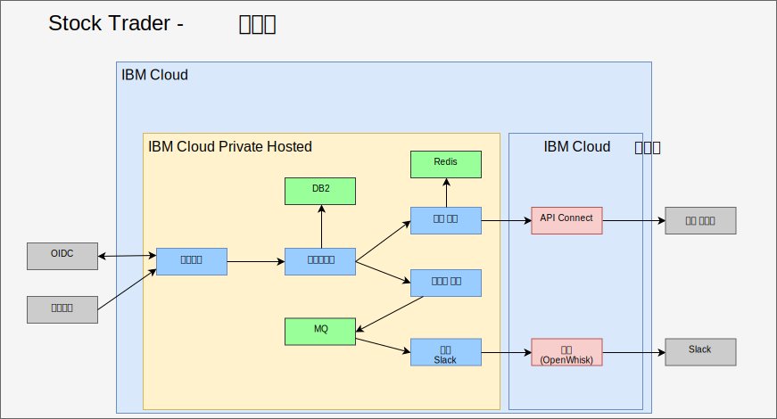
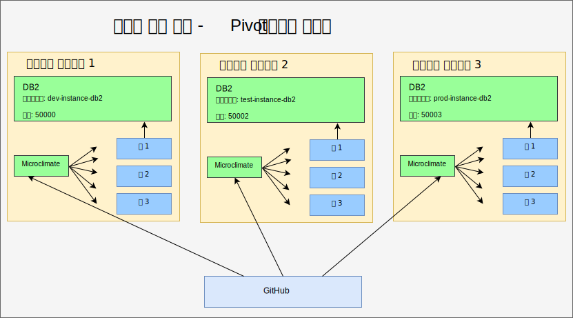
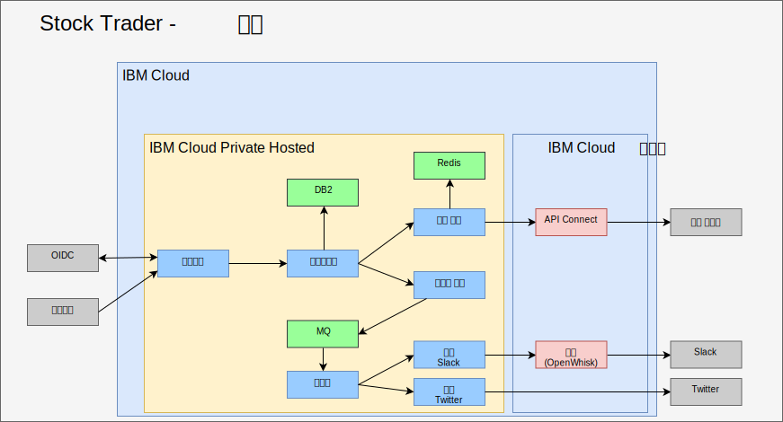

---

copyright:

  years:  2016, 2019

lastupdated: "2019-06-27"

subcollection: vmware-solutions

---

# IBM Cloud Private
{: #vcscontent-addmidware}

이제 Stock Trader가 컨테이너에서 실행되고 Jane이 현재 마이크로 서비스에 만족하며 Jane과 Todd는 추가 기능으로 애플리케이션을 향상시키는 데 대한 작업을 수행합니다. 증가된 활동과 확장성을 처리하기 위해 Stock Trader 마이크로 서비스를 리팩토링함으로써 둘 다 미들웨어를 {{site.data.keyword.cloud}} Private에 추가해야 함을 알게 됩니다. 일부 미들웨어가 해당 데이터 센터에 이미 있으므로 일부 새로운 미들웨어가 추가된 리플랫폼 연습이 됩니다.

이 솔루션 리팩토링은 애플리케이션 및 필수 서비스를 실행하는 공통 플랫폼을 가져오므로 보다 단순한 관리 플레인을 가져옵니다.

## 컨텐츠 선택
{: #vcscontent-addmidware-content-choices}

{{site.data.keyword.cloud_notm}} Private은 다양한 컨텐츠 선택사항을 가지고 있으며 Todd와 Jane 모두 그들의 필요에 가장 적합한 컨텐츠를 결정해야 합니다. Todd가 {{site.data.keyword.cloud_notm}} Private 카탈로그에서 본 것처럼, 대부분의 컨텐츠를 시도해 볼 수는 있지만 일부 컨텐츠는 Passport Advantage에서 구매하고 다운로드해야 합니다.

* 도구 체인 및 런타임
  - UrbanCode Deploy
  - Microclimate
  - Jenkins(오픈 소스)
  - IBM WebSphere Liberty(MicroProfile, 웹 프로파일, Java 플랫폼, 엔터프라이즈 에디션 프로파일)
  - Open Liberty(오픈 소스)
  - Node.js 런타임(오픈 소스)
  - Swift 런타임(오픈 소스)
  - nginx(오픈 소스)
  - {{site.data.keyword.cloud_notm}} Private VM Quickstarter Community Edition을 위한 IBM WebSphere Application Server

* 통합
  -	IBM Integration Bus
  -	IBM Integration Bus for Developers
  -	IBM DataPower Gateway Virtual Edition
  -	IBM DataPower Gateway for Developers
  -	IBM API Connect Professional
  -	IBM API Connect Enterprise
  -	IBM App Connect Enterprise Developer Edition
  -	IBM App Connect Enterprise 11.0.0

* 데이터 사이언스 및 비즈니스 분석
  -	IBM Data Science Experience Local
  -	IBM Data Science Experience Developer Edition
  -	IBM Watson Explorer Deep Analytics Edition
  -	IBM PowerAI(ILAN 라이센스 부여, 사용 가능한 오퍼링 지원)
  - IBM PowerAI Vision

* 데이터 통제 및 통합
  -	IBM InfoSphere Information Server for evaluation
  Mobile
  -	IBM Mobile Foundation

* 연결성
  -	IBM Voice Gateway Developer Trial

* 애플리케이션 현대화 도구
  -	IBM Transformation Advisor

* 메시징
  -	IBM MQ Advanced
  -	IBM MQ Advanced for Developers
  -	Rabbit MQ(오픈 소스)
  -	IBM Event Streams 기술 미리보기(Apache Kafka 기반)

* 디지털 비즈니스 자동화
  -	IBM Operational Decision Manager
  -	IBM Operational Decision Manager for Developers
  -	IBM FileNet Content Manager 5.5
  -	IBM Content Foundation 5.5

* 데이터 서비스
  -	IBM DB2 Direct Advanced Edition/AESE with Data Server Manager
  -	IBM Db2 Dev-C
  -	IBM Data Server Manager(Db2 Dev-C용)
  -	IBM Db2 Warehouse Enterprise
  - IBM Db2 Warehouse Dev-C
  -	IBM Cloudant Developer Edition
  -	MongoDB(오픈 소스)
  -	PostgreSQL(오픈 소스)
  -	MariaDB(오픈 소스)
  -	Galera clustering with MariaDB(오픈 소스)
  -	Redis(오픈 소스)

* HPC/HPDA
  -	IBM Spectrum LSF Community Edition
  -	IBM Spectrum Symphony Community Edition
  -	IBM Spectrum Conductor 기술 미리보기

* 다중 클라우드 관리
  -	{{site.data.keyword.cloud_notm}} Automation Manager

* Watson
  -	IBM Watson Compare & Comply: Element Classification
  -	Compliance Assist

* 관리
  -	IBM Netcool - 통합({{site.data.keyword.icpfull_notm}} 서비스를 위한 프로브 – 이벤트 로깅 및 경보 모니터링)
  - {{site.data.keyword.cloud_notm}} App Management 2018.2.0
  -	IBM Netcool - 통합({{site.data.keyword.icpfull_notm}} 이벤트 관리를 위한 프로브. IBM
Netcool Insights 제품과 함께 판매)
  - {{site.data.keyword.cloud_notm}} Event Management for IBM
Cloud Private(카탈로그에서의 검색 및 시도를 위해 ILAN 라이센스 부여)
  - IBM Operations Analytics Predictive Insights Mediation Pack({{site.data.keyword.icpfull_notm}}
모니터링 메트릭 관리. 카탈로그에서의 검색 및 시도를 위해 ILAN 라이센스 부여)
-	IBM Operations Analytics Predictive Insights Mediation Pack(Predictive Insights 제품과 함께 판매)

* 네트워킹
  -	F5 BIGIP Controller(오픈 소스)
  -	Calico BGP-Peer(오픈 소스)
  -	strongSwan IPSec VPN(오픈 소스)

* 스토리지
  -	IBM PowerVC FlexVolume Driver(오픈 소스 및 PowerVC 제품에서 지원)
  - GlusterFS storage cluster with Heketi lifecycle management(오픈 소스)
  -	Container Storage Interface(CSI) 샘플 NFS
  -	드라이버(오픈 소스)
  -	Rook Ceph Cluster(오픈 소스)

* 도구
  -	Web Terminal(오픈 소스)
  -	Skydive – 네트워크 분석기(오픈 소스)

Stock Trader의 경우 Jane의 솔루션 아키텍처를 기반으로 Todd는 [Db2](https://cloud.ibm.com/catalog/services/db2-hosted), [MQ](https://cloud.ibm.com/catalog/services/mq) 및 [Redis](https://cloud.ibm.com/catalog/services/databases-for-redis)를 사용하여 시작합니다.

## 미들웨어 추가
{: #vcscontent-addmidware-add-middleware}

미들웨어를 {{site.data.keyword.cloud_notm}} Private에 추가하고 카탈로그에서 [helm 차트](https://github.com/IBM/charts/blob/master/stable/ibm-microclimate/README.md)를 찾으려면 readme 파일을 읽은 다음 계속 설치하십시오.

Stock Trader의 경우 Todd는 모든 미들웨어를 추가하기로 결정했습니다. 다음 정보는 Todd가 Jane이 사용하기를 원한 각 미들웨어에 대해 수행해야 하는 작업을 요약합니다.

### Db2
{: #vcscontent-addmidware-db2}

이미 Db2를 사용 중이고 각 솔루션에 대해 컨테이너 기반 Db2를 전용으로 사용할 수 있으므로 Todd는 Db2를 사용하여 시작합니다.

Todd는 {{site.data.keyword.icpfull_notm}}를 준비했으므로 정의된 팟(Pod) 보안 정책이 이미 있습니다. Todd는 Docker 이미지 풀 시크릿을 작성하는 것에 집중할 수 있습니다.

`kubectl create secret docker-registry db2dockerregistry
--docker-username=dockeruser
--docker-password=XXXXXXXX-XXXX-XXXX-XXXX-XXXXXXXXX
--docker-email=dockeruser@email.com --namespace=default`

마지막으로 Todd가 NFS를 사용하기로 결정했기 때문에 그는 readme 파일 요구사항을 기반으로 NFS 볼륨을 작성했습니다.

{{site.data.keyword.icpfull_notm}} 대시보드로 이동하여 지속적 볼륨을 작성하십시오. 크기는 얼마입니까? readme 파일을 보고 다음을 찾으십시오.

`capacity=20Gi
RWO
type=NFS
server = nfs.server.ip.address
path = /shared/db2trader1`

카탈로그 사용자 인터페이스에서 “Db2”를 검색하고 ibm-db2oldp-dev를 클릭하십시오. readme 파일을 검토한 후 구성을 클릭하십시오.

구성 섹션에는 빠른 시작 섹션과 모든 매개변수 섹션이 있습니다. Todd가 추가 구성을 입력해야 하기 때문에 모든 매개변수를 여십시오.

*	릴리스 이름 = db2trader1
*	네임스페이스 = default
*	라이센스 동의 여부
*	데이터베이스 이름 = trader
*	시크릿 이름 = db2dockerregistry
*	서비스 이름 = db2trader1-ibm-db2oltp-dev
*	서비스 유형 = NodePort
*	포트 = 50000
*	db2 인스턴스 이름 = db2inst1
*	db2 인스턴스 이름의 비밀번호 = xxxxxx
*	예(확인) 이 배치에 지속성 사용

Db2가 실행되면, Todd나 Jane이
Stock Trader 솔루션에서 사용하는 테이블을 작성해야 합니다.

### MQ
{: #vcscontent-addmidware-mq}

Todd와 Jane은 메시징 소프트웨어가 필요하고, 이미 MQ를 사용하고 있으므로 이는 좋은 옵션입니다. 또한 작은 설치 공간에서 실행할 수 있고 각 개발자별로 개발자 버전을 돌려서 귀중한 프로덕션 트래픽을 절약합니다. MQ 설치는 매우 간단합니다. Todd는 Db2에서와 같이 스토리지를 작성한 다음 helm 차트를 설치합니다.

{{site.data.keyword.icpfull_notm}} 대시보드 > 카탈로그 > MQ를 입력하여 시작 >
ibm-mqadvanced-server-dev 선택. readme 파일을 검토한 다음 구성을 클릭하십시오.
다음 입력 값을 제공하거나 확인하십시오.

`릴리스 이름 = mqtrader1
대상 네임스페이스 = stock-trader
라이센스 동의
지속성 사용
데이터 PVC 크기 = 2Gi
서비스 유형 = NodePort
큐 관리자 이름 = stocktrader
관리자 비밀번호 = mq1pw
앱 비밀번호 = LEAVE BLANK`

처음에 Todd는 사용자 인터페이스에서 미들웨어에 도달하기 위해 NodePort를 선택합니다. 결국, Todd는 ClusterIP를 사용할 수 있으므로 클러스터 안에 있는 팟(Pod)만 미들웨어에 도달할 수 있습니다.

Stock Trader를 사용하도록 MQ를 구성하기 위해 Todd는 MQ 관리 사용자 인터페이스를 엽니다. 이는 VM 버전과 동일합니다.

### Redis
{: #vcscontent-addmidware-redis}

Stock Trader가 {{site.data.keyword.cloud_notm}} Private Hosted에서 실행되고 있지만 모두가 정말로 관심을 가지는 것은 대부분의 업무에서 전날 주식 거래 종료 시 주식 시세 서비스가 지연되는 것에 대한 걱정입니다. 성능을 높이기 위해 Redis 캐시를 추가합니다.

이 배치는 ibm-charts의 ibm-redis-ha-dev 차트를 사용합니다.

기본적으로 이 차트는 6개의 팟(Pod)을 설치합니다. 하나의 마스터, 두 개의 슬레이브 및 세 개의 센티넬을 설치합니다. 작업자 노드가 둘 이상의 서브넷에 있을 때, 이는 둘 이상의 팟(Pod)이 많은 작업자 노드에서 함께 작업하는 Kubernetes의 복원성에 대한 좋은 예입니다.

구성이 단순하기 때문에 Todd는 설치할 위치의 네임스페이스를 입력하고 설치를 시작합니다.

## Stock Trader 리팩터
{: #vcscontent-addmidware-refactor-stock-trader}

Stock Trader 리팩토링은 Jane에게 있어서 중요한 단계입니다. Todd가 미들웨어를
{{site.data.keyword.cloud_notm}} Private에 추가하고 있는 동안 Jane은
Kubernetes 및 클라우드 동작에 최적화하기 위해 솔루션을 리팩토링했습니다.

예를 들어, Jane이 Stock Trader를 변환했을 때 .war 파일을 가져와 하나씩 Liberty 컨테이너에 추가했지만, 데이터 소스를 지정하도록 WebSphere Application Server Network Deployment 구성을 사용했습니다. 이는 좋은 시작였고 Jane의 애플리케이션이 Kubernetes 스케줄링과 오케스트레이션에서 즉시 가치를 얻게 됩니다.

Kubernetes 세계에서 Jane의 마이크로 서비스(코드 다시 작성 및 빌드)를 최적화하는 것에는 많은 다른 이점이 있습니다.

최적화하기 위해 Jane은 다음 단계를 수행했습니다.
-	code repo에서 코드 업데이트(Jane은 GitHub Enterprise 사용)
-	파이프라인 추가(Jane은 Jenkins 사용)
-	Maven을 사용하여 빌드

다음 예제에서는 Jenkins 파일 server.xml 등과 함께 Jane의 [코드 저장소](https://github.com/IBMStockTrader/)를 표시합니다. 이를 사용하면 Jane은 GitHub의 개별 저장소로의 더 많은 마이크로 서비스와 함께 ODM 및 Watson과 같은 서비스에 액세스하기 위해 시크릿을 통해 추가 기능을 자유롭게 코드화할 수 있습니다.

### 시크릿 추가
{: #vcscontent-addmidware-add-secrets}

Jane이 Stock Trader 마이크로 서비스를 리팩토링했기 때문에,
특정한 이름을 하드코딩하고 애플리케이션을 다시 빌드하지 않고 배치할 때 애플리케이션에서 서비스에 대한 고유한 세부사항을 선택할 수 있도록
서비스 이름, 사용자 ID 및 비밀번호를 추상화하는 방법이 필요합니다.

Kubernetes 시크릿을 사용하여 Jane은 각 시크릿 내에 잘 정의된 시크릿 이름 및 매개변수를 구성합니다. 이를 통해 마이크로 서비스가 배치될 때 고유한 호스트 이름, 사용자 ID, 비밀번호 또는 기타 민감한 인증 정보를 선택하여 애플리케이션을 이식 가능하게 만듭니다.

Stock Trader가 둘 이상의 클라우드에서 실행되는 경우에도 Jane은 통합된 코드 베이스를 원합니다. 다음 그림에서 시크릿 DB2는 라우팅 세부사항이 다르지만 형식은 동일합니다. Jane의 포트폴리오 마이크로 서비스가 배치될 때 적절한 Db2 인스턴스에 연결할 DB2 시크릿 엔드포인트 매개변수를 찾습니다. Stock Trader 애플리케이션은 VMware 가상 머신에서 실행되는지, 컨테이너화된 서비스에서 실행되는지 또는
클라우드 관리 서비스로서 실행되는지와 관계없습니다.

## 결과
{: #vcscontent-addmidware-result}

Jane은 Stock Trader 솔루션을 리팩토링하고
Todd는 미들웨어를 {{site.data.keyword.cloud_notm}} Private Hosted에 설치했기 때문에
모든 핵심 Stock Trader 솔루션은 프라이빗 클라우드에서 실행됩니다. 이제 Jane은
Twitter 알림 서비스와 같은 마이크로 서비스를 더 추가합니다. Istio
라우팅 규칙을 사용하면 내부
Slack 채널이나 공용 Twitter 채널을 통해 동적 로열티 레벨 메시징을 사용할 수 있습니다.

## 관련 링크
{: #vcscontent-addmidware-related}

* [vCenter Server on {{site.data.keyword.cloud_notm}} with Hybridity Bundle 개요](/docs/services/vmwaresolutions/archiref/vcs?topic=vmware-solutions-vcs-hybridity-intro)
