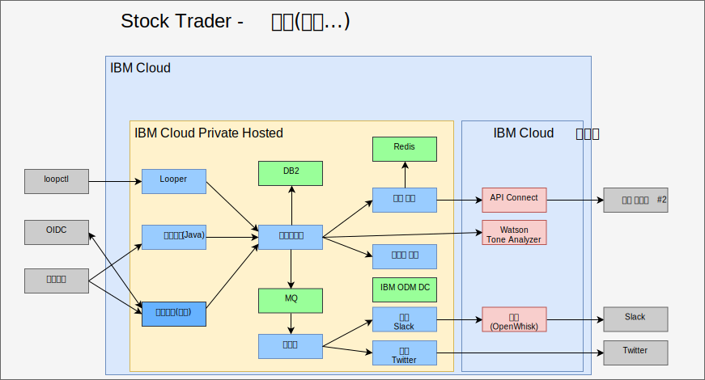

---

copyright:

  years:  2016, 2019

lastupdated: "2018-11-14"

---

# AI, 분석 및 기타 퍼블릭 클라우드 서비스로 강화

Stock Trader 강화는 일회성 단계가 아닙니다. Todd와 Jane에게 이 작업은 반복 프로세스입니다. 다음 그림에서는 Jane이 ODM 의사결정 센터를 사용하여 Watson Tone Analyzer 서비스와 로열티 레벨 규칙을 추가했습니다. 다음 항목은 Stock Trader가 강화된 방법을 강조표시합니다.

그림 1. Stock Trader 추가 강화

## AI Watson Tone Analyzer

다음 샘플은 애플리케이션을 강화하는 간단한 방법이지만 믿을 수 없을 정도로 강력합니다. Jane은 [AI](https://console.cloud.ibm.com/catalog/?category=ai) 및 [Analytics](https://console.cloud.ibm.com/catalog/?category=analytics) 서비스에 대한 [{{site.data.keyword.cloud}} 카탈로그](https://console.cloud.ibm.com/catalog/)를 검색하고 컨텐츠가 풍부한 카탈로그를 찾습니다.

Jane은 표준 플랜의 옵션인 [Tone Analyzer](https://console.cloud.ibm.com/catalog/services/tone-analyzer)를 선택한 다음 호출할 인증 정보를 제공합니다.
Jane은 Stock Trader를 리팩토링했으며 Tone Analyzer에 대한 Kubernetes 시크릿을 작성합니다. 그렇게 하면 Jane이 플랜이나 지역을 변경해도 코드를 다시 빌드할 필요가 없습니다.

리팩토링의 덕분에 Jane은 사용자 환경에 지장을 주지 않고 여러 사용자 인터페이스를 사용하여 실험할 수 있었습니다. 결과적으로 새 사용자 인터페이스를 사용하여 사용자 피드백의 톤을 이해할 수 있습니다.

향후 Jane은 전용 클라우드 인스턴스 {{site.data.keyword.cloud_notm}} Private에서 실행할 수 있는 다양한 분석 서비스를 기반으로 예측 주식 추천을 제공할 수 있습니다.

## 로열티 레벨 비즈니스 규칙

원래, Jane은 로열티가 높아질 것으로 예상되는 금액을 결정하기 위해 코드에 논리를 사용했습니다. 그러나 Stock Trader 마케팅 담당 이사로부터 범위를 변경하라는 요청을 반복적으로 받은 후 Jane은 자신이 개입하지 않아도 마케팅 담당 이사가 변경할 수 있는 비즈니스 규칙으로 해당 의사결정을 수행하기로 결정했습니다.

Jane은 [서비스](https://console.cloud.ibm.com/catalog/services/decision-optimization)를
추가한 Todd와 이야기한 후 이 의사결정을 작성했습니다.

이제 마케팅 담당 이사인 Margaret은 캠페인이 진행될 때마다 코드 변경 없이 로그인하여 로열티 레벨 범위를 변경할 수 있습니다.

## 새 증권 서비스

증권 서비스가 변경되었음을 확인할 수 있습니다.
이는 퍼블릭 서비스가 소유자 또는 해당 API 구조를 변경할 때 발생할 수 있습니다. 감사하게도 Jane은 [API
Connect](https://console.cloud.ibm.com/catalog/services/api-connect)를 사용했습니다.
원래 그녀는 API Connect를 사용하여 원본 주식 서비스로부터의 응답을 단순화했습니다. 제공된 원시 API에서 원하는 데이터를 받고 형식을 지정하는 것이 약간 번거롭기 때문입니다.

이제 Jane은 주식 서비스를 변경했을 때 작성한 단순화된 API에 매핑하는 방법을 변경했고
코드를 다시 시작할 필요가 없기 때문에 기쁩니다. Stock Trader 솔루션은 변경되지 않은 것처럼 계속해서 동일한 API로부터 데이터를 요청합니다. 모든 API 변경사항은 뒤에서 감추어진 상태로 있습니다.

또한 API Connect에서 모니터링과 미터링 기능을 사용하여 Jane은 그녀의 단순화된 API를 사용하고 있는 사용자를 추적할 수
있습니다.

### 관련 링크

* [vCenter Server on {{site.data.keyword.cloud_notm}} with Hybridity Bundle 개요](../vcs/vcs-hybridity-intro.html)
