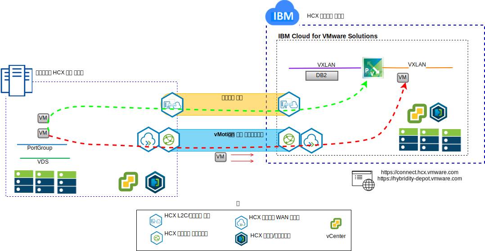

---

copyright:

  years:  2016, 2019

lastupdated: "2019-02-15"

---

# Stock Trader VM을 IBM Cloud로 올리기 및 이동
{: #vcscontent-hcx}

Todd는 현대화 과정의 첫 번째 단계로 온프레미스 VMware SDDC 인스턴스를
{{site.data.keyword.cloud}}의 VMware vCenter Server로 원활하게 확장하려고 합니다. 비즈니스는 계속해서 시작되고 실행되어야 하며 작동 중지 시간은 최소화해야 합니다.

VMware vCenter Server on {{site.data.keyword.cloud_notm}} with Hybridity Bundle을 사용하면
vCenter Server 인스턴스와
온프레미스 VMware 가상 데이터 센터 사이에 원활한 연결을 만들 수 있습니다.

{{site.data.keyword.cloud_notm}} VMware 대상 사이트의 가상 머신으로
배치되는 vCenter Server with Hybridity Bundle 컴포넌트를 사용하면 피어 온프레미스 소스 사이트에 설치되는 HCX 컴포넌트와 연결할 수 있습니다.

그림 1. vCenter Server with Hybridity Bundle

Hybridity는 온프레미스와
{{site.data.keyword.cloud_notm}} 사이에 느슨하게 결합된 상호 연결을 만들고 다음 기능을 사용할 수 있게 합니다.

* 간단한 상호 연결 – 공용 인터넷, 사설 VPN 또는 직접 링크를 포함하는 실제 접속에서 논리 네트워크 연결을 쉽게 설정할 수 있습니다.
* 계층 2 확장 – 온프레미스 네트워크가 클라우드로 확장되고 온프레미스 서브넷 및 IP 주소 지정을 포함합니다.
* 암호화 – 네트워크 트래픽이 두 사이트 간에 안전하게 암호화됩니다.
* 최적화된 네트워크 – 네트워크 트래픽이 가능한 빠르게 이동할 수 있도록 최상의 연결을 선택하여 효율적으로 연결이 흐르게 합니다.
* 데이터 중복 제거 – 네트워크 트래픽의 50% 만큼 감소할 수 있습니다.
* 지능형 라우팅 – 워크로드가 이동되는 경우 네트워크 트래픽이 대상 사이트 게이트웨이를 사용하고 원래 사이트로 다시 헤어핀하지 않도록 근접 라우팅에서 네트워크 게이트웨이를 변경할 수 있습니다.
* 무중단 마이그레이션 – vMotion을 사용하여 실행 중인 가상 머신을 클라우드로 이동하거나 클라우드에서 이동할 수 있습니다.
* 예정된 마이그레이션 – 임의의 VM을 대상 사이트에 복제한 후 지정된 시간에 해당 사이트에서 활성화하여 원래 사이트에서 실행 중인 시스템을 교체할 수 있습니다.
* 보안 정책의 마이그레이션 – NSX가 온프레미스에 사용되는 경우 보안 정책, 방화벽 및 기타 보안 항목은 워크로드와 함께 이동됩니다.

Todd는 Stock Trader를
온프레미스 VMware 환경에서 VMware on {{site.data.keyword.cloud_notm}} 환경으로 마이그레이션할 수 있으며 가동 중단 시간이 없이 애플리케이션을 다시 구성할 필요 없는 요구사항을 충족시킬 수 있습니다.

## 관련 링크
{: #vcscontent-hcx-related}

* [vCenter Server on {{site.data.keyword.cloud_notm}} with Hybridity Bundle 개요](/docs/services/vmwaresolutions/archiref/vcs?topic=vmware-solutions-vcs-hybridity-intro)
