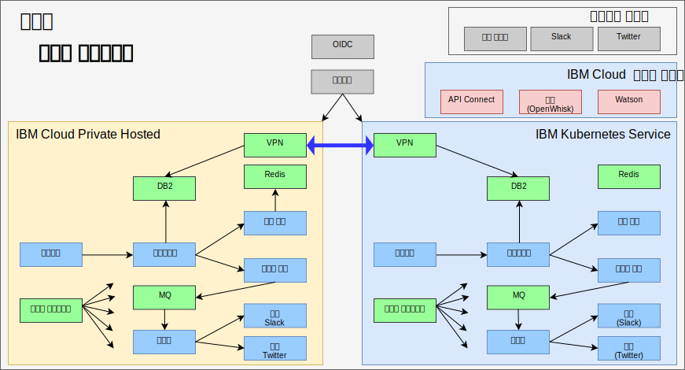

---

copyright:

  years:  2016, 2019

lastupdated: "2019-08-05"

subcollection: vmware-solutions

---

# IBM Cloud Kubernetes Service와의 진정한 하이브리드 구현
{: #vcscontent-iks}

Jane의 테스트 팀이 확장된 것처럼 Jane은 애플리케이션의 주된 부분을 실행하면서 환경에 있는 데이터를 여전히 사용하는 테스트 환경을 제공하려고 했습니다. Jane은 테스트 팀이 Kubernetes 클러스터 관리가 아닌 애플리케이션 테스트에 중점을 두기를 원합니다. Jane과 Todd는 [{{site.data.keyword.cloud}} Kubernetes
Service](https://www.ibm.com/cloud/container-service) 인스턴스를 계속 사용하기로 결정하고 Jane이 코드 변경 없이
Stock Trader를 해당 인스턴스에 배치합니다.

그런 다음 Todd는 각 클러스터의 사설 네트워크 간의 연결을 위해 strongSwan VPN을 추가합니다.

