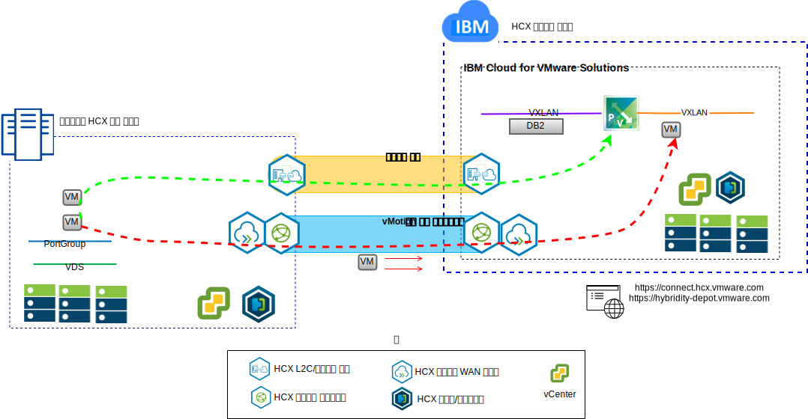

---

copyright:

  years:  2016, 2019

lastupdated: "2019-03-06"

---

# VMware Hybrid Cloud Services 소개
{: #vcshcx-intro}

VMware HCX(Hybrid Cloud Services)를 사용하면 vSphere 소프트웨어 정의 데이터 센터(SDDC)의 개별 인스턴스를 통해 다양한 네트워크 유형을 통합할 수 있습니다. 여기에는 공용 인터넷에 보안이 설정되어 있는지 여부와 상관없이 LAN 또는 WAN이 포함됩니다. HCX는 온프레미스 및 클라우드 제공자 경계를 넘어 다중 인스턴스, 다중 사이트, vSphere 배치를 확장하려는 중에 발생할 수 있는 보안, 호환성 및 성능 문제를 해결하도록 설계되었습니다.

그림 1. VMware Hybrid Cloud Services

HCX는 {{site.data.keyword.cloud}}에서 완전히 자동화된 vSphere 오퍼링과 기타 배치된 vSphere 인스턴스 사이의 상호 운용에 사용되는 기본 방법입니다. HCX는 이제 {{site.data.keyword.vmwaresolutions_short}}에 완전히 통합된 오퍼링입니다.

이 안내서는 HCX의 배치와 운영에 사용하도록 제공되며, 현재 허용되고 용인되는 우수 사례와 문제점 해결이 포함되어 있습니다. HCX는 Agile 개발 방법론을 사용하여 개발되므로 이 안내서를 지원되는 버전 또는 지원되는 플랫폼의 실질적인 소스로 사용하지 마십시오.

## 관련 링크
{: #vcshcx-intro-related}

* [vCenter Server on {{site.data.keyword.cloud_notm}} with Hybridity Bundle 개요](/docs/services/vmwaresolutions/archiref/vcs?topic=vmware-solutions-vcs-hybridity-intro)   
