---

copyright:

  years:  2016, 2019

lastupdated: "2019-01-23"

---

# 애플리케이션 현대화 개요

다음 다이어그램은 Acme Skateboards에서 배치할 애플리케이션 현대화 참조 아키텍처를 보여줍니다. 아키텍처는 이 일련의 문서에서 자세히 설명됩니다.

그림 1. 아키텍처 개요 다이어그램

이 하이브리드 아키텍처를 통해 Acme Skateboards에서는 다음 목적을 달성할 수 있습니다.
- 애플리케이션 재구성 없이 가동 중단 시간이 짧거나 중단 없이 온프레미스에서 {{site.data.keyword.cloud}}로 VMware 가상 머신(VM)을 마이그레이션할 수 있습니다.
- 더 복잡한 데이터베이스를 VM으로 유지할 수 있도록 허용하는 반면 보다 간단한 웹 인터페이스와 미들웨어를 컨테이너화하는 데 중점을 두어 애플리케이션 현대화 과정을 시작할 수 있습니다.
- {{site.data.keyword.cloud_notm}} Automation Manager(CAM)를 사용하여 DevOps 도구 체인과 ITSM 솔루션을 통합하기 위해 VM 및 컨테이너 둘 다에서 작성된 서비스를 작성하고 조정하도록 IaC(Infrastructure as Code)를 스크립팅할 수 있습니다.

참조 아키텍처에는 다음 주요 컴포넌트가 있습니다.
- **온프레미스 가상화** - Acme Skateboards VM을 현재 호스팅하고 있는 VMware 클러스터입니다. 이러한 VM은 현대화시킬 애플리케이션을 현재 호스트하고 있습니다. 이 클러스터는 HCX를 실행할 수 있도록 [VMware HCX on {{site.data.keyword.cloud_notm}} 솔루션 아키텍처](https://www.ibm.com/cloud/garage/files/HCX_Architecture_Design.pdf)의 전제조건을 충족해야 합니다. HCX는 고객이 {{site.data.keyword.cloud_notm}}에서 실행 중인 VMware vCenter Server on {{site.data.keyword.cloud_notm}}(VCS) 인스턴스로 VM을 마이그레이션할 수 있는 {{site.data.keyword.cloud_notm}}로 온프레미스 네트워크를 확장하며 필요한 경우 확장을 취소합니다.

- **{{site.data.keyword.vmwaresolutions_short}}** - vCenter 인스턴스는 vSphere, vCenter Server, NSX-V와 같은 기본적인 VMware 빌딩 블록을 제공하며, VMware SDDC(Software Defined Data Center) 솔루션을 자동으로 배치하는 데 필요한 vSAN 또는 {{site.data.keyword.cloud_notm}} Endurance 스토리지가 포함된 스토리지 옵션을 제공합니다. VMware 클러스터는 {{site.data.keyword.icpfull_notm}}에서 호스팅되는 컨테이너의 일부 현대화된 애플리케이션 및 마이그레이션된 VM에 대한 대상입니다. vCenter Server의 주요 컴포넌트는 다음과 같습니다.
    - **NSX-V** - NSX-V는 Acme Skateboards VM에 대한 네트워크 오버레이를 제공하는 VCS의 네트워크 가상화 계층을 제공합니다. NSX-V는 BYOIP를 사용으로 설정하고 IBM Cloud 네트워크에서 워크로드 네트워크를 격리합니다. NSX-V는 Acme Skateboards가 온프레미스에서 확장하는 네트워크를 작성하기 위해 HCX로 프로그래밍됩니다.

    - **NSX-T** - NSX-T는 컨테이너 및 VM 모두에서 네트워크 및 보안 관리를 위한 공통 도구 세트를 제공합니다. NSX-T는 Kubernetes Container Networking Interface(CCNI)와 완전히 호환 가능하며 컨테이너 네트워킹을 제공하기 위해 CNI와 통합됩니다. NSX-T는 현대화된 애플리케이션이 사용하는 오버레이 네트워크를 제공하며 기본적으로 {{site.data.keyword.icpfull_notm}} 및 {{site.data.keyword.containerlong_notm}}에서 사용하는 Calico를 대체합니다.

- **{{site.data.keyword.icpfull_notm}}** - {{site.data.keyword.icpfull_notm}}는 컨테이너화된 애플리케이션의 개발 및 관리를 위한 애플리케이션 플랫폼입니다. {{site.data.keyword.icpfull_notm}}는 컨테이너 오케스트레이터 Kubernetes, 개인용 이미지 저장소, 관리 콘솔, 모니터링 프레임워크 및 Acme Skateboards에서 애플리케이션을 배치, 관리, 모니터 및 확장할 수 있는 중앙 위치를 제공하는 그래픽 사용자 인터페이스가 포함된 통합 환경입니다. vCenter Server 인스턴스는 VM으로 실행 중인 {{site.data.keyword.icpfull_notm}} 컴포넌트, 마스터 노드, 작업자 노드를 호스팅합니다. {{site.data.keyword.icpfull_notm}}는 다음을 호스팅합니다.
    - **{{site.data.keyword.cloud_notm}} Automation Manager** - CAM은 템플리트를 사용하여 Kubernetes 워크로드와 함께 {{site.data.keyword.icpfull_notm}} 또는 {{site.data.keyword.containerlong_notm}}의 온프레미스 또는 VCS에서 VM 워크로드를 프로비저닝하기 위해 단일 분할창 방식을 제공하는 엔터프라이즈용 IaC(Infrastructure as Code) 플랫폼입니다. CAM은 {{site.data.keyword.icpfull_notm}} 설치에서 실행되는 도커화된 애플리케이션이며, 권한 부여, 역할 기반 액세스 제어(RBAC) 및 다른 기능을 위해 긴밀하게 통합됩니다.
    - 고객이 이 환경에 배치하려는 컨테이너화된 Acme Skateboards 애플리케이션

- **{{site.data.keyword.containerlong_notm}}** – {{site.data.keyword.containerlong_notm}}를 통해 Acme Skateboards가 현대화된 애플리케이션을 Kubernetes 클러스터에서 실행되는 Docker 컨테이너에 배치할 수 있습니다. 작업자 풀에 있는 작업자 노드가 vCenter Server 인스턴스와 동일한 {{site.data.keyword.cloud_notm}} 계정으로 배치되는 동안 마스터 노드는 IBM에 의해 완전히 관리됩니다. 작업자 노드는 Bare Metal, 공용 또는 전용 가상 서버 인스턴스일 수 있습니다. Calico는 {{site.data.keyword.containerlong_notm}}에 자동으로 설치되고 구성됩니다. Calico는 컨테이너에 대한 안전한 네트워크 연결을 제공하며, 서브넷에서 이동하는 패킷에 IP-in-IP 캡슐화를 사용하고 컨테이너로부터의 발신 연결에 NAT를 사용하도록 {{site.data.keyword.containerlong_notm}}에 구성됩니다.

- **Direct Link** – {{site.data.keyword.cloud_notm}} Direct Link는 대기 시간이 짧고 신뢰할 수 있는 안전한 네트워크 연결을 제공하기 위해 Acme Skateboard의 WAN 제공자를 사용하여 데이터 센터를 {{site.data.keyword.cloud_notm}}에 연결합니다. 이 연결은 다음을 제공합니다.
    - 엔터프라이즈 사용자의 클라우드 호스팅 애플리케이션에 대한 액세스.
    - 온프레미스 VM과 클라우드 VM 간의 중간 VM 트래픽.
    - 온프레미스 데이터 센터의 헤리티지 시스템과 클라우드 VM 간의 트래픽.

## Acme Skateboards의 주요 이점

vCenter Server는 사용자의 워크로드에 가장 적합하며 유연한 VMware SDDC(Software Defined Data Center) 솔루션을 설계하는 데 필요한 vSAN을 포함한 공유 스토리지 옵션과 VMware vSphere, vCenter Server, NSX이 포함된 기본 빌딩 블록을 제공합니다.

요약하면, {{site.data.keyword.vmwaresolutions_short}} 오퍼링의 이점은 다음과 같습니다.

* 리소스의 조달, 아키텍처, 구현 및 배치에 걸리는 시간을 몇 주나 심지어는 몇 달에서 몇 시간으로 줄임으로써 개발자 및 비즈니스 라인을 위한 IT 프로젝트의 제공을 가속화합니다.
* {{site.data.keyword.containerlong_notm}} 및 KMIP 등 {{site.data.keyword.cloud_notm}} 서비스에 대한 사설 엔드포인트 배치를 포함하여 호스팅되는 프라이빗 클라우드의 전용 Bare Metal Server를 사용하여 보안을 개선합니다.
* 가상화 관리에 대한 전체 관리 액세스를 제공하여 기존 VMware 도구, 스크립트 및 교육 투자를 그대로 유지하여 배치된 하이브리드 클라우드의 지속적인 관리 및 통제가 가능합니다.
* 전세계 30개 이상의 {{site.data.keyword.CloudDataCents_notm}}에 걸쳐 있는 IBM Professional 및
Managed Services를 사용하여 전세계적으로 VMware 전문 지식을 사용할 수 있습니다.

{{site.data.keyword.icpfull_notm}} 및 {{site.data.keyword.containerlong_notm}}와 같은 클라우드 기반 애플리케이션 플랫폼으로 이동하는 고객은 속도와 혁신에 중점을 두고 있으며 항상 보안 및 네트워킹을 염두에 두고 있지는 않습니다. 네트워킹 또는 보안 팀에서 Load Balancer, 방화벽, 스위치, 라우터와 같은 서비스를 주문할 수 있을 때까지 고객이 대기해야 하는 경우 가치 창출을 위한 애플리케이션 시간이 줄어듭니다.

이 참조 아키텍처는 VCS, {{site.data.keyword.icpfull_notm}} 및 {{site.data.keyword.containerlong_notm}}가 애플리케이션 현대화 과정을 따라 Acme Skateboards로 안전하게 이동하는 방법을 보여줍니다.

### 관련 링크

* [vCenter Server on {{site.data.keyword.cloud_notm}} with Hybridity Bundle 개요](/docs/services/vmwaresolutions/archiref/vcs/vcs-hybridity-intro.html)
