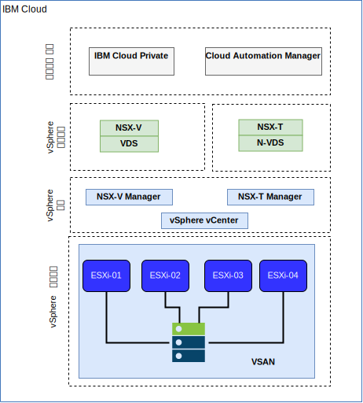

---

copyright:

  years:  2016, 2018

lastupdated: "2018-10-23"

---

# IBM Cloud 네트워킹 및 인프라

## VRF(Virtual Routing and Forwarding)
IBM Cloud 계정을 VRF 계정으로 구성할 수 있습니다. 이 기능은 VLAN SPanning과 유사한 기능을 제공하여 서브넷 IP 블록 간에 자동 라우팅을 가능하게 합니다. Direct-Link 연결의 모든 계정은 VRF 계정으로 변환되거나 VRF 계정으로 작성되어야 합니다.

## Direct Link
IBM Cloud Direct Link Connect는 로컬 IBM Cloud 데이터 센터를 통해 IBM Cloud 인프라 및 네트워크 서비스 제공자에 연결된 다른 클라우드에 대한 개인용 액세스를 제공합니다. 이 옵션은 단일 환경에서 다중 클라우드 연결을 작성하는 데 적합합니다. IBM은 공유 대역폭 토폴로지를 사용하여 고객을 IBM Cloud 사설 네트워크에 연결합니다. 모든 Direct-Link 제품과 마찬가지로, 글로벌 라우팅을 추가하여 모든 IBM Cloud 위치에 사설 네트워크 트래픽을 사용할 수 있습니다.

## 가상 사설망(VPN)

### strongSwan VPN
strongSwan IPSec VPN 서비스는 업계 표준 인터넷 프로토콜 보안(IPSec) 프로토콜 스위트를 기반으로 인터넷에서 안전한 엔드-투-엔드 통신 채널을 제공합니다. 

### Hybridity(HCX)
VCS Hybridity Bundle on IBM Cloud 서비스는 온프레미스 데이터 센터의 네트워크를 IBM Cloud로 원활하게 확장할 수 있으며, 이를 통해 가상 머신(VM)을 변환이나 변경 없이 IBM Cloud로 마이그레이션할 수 있습니다. 

## 물리적 구조
IBM Cloud Private(ICP) 프로덕션 인스턴스를 VMware vCenter Server on IBM Cloud(VCS) 클러스터에 배치해야 하는 실제 인프라는 다음과 같은 최소 스펙이 필요합니다. 

표 1. ICP에 대한 VCS 스펙

| NFS 배치  |  vSAN 배치 |
:--|:----:|:----:
서버 수   |  3 |  4
CPU | 28개 코어 2.2GHz | 28개 코어 2.2GHz
메모리 | 384GB | 384GB
스토리지 | 2000GB 2IOPS/GB 관리, 2000-GB 4IOPS/GB 워크로드, 4000GB 4IOPS/GB ICP | 최소 960-GB SSD x 2

IBM Cloud Private 하드웨어 요구사항 외에도 ICP 환경에 지속적 볼륨을 작성하여 CAM(Cloud Automation Manager) 데이터베이스 및 로그 데이터를 저장해야 합니다. ICP가 지원하는 모든 지속적 볼륨 유형을 CAM에서 지원하지만, CAM에 대해 권장되는 두 가지 스토리지 구성은 NFS 및 GlusterFS입니다.

## 가상 구조

그림 1. VCS 및 ICP 배치의 물리적 구조

VCS 인스턴스 내에서, ICP 인스턴스는 전용 NSX Edge Services Gateway(ESG) 및 Distributed Logical Router(DLR)로 배치됩니다. ICP 설치는 위 컴포넌트에 정의되어 있는 VXLAN 서브넷으로 로드됩니다. 

ESG는 소스 NAT 규칙(SNAT)으로 구성하여 아웃바운드 트래픽을 허용하고, 인터넷 연결을 가능하게 하여 ICP 전제조건을 다운로드하고 GitHub 및 Docker에 연결하거나 웹 프록시를 사용하여 인터넷 연결을 제공할 수 있습니다. 또한 ESG는 DNS 및 NTP 서비스에 대한 액세스를 제공하도록 구성됩니다. 

ESG는 또한 VXLAN 환경을 통해 IBM Cloud 10.x 네트워크에서 ICP 마스터/프록시 가상 IP 주소로 대상 NAT 규칙(DNAT)을 사용하여 구성됩니다.

### 관련 링크

* [VMware vCenter Server on IBM Cloud with Hybridity Bundle](../vcs/vcs-hybridity-intro.html)
