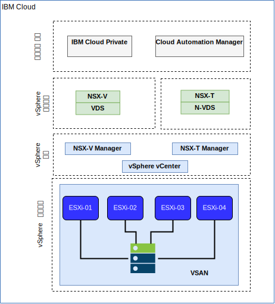

---

copyright:

  years:  2016, 2019

lastupdated: "2019-05-22"

subcollection: vmware-solutions

---

# IBM Cloud 네트워킹 및 인프라
{: #vcsicp-arch-overview-infrastructure}

## VRF(Virtual Routing and Forwarding)
{: #vcsicp-arch-overview-infrastructure-vrf}

서브넷 IP 블록 간에 자동 글로벌 라우팅을 사용하여 VRF(Virtual Routing and Forwarding) 계정으로 {{site.data.keyword.cloud}} 계정을 구성할 수 있습니다. Direct Link 연결의 모든 계정은 VRF 계정으로 변환되거나 VRF 계정으로 작성되어야 합니다.

## Direct Link
{: #vcsicp-arch-overview-infrastructure-direct-link}

{{site.data.keyword.cloud_notm}} Direct Link Connect는 로컬 IBM Cloud 데이터 센터를 통해 {{site.data.keyword.cloud_notm}} 인프라 및 네트워크 서비스 제공자에 연결된 다른 클라우드에 대한 개인용 액세스를 제공합니다. 이 옵션은 단일 환경에서 다중 클라우드 연결을 작성하는 데 적합합니다. 공유 대역폭 토폴로지를 사용하여 고객을 {{site.data.keyword.icpfull_notm}} 네트워크에 연결합니다. 모든 Direct-Link 제품과 마찬가지로, 글로벌 라우팅을 추가하여 모든 {{site.data.keyword.cloud_notm}} 위치에 사설 네트워크 트래픽을 사용할 수 있습니다.

## 가상 사설망(VPN)
{: #vcsicp-arch-overview-infrastructure-vp-networks}

### strongSwan VPN
{: #vcsicp-arch-overview-infrastructure-strongswan}

strongSwan IPSec VPN 서비스는 업계 표준 인터넷 프로토콜 보안(IPSec) 프로토콜 스위트를 기반으로 인터넷에서 안전한 엔드-투-엔드 통신 채널을 제공합니다.

### Hybridity(HCX)
{: #vcsicp-arch-overview-infrastructure-hcx}

vCenter Server on {{site.data.keyword.cloud_notm}} with Hybridity Bundle은 {{site.data.keyword.cloud_notm}}로 온프레미스 데이터 센터의 네트워크를 원활하게 확장할 수 있으며, 이를 통해 변환이나 변경 없이 {{site.data.keyword.cloud_notm}}에서 가상 머신(VM)을 마이그레이션할 수 있습니다.

## 물리적 구조
{: #vcsicp-arch-overview-infrastructure-phys-struct}

{{site.data.keyword.icpfull_notm}} 프로덕션 인스턴스를 VMware vCenter Server on {{site.data.keyword.cloud_notm}} 클러스터에 배치해야 하는 실제 인프라는 다음과 같은 최소 스펙이 필요합니다.

표 1. {{site.data.keyword.icpfull_notm}}에 대한 vCenter Server 스펙

| NFS 배치  |  vSAN 배치 |
:--|:----:|:----:
서버 수   |  3 |  4
CPU | 28개 코어 2.2GHz | 28개 코어 2.2GHz
메모리 | 384GB | 384GB
스토리지 | 2000GB 2IOPS/GB 관리, 2000GB 4IOPS/GB 워크로드, 4000GB 4IOPS/GB {{site.data.keyword.icpfull_notm}} | 최소 960GB SSD x 2

{{site.data.keyword.icpfull_notm}} 하드웨어 요구사항 외에도 {{site.data.keyword.icpfull_notm}} 환경에 지속적 볼륨을 작성하여 CAM(Cloud Automation Manager) 데이터베이스 및 로그 데이터를 저장해야 합니다. {{site.data.keyword.icpfull_notm}}가 지원하는 모든 지속적 볼륨 유형을 CAM에서 지원하지만, CAM에 대해 권장되는 두 가지 스토리지 구성은 NFS 및 GlusterFS입니다.

## 가상 구조
{: #vcsicp-arch-overview-infrastructure-virtual-struct}

vCenter Server 인스턴스 내에서, {{site.data.keyword.icpfull_notm}} 인스턴스는 전용 NSX ESG(Edge Services Gateway) 및 DLR(Distributed Logical Router)로 배치됩니다. {{site.data.keyword.icpfull_notm}} 설치는 이전 컴포넌트에 정의되어 있는 VXLAN 서브넷으로 로드됩니다.

ESG는 아웃바운드 트래픽을 허용하도록 소스 NAT 규칙(SNAT)을 사용하여 구성되며, 인터넷 연결을 통해 {{site.data.keyword.icpfull_notm}} 전제조건을 다운로드하고 GitHub 및 Docker에 연결할 수 있습니다. 또는 인터넷 연결을 위해 웹 프록시를 사용할 수 있습니다. 또한 ESG는 DNS 및 NTP 서비스에 대한 액세스를 제공하도록 구성됩니다.

ESG는 또한 {{site.data.keyword.cloud_notm}} 10.x 네트워크에서 VXLAN 환경으로 {{site.data.keyword.icpfull_notm}} 마스터/프록시 가상 IP 주소에 대한 대상 NAT 규칙(DNAT)을 사용하여 구성됩니다.

## 관련 링크
{: #vcsicp-arch-overview-infrastructure-related}

* [vCenter Server on {{site.data.keyword.cloud_notm}} with Hybridity Bundle 개요](/docs/services/vmwaresolutions/archiref/vcs?topic=vmware-solutions-vcs-hybridity-intro)
