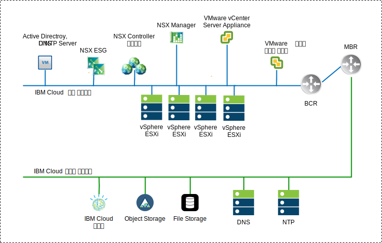
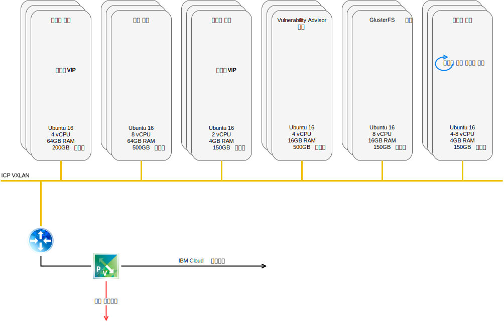
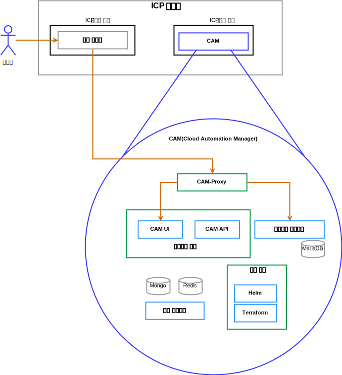

---

copyright:

  years:  2016, 2019

lastupdated: "2019-03-19"

subcollection: vmware-solutions

---

# 솔루션 컴포넌트
{: #vcsicp-arch-overview-solution}

## VMware vCenter Server on IBM Cloud 컴포넌트
{: #vcsicp-arch-overview-solution-vcs-comp}

그림 1. vCenter Server 환경 다이어그램

### Platform Service Controller
{: #vcsicp-arch-overview-solution-psc}

vCenter Server 배치는 관리 가상 머신(VM)과 연관된 사설 VLAN의 포터블 서브넷에 설치된 하나의 외부 플랫폼 서비스 제어기를 사용합니다. 기본 게이트웨이는 BCR(Backend Customer Router)로 설정됩니다.

### vCenter Server
{: #vcsicp-arch-overview-solution-vcs}

Platform Service Controller처럼 vCenter Server는 어플라이언스로 배치됩니다. 또한 vCenter Server는 관리 VM과 연관된 사설 VLAN의 포터블 서브넷에 설치됩니다. 이의 기본 게이트웨이는 해당 특정 서브넷에 대한 BCR에서 지정된 IP 주소로 설정됩니다.

### NSX Manager
{: #vcsicp-arch-overview-solution-nsx-manager}

NSX Manager는 초기 클러스터에 배치됩니다. 또한 NSX Manager에는 관리 컴포넌트용으로 지정되며 DNS 및 NTP 서버로 구성되어 있는 사설 포터블 주소 블록의 VLAN 지원 IP 주소가 지정됩니다.

### NSX
Controller
{: #vcsicp-arch-overview-solution-nsx-controllers}

{{site.data.keyword.cloud}} 자동화는 초기 클러스터 내에 3개의 NSX Controller를 배치합니다. 제어기에는 관리 컴포넌트용으로 지정된 사설 포터블 서브넷의 VLAN 지원 IP 주소가 지정됩니다.

### NSX Edge/DLR
{: #vcsicp-arch-overview-solution-nsx-edge}

NSX Edge Services Gateway(ESG) 쌍이 배치됩니다. 모든 경우에, 하나의 게이트웨이 쌍은 사설 네트워크에 상주하는 자동화 컴포넌트의 아웃바운드 트래픽에 사용됩니다. vCenter Server 및 {{site.data.keyword.icpfull_notm}}의 경우, ICP 관리 에지라고 하는 두 번째 게이트웨이가 배치되며 사설 네트워크에 지정된 인터페이스와 공용 네트워크에 대한 업링크로 구성됩니다. 관리자는 DLR(Distributed Logical Router), 논리 스위치 및 방화벽과 같은 필수 컴포넌트를 구성할 수 있습니다. [vCenter Server 네트워킹 안내서](/docs/services/vmwaresolutions/archiref/vcsnsxt?topic=vmware-solutions-vcsnsxt-intro)에서는 네트워크 디자인에 대해 자세히 설명합니다.

다음 표에서는 {{site.data.keyword.icpfull_notm}} ESG / DLR 스펙의 개요를 보여줍니다.

표 1. {{site.data.keyword.icpfull_notm}} ESG 스펙

 속성  | 스펙
--|--
Edge Service Gateway  | 가상 어플라이언스
Edge 크기 대형 | vCPU 수 2
메모리	| 1GB 디스크	| 로컬 데이터 저장소의 1000GB

표 2. {{site.data.keyword.icpfull_notm}} DLR 스펙

 속성  | 스펙
--|--|
Distributed Logical Router | 	 가상 어플라이언스
Edge 크기 압축 | vCPU 수 1
메모리	| 512MB 디스크	| 로컬 데이터 저장소의 1000GB

## IBM Cloud Private 컴포넌트
{: #vcsicp-arch-overview-solution-icp-comp}

{{site.data.keyword.icpfull_notm}}는 컨테이너화된 온프레미스 애플리케이션의
개발 및 관리를 위한 애프리케이션 플랫폼입니다. 컨테이너 오케스트레이터 Kubernetes, 개인용 이미지 저장소, 관리 콘솔 및 모니터링 프레임워크를 포함하는 컨테이너 관리를 위한 통합 환경입니다.

그림 2. vCenter Server를 사용하는 가상 {{site.data.keyword.icpfull_notm}} 배치

###	부트 노드
{: #vcsicp-arch-overview-solution-boot-node}

부트 또는 부트스트랩 노드(선택사항)는 설치, 구성, 노드 스케일링 및 클러스터 업데이트를 실행하는 데 사용됩니다. 클러스터에는 단 하나의 부트 노드만 필요합니다. 마스터 및 부트 둘 다에 대해 단일 노드를 사용할 수 있습니다.

### 마스터 노드
{: #vcsicp-arch-overview-solution-master-node}

마스터 노드는 관리 서비스를 제공하고 클러스터에서 작업자 노드를 제어합니다. 마스터 노드는 리소스 할당, 상태 유지보수, 스케줄링 및 모니터링을 담당하는 프로세스를 호스팅합니다. 고가용성(HA) 환경에는 둘 이상의 마스터 노드가 있으므로, 리드 마스터 노드가 실패하는 경우 장애 복구 로직에서 자동으로 다른 노드를 마스터 역할로 승격시킵니다. 마스터 역할을 수행할 수 있는 호스트를 마스터 후보라고 합니다.

###	작업자 노드
{: #vcsicp-arch-overview-solution-worker-node}

작업자 노드는 태스크 실행을 위해 컨테이너화된 환경을 제공하는 노드입니다. 요구가 증가하면 클러스터에 더 많은 작업자 노드를 쉽게 추가하여 성능과 효율성을 향상시킬 수 있습니다. 클러스터는 여러 개의 작업자 노드를 포함할 수 있지만 최소 하나의 작업자 노드가 필요합니다.

### 프록시 노드
{: #vcsicp-arch-overview-solution-proxy-node}

프록시 노드는 클러스터 내에서 작성된 서비스에 외부 요청을 전송하는 노드입니다. 고가용성(HA) 환경에는 둘 이상의 프록시 노드가 있으므로, 리드 프록시 노드가 실패하는 경우 장애 복구 로직에서 자동으로 다른 노드를 프록시 역할로 승격시킵니다. 단일 노드를 마스터 및 프록시 둘 다로 사용할 수 있지만, 마스터 노드에서 로드를 줄이기 위해 전용 프록시 노드를 사용하십시오. 클러스터 내에서 로드 밸런싱이 필요한 경우 클러스터에는 하나 이상의 프록시 노드가 있어야 합니다.

### 관리 노드
{: #vcsicp-arch-overview-solution-mgmt-node}

관리 노드는 모니터링, 미터링 및 로깅과 같은 관리 서비스만 호스팅하는 선택적 노드입니다. 전용 관리 노드를 구성하면, 마스터 노드에 과부하가 발생하는 것을 방지할 수 있습니다. {{site.data.keyword.icpfull_notm}} 설치 중에만 관리 노드를 사용으로 설정할 수 있습니다.

###	Vulnerability Advisor 노드
{: #vcsicp-arch-overview-solution-va-node}

VA(Vulnerability Advisor) 노드는 Vulnerability Advisor 서비스 실행에 사용되는 선택적 노드입니다. Vulnerability Advisor 서비스는 리소스 집약적인 서비스입니다. Vulnerability Advisor 서비스를 사용하는 경우 전용 VA 노드를 지정하십시오.

고가용성 {{site.data.keyword.icpfull_notm}} 인스턴스에는 다음 VM 스펙이 필요합니다.

표 3. {{site.data.keyword.icpfull_notm}} 가상 머신 스펙

노드 | 	인스턴스	| IP	| CPU	| RAM(GB)	| 디스크(GB)
:-----|------------:|:----|----:|----------:|----------:|
마스터|	3	| IP (x3) VIP (x1)	| 4	| 64	| 200
관리	|3	| IP (x3)	|8	|64	|500
프록시	| 3	| IP (x3)VIP (x1)	|2	|4	|150
Vulnerability Advisor	|3	| IP (x3)	| 4	| 16	|500
GlusterFS	| 3	| IP (x3)	|8	|16	|150
작업자	| 3-6	| IP (x3)	|4-8	|4	|150

CAM에서는 작업자 노드가 더 높은 vCPU 및 메모리 구성을 포함해야 합니다.

표 4. {{site.data.keyword.icpfull_notm}} 가상 머신 스펙

노드 | 	인스턴스	| IP	| CPU	| RAM(GB)	| 디스크(GB)
:-----|------------:|:----|----:|----------:|----------:|
작업자  |  3 | IP (x3)  |  4-8 |16-20   |  150

## CAM 컴포넌트
{: #vcsicp-arch-overview-solution-cam-comp}

{{site.data.keyword.cloud_notm}} Automation Manager(CAM)은 개발자와 관리자가 비즈니스 요구를 충족시킬 수 있도록 도움을 주는 {{site.data.keyword.icpfull_notm}}에서 실행되는 다중 클라우드의 셀프 서비스 관리 플랫폼입니다.

그림 3. CAM 컴포넌트 참조 

### CAM 프록시
{: #vcsicp-arch-overview-solution-cam-proxy}

CAM에 대한 nginx 프록시 액세스를 제공합니다.

### CAM 사용자 인터페이스
{: #vcsicp-arch-overview-solution-cam-ui}

이 사용자 인터페이스 컴포넌트는 둘 이상의 컨테이너로 분할됩니다. 컴포넌트는 클라우드 연결 사용자 인터페이스, Library of Templates 사용자 인터페이스 및 배치된 인스턴스 사용자 인터페이스에 포함됩니다.

### CAM API
{: #vcsicp-arch-overview-solution-cam-api}

CAM API는 둘 이상의 컨테이너로 분할됩니다.

### Helm
{: #vcsicp-arch-overview-solution-helm}

Helm 차트를 Kubernetes 클러스터로 배치하기 위해 필수 2진이 포함된 컨테이너

### Terraform
{: #vcsicp-arch-overview-solution-terraform}

둘 이상의 클라우드에서 Terraform 리소스를 배치하기 위해 필수 2진 파일이 포함된 컨테이너

### 로그
{: #vcsicp-arch-overview-solution-logs}

컨테이너 로그의 위치

### Mongo 데이터베이스
{: #vcsicp-arch-overview-solution-mongo-db}

CAM 애플리케이션에 대한 코어 데이터베이스.

### Redis
{: #vcsicp-arch-overview-solution-redis}

Redis 데이터베이스는 CAM 내에서 세션 캐싱과 잠금을 저장하는 데 사용됩니다.

### 템플리트 디자이너
{: #vcsicp-arch-overview-solution-template-designer}

Terraform 모듈의 끌어서 놓기 기능을 사용하여 Terraform 템플리트를 작성하는 그래픽 사용자 인터페이스

### Maria 데이터베이스
{: #vcsicp-arch-overview-solution-maria-db}

템플리트 디자이너 애플리케이션의 데이터베이스

## 관련 링크
{: #vcsicp-arch-overview-solution-related}

* [vCenter Server on {{site.data.keyword.cloud_notm}} with Hybridity Bundle 개요](/docs/services/vmwaresolutions/archiref/vcs?topic=vmware-solutions-vcs-hybridity-intro)
