---

copyright:

  years:  2016, 2019

lastupdated: "2019-02-15"

subcollection: vmware-solutions

---

# 아키텍처 개요
{: #vcsicp-arch-overview}

{{site.data.keyword.vmwaresolutions_full}} 오퍼링은 VMware 기술 컴포넌트를 전세계에 있는
{{site.data.keyword.CloudDataCents_notm}}에 배치하는 자동화 기능을 제공합니다.
이 아키텍처는 단일 클라우드 지역으로 구성되며 동일한 데이터 센터 내의 다른 지역 또는 다른 {{site.data.keyword.cloud_notm}} 팟(Pod)에 위치한 여러 클라우드 지역으로 확장하는 기능을 지원합니다.

{{site.data.keyword.cloud_notm}} Private 및 CAM(Cloud Automation Manager) 제품을 온프레미스 가상화 플랫폼에 수동으로 배치할 수 있으며 온프레미스 위치에서 클라우드를 관리할 수 있습니다. 또는 {{site.data.keyword.icpfull_notm}} 및 CAM은 자동화를 통해 기존 또는 새로운 VMware vCenter Server on {{site.data.keyword.cloud_notm}} 배치에 대한 서비스 확장으로 제공되며 {{site.data.keyword.cloud_notm}}에서 클라우드를 관리할 수 있습니다.

{{site.data.keyword.cloud_notm}} Private은 컨테이너화된 온프레미스 애플리케이션의 개발 및 관리를 위한 애프리케이션 플랫폼입니다. {{site.data.keyword.cloud_notm}} Private은 컨테이너 오케스트레이터 Kubernetes, 개인용 이미지 저장소, 관리 콘솔 및 모니터링 프레임워크를 포함하는 컨테이너 관리를 위한 통합 환경입니다.

IBM Multi-Cluster Manager(MCM)는 클라우드 및 클러스터에서 사용자 가시성, 애플리케이션 중심 관리(정책, 배치, 상태, 운영) 및 정책 기반 준수를 제공합니다. MCM을 사용하면 Kubernetes 클러스터를 제어할 수 있습니다. MCM은 클러스터가 개발자와 관리자가 비즈니스 요구를 충족시킬 수 있도록 {{site.data.keyword.cloud_notm}} Private에서 실행되는 서비스 관리 플랫폼을 제공하고, 효율적으로 운영하며, 안전하게 보호하는지 확인할 수 있도록 지원합니다.

Cloud Automation Manager Service Composer를 사용하여 {{site.data.keyword.cloud_notm}} Private 카탈로그에 하이브리드 클라우드 서비스를 표시할 수 있습니다.

## IBM Cloud 측 클라우드 관리 플랫폼
{: #vcsicp-arch-overview-ibm-cloud-side-platform}

다음 다이어그램은 {{site.data.keyword.cloud_notm}}에 배치된 온프레미스 vCenter 및 {{site.data.keyword.containerlong_notm}}와의 연결을 통해 {{site.data.keyword.cloud_notm}} 인프라에 배치된 {{site.data.keyword.icpfull_notm}} 및 CAM의 예입니다. 사용자는 가상 머신(VM)을 온프레미스에, VM을 vCenter Server 인스턴스에, 컨테이너를 {{site.data.keyword.icpfull_notm}} 및 {{site.data.keyword.containerlong_notm}} 클러스터에 배치할 수 있습니다.

그림 1. 클라우드 측에서 클라우드 관리

다이어그램에서 CAM은 vCenter, 클라우드 제공자, {{site.data.keyword.icpfull_notm}} 및 {{site.data.keyword.containerlong_notm}} 환경에 클라우드 연결을 논리적으로 작성합니다. {{site.data.keyword.icpfull_notm}} 클러스터를 단일 관리 보기로 연결하기 위한 메커니즘을 제공하는 MCM을 사용하여 각각의 데이터 센터 클라우드 환경에 {{site.data.keyword.icpfull_notm}} 클러스터를 배치해야 합니다.

NSX-V 또는 NSX-T 컴포넌트가 있는 {{site.data.keyword.icpfull_notm}}를 배치할 수 있습니다. NSX-V를 사용하는 {{site.data.keyword.icpfull_notm}}의 경우 {{site.data.keyword.icpfull_notm}} VM을 VXLAN 네트워크에서 실행하고 Kubernetes Calico 내부 네트워킹을 사용할 수 있습니다.

NSX-T를 사용하는 {{site.data.keyword.icpfull_notm}}의 경우 사용자가 중앙 UI(NSX-T 관리자)에서 네트워킹, 서브넷, 정책을 제어하고 구성할 수 있습니다. NSX-V와 NSX-T의 차이점은 [vCenter Server 네트워킹 안내서](/docs/services/vmwaresolutions/archiref/vcsnsxt?topic=vmware-solutions-vcsnsxt-intro)를 참조하십시오.

## 온프레미스 클라우드 관리 플랫폼
{: #vcsicp-arch-overview-on-premises-platform}

다음 다이어그램은 {{site.data.keyword.cloud_notm}}에 배치된 vCenter 및 {{site.data.keyword.containerlong_notm}}와의 연결을 통해 온프레미스 인프라에 배치된 {{site.data.keyword.icpfull_notm}} 및 CAM의 예입니다. 사용자는 VM과 컨테이너를 온프레미스에, VM을 vCenter Server 인스턴스에, 컨테이너를 {{site.data.keyword.containerlong_notm}} 클러스터에 배치할 수 있습니다.

그림 2. 온프레미스 측의 클라우드 관리

strongSwan VPN은 배치된 {{site.data.keyword.containerlong_notm}} 컨테이너에 대한 연결을 설정하는 데 사용됩니다. strongSwan VPM은 Direct Link 연결로 대체될 수 있습니다.

다이어그램에서 CAM은 vCenter, 클라우드 제공자, {{site.data.keyword.icpfull_notm}} 및 {{site.data.keyword.containerlong_notm}} 환경에 클라우드 연결을 논리적으로 작성합니다. {{site.data.keyword.icpfull_notm}} 클러스터를 단일 관리 보기로 연결하기 위한 메커니즘을 제공하는 MCM을 사용하여 각각의 데이터 센터 클라우드 환경에 {{site.data.keyword.icpfull_notm}} 클러스터를 배치해야 합니다.

## 관련 링크
{: #vcsicp-arch-overview-related}

* [vCenter Server on {{site.data.keyword.cloud_notm}} with Hybridity Bundle 개요](/docs/services/vmwaresolutions/archiref/vcs?topic=vmware-solutions-vcs-hybridity-intro)
