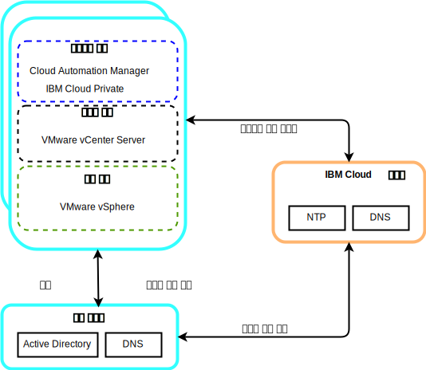
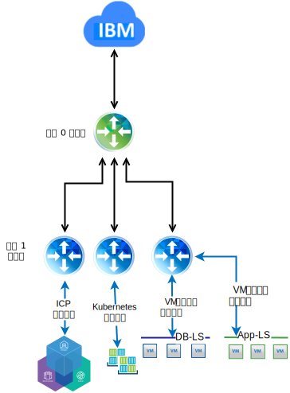

---

copyright:

  years:  2016, 2019

lastupdated: "2019-02-15"

subcollection: vmware-solutions

---

# 자세한 디자인
{: #vcsicp-detail-design}

## 공통 서비스 컴포넌트
{: #vcsicp-detail-design-common-services}

공통 서비스는 클라우드 관리 플랫폼의 기타 서비스에서 사용하는 서비스를 제공합니다. 공통 서비스는 ID 및 액세스 서비스, Domain Name Service 및 NTP 서비스가 포함됩니다.

그림 1. {{site.data.keyword.icpfull_notm}} 공통 서비스

### ID 및 액세스 서비스
{: #vcsicp-detail-design-identity}

VMware vCenter Server on {{site.data.keyword.cloud}} 자동화의 일부로 Microsoft Active Directory(AD)는 Identity  Management에 사용됩니다. 단일 AD VSI(Virtual Server Instance)가 배치됩니다. vCenter는 AD 인증을 사용하도록 구성되며 LDAP 인증을 위해 {{site.data.keyword.icpfull_notm}}를 구성할 수 있습니다.

###	Domain Name Service
{: #vcsicp-detail-design-dns}

vCenter Server 배치에서는 배치된 AD VSI를 인스턴스를 위한 DNS 서버로 사용합니다. 배치된 모든 컴포넌트(예: vCenter, PSC, NSX 및 ESXi 호스트)는 기본 DNS로 MS AD를 지정하도록 구성됩니다.

###	NTP 서비스
{: #vcsicp-detail-design-ntp}

vCenter Server 배치에서는 {{site.data.keyword.cloud_notm}} 인프라 NTP 서버를 사용합니다. 배치된 모든 컴포넌트는 이러한 NTP 서버를 사용하도록 구성되어 있습니다. 인증서와 AD 인증이 올바르게 작동하려면 이 디자인 내의 모든 컴포넌트가 동일한 NTP 서버를 사용해야 합니다.

## 네트워킹
{: #vcsicp-detail-design-networking}

### NSX-V 네트워킹
{: #vcsicp-detail-design-nsx-v}

NSX-V는 단일 NSX-V 관리자 플랫폼이 단일 vCenter Server 인스턴스에 연결되도록 설계되었습니다. vSphere 환경 내에서 실행되는 애플리케이션에 네트워킹 서비스를 제공합니다.

VCS 배치에 포함된 NSX-V 네트워킹을 사용하여 {{site.data.keyword.icpfull_notm}}를 VXLAN 오버레이 네트워크에 배치할 수 있습니다.

{{site.data.keyword.icpfull_notm}}는 Kubernetes에 대한 기본 Calico 네트워킹 스택을 사용하여 배치되며, 클러스터 내에서 네트워크 격리를 제공합니다.

그림 2. NSX-V 네트워킹을 사용하는 {{site.data.keyword.icpfull_notm}}

자세한 정보는 [vCenter Server 네트워킹 안내서](/docs/services/vmwaresolutions/archiref/vcsnsxt?topic=vmware-solutions-vcsnsxt-intro)를 참조하십시오.

### NSX-T 네트워킹
{: #vcsicp-detail-design-nst-t}

NSX-T는 모든 유형의 애플리케이션에 연결할 수 있는 단일 네트워킹 플랫폼이 가상 머신 또는 컨테이너 기반이 되고, vSphere 환경 내부 또는 외부에서 실행할 수 있도록 설계되었습니다.

{{site.data.keyword.icpfull_notm}}는 Calico 네트워킹을 NSX-T 인스턴스로 대체하기 위한 옵션을 제공하며 네트워킹 및 보안 관리를 위한 단일 위치를 제공합니다.

그림 3. NSX-T 네트워킹을 사용하는 {{site.data.keyword.icpfull_notm}}

## 관련 링크
{: #vcsicp-detail-design-related}

* [vCenter Server on {{site.data.keyword.cloud_notm}} with Hybridity Bundle 개요](/docs/services/vmwaresolutions/archiref/vcs?topic=vmware-solutions-vcs-hybridity-intro)
