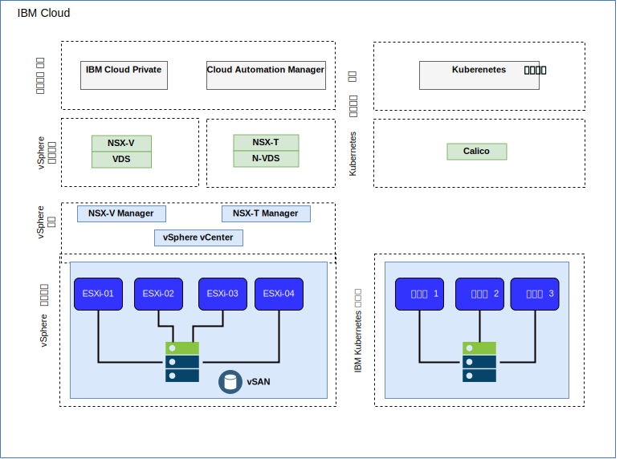
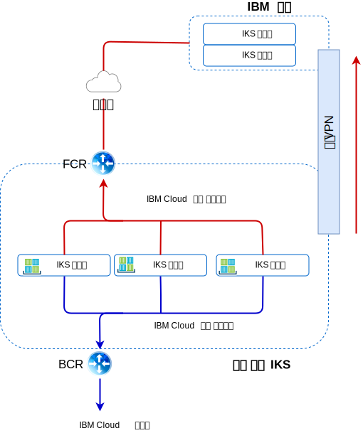

---

copyright:

  years:  2016, 2019

lastupdated: "2019-05-08"

subcollection: vmware-solutions

---

# IBM Cloud 네트워킹 및 인프라
{: #vcsiks-arch-overview-infrastructure}

## VRF(Virtual Routing and Forwarding)
{: #vcsiks-arch-overview-infrastructure-vrf}

{{site.data.keyword.cloud}} 계정을 VRF(Virtual Routing and Forwarding) 계정으로 구성할 수 있습니다. VRF 계정은 서브넷 IP 블록 사이의 자동 글로벌 라우팅을 사용합니다. Direct-Link 연결의 모든 계정은 VRF 계정으로 변환되거나 VRF 계정으로 작성되어야 합니다.

## Direct Link
{: #vcsiks-arch-overview-infrastructure-direct-link}

{{site.data.keyword.cloud_notm}} Direct Link Connect는 로컬 {{site.data.keyword.CloudDataCent_notm}}를 통해 {{site.data.keyword.cloud_notm}} 인프라 및 네트워크 서비스 제공자에 연결된 다른 클라우드에 대한 개인용 액세스를 제공합니다. 이 옵션은 단일 환경에서 다중 클라우드 연결을 작성하는 데 적합합니다.
IBM은 공유 대역폭 토폴로지를 사용하여 고객을 {{site.data.keyword.cloud_notm}} Private 네트워크에 연결합니다. 모든 Direct-Link 제품과 마찬가지로, 글로벌 라우팅을 추가하여 모든 {{site.data.keyword.cloud_notm}} 위치에 사설 네트워크 트래픽을 사용할 수 있습니다.

## 가상 사설망(VPN)
{: #vcsiks-arch-overview-infrastructure-virt-private-network}

### strongSwan VPN
{: #vcsiks-arch-overview-infrastructure-strongswan}

strongSwan IPSec VPN 서비스는 업계 표준 인터넷 프로토콜 보안(IPSec) 프로토콜 스위트를 기반으로 인터넷에서 안전한 엔드-투-엔드 통신 채널을 제공합니다.

### Hybridity(HCX)
{: #vcsiks-arch-overview-infrastructure-hcx}

VMware vCenter Server on {{site.data.keyword.cloud_notm}} with Hybridity Bundle은 {{site.data.keyword.cloud_notm}}로 온프레미스 데이터 센터의 네트워크를 원활하게 확장할 수 있으며, 이를 통해 변환이나 변경 없이 {{site.data.keyword.cloud_notm}}에서 가상 머신(VM)을 마이그레이션할 수 있습니다.

## 물리적 구조
{: #vcsiks-arch-overview-infrastructure-physical-structure}

vCenter Server를 배치해야 하는 실제 인프라는 다음과 같은 최소 스펙이 필요합니다.

표 1. vCenter Server 스펙

  | NFS 배치 | VSAN 배치
---|---|---
서버 수 | 3 | 4
CPU | 28개 코어 2.2GHZ | 28개 코어 2.2GHZ
메모리 | 384GB | 384GB
저장 공간|관리: 2TB 2 IOPS, 워크로드: 2TB 4 IOPS|최소 SSD: 960GB(x2)   

{{site.data.keyword.containerlong_notm}} 배치 옵션은 작업자 노드 요구사항에 따라 다릅니다.

표 2. {{site.data.keyword.containerlong_notm}} 스펙

  | 가상 머신 | Bare Metal
--|---|--
서버 수 | 3 | 3
CPU | 2 – 56개 코어 | 4 – 28개 코어
메모리 | 4GB - 242GB | 32GB - 512GB
저장 공간 | 100GB |  SATA: 2TB/SSD: 960GB

## 가상 구조
{: #vcsiks-arch-overview-infrastructure-virtual-structure}

{: caption="그림 1. {{site.data.keyword.containerlong_notm}} 및 {{site.data.keyword.icpfull_notm}} 배치의 물리적 구조" caption-side="bottom"}

vCenter Server 인스턴스 내에서, 고객 VMS는 전용 NSX ESG(Edge Services Gateway) 및 DLR(Distributed Logical Router)로 배치됩니다.

ESG는 아웃바운드 트래픽을 허용하도록 소스 NAT 규칙(SNAT)을 사용하여 구성되며, 인터넷 연결을 통해 {{site.data.keyword.icpfull_notm}} 전제조건을 다운로드하고 GitHub 및 Docker에 연결할 수 있습니다. 또는 인터넷 연결을 위해 웹 프록시를 사용할 수 있습니다. ESG는 사설 네트워크를 통해 DNS 및 NTP 서비스에 액세스하도록 구성됩니다. {{site.data.keyword.containerlong_notm}} 인스턴스에 대한 통합은 vCenter Server 인스턴스와 {{site.data.keyword.containerlong_notm}} 사이의 {{site.data.keyword.cloud_notm}} 네트워킹을 통해 사용 가능합니다.

## vCenter Server 컴포넌트
{: #vcsiks-arch-overview-infrastructure-vcs-comp}

### Platform Service Controller
{: #vcsiks-arch-overview-infrastructure-psc}

vCenter Server 배치는 관리 VM과 연관된 사설 VLAN의 포터블 서브넷에 설치된 하나의 외부 PSC(Platform Services Controller)를 사용합니다. 기본 게이트웨이는 BCR(Backend Customer Router)로 설정됩니다.

### vCenter Server
{: #vcsiks-arch-overview-infrastructure-vcs}

PSC처럼 vCenter Server는 어플라이언스로 배치됩니다.
또한 vCenter는 관리 VM과 연관된 사설 VLAN의 포터블 서브넷에 설치됩니다. 기본 게이트웨이는 BCR로 설정됩니다.

### NSX
Manager
{: #vcsiks-arch-overview-infrastructure-nsx-manager}

NSX Manager는 초기 vCenter Server 클러스터에 배치됩니다. 또한 NSX Manager에는 관리 컴포넌트용으로 지정되는 사설 포터블 주소 블록의 IP 주소가 지정됩니다.

### NSX
Controller
{: #vcsiks-arch-overview-infrastructure-nsx-controllers}

{{site.data.keyword.cloud_notm}} 자동화는 초기 클러스터 내에 3개의 NSX Controller를 배치합니다. 제어기에는 관리 컴포넌트용으로 지정된 사설 포터블 서브넷의 IP 주소가 지정됩니다.

### NSX ESG/DLR
{: #vcsiks-arch-overview-infrastructure-nsx-esg}

NSX Edge Services Gateway(ESG) 쌍이 배치됩니다. 모든 경우에, 하나의 게이트웨이 쌍은 사설 네트워크에 상주하는 자동화 컴포넌트의 아웃바운드 트래픽에 사용됩니다. vCenter Server 및 {{site.data.keyword.icpfull_notm}}의 경우,
ICP 관리 에지라고 하는 두 번째 게이트웨이가 배치되며 사설 네트워크에 지정된 인터페이스와
공용 네트워크에 대한 업링크로 구성됩니다.
관리자는 DLR(Distributed Logical Router), 논리 스위치 및 방화벽과 같은 필수 컴포넌트를 구성할 수 있습니다. 솔루션의 일부로 배치되는 NSX Edges에 대한 자세한 정보는 [vCenter
Server 네트워킹 안내서](/docs/services/vmwaresolutions/archiref/vcsnsxt?topic=vmware-solutions-vcsnsxt-intro)를 참조하십시오.

다음 표에서는 {{site.data.keyword.icpfull_notm}} ESG/DLR 스펙의 개요를 보여줍니다.

표 3. {{site.data.keyword.icpfull_notm}} ESG 스펙

 속성 | 스펙
--|--
Edge Service Gateway | 가상 어플라이언스
Edge 크기 대형 | vCPU 수 2
메모리	|1GB
디스크	| 로컬 데이터 저장소의 1000GB

표 4. {{site.data.keyword.icpfull_notm}} DLR 스펙

 속성  | 스펙
--|--|
Distributed Logical Router |	 가상 어플라이언스
Edge 크기 압축 | vCPU 수 1
메모리	|512MB
디스크	| 로컬 데이터 저장소의 1000GB

## IBM Cloud Kubernetes Service 컴포넌트
{: #vcsiks-arch-overview-infrastructure-iks-comp}

### Kubernetes 마스터
{: #vcsiks-arch-overview-infrastructure-kube-master}

Kubernetes 마스터는 클러스터에서 모든 컴퓨팅, 네트워크 및 스토리지 리소스를 관리하는 작업을 수행합니다. Kubernetes 마스터를 사용하면 컨테이너화된 앱과 서비스가 클러스터의 작업자 노드에 균등하게 배치됩니다.

###	작업자 노드
{: #vcsiks-arch-overview-infrastructure-worker-node}

각 작업자 노드는 클라우드 환경의 실제 하드웨어에서 실행되는 실제 시스템(베어메탈) 또는 VM입니다. 작업자 노드를 프로비저닝할 때 해당 작업자 노드에 호스트되는 컨테이너에 사용 가능한 리소스를 판별합니다. 작업자 노드는 기본적으로 IBM 관리 Docker Engine, 별도의 컴퓨팅 리소스, 네트워킹 및 볼륨 서비스로 설정됩니다. 내장 보안 기능은 격리, 리소스 관리 기능 및 작업자 노드 보안 준수를 제공합니다.

## 관련 링크
{: #vcsiks-arch-overview-infrastructure-related}

* [vCenter Server on {{site.data.keyword.cloud_notm}} with Hybridity Bundle 개요](/docs/services/vmwaresolutions/archiref/vcs?topic=vmware-solutions-vcs-hybridity-intro)
