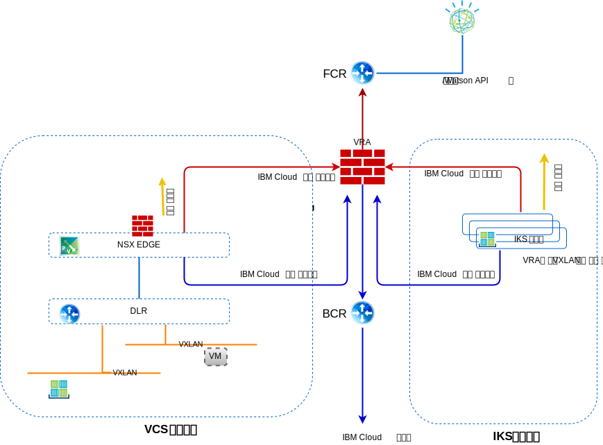

---

copyright:

  years:  2016, 2019

lastupdated: "2019-01-23"

---

# 네트워킹, 백업, 재해 복구 및 확장성

## 네트워킹

{{site.data.keyword.cloud}}에는 두 가지 네트워크가 있습니다. 공용 네트워크를 사용하면 인터넷에서 서버에 도달할 수 있으며 사설 네트워크를 사용하면 서버가 모든 {{site.data.keyword.CloudDataCents_notm}}의
고속 백본을 통해 서로 통신할 수 있습니다.

기본적으로 {{site.data.keyword.containerlong_notm}}는 공용 VLAN 및 사설 VLAN에 대한 액세스 권한으로 클러스터를 설정합니다.
- 각 작업자 노드의 공용 IP 주소. 이를 통해 작업자 노드에 공용 네트워크 인터페이스를 제공합니다.
  - 모든 아웃바운드 네트워크 트래픽이 모든 작업자 노드에 허용됩니다.
  - 인바운드 네트워크 트래픽은 몇 개의 포트를 제외하고 차단됩니다. IBM이 네트워크 트래픽을 모니터하고 Kubernetes 마스터에 대한 보안 업데이트를 설치할 수 있도록 이러한 포트는 열려 있습니다.
- 각 작업자 노드의 사설 IP 주소. 이를 통해 작업자 노드에 사설 네트워크 인터페이스를 제공합니다.
- 모든 작업자 노드와 마스터 노드 사이의 자동 보안 OpenVPN 연결.

그림 1. vCenter Server 및 {{site.data.keyword.containerlong_notm}} 네트워크

### IBM Cloud Kubernetes Service 및 vCenter Server 통합

현재 다음 시나리오는 {{site.data.keyword.cloud_notm}} 네트워킹에서 {{site.data.keyword.containerlong_notm}}와 VMware vCenter Server를 통합합니다.
- **VRA 라우팅** - 이 시나리오에서는 {{site.data.keyword.containerlong_notm}} 작업자 노드가 vCenter Server 인스턴스와 같은 VLAN에 배치되어야 합니다. 이렇게 하면 VRA로 ESG를 BGP 피어링하고 vCenter Server와 {{site.data.keyword.containerlong_notm}} 사이에서 오버레이부터 언더레이 네트워크까지 라우팅할 수 있습니다. 각 VXLAN 네트워크가 올바르게 라우트하기 위해 해당 요청을 BCR/VRA로 다시 라우트하려면 {{site.data.keyword.containerlong_notm}} 작업자 노드에 정적 라우트가 필요합니다.
- **strongSwan VPN** - 이 시나리오에서는 {{site.data.keyword.containerlong_notm}}-엔터프라이즈 연결 솔루션을 사용합니다. strongSwan 컨테이너는 원격 게이트웨이에 대한 IPSec 터널을 통해 패킷을 원격 네트워크로 전달하는 클러스터에 VPN
게이트웨이를 제공합니다. 이 원격 게이트웨이는 vCenter Server 인스턴스의 ESG입니다. 게이트웨이에서 라우트는 모든 클러스터와 서비스 IP 범위를 StrongSwan 컨테이너로 보내고 모든 vCenter Server BYOIP 주소를 ESG로 보내도록 구성됩니다. 게이트웨이의 대상 IP 주소는 strongSwan 컨테이너에 지정된 로드 밸런서 서비스의 사설 포터블 IP 주소와 ESG의 사설 포터블 IP 주소입니다.

#### IBM Cloud Kubernetes Service 네트워킹 VLAN

##### 공용 VLAN 서브넷

- 기본 공용 서브넷은 클러스터 작성 중에 작업자 노드에 지정되는 공용 IP 주소를 판별합니다. 동일한 VLAN에 있는 여러 클러스터는 하나의 기본 공용 서브넷을 공유할 수 있습니다.
- 포터블 공용 서브넷은 한 클러스터에만 바인드되고 클러스터에 8개의 공용 IP 주소를 제공합니다. 3개의 IP는 네트워크 기능에 예약됩니다. 1개의 IP는 기본 공용 Ingress ALB에서 사용되고 4개의 IP는 공용 로드 밸런서 네트워킹 서비스를 작성하는 데 사용됩니다.

포터블 공용 IP는 인터넷을 통해 로드 밸런서 서비스에 액세스할 때 사용되는 영구적인 고정 IP 주소입니다.

##### 사설 VLAN 서브넷

- 기본 사설 서브넷은 클러스터 작성 중에 작업자 노드에 지정되는 사설 IP 주소를 판별합니다. 동일한 VLAN에 있는 여러 클러스터는 하나의 기본 사설 서브넷을 공유할 수 있습니다.
- 포터블 사설 서브넷은 한 클러스터에만 바인드되고 클러스터에 8개의 사설 IP 주소를 제공합니다. 3개의 IP는 네트워크 기능에 예약됩니다. 1개의 IP는 기본 사설 Ingress ALB에서 사용되고 4개의 IP는 사설 로드 밸런서 네트워킹 서비스를 작성하는 데 사용됩니다.

포터블 사설 IP는 인터넷을 통해 로드 밸런서 서비스에 액세스할 때 사용되는 영구적인 고정 IP 주소입니다.

#### Calico

모든 Kubernetes 클러스터는 Calico라는 네트워크 플러그인을 사용하여 설정됩니다.

##### 네트워크 정책으로 트래픽 제어

기본 네트워크 정책은 {{site.data.keyword.containerlong_notm}}에 있는 모든 작업자 노드의 공용 네트워크 인터페이스를 보호하도록 설정됩니다. 고유한 보안 요구사항이 있거나 VLAN Spanning을 사용하는 다중 구역 클러스터가 있는 경우 Calico와 Kubernetes를 사용하여 클러스터에 대한 네트워크 정책을 작성할 수 있습니다. Kubernetes 네트워크 정책을 사용하여 클러스터 내의 팟(Pod)에서 허용하거나 차단할 네트워크 트래픽을 지정할 수 있습니다. LoadBalancer 서비스에 대한 인바운드(유입) 트래픽 차단과 같은 고급 네트워크 정책을 설정하려면 Calico 네트워크 정책을 사용하십시오.

###### Kubernetes 네트워크 정책

다음 정책은 팟(Pod)이 다른 팟(Pod)과 그리고 외부 엔드포인트와 통신할 수 있는 방법을 지정합니다. 트래픽은 팟(Pod)과 네임스페이스 레이블을 기반으로 필터링할 수 있습니다. Kubernetes 네트워크 정책은 kubectl 명령 또는 Kubernetes API를 사용하여 적용됩니다. 이러한 정책이 적용되면 정책은 자동으로 Calico 네트워크 정책으로 변환되고 Calico에서 이러한 정책을 강제 적용합니다.

###### Kubernetes를 위한 Calico 네트워크 정책

Calico 네트워크 정책은 Kubernetes 네트워크 정책의 수퍼세트이고 calicoctl 명령을 사용하여 적용됩니다.

Calico 정책은 다음 기능을 추가합니다.
- Kubernetes 팟(Pod) 소스 또는 대상 IP 주소 또는 CIDR에 상관없이 특정 네트워크 인터페이스에서 네트워크 트래픽을 허용하거나 차단합니다.
- 네임스페이스에서 팟(Pod)에 대한 네트워크 트래픽을 허용하거나 차단합니다.
- LoadBalancer 또는 NodePort Kubernetes 서비스에 대한 인바운드(유입) 트래픽을 차단합니다.

Calico는 Kubernetes 작업자 노드에 Linux iptables 규칙을 설정하여, 자동으로 Calico 정책으로 변환되는 Kubernetes 네트워크 정책을 포함하여 이러한 정책을 적용합니다. 네트워크 트래픽을 대상 리소스로 전송하기 위해 충족되어야 하는 특성을 정의하려면 Iptables 규칙이 작업자 노드의 방화벽 역할을 해야 합니다.

### 트래픽 플로우

#### 인터넷 상의 외부 사용자와 IBM Cloud Kubernetes Service의 컨테이너에서 호스팅되는 웹 티어 사이의 트래픽 플로우

1. 외부 사용자는 URL을 사용하여 웹 티어에 요청을 작성합니다.
2. DNS는 IP 주소를 판별하는 데 사용됩니다. 이 IP 주소는 ALB 또는 Ingress Service에 지정되는 포터블 서브넷의 {{site.data.keyword.cloud_notm}} 공용 주소입니다.
3. 공용 네트워크는 ALB 또는 Ingres Service를 호스트하는 작업자 노드에 자동으로 요청을 전달합니다.
4. 작업자 노드는 ALB 또는 Ingress 서비스의 내부 클러스터 IP 주소 및 포트 번호로 요청을 전달합니다. 이 내부 클러스터 IP 주소는 클러스터 안에서만 액세스할 수 있습니다.
5. 작업자 노드 내에서, kube-proxy는 요청을 ALB 또는 Ingress 서비스로 라우팅합니다.
6. 애플리케이션이 동일한 작업자 노드에 있는 경우에는 iptables를 사용하여 요청을 전달하는 데 어떤 내부 인터페이스가 사용되는지 판별합니다. 앱이 서로 다른 작업자 노드에 있으면, 작업자 노드가 다른 서브넷에 있는 경우에만 IP-in-IP 캡슐화를 사용하여 Calico vRouter가 해당 작업자 노드로 라우트됩니다.

#### IBM Cloud Kubernetes Service의 컨테이너에서 호스팅되는 웹 티어와 vCenter Server의 가상 머신에서 호스팅되는 데이터베이스 티어 사이의 트래픽 플로우

예를 들면 NAT IP 주소와 MySQL 데이터베이스 VM의 포트 번호가 포함된 외부 데이터베이스 가상 머신(VM)을 자세히 설명하는 엔드포인트 리소스가 작성됩니다.

- 종류: 엔드포인트
- api 버전: v1
- 메타데이터:
  - 이름: mysqldb
- 서브세트:
  - 주소:
      - ip: 10.x.x.x
  - 포트:
      - 포트: 3306

엔드포인트 리소스에는 여러 개의 주소가 나열될 수 있고, Kubernetes는 해당 주소 간에 라운드 로빈 방식으로 작동합니다.  

서비스 리소스는 서비스에 대한 kube-dns에 IP와 DNS 이름을 작성하는 데 사용됩니다.

- 종류: 서비스
- api 버전: v1
- 메타데이터:
  - 이름: mysqldb
- 레이블:
  - 이름: mysqldb
- 스펙:
  - 포트:
    - 프로토콜: TCP
    - 포트: 3306

##### 플로우

1. {{site.data.keyword.containerlong_notm}}의 컨테이너에서 실행 중인 웹 티어는 mysqldb라는 vCenter Server 인스턴스의 VM에서 실행 중인 데이터베이스에 요청을 작성합니다. Kubernetes는 이 이름을 IP 주소로 해석하고, 데이터베이스 서버(10.x/26)의 NAT 적용 IP의 대상 IP 주소와 작업자 노드(10.x/26)의
소스 IP를 사용하여 클러스터에서 이 요청을 내보냅니다.
2. 대상 IP 주소는 작업자 노드와 동일한 서브넷에 있지 않으므로 {{site.data.keyword.cloud_notm}}
BCR로 전달됩니다.
3. BCR은 요청을 라우트하고, customer-nsx-edge가 연결되는 고객 워크로드 서브넷인 **사설 A** VLAN에 대한 요청을 수행합니다.

이 NSX Edge에는 다음과 같은 규칙이 있습니다.
- 이 연결을 허용하는 방화벽 규칙.
- 대상 IP 주소를 10.x 주소에서 데이터베이스 서버에 사용되는 192.168 주소로 변경하는 DNAT 규칙.
4. 그런 다음 ESG에서 DLR로 전달합니다.
5. DLR은 요청을 필요한 VXLAN에 배치합니다.
6. 데이터베이스 VM에서 요청을 수신합니다.

## 백업 및 DR

### vCenter Server 백업
{{site.data.keyword.vmwaresolutions_short}}의 일부로, Veeam 백업 소프트웨어는 VMware 클러스터 외부에서 {{site.data.keyword.cloud_notm}} Endurance Storage를 사용하는 {{site.data.keyword.cloud_notm}} VSI(Virtual Server Instance)에 선택적으로 배치됩니다. 이 소프트웨어의 목적은 이 솔루션의 관리 컴포넌트를 백업하는 것입니다.

### NSX 백업
모든 NSX 컴포넌트의 적절한 백업은 장애가 발생하는 경우 시스템을 해당 작업 상태로 복원하는 데 매우 중요합니다. NSX VM을 백업하는 것만으로는 충분하지 않습니다. 적절한 백업을 위해서는 NSX Manager 내의 NSX 백업 기능을 사용해야 합니다. 이 백업을 위해서는 FTP 또는 SFTP 서버가 NSX 백업 데이터의 저장소에 대해 지정되어야 합니다. NSX 관리자 백업에는 제어기, 엔티티의 논리적 전환 및 라우팅, 보안, 방화벽 규칙 및 NSX 관리자 UI 또는 API 내에서 구성하는 모든 것을 포함하여 모든 NSX 구성이 포함됩니다. vCenter 데이터베이스와 관련 요소(예: 가상 스위치)는 별도로 백업됩니다. NSX 구성은 vCenter 백업과 함께 백업해야 합니다.

### IBM Cloud Kubernetes Service에 대한 백업 및 DR
etcd 데이터베이스의 백업은 관리 서비스의 일부로 고객에게 제공되며 애플리케이션 데이터는 자체적으로 백업해야 합니다.

## 확장성

### vCenter Server 확장성
초기 호스트를 배치하고 나면 사용자는 {{site.data.keyword.vmwaresolutions_short}} 포털 내에서 컴퓨팅 기능을 확장할 수 있습니다. 환경에서 이 확장은 세 가지 경로 중 하나를 따릅니다.
- 별도의 vCenter Server에서 관리하는 새 사이트의 추가
- 새 클러스터의 추가
- 기존 클러스터에 새 호스트 추가

#### 다중 사이트 배치
VMware on {{site.data.keyword.cloud_notm}}는 IBM Cloud의 전세계 데이터 센터 및 통합 네트워크 백본을 사용하여 다양한 교차 지역의 유스 케이스를 배치하고 처음부터 이러한 인프라를 빌드하는 데 걸리는 시간 내에 작동되도록 할 수 있습니다.

#### 새 클러스터로 확장
또한 사용자는 콘솔에서 새 클러스터를 작성하고, 호스트를 주문하여 컴퓨팅 용량을 확장할 수 있으며, 새 호스트는 새 클러스터에 자동으로 추가됩니다. 이 옵션은 환경에 추가 클러스터를 작성하며, 사용자에게 애플리케이션 워크로드에서 관리 워크로드를 물리적 및 논리적으로 구분하는 기능, 다른 특성(예: Microsoft SQL 데이터베이스 클러스터)에 따라 워크로드를 구분하는 기능 및 고가용성 토폴로지에 애플리케이션을 배치하는 기능을 제공합니다.

#### 기존 클러스터 확장
사용자는 콘솔 내에서 호스트를 주문하여 기존 클러스터를 확장할 수 있으며 새 호스트는 자동으로 클러스터에 추가됩니다.
예약 요구사항에 따라 클러스터에 대한 HA 예약 정책을 조정해야 할 수 있습니다.

### IBM Cloud Kubernetes Service 확장

사용자는 {{site.data.keyword.cloud_notm}} Portal을 통해 {{site.data.keyword.containerlong_notm}} 환경을
프로비저닝하여 컨테이너 환경을 확장하거나 사용할 수 있습니다. 다음을 통해 {{site.data.keyword.containerlong_notm}}로의 애플리케이션
배치를 수행할 수 있습니다.
  - {{site.data.keyword.containerlong_notm}} 연결 및 서비스는 CAM에서 개발되고 {{site.data.keyword.icpfull_notm}}
카탈로그에 공개됩니다.
  - 다중 클라우드 관리자의 향후 {{site.data.keyword.containerlong_notm}} 인스턴스 관리 개선사항.
  - Helm 명령행 인터페이스.
  - 다중 구역 클러스터를 사용하여 고가용성을 늘리십시오.

[클러스터 및 작업자 노드 설정 계획](/docs/containers/cs_clusters_planning.html#plan_clusters)은 요구사항을 충족하는 솔루션을 설계하기 위한 옵션과 프로세스에 대해 설명합니다.

## 보안 및 규제 준수
엄격한 업계 가이드라인 준수에 관해 {{site.data.keyword.cloud_notm}}는 사용자를 위해 준수를 촉진하는 작업을 수행했습니다. [{{site.data.keyword.cloud_notm}}의 규제 준수](https://www.ibm.com/cloud/compliance)에서는 보안 및 개인정보 보호를 위한 특정한 준수 인증, 글로벌 규정, 맞춤 및 프레임워크에 대해 자세히 설명합니다. [{{site.data.keyword.containerlong_notm}}에 대한 보안](/docs/containers/cs_secure.html#security)에는 {{site.data.keyword.containerlong_notm}} 보안 기능이 자세히 설명되어 있습니다. 

### 관련 링크

* [vCenter Server on {{site.data.keyword.cloud_notm}} with Hybridity Bundle 개요](/docs/services/vmwaresolutions/archiref/vcs/vcs-hybridity-intro.html)
