---

copyright:

  years:  2016, 2019

lastupdated: "2019-02-15"

---

# 시스템 컨텍스트
{: #vcsiks-systemcontext}

그림 1. 시스템 컨텍스트

핵심 구성요소는 다음과 같습니다.

- **온프레미스 가상화** - 이 컴포넌트는 클라이언트의 프레미스 또는 서드파티에서 호스팅되고, 현대화시킬 애플리케이션을 실행 중인 VM을 현재 호스팅하고 있는 VMware 환경입니다. 온프레미스 가상화는 VM 마이그레이션을 위한 소스 환경이며 VMware Hybridity(HCX)를 통해 {{site.data.keyword.cloud}} 인스턴스에 느슨하게 결합되어 있습니다.
- **vCenter Server** - VMware vCenter Server on {{site.data.keyword.cloud_notm}}는 온프레미스 환경에서 마이그레이션된 VM의 대상이 되는 {{site.data.keyword.cloud_notm}} for VMware
Services 인스턴스입니다. 온프레미스 가상화된 환경과 함께 하나의 사이트에서 다른 사이트로 VM을 이동할 수 있는 하이브리드 환경을 형성합니다.
- **{{site.data.keyword.containerlong_notm}}** - {{site.data.keyword.containerlong_notm}}는 Kubernetes를 컨테이너 오케스트레이션 솔루션으로 사용합니다. IBM은 작업자 노드가 고객 관리 인프라로 배치되는 동안 Kubernetes 마스터 노드를 운영 및 관리합니다. IBM은 운영 체제 패치 배치, Docker 엔진 업그레이드 및 새로운 Kubernetes 버전에 대한 관리 도구를 제공합니다. {{site.data.keyword.containerlong_notm}}에서는 장애 복구 발생 시 자가 치료가 가능하며 확장 가능한 포터블 컨테이너를 관리하기 위해 안전하고 격리된 플랫폼을 제공합니다.
- **{{site.data.keyword.icpfull_notm}}** - {{site.data.keyword.icpfull_notm}}는 컨테이너화된 애플리케이션의 개발 및 관리를 위한 애플리케이션 플랫폼입니다. {{site.data.keyword.icpfull_notm}}는 컨테이너 오케스트레이터 Kubernetes, 개인용 이미지 저장소, 관리 콘솔, 모니터링 프레임워크 및 애플리케이션을 배치, 관리, 모니터 및 확장할 수 있는 중앙 위치를 제공하는 그래픽 사용자 인터페이스가 포함된 통합 환경입니다.
- **{{site.data.keyword.cloud_notm}} Automation Manager** – CAM은 Kubernetes 기반 워크로드와 함께 VMware 기반 워크로드를 프로비저닝하는 단일 분할창을 제공하는 엔터프라이즈용 IaC(Infrastructure as Code) 플랫폼입니다. 가상 머신, 컨테이너 및 해당 인프라 전제조건에 대한 워크로드 프로비저닝 자동화가 CAM을 통해 사용으로 설정됩니다.
- **IBM Multi Cloud Manager** – MCM은 클라우드 및 클러스터에서 사용자 가시성, 애플리케이션 중심 관리(정책, 배치, 상태, 운영) 및 정책 기반 규제 준수를 제공합니다. MCM을 사용하면 Kubernetes 클러스터를 제어할 수 있습니다.
- **{{site.data.keyword.cloud_notm}} Services** – {{site.data.keyword.cloud_notm}} Services는 분석, AI 및 IoT 오퍼링을 포함하여 사용 가능한 다양한 서비스를 제공합니다.

## 액터
{: #vcsiks-systemcontext-actors}

표 1. 액터

액터 |설명
--|--
시스템 관리자 | 온프레미스 가상화 및 VCS 인스턴스를 관리하기 위해 vCenter Server를 사용하는 VMware vSphere의 숙련된 리소스.
개발자 | 컨테이너를 작성 및 관리하기 위해 {{site.data.keyword.containerlong_notm}}(CLI/Kubectl) 콘솔을 사용하는 컨테이너에 대한 숙련된 리소스. 개발자는 애플리케이션 현대화의 일환으로 새 서비스를 작성합니다.
고객 | 엔터프라이즈에서 서비스를 이용하는 외부 액터입니다. Acme Skateboard의 경우, 고객은 스케이트보드 제품을 구매하려는 스케이트를 타는 사람입니다. 고객은 카탈로그에 대한 보안 인터넷 액세스가 필요합니다.
{{site.data.keyword.containerlong_notm}} | 서비스에 대한 {{site.data.keyword.containerlong_notm}} 마스터 노드를 관리하는 IBM 리소스

## 시스템
{: #vcsiks-systemcontext-systems}

표 2. 시스템

액터 |설명
--|--
vCenter Server |관리자가 vCenter Server 인스턴스에서 온프레미스 VM 및 {{site.data.keyword.cloud_notm}} VM을 모두 관리하는 데 사용하는 기본 인터페이스 시스템입니다.
온프레미스 VM| {{site.data.keyword.cloud_notm}}로의 마이그레이션 대상인 애플리케이션을 호스팅하는 가상화된 서버입니다. 초기에 VM으로 마이그레이션된 후 애플리케이션 현대화를 VM에서 컨테이너로 리팩토링됩니다.
{{site.data.keyword.cloud_notm}} VM | 온프레미스 데이터 센터에서 마이그레이션된 애플리케이션을 호스팅하는 가상화된 서버입니다. 이 참조 아키텍처 및 Acme Skateboards의 경우, {{site.data.keyword.cloud_notm}} VM 중 하나가 데이터베이스 서버이며 온라인 상태 워크로드의 일부입니다.
엔터프라이즈 컨텐츠 카탈로그 | 패키지를 찾아보고 클러스터에 설치할 수 있는 중앙 집중식 위치입니다. 카탈로그에는 컨테이너를 작성하고 Helm 차트에 액세스하는 데 사용되는 여러 IBM 패키지가 있습니다. Helm은 Kubernetes 차트를 관리하기 위한 도구입니다. 차트는 사전 구성된 Kubernetes 리소스의 패키지이며 이를 통해 컨테이너 배치의 버전화, 패키징, 릴리스, 배치, 삭제, 업그레이드 및 롤백을 쉽게 수행할 수 있습니다. Helm은 Kubernetes 원시 패키지 관리 시스템이며 {{site.data.keyword.icpfull_notm}} 클러스터 내의 애플리케이션 관리에 사용됩니다.
핵심 운영 서비스 | {{site.data.keyword.icpfull_notm}}에는 로그 및 메트릭을 수집, 저장 및 조회하는 여러 도구가 포함되어 있습니다. 이러한 도구는 모든 로그 및 메트릭에 대한 중앙 저장소를 제공하며 로그 및 메트릭에 대한 액세스와 조회를 수행할 때 성능과 안정성이 향상됩니다.
관리 콘솔 | {{site.data.keyword.icpfull_notm}} 관리 콘솔을 사용하면 안전하고 중앙 집중식의 단일 관리 콘솔에서 애플리케이션 및 클러스터를 관리하고, 모니터링 및 문제점을 해결할 수 있습니다.
Terraform | VMware vSphere, {{site.data.keyword.cloud_notm}}, Microsoft Azure, Amazon Web Services, Google Cloud Platform 및 OpenStack과 같은 제공자를 사용하는 클라우드 및 인프라 리소스의 프로비저닝을 처리합니다.
HELM |  Kubernetes의 패키지 관리자입니다. Helm 차트는 Kubernetes 리소스를 정의하고 애플리케이션을 배치하는 데 사용됩니다.
Chef |  구성 관리 및 규제 준수 자동화를 담당합니다. Chef에서는 Terraform이 초기 프로비저닝을 완료한 후에 미들웨어 및 애플리케이션을 배치하고 구성합니다.
서비스 |  관리자가 Kubernetes 리소스 및 하나 이상의 VM에서 구성된 서비스를 작성, 구성 및 디자인하는 위치인 Service Composer를 나타냅니다.
컨테이너화된 애플리케이션 |  애플리케이션 현대화 과정을 완료하고 이제 컨테이너로 실행 중인 애플리케이션입니다. 이 참조 아키텍처 및 Acme Skateboards의 경우, 컨테이너화된 애플리케이션 중 하나가 웹 서버이며 온라인 상태 워크로드의 일부입니다.
Watson | 이 참조 아키텍처 및 Acme Skateboards의 경우, Watson은 "컨셉트 카" 아키텍처에 사용되는 AI 서비스를 나타냅니다.

애플리케이션 마이그레이션, 네트워킹 및 보안은 애플리케이션 현대화의 가장 어려운 과제입니다. VMware vCenter Server on {{site.data.keyword.cloud_notm}}, VMware Hybridity, VMware NSX, {{site.data.keyword.cloud_notm}} Private 및 {{site.data.keyword.containerlong_notm}}를 통해 이러한 과제를 해결하고 복원 가능한 안전하고 강력한 현대 애플리케이션을 빌드할 수 있습니다.

## 관련 링크
{: #vcsiks-systemcontext-related}

* [vCenter Server on {{site.data.keyword.cloud_notm}} with Hybridity Bundle 개요](/docs/services/vmwaresolutions/archiref/vcs?topic=vmware-solutions-vcs-hybridity-intro)
