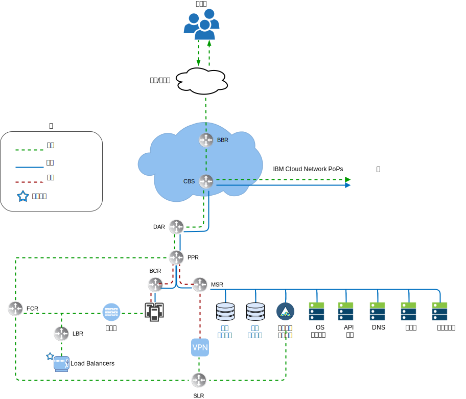
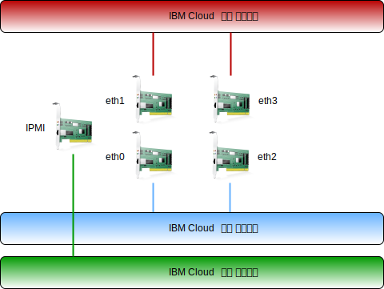

---

copyright:

  years:  2016, 2019

lastupdated: "2019-02-15"

---

# IBM Cloud 네트워킹 개요
{: #vcsnsxt-overview-ic4vnetwork}

{{site.data.keyword.cloud}}는 물리적인 네트워킹을 처리합니다. 다음 정보는 {{site.data.keyword.cloud_notm}}에서 제공하는 실제 네트워크 및 이전에 설명된 실제 호스트와 연관된 실제 호스트 연결(VLAN, MTU)에 대해 설명합니다.

{{site.data.keyword.cloud_notm}}의 실제 네트워크는 3개의 개별 네트워크(공용, 사설 및 관리)로 분류됩니다.

그림 1. {{site.data.keyword.cloud_notm}} 상위 레벨 네트워크 보기

## 공용 네트워크
{: #vcsnsxt-overview-ic4vnetwork-public-net}

{{site.data.keyword.CloudDataCents_notm}} 및 네트워크 PoP(Points of Presence)에는 피어링 네트워크 캐리어 및 최상위 티어 전송에 대한 두 개 이상의 1Gbps 또는 10Gbps 연결이 있습니다. 전세계 모든 위치에서의 네트워크 트래픽이 최인접 네트워크 PoP에 연결되고 네트워크를 직접 거쳐서 해당 데이터 센터로 이동하게 되어 제공업체 간의 네트워크 홉과 핸드오프의 수가 최소화됩니다. 데이터 센터 내에서 피어 집계 프론트 엔드 고객 스위치(FCS) 쌍을 통해 1Gbps 또는 10Gbps의 네트워크 대역폭을 개별 서버에 제공합니다. 이 집계된 스위치는 L3 네트워킹을 위해 개별 라우터(즉, 프론트 엔드 고객 라우터(FCR)) 쌍에 연결됩니다. 이 다중 티어 디자인은 {{site.data.keyword.CloudDataCent_notm}} 내의 랙, 행 및 팟(Pod)에서 네트워크의 스케일링을 허용합니다.

## 사설 네트워크
{: #vcsnsxt-overview-ic4vnetwork-private-net}

모든 {{site.data.keyword.CloudDataCents_notm}} 및 PoP는 사설 네트워크 백본에 의해 연결되어 있습니다. 이 사설 네트워크는 공용 네트워크와는 분리되며, 이는 전세계에서 {{site.data.keyword.CloudDataCents_notm}}의 서비스에 대한 연결을 가능하게 합니다. 데이터 센터 간의 데이터 이동은 사설 네트워크에 대한 다중 10Gbps 또는 40Gbps 연결을 사용하여 이루어집니다. 공용 네트워크와 유사하게 사설 네트워크는 해당 서버에서 다중 티어이며, 기타 인프라는 집계된 백엔드 고객 스위치(BCS)에 연결됩니다. 이 집계된 스위치는 L3 네트워킹을 위해 개별 라우터(즉, 백엔드 고객 라우터(BCR)) 쌍에 연결됩니다. 사설 네트워크는 실제 호스트 연결을 위한 점보 프레임(MTU 9000)을 사용하는 기능도 지원합니다.

## 관리 네트워크
{: #vcsnsxt-overview-ic4vnetwork-mgmt-net}

공용 및 사설 네트워크와 함께 각각의 {{site.data.keyword.cloud_notm}} 서버는 대역외 관리 네트워크에 연결되어 있습니다. VPN을 통해 액세스 가능한 이 관리 네트워크는 유지보수 및 관리 용도로 해당 CPU, 펌웨어 및 운영 체제와 독립적으로 서버에 대한 IPMI(Intelligent Platform Management Interface) 액세스를 허용합니다.

## 기본 및 포터블 IP 블록
{: #vcsnsxt-overview-ic4vnetwork-ip-blocks}

{{site.data.keyword.cloud_notm}}는 {{site.data.keyword.cloud_notm}} 인프라 내에서 사용되는 두 가지 유형의 IP 주소를 할당합니다.
* 기본 IP 주소는 디바이스, 베어메탈 및 {{site.data.keyword.cloud_notm}}에서 프로비저닝하는 가상 서버에 지정됩니다. 사용자는 이러한 블록에 IP 주소를 지정하면 안 됩니다.
* 포터블 IP 주소는 사용자가 필요에 따라 지정 및 관리할 수 있도록 제공됩니다.

기본 또는 포터블 IP 주소는 VLAN Spanning이 계정 내에서 사용되거나 계정이 VRF(virtual routing and forwarding) 계정으로 구성된 경우에 고객 계정 내에서 임의의 VLAN으로 라우팅 가능합니다.

## VLAN Spanning
{: #vcsnsxt-overview-ic4vnetwork-vlan-spanning}

VLAN Spanning은 계정의 모든 VLAN에 있는 각각의 기본 및 포터블 서브넷 IP 블록이 서로 간에 라우팅 가능하도록 허용하는 {{site.data.keyword.cloud_notm}} 글로벌 계정 설정입니다. 이 설정을 사용할 수 없는 경우, IP 블록은 계속해서 {{site.data.keyword.cloud_notm}} 서비스에 라우팅할 수 있지만 서로 간에는 라우팅할 수 없습니다. 이 아키텍처에서는 솔루션 컴포넌트가 있는 다양한 서브넷에서 연결이 투명하게 구성되도록 하기 위해 VMware vCenter Server on {site.data.keyword.cloud_notm}}가 배치된 계정에서 VLAN Spanning을 사용해야 합니다.

## VRF(Virtual Routing and Forwarding)
{: #vcsnsxt-overview-ic4vnetwork-vrf}

{{site.data.keyword.cloud_notm}} 계정을 VRF(Virtual Routing and Forwarding) 계정으로 구성할 수 있습니다. VRF 계정은 VLAN SPanning과 유사한 기능을 제공하여 서브넷 IP 블록 간에 자동 라우팅을 가능하게 합니다. Direct-Link 연결의 모든 계정은 VRF 계정으로 변환되거나 VRF 계정으로 작성되어야 합니다.

## 실제 호스트 연결
{: #vcsnsxt-overview-ic4vnetwork-host-connect}

디자인에서 각각의 실제 호스트에는 각 {{site.data.keyword.cloud_notm}} ToR(Top of Rack) 스위치(공용 및 사설)로 유입되는 10Gbps 이더넷 연결의 2개 중복 쌍이 있습니다. 어댑터는 총 4 × 10Gbps 연결을 위해 개별 연결(비부착)로 설정됩니다. 이렇게 하면 네트워킹 인터페이스 카드(NIC) 연결이 서로 독립적으로 작동할 수 있습니다.

그림 2. 실제 호스트 연결

## VLAN
{: #vcsnsxt-overview-ic4vnetwork-vlans}

VMware on {{site.data.keyword.cloud_notm}} 오퍼링은 배치 시에 지정된 3개의 VLAN(1개의 공용 및 2개의 사설)으로 설계되어 있습니다. 공용 VLAN은 eth1 및 eth3에 지정되어 있으며 사설 연결은 eth0 및 eth2에 지정되어 있습니다. 이 디자인에서 작성되고 지정된 첫 번째 사설 VLAN 및 공용 VLAN에는 기본적으로 태그가 지정되지 않는다는 것은 중요합니다. 이후에 추가적인 사설 VLAN은 실제 스위치 포트에서 선택되며 이러한 서브넷을 사용 중인 VMware 포트 내에서 태그 지정됩니다.

이전에 언급한 대로 사설 네트워크는 이 디자인 내에서 2개의 VLAN으로 구성되어 있습니다. 3개의 서브넷이 이러한 VLAN의 첫 번째에 할당됩니다(여기서는 지정된 사설 VLAN A). 첫 번째는 {{site.data.keyword.cloud_notm}}가 실제 호스트에 지정하는 기본 사설 IP 서브넷 범위입니다. 두 번째 서브넷은 관리 가상 머신(예: vCenter Server Appliance 및 Platform Services Controller)에 사용됩니다. 세 번째는 NSX Manager를 사용하여 각 호스트에 지정된 VTEP(VXLAN Tunnel Endpoint)에 사용됩니다.

사설 VLAN A와 함께 두 번째 사설 VLAN(여기서는 지정된 사설 VLAN B)은 vSAN 및 vMotion 등의 VMware 기능을 지원하고 NAS(Network Attached Storage)에 대한 연결을 위해 존재합니다. 이와 같이, VLAN은 2개 또는 3개의 포터블 서브넷으로 분리됩니다. 첫 번째 서브넷은 vMotion 트래픽을 위해 커널 포트 그룹에 지정됩니다. 나머지 서브넷은 스토리지 트래픽에 사용되고, vSAN을 사용하는 경우 한 서브넷은 vSAN 트래픽에 사용되는 커널 포트 그룹에 지정됩니다. NAS를 사용하는 경우 한 서브넷은 NFS 트래픽 전용인 포트 그룹에 지정됩니다. vCenter Server 자동 배치의 일부로 구성된 모든 서브넷은 {{site.data.keyword.cloud_notm}} 관리 범위를 사용합니다. 이는 현재 또는 향후에 필요한 경우 사용되는 {{site.data.keyword.cloud_notm}} 계정 내의 임의의 데이터 센터로 IP 주소가 라우팅될 수 있도록 보장합니다.

표 1. VLAN 및 서브넷 요약

VLAN 	|서브넷 유형 	|설명
---|---|---
공용 	|기본 	|공용 네트워크 액세스를 위해 실제 호스트에 지정됩니다. 초기 배치 시에는 사용되지 않습니다.
공용	|포터블 	|customer-nsx-esg에서 업링크와 NAT 사용을 위해 지정됩니다.
공용	|포터블 	|mgmt-nsx-esg에서 업링크 NAT 사용을 위해 지정됩니다.
공용	|포터블 	|Hybridity Bundle을 선택한 경우, hcx-mgmt-esg에서 업링크 NAT 사용을 위해 지정됩니다.
사설 A 	|기본 	  |{{site.data.keyword.cloud_notm}}에 의해 지정된 실제 호스트에 지정됩니다. vSphere 관리 트래픽에 대한 관리 인터페이스에 의해 사용됩니다.
사설 A 	|포터블 	|관리 컴포넌트로서 작동하는 가상 머신에 지정됩니다.
사설 A 	|포터블 	|NSX VTEP에 지정됩니다.
사설 A 	|포터블 	|Hybridity Bundle을 선택한 경우, 내부 사용을 위해 HCX에 지정됩니다.
사설 A 	|포터블 	|customer-nsx-esg에서 업링크 사용을 위해 지정됩니다.
사설 A 	|포터블 	|Hybridity Bundle을 선택한 경우, HCX에 지정됩니다.
사설 B	  |기본	  |초기 배치 시에는 사용되지 않습니다.
사설 B 	|포터블 	|사용 중인 경우 vSAN을 위해 지정됩니다.
사설 B 	|포터블 	|사용 중인 경우 NAS를 위해 지정됩니다.
사설 B 	|포터블 	|vMotion을 위해 지정됩니다.

이 디자인은 VLAN에 있는 실제 호스트와 가상 시스템 인스턴스(VSI)로 구현되고 {{site.data.keyword.cloud_notm}}
BCR(백엔드 "사설 네트워크" 고객 라우터)을 기본 라우트로 지정하도록 구성됩니다. 반면 vCenter Server 인스턴스는 소프트웨어 정의 네트워킹을 사용하도록 설정됩니다. VLAN 서브넷에 대한 라우팅을 포함하는 NSX에서 작성한 네트워크 오버레이는 {{site.data.keyword.cloud_notm}} 관리 라우터에서 알 수 없으며, 네트워크 플로우를 적절하게 관리하기 위해서는 정적 라우트, 방화벽 규칙 및 NAT 규칙을 만들어야 할 수 있습니다.

사설 네트워크 연결은 MTU 크기가 9000인 점보 프레임을 사용하도록 구성되어 있어 스토리지 및 vMotion 등의 대형 데이터 전송에 대한 성능이 향상됩니다. 이는 VMware 내에서 그리고 {{site.data.keyword.cloud_notm}}에 의해 허용되는 최대 MTU입니다. 공용 네트워크 연결은 1500의 표준 이더넷 MTU를 사용합니다. 이를 변경하면 인터넷 상에서 패킷 단편화가 발생할 수 있으므로 이를 그대로 유지해야 합니다.

## 관련 링크
{: #vcsnsxt-overview-ic4vnetwork-related}

* [vCenter Server on {{site.data.keyword.cloud_notm}} with Hybridity Bundle 개요](/docs/services/vmwaresolutions/archiref/vcs?topic=vmware-solutions-vcs-hybridity-intro)
