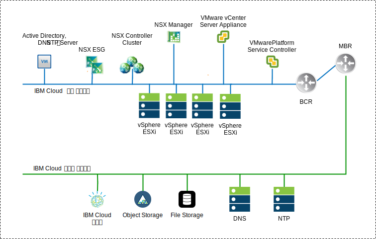

---

copyright:

  years:  2016, 2019

lastupdated: "2019-02-19"

subcollection: vmwaresolutions

---

# NSX-V 개요
{: #vcsnsxt-overview-ic4vnsxv}

네트워크 가상화는 가상 계층 내에 존재하는 네트워크 오버레이를 제공합니다. NSX-V는 On-Demand 가상 네트워크의 빠른 프로비저닝, 배치, 재구성 및 폐기 등의 기능을 아키텍처에 제공합니다. 이 디자인은 vDS(vSphere Distributed Switch) 및 VMware NSX for vSphere를 사용하여 가상 네트워킹을 구현합니다.

이 디자인에서 NSX Manager는 초기 클러스터에 배치됩니다. NSX Manager에는 관리 컴포넌트용으로 지정되며 이전의 논의된 DNS 및 NTP 서버로 구성되어 있는 사설 포터블 주소 블록의 VLAN 지원 IP 주소가 지정됩니다.

표 1. NSX-V Manager 가상 어플라이언스 스펙

 속성 | 스펙
---|---
 NSX Manager | 가상 어플라이언스
 vCPU 수 | 4
 메모리 | 16GB
 디스크 | 관리 NFS 공유의 60GB
 디스크 유형 | 씬 프로비저닝됨
 네트워크 | 관리 컴포넌트용으로 지정된 **사설 A** 포터블

네트워크 다음의 NSX-V Manager 네트워크 개요에서는 이 아키텍처의 기타 컴포넌트와 연관된 NSX Manager의 배치를 보여줍니다.

그림 1. NSX-V Manager 네트워크 개요

초기 배치 이후 {{site.data.keyword.cloud}} 자동화는 초기 클러스터 내에 3개의 NSX Controller를 배치합니다. 제어기에는 관리 컴포넌트용으로 지정된 **사설 A** 포터블 서브넷의 IP 주소가 지정됩니다. VM–VM 반유사성(anti–affinity) 규칙은 제어기가 클러스터의 호스트 간에 분리되는 방식으로 작성됩니다. 초기 클러스터는 제어기에 대한 고가용성을 보장할 수 있도록 최소한 3개의 노드로 배치되어야 합니다.

제어기와 함께 {{site.data.keyword.cloud_notm}} 자동화는 VTEP(VXLAN Tunnel Endpoint)를 통해 가상화된 네트워크를 사용할 수 있는 NSX VIBS의 배치된 vSphere 호스트를 준비합니다. VTEP에는 VTEP에 지정된 **사설 A** 포터블 서브넷의 IP 주소 범위의 IP 주소가 지정됩니다. VXLAN 트래픽은 태그가 지정되지 않은 VLAN에 상주하며 사설 vDS(virtual Distributed Switch)에 지정됩니다. 이후에 세그먼트 ID 풀이 지정되고 클러스터에 있는 호스트가 전송 구역에 추가됩니다. IGMP 스누핑이 {{site.data.keyword.cloud_notm}} 내에서 구성되지 않으므로 전송 구역에서는 유니캐스트만 사용됩니다.

그런 다음 NSX Edge Services Gateway(ESG) 쌍이 배치됩니다. 모든 배치의 경우, 하나의 게이트웨이 쌍은 사설 네트워크에 상주하는 자동화 컴포넌트의 아웃바운드 트래픽에 사용됩니다. VMware vCenter Server on {{site.data.keyword.cloud_notm}} 인스턴스에는 ICP 관리 에지라고 하는 두 번째 게이트웨이가 있으며, 이 관리 에지는 사설 네트워크에 지정된 인터페이스와 공용 네트워크에 대한 업링크로 배치되고 구성됩니다. 관리자는 DLR(Distributed Logical Routers), 논리 스위치 및 방화벽과 같은 필수 컴포넌트를 구성할 수 있습니다.

## 분배 스위치 디자인
{: #vcsnsxt-overview-ic4vnsxv-distributed-switch}

이 디자인에서는 최소한의 vDS(virtual Distributed Switch)를 사용합니다. 클러스터의 호스트는 공용 및 사설 네트워크에 연결됩니다. 호스트는 2개의 vDS로 구성되어 있습니다. 2개 스위치의 사용은 {{site.data.keyword.cloud_notm}} 내에 구현된 공용 및 사설 네트워크의 실제 네트워크 분리를 따릅니다.

총 2개의 분배 스위치가 구성됩니다. 첫 번째 스위치는 공용 네트워크 연결(SDDC-Dswitch-Public)용이고 두 번째 스위치는 사설 네트워크 연결(SDDC-Dswitch-Private)용입니다.
경합과 대기 시간을 줄이기 위해 서로 다른 유형의 트래픽을 분리해야 합니다. 액세스 보안을 위한 별도의 네트워크도 필요합니다. VLAN은 실제 네트워크 기능을 세그먼트화하는 데 사용됩니다. 이 디자인에서는 3개의 VLAN을 사용합니다. 2개는 사설 네트워크 트래픽용이고 1개는 공용 네트워크 트래픽용입니다.

표 2. VLAN 트래픽 맵핑

VLAN | 대상 |트래픽 유형
---|---|---
VLAN1 | 공용 |인터넷 액세스를 위해 사용 가능
VLAN2 | 사설 A | ESXi 관리, 관리, VXLAN(VTEP)
VLAN3 | 사설 B | vSAN, NFS, vMotion

워크로드의 트래픽이 NSX 논리 스위치에서 이동합니다. vSphere 클러스터는 통합 클러스터를 위해 2개의 vDS(vSphere Distributed Switch)를 사용합니다.

표 3. 통합 클러스터 분배 스위치

vSphere 분배 스위치 이름 |기능 |네트워크 I/O 제어 |로드 밸런싱 모드 |실제 NIC 포트 | MTU
---|---|---|---|---|---
 SDDC-Dswitch-Private | ESXi 관리 가상 SAN vSphere vMotion VTEP(VXLAN Tunnel Endpoint) NFS |사용 | 명시적 장애 복구 기반 라우트(vSAN, vMotion). 원래 가상 포트(기타 모두) |2 | 9,000(점보 프레임)
 SDDC-Dswitch-Public | 외부 관리 트래픽(North–South) |사용 |원래 가상 포트 기반 라우트 |2 | 1,500(기본값)

표 4. 분배 스위치 포트 그룹 팀 구성 및 장애 복구 설정

매개변수 |설정
---|---
로드 밸런싱 |원래 가상 포트 기반 라우트 \*
장애 복구 발견 | 링크 상태만
알림 스위치 |사용
 장애 조치 |사용
장애 복구 순서 |활성 업링크: Uplink1, Uplink2 \*

\* vSAN 스토리지 트래픽의 로드 밸런싱을 지원하지 않으므로 vSAN 포트 그룹은 활성/대기의 명시적 장애 복구를 사용합니다.
{:note}

그림 2. 클러스터 VM 커널 인터페이스 포트 그룹 맵핑

표 5. 클러스터 가상 스위치 포트 그룹, VLAN 및 팀 구성 정책

vSphere 분배 스위치	| 포트 그룹 이름	|팀 구성	|업링크	| VLAN ID
---|---|---|---|---
SDDC-Dswitch-Private	|SDDC-DPortGroup-Mgmt	| 원래 가상 포트	| 활성: 0, 1	|VLAN1
SDDC-Dswitch-Private	|SDDC-DPortGroup-vMotion	| 원래 가상 포트	| 활성: 0, 1	|VLAN2
SDDC-Dswitch-Private	|SDDC-DPortGroup-VSAN	| 명시적 장애 복구	| 활성: 0 대기: 1	|VLAN2
SDDC-Dswitch-Private	|SDDC-DPortGroup-NFS	| 원래 가상 포트	| 활성: 0, 1	|VLAN2
SDDC-Dswitch-Private	| NSX에 의해 자동으로 생성됨	| 원래 가상 포트	| 활성: 0, 1	|VLAN1
SDDC-Dswitch-Public	  |SDDC-DPortGroup-External	| 원래 가상 포트	| 활성: 0, 1	|VLAN3

## NSX-V
{: #vcsnsxt-overview-ic4vnsxv-nsx-v}

이 디자인은 NSX 컴포넌트의 구성을 지정하지만 네트워크 오버레이 컴포넌트 구성은 적용하지 않습니다. 고객은 직접 자신의 요구에 맞게 네트워크 오버레이를 설계할 수 있습니다.

다음 컴포넌트가 구성됩니다.
-	관리 서버 및 제어기가 설치되어 vCenter 웹 사용자 인터페이스에 통합됨.
-	ESXi 에이전트가 설치되며 VTEP IP IP 주소가 ESXi 호스트마다 구성됨.
-	VTEP 구성, 제어기 구성, VXLAN 구성(전송 구역).
-	관리 컴포넌트에서 사용할 NSX ESG(Edge Services Gateway) 어플라이언스.
-	(vCenter Server만 해당) 고객 사용을 위한 NSX ESG(Edge Services Gateway) 어플라이언스.

다음은 구성되지 않습니다.
-	가상 분배 라우터.
-	마이크로 세그먼트화.
-	VXLAN.
-	다른 VMware 인스턴스에 링크된 NSX 관리.

### NSX-V 보안
{: #vcsnsxt-overview-ic4vnsxv-nsx-v-security}

NSX for vSphere를 사용하면 조직은 데이터 센터를 별개의 보안 세그먼트로 나눌 수 있습니다. 워크로드 실행 위치와 관계없이 개별 워크로드 레벨로 나눕니다. IT 팀은 애플리케이션과 사용자 컨텍스트를 기반으로 각 워크로드를 위한 정책을 정의할 수 있습니다. 이를 통해 데이터 센터 내부의 위협에 즉각적으로 반응하여 애플리케이션에 적용합니다.

다음은 일부 주요한 NSX 컴포넌트입니다.
-	NSX 분배 상태 저장(stateful) 방화벽은 하이퍼바이저 커널에 임베드되어 하이퍼바이저 호스트당 최대 20Gbps의 방화벽 용량을 제공합니다. NSX Edge를 통해 north-south 방화벽 기능을 제공합니다.
-	NSX를 통해 단지 IP 주소와 MAC이 아닌 동적 보안 그룹 및 연관된 정책을 작성할 수 있습니다. 이러한 정책에는 vCenter 오브젝트와 태그, 운영 체제 유형 및 계층 7 애플리케이션 정보가 포함되어 애플리케이션 컨텍스트를 기반으로 마이크로 세그먼트화할 수 있습니다.
-	VM, Active Directory 및 Mobile Device Management 통합의 로그인 정보를 사용하는 ID 기반 정책은 원격 및 가상 데스크탑 환경의 세션 레벨 보안을 포함하여 사용자 기반 보안에 허용됩니다.
- Application Rule Manager 및 Endpoint Monitoring을 사용하면 최대 계층 7까지 엔드 투 엔드 네트워크 트래픽 플로우 가상화를 수행할 수 있습니다. 이를 통해 애플리케이션 팀은 intra- 및 inter-데이터 센터 엔드포인트를 모두 식별할 수 있으며 적절한 보안 규칙을 작성하여 응답할 수 있습니다.
- 차세대 방화벽, IDS/IPS, 에이전트가 없는 안티바이러스, 전환, 고급 보안 등과 같은 서드파티 공급업체와의 관리, 제어 플레인 및 데이터 플레인 통합을 지원합니다.

다음 다이어그램에서는 보안 그룹을 작성하여 NSX-V의 마이크로 세그먼트화 기능 중 일부를 구현할 수 있는 방법에 대한 상위 레벨 다이어그램을 보여줍니다. 이 예에서, 프로덕션 및 개발은 보안 그룹이며 이 그룹을 기반으로 보안 규칙이 지정됩니다.

그림 3. NSX-V 보안
 

## 관련 링크
{: #vcsnsxt-overview-ic4vnsxv-related}

* [vCenter Server on {{site.data.keyword.cloud_notm}} with Hybridity Bundle 개요](/docs/services/vmwaresolutions/archiref/vcs?topic=vmware-solutions-vcs-hybridity-intro)
