---

copyright:

  years:  2016, 2018

lastupdated: "2018-11-06"

---

# IBM Kubernetes Service

## IKS 개요

IBM Kubernetes Service(IKS)에서는 컨테이너를 관리하기 위해 안전하고 격리된 플랫폼을 제공합니다. 이 플랫폼은 장애 복구 시 휴대 가능하고 확장 가능하며 자체 복구 가능합니다. 

아키텍처는 다음 주요 컴포넌트로 구성됩니다.
-	**{{site.data.keyword.cloud}} 계정** - 작업자 노드는 {{site.data.keyword.cloud_notm}} 계정에 배치됩니다. 마스터 노드는 IBM에서 관리되는 중앙 Cloud Account에 배치됩니다. 
-	**클러스터** - Kubernetes 클러스터는 하나 이상의 작업자 노드로 구성됩니다. 
-	**작업자 노드** - 작업자 노드는 베어메탈이거나 IBM 계정에 호스트되는 가상 서버입니다. 작업자 노드를 프로비저닝할 때 해당 작업자 노드에 호스트되는 컨테이너에 사용 가능한 리소스를 판별합니다. 작업자 노드는 IBM 관리 Docker Engine, 별도의 컴퓨팅 리소스, 네트워킹 및 스토리지 볼륨 서비스를 포함합니다. 
-	**마스터 노드** - 작업자 노드는 클러스터의 모든 Kubernetes 리소스를 중앙에서 제어하고 모니터하는 Kubernetes 마스터 노드에 의해 관리됩니다. 이 마스터 노드는 IBM에서 관리합니다. 

IKS에서는 다음 개념이 사용됩니다.
-	**서비스** - 서비스는 팟(Pod) 세트를 그룹화하고, 각 팟(Pod)의 실제 사설 IP 주소를 노출하지 않고 이러한 팟(Pod)에 네트워크 연결을 제공하는 Kubernetes 리소스입니다. 서비스를 사용하여 클러스터 내에서 또는 공용 인터넷에서 앱을 사용하도록 할 수 있습니다. 
-	**배치** - 배치는 서비스, 지속적 스토리지 또는 어노테이션과 같은 앱을 실행하는 데 필요한 기타 리소스 또는 기능에 대한 정보를 지정할 수 있는 Kubernetes 리소스입니다. 구성 YAML 파일로 배치를 문서화한 후 클러스터에 적용합니다. Kubernetes 마스터는 리소스를 구성하고, 사용 가능한 용량이 있는 작업자 노드의 팟(Pod)에 컨테이너를 배치합니다. 롤링 업데이트 중에 추가할 팟(Pod) 수와 한 번에 사용할 수 없는 팟(Pod) 수를 포함하여 앱에 대한 업데이트 전략을 정의하십시오. 롤링 업데이트를 수행할 때 배치는 업데이트가 작동 중인지 확인하고 실패가 발견되면 롤아웃을 중지합니다.
-	**팟(Pod)** - 클러스터에 있는 모든 앱은 팟(Pod)이라는 Kubernetes 리소스에 의해 배치되고 실행되고 관리됩니다. 팟(Pod)은 Kubernetes 클러스터의 작은 배치 가능 단위를 나타내고 단일 단위로 처리되어야 하는 컨테이너를 그룹화하는 데 사용됩니다. 대부분의 경우, 각 컨테이너는 자체 팟(Pod)에 배치됩니다. 동일한 사설 IP 주소를 사용하여 컨테이너 및 다른 헬퍼 컨테이너의 주소를 지정할 수 있도록 애플리케이션에서는 해당 컨테이너를 한 팟(Pod)에 배치해야 할 수 있습니다. 
-	**애플리케이션** - 앱은 완전한 앱이거나 앱의 컴포넌트일 수도 있습니다. 별도의 팟(Pod) 또는 별도의 작업자 노드에 앱의 컴포넌트를 배치할 수 있습니다. 

Kubernetes는 특정한 네트워킹 솔루션을 따르도록 지시하지 않습니다. 

Kubernetes 네트워크 모델에는 간단한 세 가지 기본 요구사항만 있습니다.
* 컨테이너는 NAT 없이 다른 모든 컨테이너와 통신할 수 있음
* 노드는 NAT 없이 다른 모든 컨테이너와 통신할 수 있음(역으로도 가능)
* 컨테이너가 자체 컨테이너를 보는 IP는 다른 컨테이너가 보는 것과 동일한 IP입니다.

### 네임스페이스

네임스페이스는 컨테이너 네트워킹의 기본 요소입니다. 네임스페이스는 커널 리소스를 파티션하는 Linux 커널의 기능이며, 한 프로세스 세트는 한 리소스 세트를 보고 다른 프로세스 세트는 다른 리소스 세트를 봅니다. 리소스에는 마운트 지점, 프로세스 ID, 네트워크 스택, IPC 및 사용자 ID가 포함됩니다. 각 네임스페이스에는 IP 주소의 개인 세트, 자체 라우팅 테이블, 소켓 목록, 연결 추적 테이블, 방화벽 및 기타 네트워크 관련 리소스가 있습니다. 

### 컨테이너 네트워크 인터페이스

Kubernetes는 해당 플러그인 지향 네트워킹 솔루션으로 CNI(Container Network Interface)를 사용합니다. CNI는 Linux 컨테이너에서 네트워크 인터페이스를 구성하는 플러그인을 기록하기 위한 스펙과 라이브러리로 구성됩니다. 컨테이너가 삭제되면 리소스의 가비지 콜렉션 뿐 아니라 컨테이너의 네트워크 연결도 처리하기 때문에 CNI 스펙은 경량입니다. 

Kubernetes의 CNI 컨텍스트에는 두 가지 중심 정의가 있습니다.
- **팟(Pod)** - Linux 네트워크 네임스페이스와 동의어입니다. Kubernetes의 스케줄링 단위는 팟(Pod)이며, 이는 기본적으로 항상 같은 위치에 배치되는 하나 이상의 컨테이너가 단단하게 결합된 세트입니다(한 단위로 노드에 스케줄링됨). 팟(Pod)은 다중 작업자 노드에 분산될 수 없습니다. 
- **네트워크** - 서로 통신할 수 있으며 고유하게 주소 지정 가능한 엔티티 그룹입니다. 이러한 엔티티는 개별 컨테이너, 머신, 또는 라우터와 같은 기타 네트워크 장치일 수 있습니다. 

CNI에서 컨테이너를 네트워크에 추가하는 경우, 컨테이너 런타임 시 먼저 컨테이너의 새 네트워크 네임스페이스를 작성하고 하나 이상의 정의된 플러그인을 시작해야 합니다. 네트워크 구성은 JSON 형식이며, 플러그인 유형에 특정한 필드 뿐 아니라 이름과 유형 같은 필수 필드도 포함합니다. CNI 플러그인에서는 IP 주소를 인터페이스에 지정하고 이와 관련한 네트워크 경로를 설정할 것으로 예상됩니다. IKS는 CNI의 네트워크 플러그인으로 Calico를 사용합니다. Calico는 각 워크로드에 IP 주소를 지정합니다. IKS에서 Calico는 컨테이너 네트워크 IP 주소를 {{site.data.keyword.cloud_notm}} 네트워크에서 숨길 수 있도록 IP-in-IP 터널링을 사용합니다. 

다음 다이어그램에 표시된 대로 네트워크 트래픽 퍼스펙티브에서는 IKS의 4가지 유형을 구별합니다. 

그림 1. 컨테이너 네트워크 트래픽 유형

- **Intra-pod 네트워킹** – 컨테이너 대 컨테이너 통신이라고도 합니다. 팟(Pod) 내의 모든 컨테이너는 네트워크 네임스페이스를 공유하고 IP 주소가 동일하며 localhost에서 서로 볼 수 있습니다. 각 앱의 트래픽은 다른 포트 번호로 구분됩니다. 개발자는 사용된 포트와 관련하여 팟(Pod) 내의 컨테이너가 다른 포트와 충돌하는지 확인해야 합니다. 팟(Pod)에는 인프라 컨테이너가 있습니다. 이는 kubelet이 실행하는 첫 번째 컨테이너이며, 팟(Pod)의 IP를 획득하고 네트워크 네임스페이스를 설정합니다. 그런 다음 팟(Pod)의 다른 모든 컨테이너가 인프라 컨테이너의 네트워크와 IPC 네임스페이스에 결합됩니다. 컨테이너의 네트워크 브릿지 모드가 사용으로 설정되고 팟(Pod)의 다른 모든 컨테이너는 컨테이너 모드를 통해 이 네임스페이스에 결합됩니다. 인프라 컨테이너가 없어지면, kubelet은 팟(Pod)의 모든 컨테이너를 강제 종료(kill)한 다음 일반적으로 새 IP 주소로 다시 프로비저닝합니다. 이 문서에서는 이 트래픽 플로우에 대한 추가 세부사항을 제공하지 않습니다. 

- **Inter-pod 네트워킹** – "팟(Pod) 대 팟(Pod)" 통신이라고도 합니다. 세 가지 유형의 east–west 트래픽이 있습니다.
  - 팟(Pod)이 동일한 서브넷에 있는 다른 팟(Pod)과 직접 통신할 수 있습니다. IKS에서, 각 팟(Pod)에는 IKS 제공 범위에서 지정되는 IP 주소가 있습니다. 각 작업자 노드에는 프로비저닝 시 서브넷이 지정됩니다. 프록시, 터널링 또는 NAT가 없는 팟(Pod) 대 팟(Pod) 통신은 동일한 서브넷과 호스트에 있는 팟(Pod)에서 발생합니다.
  - 팟(Pod)이 다른 서브넷에 있는 다른 팟(Pod)과 직접 통신할 수 있습니다. IP-in-IP 캡슐화는 서브넷을 이동하고 있는 패킷만 캡슐화하기 위해 자동으로 IKS에서 구성됩니다. 이 캡슐화는 {{site.data.keyword.cloud_notm}} 네트워크에서 팟(Pod) 네트워크 주소 공간을 숨깁니다. 캡슐화는 {{site.data.keyword.cloud_notm}} 기본 사설 서브넷의 IP 주소를 사용합니다. 
  - 팟(Pod)이 서비스를 사용하여 다른 팟(Pod)과 통신하며, 이를 팟(Pod) 대 서비스 통신이라고 합니다. 그러나 팟(Pod)은 팟(Pod) 위의 두 지점이 치명적인 상태인 경우 다른 팟(Pod)과 직접 통신할 수 있습니다. 팟(Pod)은 생성되며, 소멸될 때 새로 생성되지는 않습니다. 복제본 세트는 확대하거나 축소할 때와 같이 팟(Pod)을 동적으로 작성하고 영구 삭제합니다. 각 팟(Pod)은 자체 IP 주소를 얻지만, 해당 IP 주소는 시간이 지나도 계속 안정적이지는 않습니다. 개발자는 통신에 서비스 구성을 사용하는 것이 좋습니다. 이 서비스 구성에서는 DNS를 통해 검색될 수 있는 안정적인 가상 IP 주소가 사용됩니다. 

- **Ingress** - 외부 사용자 또는 앱에서 팟(Pod)으로의 트래픽 라우팅입니다. 서비스는 팟(Pod) 세트에 대한 안정적인 가상 IP(vIP) 주소를 제공합니다. 팟(Pod)은 일시적으로 존재하지만 서비스를 사용하면 클라이언트가 vIP를 사용하여 팟(Pod)에서 실행 중인 컨테이너를 안전하게 검색하고 컨테이너에 연결할 수 있습니다. 이 vIP는 네트워크 인터페이스에 연결된 실제 IP 주소가 아닙니다. 해당 용도는 트래픽을 하나 이상의 팟(Pod)으로 전달하기 위해 안정적인 엔드포인트의 역할을 하는 것입니다. 클러스터 외부에서 팟(Pod)에 액세스하는 것은 다소 어렵습니다. Kubernetes는 서비스에 가용성이 높은 고성능 로드 밸런싱을 제공하는 것을 목표합니다. IKS의 North-South 트래픽에 대한 세 가지 옵션이 있습니다.

  - **NodePort** - NodePort 서비스는 테스트를 위해 또는 공용 또는 사설 액세스가 잠시 동안만 필요한 경우에 적절합니다. NodePort 서비스는 작업자 노드의 사설 및 공용 IP 주소를 통해 작업자 노드에서 포트를 엽니다. 공용 또는 사설 액세스를 차단하려면 Calico preDNAT 네트워크 정책을 사용해야 합니다. 작업자 노드의 공용 및 사설 IP 주소는 영구적이지 않습니다. 
  - **LoadBalancer** - 로드 밸런서에 지정된 포터블 공용 및 사설 IP 주소는 영구적이며 클러스터에서 작업 노드를 다시 작성하는 경우에도 변경되지 않습니다. 앱에서 필요한 포트를 노출시켜 로드 밸런서를 사용자 정의할 수 있습니다. 포터블 사설 IP 주소를 가진 로드 밸런서 서비스에는 모든 작업자 노드에서 열리는 공용 노드 포트가 여전히 있습니다. 이 공용 노드 포트를 차단하려면 Calico preDNAT 네트워크 정책을 사용해야 합니다. 
  - **Ingress 서비스** - ALB는 안전하고 고유한 공용 또는 개인 시작점을 사용하여 수신 요청을 앱에 라우팅합니다. ALB는 수신 HTTP 또는 HTTPS, TCP 또는 UDP 서비스 요청을 청취합니다. 유입(Ingress) 리소스에서 정의한 규칙을 기반으로 애플리케이션 팟(Pod) 전체에서 요청을 전달합니다. 클러스터를 작성할 때 하나의 공용 및 하나의 개인용 유입(Ingress) 애플리케이션 로드 밸런서(ALB)가 자동으로 작성됩니다. 기본적으로 공용 ALB는 사용으로 설정되고 개인용 ALB는 사용 안함으로 설정되기 때문에 공용 ALB를 사용 안함으로 설정하고 개인용 ALB를 사용으로 설정해야 합니다. 

- **Egress** - VM의 API 또는 VM에서 소비하는 리소스와 같이 팟(Pod) 외부에 있는 외부 리소스입니다. Egress 옵션은 다음과 같습니다.
    - 클러스터 외부에서 실행되는 시스템을 위한 서비스 리소스를 정의합니다. 외부 시스템을 자세히 설명하는 엔드포인트 리소스가 작성됩니다(IP 주소 및 포트 번호). 엔드포인트 리소스에는 여러 개의 주소가 나열될 수 있고, Kubernetes는 클러스터 내부에서 실행되는 팟(Pod) 간에 작동하는 것과 같이 해당 주소 간에 라운드 로빈 방식으로 작동합니다. 그런 다음 서비스 리소스를 사용하여 서비스의 kube-dns에서 클러스터 IP와 DNS 이름을 작성합니다. 
    - strongSwan IPSec VPN을 사용하여 클러스터 외부에 있는 애플리케이션에 연결할 수 있습니다. Helm 차트를 사용하여 Kubernetes 팟(Pod) 내부에 있는 strongSwan IPSec VPN 서비스가 배치되고 구성됩니다. VPN 연결이 설정되면 클러스터의 모든 작업자 노드에서 라우트가 자동으로 구성욉니다. 이러한 라우트는 작업자 노드의 팟(Pod)과 원격 시스템 사이의 VPN 터널을 통해 양방향 연결을 허용합니다. 팟(Pod)이 실패하면 클러스터는 팟(Pod)을 다시 시작합니다. 그러나 새 팟(Pod)이 시작되고 VPN 연결이 재설정되는 동안 아주 잠시 동안 가동 중단이 발생할 수 있습니다. 포터블 공용 또는 사설 IP 주소가 strongSwan VPN 서비스에 사용됩니다. local.subnet 설정에서는 클러스터 팟(Pod) 서브넷, 클러스터 서비스 서브넷, 또는 공용 또는 사설 포터블 서브넷을 사용할 수 있습니다. localSubnetNAT 설정을 사용하여 클러스터 서브넷을 다시 맵핑할 수 있습니다. 또는 enableSingleSourceIP를 true로 설정하여 클러스터 IP 주소를 단일 IP 주소의 뒤에 숨길 수 있습니다. 원격 네트워크 서브넷을 다시 맵핑하려면 remoteSubnetNAT 설정을 사용하십시오. 
    - {{site.data.keyword.cloud_notm}} Virtual Router Appliance를 외부 네트워크에 안전하게 연결하기 위해 VPN 게이트웨이로 배치할 수 있습니다. 공용 또는 사설 네트워크 트래픽은 VRA를 통해 라우팅할 수 있습니다. VRA는 원격 VPN 게이트웨이에 암호화된 IP보호 터널을 작성합니다. 

## IKS 컴포넌트

작업자 노드는 클러스터의 모든 Kubernetes 리소스를 중앙에서 제어하고 모니터하는 Kubernetes 마스터 노드에 의해 관리됩니다. 개발자가 컨테이너를 위한 리소스를 배치할 때, 마스터 노드는 클러스터의 배치 요구사항과 가용 용량을 고려하면서 해당 리소스를 배치할 작업자 노드를 결정합니다. 마스터와 작업자 노드는 보안 TLS 인증서 및 {{site.data.keyword.cloud_notm}} 공용 네트워크를 통한 openVPN 연결을 사용하여 서로 통신합니다. 개발자는 인터넷을 통해 마스터 노드에 호스팅되는 kube-apiserver에 액세스합니다. 

작업자 노드의 kubelet은 업데이트를 위해 마스터 노드의 kube-apiserver를 감시하고 상태를 보고합니다. kubelet은 모든 작업자 노드에서 실행되는 팟(Pod)이며, 작업자 노드에서 실행되는 팟(Pod) 상태를 모니터링하고 Kubernetes API 서버가 보내는 이벤트를 감시합니다. 이벤트를 기반으로 kubelet은 팟(Pod)을 작성하거나 제거하고, 라이브 및 준비 상태의 프로브를 실행하고, Kubernetes API 서버에 팟(Pod) 상태를 보고합니다. 

네트워크 퍼스펙티브에서 다음 컴포넌트가 작업자 노드에 배치됩니다.

-	**openvpn-client** - OpenVPN 클라이언트는 OpenVPN 서버와 함께 작업하여 마스터는 작업자 노드에 안전하게 연결합니다. 이 컴포넌트는 kube 시스템 네임스페이스에서 작동합니다. 
-	**Calico 노드** - Calico 노드는 Calico를 가진 네트워킹 컨테이너에 필요한 다양한 컴포넌트를 함께 번들로 묶는 컨테이너입니다. 이 컴포넌트는 kube 시스템 네임스페이스에서 작동합니다. 
-	**Calico 정책 제어기** - Calico 정책 제어기는 설정된 네트워크 정책을 준수하기 위해 인바운드 및 아웃바운드 네트워크 트래픽을 감시합니다. 트래픽이 클러스터에 허용되지 않은 경우 클러스터에 대한 액세스가 차단됩니다. Calico 정책 제어기는 클러스터에 대한 네트워크 정책을 작성 및 설정하는 데도 사용됩니다. 이 컴포넌트는 kube 시스템 네임스페이스에서 작동합니다. 
-	**Calico CNI** - Calico 컨테이너 네트워크 인터페이스(CNI)는 컨테이너의 네트워크 연결을 관리하고, 컨테이너가 삭제될 때 할당된 리소스를 제거합니다.
-	**Calico IPAM** - Calico IPAM은 컨테이너에 대한 IP 주소 지정을 관리합니다. 
-	**kube 프록시** - Kubernetes 네트워크 프록시는 모든 작업자 노드에서 실행되고 클러스터에서 실행되는 서비스의 TCP 및 UDP 네트워크 트래픽을 전달하거나 로드 밸런싱하는 디먼입니다. 이 컴포넌트는 kube 시스템 네임스페이스에서 작동합니다. 
-	**kube DNS** - Kubernetes DNS은 클러스터에서 DNS 팟(Pod) 및 서비스를 스케줄링합니다. 컨테이너는 다른 팟(Pod)과 서비스에 대한 검색에서 DNS 이름을 분석하기 위해 자동으로 DNS 서비스의 IP를 사용합니다. 이 컴포넌트는 kube 시스템 네임스페이스에서 작동합니다. 
-	**Ingress ALB** - Ingress는 공용 또는 개인용 요청을 클러스터에 있는 여러 앱에 전달하여 클러스터에서 네트워크 트래픽 워크로드를 밸런싱하는 데 사용할 수 있는 Kubernetes 서비스입니다. 공용 또는 사설 네트워크를 통해 앱을 노출하려면 Ingress 앱 로드 밸런서(ALB)에 앱을 등록하는 Ingress 리소스를 작성해야 합니다. 그러면 단일 URL 또는 IP 주소를 사용하여 여러 앱에 액세스할 수 있게 됩니다. 이 컴포넌트는 ibm 시스템 네임스페이스에서 작동합니다. 
-	**로드 밸런서** - 로드 밸런서는 공용 또는 개인용 요청을 한 앱에 전달하여 클러스터에서 네트워크 트래픽 워크로드를 밸런싱하는 데 사용할 수 있는 Kubernetes 서비스입니다. 이 컴포넌트는 ibm 시스템 네임스페이스에서 작동합니다. 

### Calico

IKS는 네트워크 제공자로 Calico를 사용합니다. Calico는 오버레이 네트워크 대신에 계층 3 접근법을 사용합니다. CNI 플러그인을 통해 Calico는 Kubernetes와 통합되어, 라우트 분배를 위해 BGP(Border Gateway Protocol)와 결합된 순수한 IP 네트워크를 사용하는 접근법을 이용하는 네트워킹을 제공합니다. 

Calico는 L3 패브릭 솔루션을 제공하고 vSwitch 대신에 각 컴퓨팅 노드에서 vRouter 기능을 사용합니다. vusesverages는 Linux 커널의 기존 L3 전달 기능입니다. Calico는 vRouter를 통해 직접 인프라 네트워크에 각 워크로드를 연결합니다. vRouter 기능은 각 작업자 노드에 호스팅되는 팟(Pod)에 라우트를 광고하기 위해 BGP를 사용합니다. 각 vRouter는 연결되는 모든 엔드포인트를 BGP를 사용하는 다른 모든 vRouters에 알립니다. 

Calico에서는 팟에서 보내고 받는 IP 패킷이 Linux 라우팅 테이블과 작업자 노드의 iptables 인프라에 의해 라우팅되고 방화벽 처리됩니다. 

-	패킷을 보내는 워크로드의 경우 Calico에서는 워크로드 자체에 대한 라우팅을 구성할 수 있는지 여부에 상관 없이 작업자 노드가 항상 다음 홉 MAC 주소로 리턴되어야 합니다. 
-	워크로드로 보내진 패킷의 경우 마지막 IP 홉은 대상 워크로드의 작업자 노드에서 워크로드 자체로의 홉입니다.

그림 2. Calico CNI

위의 다이어그램은 다음 Calico 컴포넌트를 표시합니다.
-	**calicoctl** - 명령행 인터페이스입니다. 
-	**CNI 플러그인**
-	**키/값 저장소** - Calico의 정책과 네트워크 구성 상태를 보유합니다. Calico는 컴포넌트 간의 통신을 제공하기 위해, 그리고 Calico에서 항상 정확한 네트워크를 빌드할 수 있도록 하는 일관된 데이터 저장소로 etcd를 사용합니다. etcd 컴포넌트는 전체 배치를 통해 분배됩니다. 이 컴포넌트는 두 개의 머신 그룹으로 나뉩니다(코어 클러스터 및 프록시).
-	**calico/노드** - 네트워킹에 필요한 여러 컴포넌트를 함께 번들로 묶는 "헬퍼" 컨테이너입니다.
 -	**Felix** - 엔드포인트를 호스트하는 각 시스템에서 실행되는 기본 Calico 에이전트입니다. 이는 해당 호스트의 엔드포인트에 원하는 연결을 제공하기 위해 라우트 및 ACL과 호스트에 필요한 기타 사항을 프로그래밍합니다. 
 - **BIRD** - BIRD는 호스트 간에 라우팅 정보를 교환하는 데 사용되는 오픈 소스 BGP 클라이언트입니다. Felix가 Linux 커널 FIB에 라우트를 삽입할 때 BGP 클라이언트는 라우트를 선택하여 배치의 다른 노드에 분배합니다. 이를 통해 트래픽이 효율적으로 배치에서 라우팅됩니다. 
 - **Confd** - confd 템플레이팅 엔진은 AS Number, 로깅 레벨 및 IPAM 정보와 같은 일부 최상위 레벨 글로벌 기본 구성 및 BGP 구성에 대한 변경을 감시하기 위해 etcd 데이터 저장소를 모니터합니다. 그런 다음 etcd의 데이터를 기반으로 하여 업데이트에서 데이터로 자동으로 트리거되는 BIRD 구성 파일을 동적으로 생성합니다. 구성 파일이 변경되면 confd가 새 파일을 로드하기 위해 BIRD를 트리거합니다. 

{{site.data.keyword.cloud_notm}} Private 네트워크는 {{site.data.keyword.cloud_notm}} IP 주소 지정 스키마만 전달하므로 Calico는 IKS의 워크로드 간 트래픽에 대한 IP-in-IP 캡슐화를 사용하여 팟(Pod) 네트워크 IP 주소를 숨겨야 합니다. IKS는 IP-in-IP 교차 서브넷 모드를 사용합니다. 

### IKS의 Calico

Calico는 IKS에 자동으로 설치되고 구성됩니다. Kubernetes 클러스터를 보호하기 위한 기본 정책이 작성되고, 특정 서비스를 보호하기 위한 자체 정책을 작성하는 옵션도 제공됩니다. IP-in-IP 캡슐화는 서브넷을 이동하고 있는 패킷만 캡슐화하기 위해 자동으로 구성되고 컨테이너에서 나가는 연결을 위해 NAT를 사용합니다. 워크로드 대 WAN 트래픽도 {{site.data.keyword.cloud_notm}} Kubernetes Service에서 자동으로 사용으로 설정되므로 Calico에 대한 추가 구성이 필요하지 않습니다.

#### Calico를 사용한 네트워크 확장성

Calico는 분산 스케일 확장 아키텍처를 기반으로 빌드되어 이를 통해 단일 개발자 노트북에서 대형 엔터프라이즈 배치로 원활하게 확장할 수 있으며 표준 Linux 데이터 플레인을 사용하여 가상 워크로드에 대한 베어메탈 성능을 제공합니다.

#### Calico를 사용한 보안

Calico는 시스템의 모든 컴포넌트를 제어하는 정책 세트를 사용하며, 이러한 정책은 서비스와 컨테이너 인스턴스가 필요할 경우에만 서로 통신하도록 구성할 수 있습니다. 컨테이너 인스턴스를 식별하기 위해 IP 주소를 사용하고, 이러한 주소를 기반으로 정책을 작성합니다. Calico와 Kubernetes의 통합으로 인프라를 인식할 수 있으며 인프라의 변경사항을 기반으로 보안 정책을 확장할 수 있습니다. 

#### Calico와의 통합

Calico는 인터넷과 동일한 IP 네트워킹 프린시펄을 기반으로 Kubernetes 팟(Pod)을 연결하기 위해 확장성이 뛰어난 네트워킹과 네트워크 정책 솔루션을 제공합니다. 이는 캡슐화 없이 배치될 수 있거나 확장성이 뛰어난 고성능의 데이터 센터 네트워킹을 제공하기 위해 오버레이됩니다. Calico는 분산 방화벽을 통해 Kubernetes 팟(Pod)에 대한 세분화된 의도 기반 네트워크 보안 정책을 제공합니다. Calico는 canal 또는 기본 GCE 네트워킹이라고 하는 Flannel과 같은 다른 네트워킹 솔루션과 함께 정책 강제 실행 모드로 실행할 수도 있습니다. 

## IKS 네트워킹

기본적으로 IKS는 다음을 사용하여 공용 VLAN 및 사설 VLAN에 대한 액세스 권한으로 클러스터를 설정합니다. 
- 각 작업자 노드의 공용 IP 주소. 이를 통해 작업자 노드에 공용 네트워크 인터페이스를 제공합니다. 기본적으로 다음과 같습니다. 
  -	모든 아웃바운드 네트워크 트래픽이 모든 작업자 노드에 허용됩니다. 
  -	인바운드 네트워크 트래픽은 몇 개의 포트를 제외하고 차단됩니다. IBM이 네트워크 트래픽을 모니터하고 Kubernetes 마스터에 대한 보안 업데이트를 설치할 수 있도록 이러한 포트는 열려 있습니다. 
-	각 작업자 노드의 사설 IP 주소. 이를 통해 작업자 노드에 사설 네트워크 인터페이스를 제공합니다. 
-	모든 작업자 노드와 마스터 노드 사이의 자동 보안 OpenVPN 연결. 

먼저 클러스터가 구역에 작성되면, 해당 구역의 공용 VLAN 및 사설 VLAN이 {{site.data.keyword.cloud_notm}} 인프라 계정에서 자동으로 프로비저닝됩니다. 해당 구역에서 이후에 작성되는 모든 클러스터의 경우 클러스터가 VLAN을 공유할 수 있으므로 동일한 공용 및 사설 VLAN을 재사용할 수 있습니다. 

작업자 노드를 공용 VLAN 및 사설 VLAN 모두에 연결하거나 사설 VLAN에만 연결할 수 있습니다. 작업자 노드를 사설 VLAN에만 연결하려면 기존 사설 VLAN의 ID를 사용하거나 사설 VLAN을 작성하고 클러스터 작성 중에 해당 ID를 사용할 수 있습니다. 

작업자 노드와 팟(Pod)의 IP 서브넷도 VLAN에 자동으로 프로비저닝됩니다. 서브넷은 IP 주소를 클러스터 컴포넌트에 지정하여 클러스터 컴포넌트에 대한 네트워크 연결성을 제공합니다. 다음 서브넷은 자동으로 기본 공용 및 사설 VLAN에 프로비저닝됩니다.
-	**공용 VLAN 서브넷:**
    - 기본 공용 서브넷은 클러스터 작성 중에 작업자 노드에 지정되는 공용 IP 주소를 판별합니다. 동일한 VLAN에 있는 여러 클러스터는 하나의 기본 공용 서브넷을 공유할 수 있습니다. 
    - 포터블 공용 서브넷은 한 클러스터에만 바인드되고 클러스터에 8개의 공용 IP 주소를 제공합니다. 3개의 IP는 네트워크 기능에 예약됩니다. 1개의 IP는 기본 공용 Ingress ALB에서 사용되고 4개의 IP는 공용 로드 밸런서 네트워킹 서비스를 작성하는 데 사용할 수 있습니다. 포터블 공용 IP는 인터넷을 통해 로드 밸런서 서비스에 액세스할 때 사용할 수 있는 영구적인 고정 IP 주소입니다. 
-	**사설 VLAN 서브넷:**
    - 기본 사설 서브넷은 클러스터 작성 중에 작업자 노드에 지정되는 사설 IP 주소를 판별합니다. 동일한 VLAN에 있는 여러 클러스터는 하나의 기본 사설 서브넷을 공유할 수 있습니다. 
    - 포터블 사설 서브넷은 한 클러스터에만 바인드되고 클러스터에 8개의 사설 IP 주소를 제공합니다. 3개의 IP는 네트워크 기능에 예약됩니다. 1개의 IP는 기본 사설 Ingress ALB에서 사용되고 4개의 IP는 사설 로드 밸런서 네트워킹 서비스를 작성하는 데 사용할 수 있습니다. 포터블 사설 IP는 인터넷을 통해 로드 밸런서 서비스에 액세스할 때 사용할 수 있는 영구적인 고정 IP 주소입니다. 

### 관련 링크

* [VCS Hybridity Bundle 개요](../vcs/vcs-hybridity-intro.html)
