---

copyright:

  years:  2016, 2019

lastupdated: "2019-03-13"

subcollection: vmware-solutions

---

# 시스템 컨텍스트
{: #vcsnsxt-systemcontext}

시스템 컨텍스트 다이어그램은 시스템의 핵심 요소, 시스템의 경계, 상호작용과 함께 상호작용하는 엔티티를 정의합니다. 독자에게 시스템에 대한 초기 보기를 제공하는 상위 레벨 다이어그램입니다.

그림 1. 시스템 컨텍스트

네트워크 관점에서 다음과 같은 네 가지 핵심 컴포넌트가 있습니다.
- **온프레미스 가상화** - 클라이언트의 프레미스 또는 서드파티에서 호스팅되고, 현대화시킬 애플리케이션을 실행 중인 VM을 현재 호스팅하고 있는 VMware 환경입니다. 이는 VM 마이그레이션을 위한 소스 환경이며 VMware HCX를 통해 {{site.data.keyword.cloud}}에 느슨하게 결합되어 있습니다.
- **vCenter Server** - 온프레미스 환경에서 마이그레이션된 VM의 대상이 되는 {{site.data.keyword.vmwaresolutions_short}} 인스턴스입니다. 이는 온프레미스 가상화와 함께 하이브리드 환경을 구성합니다. 이 환경에서는 VM이 한 환경에서 다른 환경으로 원할하게 이동할 수 있습니다.
- **{{site.data.keyword.containerlong_notm}}** - Kubernetes를 컨테이너 오케스트레이션 솔루션으로 사용합니다. IBM은 작업자 노드가 고객 관리 인프라로 배치되는 동안 Kubernetes 마스터 노드를 운영 및 관리합니다. IBM은 운영 체제 패치 배치, Docker 엔진 업그레이드 및 새로운 Kubernetes 버전에 대한 관리 도구를 제공합니다. {{site.data.keyword.containerlong_notm}}에서는 장애 복구 발생 시 자가 치료가 가능하며 확장 가능한 포터블 컨테이너를 관리하기 위해 안전하고 격리된 플랫폼을 제공합니다.
- **IBM Cloud Private** - 컨테이너화된 애플리케이션의 개발 및 관리를 위한 애플리케이션 플랫폼입니다. 컨테이너 오케스트레이터 Kubernetes, 개인용 이미지 저장소, 관리 콘솔, 모니터링 프레임워크 및 애플리케이션을 배치, 관리, 모니터 및 확장할 수 있는 중앙 위치를 제공하는 그래픽 사용자 인터페이스가 포함된 통합 환경입니다.
- **IBM Cloud Services** - {{site.data.keyword.cloud_notm}}에서 이용할 수 있는 넓은 범위의 서비스입니다. 서비스 옵션의 예로 분석, AI 및 IoT가 있습니다.

## 액터
{: #vcsnsxt-systemcontext-actors}

시스템 컨텍스트 다이어그램은 다음 액터를 식별합니다.

표 1. 액터

액터  |설명
---|---
시스템 관리자 |시스템 관리자는 vCenter와 HCX 플러그인을 사용하는 엔터프라이즈 VMware 리소스입니다. 마이그레이션, 스트레치 네트워크의 후보를 식별하고 VM을 마이그레이션하고 NSX-V를 관리합니다. {{site.data.keyword.cloud_notm}} 콘솔을 사용하여 VMware vCenter Server on {{site.data.keyword.cloud_notm}} 인스턴스를 프로비저닝하고 용량을 확장합니다.
개발자	| 개발자는 {{site.data.keyword.containerlong_notm}}, {{site.data.keyword.icpfull_notm}} 및 CAM 콘솔과 API를 사용하여 컨테이너를 작성하고 관리하는 엔터프라이즈의 숙련된 컨테이너 리소스입니다. 개발자는 애플리케이션 현대화의 일환으로 새 서비스를 작성합니다.
엔터프라이즈 사용자 | 이 엔터프라이즈 리소스는 컨텐츠 업데이트와 같은 비즈니스 프로세스를 완료하기 위해 애플리케이션에 대한 네트워크 액세스가 필요합니다.
고객 | 고객은 엔터프라이즈의 서비스를 소비하려는 외부 액터입니다. Acme Skateboards의 경우, 스케이트 제품을 구매하려는 스케이트를 타는 사람입니다. 고객은 카탈로그에 대한 보안 인터넷 액세스가 필요합니다.
{{site.data.keyword.containerlong_notm}} | 이는 서비스의 {{site.data.keyword.containerlong_notm}} 마스터 노드를 관리하는 IBM 리소스입니다.

## 시스템
{: #vcsnsxt-systemcontext-systems}

시스템 컨텍스트 다이어그램은 다음 시스템을 식별합니다.

표 2. 시스템

액터 |설명
---|---
vCenter | vCenter는 시스템 관리자가 온프레미스 VM을 관리하고 HCX 플러그인에 액세스하여 네트워크를 확장하고 VM을 마이그레이션하는 기본 인터페이스입니다. 시스템 관리자는 vCenter Server with Hybridity Bundle을 사용하여 온프레미스 vSphere 네트워크를 {{site.data.keyword.cloud_notm}}에서 실행되는 vCenter Server 인스턴스에 원활하게 통합할 수 있습니다. 하이브리드 네트워킹은 온프레미스 네트워크를 {{site.data.keyword.cloud_notm}}로 확장하여 고객이 애플리케이션을 {{site.data.keyword.cloud_notm}}에서 실행되는 vCenter Server 인스턴스로 마이그레이션하고 필요한 경우 다시 온프레미스로 되돌릴 수 있도록 합니다. vCenter Server with Hybridity Bundle에 대한 자세한 정보는 [VMware HCX on {{site.data.keyword.cloud_notm}} 솔루션 아키텍처](/docs/services/vmwaresolutions/services?topic=vmware-solutions-hcx-archi-intro#hcx-archi-intro)를 참조하십시오.
온프레미스 VM | 온프레미스 VM은 클라우드로 마이그레이션하는 애플리케이션을 호스트합니다. 처음에는 VM으로서 마이그레이션되고, 그런 다음 애플리케이션 현대화 과정을 통해 VM에서 컨테이너로 마이그레이션됩니다.
On cloud VM | On cloud VM은 온프레미스에서 마이그레이션된 애플리케이션을 호스트합니다. 이는 스트레칭된 L2 네트워크를 통해 온프레미스 애플리케이션과 통신합니다. 이 참조 아키텍처 및 Acme Skateboards 예의 경우, 클라우드 VM 중 하나는 온라인 상태 워크로드의 일부인 데이터베이스 서버입니다.
NSX-V | NSX-V on vCenter Server는 시스템 관리자가 관리하는 소프트웨어 정의 오버레이 네트워크를 제공합니다. 오버레이 네트워크는 {{site.data.keyword.icpfull_notm}}를 위한 VM에서 트래픽을 처리하는 HCX 스트레치 네트워크의 대상이 됩니다. NSX-V는 vDS(vSphere distributed switch)를 사용하여 VMware 내에 마이크로 세그먼트화 서비스 및 On-Demand 가상 네트워크의 배치, 재구성 및 폐기 등의 기능을 갖춘 참조 아키텍처를 제공합니다. 자세한 정보는 [NSX–V 개요](/docs/services/vmwaresolutions/archiref/vcsnsxt?topic=vmware-solutions-vcsnsxt-overview-ic4vnsxv)를 참조하십시오.
CAM | {{site.data.keyword.cloud_notm}} Automation Manager(CAM)는 {{site.data.keyword.icpfull_notm}}에서 실행되고, 템플리트를 사용하여 Kubernetes 기반 워크로드와 함께 VM 기반 워크로드를 프로비저닝하는 단일 분할창을 제공합니다. 개발자는 CAM을 사용하여 다음을 수행할 수 있습니다.   - vCenter Server, {{site.data.keyword.icpfull_notm}} 또는 {{site.data.keyword.containerlong_notm}}에서 워크로드를 프로비저닝합니다.  - VM과 컨테이너로 구성된 서비스를 작성하고 오케스트레이션합니다.   - 해당 DevOps 도구 체인과 2일 ITSM 솔루션을 통합합니다.
컨테이너화된 애플리케이션 |애플리케이션 현대화 과정을 완료하고 이제 컨테이너로 실행 중인 앱입니다. 이 참조 아키텍처와 Acme Skateboards 예의 경우, 컨테이너화된 앱 중 하나가 웹 서버이며 이는 온라인 상태 워크로드의 일부입니다.
Watson | 이 참조 아키텍처 및 Acme Skateboards 예의 경우, Watson은 "컨셉트 카" 아키텍처에 사용되는 AI 서비스를 나타냅니다.

## 관련 링크
{: #vcsnsxt-systemcontext-related}

* [vCenter Server on {{site.data.keyword.cloud_notm}} with Hybridity Bundle 개요](/docs/services/vmwaresolutions/archiref/vcs?topic=vmware-solutions-vcs-hybridity-intro)
