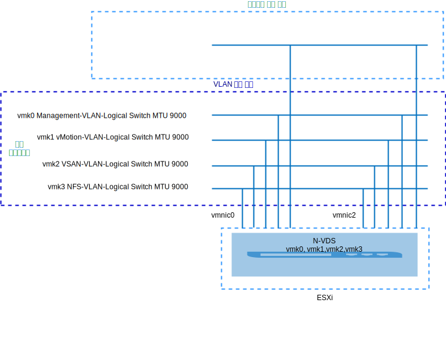
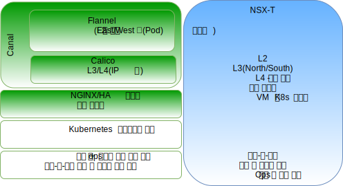
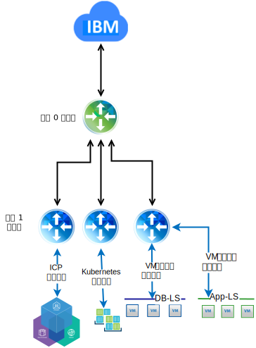

---

copyright:

  years:  2016, 2019

lastupdated: "2019-03-19"

subcollection: vmwaresolutions

---

# VMware vCenter Server on IBM Cloud의 VMware NSX-T에 대한 기술 미리보기
{: #vcsnsxt-techpreview}

## NSX–T의 개요
{: #vcsnsxt-techpreview-nsx-t-ovw}

VMware NSX-T는 이기종 엔드포인트와 기술 스택이 있는 애플리케이션 프레임워크와 아키텍처를 다루도록 설계되었습니다. vSphere 외에도 다른 하이퍼바이저, KVM, 컨테이너 및 베어메탈이 포함될 수 있습니다. IT 및 개발 팀에서는 NSX-T를 사용하여 애플리케이션에 가장 적합한 기술을 선택할 수 있습니다. 또한 NSX-T는 개발 조직 및 IT 조직에서의 관리, 오퍼레이션, 사용을 위해 설계되었습니다.

이 디자인에서 NSX-T 관리 인프라는 초기 vCenter Server 클러스터에 배치되거나 기존 클러스터에 배치됩니다.

NSX-T Manager에는 관리 컴포넌트용으로 지정되고 공통 DNS 및 NTP 서버를 사용하도록 구성된 사설 포터블 주소 블록의 IP 주소가 지정됩니다.

워크로드 데이터 저장소로 사용되는 vSAN 또는 NFS 스토리지와 함께 추가 클러스터가 배치되어 하이퍼바이저 전송 노드로 사용됩니다. 표 1은 중간 크기 환경에 대한 요구사항을 요약합니다.

표 1. NSX-T 컴포넌트 스펙

리소스	|NSX-T Manager	|제어기 x 3	|Edge x 2	|Bare Metal Edge*
---|---|---|---|---
중간 크기	| 가상 어플라이언스	| 가상 어플라이언스	| 가상 어플라이언스	|실제 서버*
 vCPU 수	|4	|4	|4	|8
메모리	| 16GB	| 16GB	|8GB	|32GB
디스크	|140-GB vSAN 또는 관리 NFS 공유.	|120-GB vSAN 또는 관리 NFS 공유.	|120-GB vSAN 또는 관리 NFS 공유.	|200GB
 디스크 유형	| 씬 프로비저닝됨	| 씬 프로비저닝됨	| 씬 프로비저닝됨	|실제
네트워크	|관리 컴포넌트용으로 지정된 사설 A 포터블.	|관리 컴포넌트용으로 지정된 사설 A 포터블.	|관리 컴포넌트용으로 지정된 사설 A 포터블.	|관리 컴포넌트용으로 지정된 사설 A 포터블.

\* **참고**: 특정 요구사항에 대한 하드웨어 호환 목록을 확인하십시오.

그림 1. NSX-V 및 T 관리 컴포넌트 레이아웃

### 초기 구성
{: #vcsnsxt-techpreview-init-config}

초기 vCenter Server 클러스터 내에 세 개의 제어기와 하나의 에지 클러스터로 구성되는 제어기 클러스터인 NSX-T Manager를 배치하십시오. **사설 A** 포터블 서브넷에서 모든 컴포넌트에 IP 주소를 지정하십시오.

제어기가 클러스터의 호스트 간에 분리되는 방식으로 VM–VM 반유사성(anti–affinity) 규칙을 작성하십시오. 초기 클러스터는 제어기에 대한 고가용성을 보장할 수 있도록 최소한 3개의 노드로 배치됩니다.

NSX-T 관리자를 위해 2개의 vSphere 호스트를 추가로 배치하고 호스트에 NSX-T 소프트웨어(VIBs)를 설치하십시오. 호스트 및 에지 업링크 프로파일, NIOC 프로파일을 작성하고 터널 엔드포인트 통신에 대해 사용되는 IP 풀을 정의하십시오. 자세한 정보는 업링크 프로파일 정의 표와 NIOC 프로파일 정의 표를 참조하십시오.

풀에 정의된 IP 주소는 **사설 A** 포터블 IP 주소 범위에 있습니다. VLAN과 오버레이 전송 구역이 작성되고 2개의 추가 ESXi 호스트가 두 구역에 대한 전송 노드로 구성됩니다. 현재, 해당 업링크 프로파일이 지정됩니다. ESXi 호스트에 N-VDS 켜기를 작성하고 uplink1과 uplink2에 지정됩니다.

이 때, 2개의 추가 VLAN은 vDS 포트 그룹에서 NSX-T 논리 VLAN 스위치로의 vmkernel 포트 마이그레이션을 위한 팀 구성, 장애 복구 및 업링크 정책을 수용하는 데 필요합니다. 논리 VLAN 스위치는 적절한 VLAN ID로 작성되고 vmkernel 포트가 마이그레이션됩니다.

NSX-T는 vmk10을 작성합니다. vmk10은 ESXi 호스트의 내부 Tier0 전송 및 내부 Tier0-Tier1 전송 서브넷에 사용되는 vmk50 및 캡슐화 인터페이스에 사용됩니다. 기본적으로 169.254.0.0/28 서브넷은 내부 Tier0 전송에 사용되고 100.64.0.0/16 서브넷은 Tier0-Tier1 전송에 사용됩니다.

표 2. 업링크 프로파일 정의

업링크 프로파일	| 스펙
---|---
LAG	|현재 정의되지 않음.
팀 구성	|장애 복구: 활성 = Uplink1 = vmnic0, 대기 = Uplink2 = vmnic2
전송 VLAN	| 0
MTU	|9000

표 3. NIOC 프로파일 정의

트래픽 유형/트래픽 이름	|한계(%)	|공유	|예약(%)
---|---|---|---
 관리 트래픽	|무제한	|20	| 0
가상 머신 트래픽	|무제한	|30	| 0
결함 허용 트래픽	|무제한	|50	| 0
vSphere 복제 트래픽	|무제한	|50	| 0
iSCSI 트래픽	|무제한	|50	| 0
vSphere Data Protection 백업 트래픽	|무제한	|50	| 0
 vMotion 트래픽	|무제한	|50	| 0
NFS 트래픽	|무제한	|100	| 0
vSAN 트래픽	|무제한	|100	| 0

그림 2. vmkernel 인터페이스에 대한 논리 VLAN 스위치

## NSX-T
{: #vcsnsxt-techpreview-nsx-t}

이 디자인은 NSX-T 컴포넌트, VLAN 및 오버레이 전송 구역의 구성을 지정하지만 오버레이 네트워크 컴포넌트 구성은 적용하지 않습니다. 사용자는 직접 자신의 요구에 맞게 네트워크 오버레이를 설계할 수 있습니다.

다음이 구성됩니다.
-	관리 서버와 제어기가 설치됩니다.
-	ESXi 에이전트가 설치되고 전송 노드에 대한 Tunnel Endpoint IP 주소 풀이 구성됩니다.
-	전송 노드는 VLAN과 오버레이 전송 구역 모두에 대해 구성됩니다.
-	N-VDS가 ESXi 전송 노드에 작성됩니다.
-	VMkernel 포트가 VSS/VDS에서 N-VDS로 마이그레이션됩니다.
-	관리 컴포넌트에서 사용하기 위한 티어 0 라우터가 구성됩니다.

다음은 구성되지 않습니다.
-	오버레이 논리 스위치.
-	마이크로 세그먼트화.
-	다른 VMware 인스턴스에 링크된 NSX 관리.

### NSX-V 및 NSX-T가 있는 vCenter Server
{: #vcsnsxt-techpreview-vcs-nsx-v-nsx-t}

원래 vCenter Server 클러스터에는 vCenter Server 어플라이언스와 함께 NSX-V 및 NSX-T에 대한 모든 관리 컴포넌트가 포함됩니다. 이 클러스터의 호스트는 [NSX-V 개요](/docs/services/vmwaresolutions/archiref/vcsnsxt?topic=vmware-solutions-vcsnsxt-overview-ic4vnsxv)에 설명된 대로 NSX-V을 위해 준비됩니다. 두 번째 클러스터의 호스트는 NSX-T를 위해 준비되고 전송 노드로 구성됩니다. 이 구성을 통해 고객은 NSX-V에서 NSX-T로 마이그레이션할 수 있습니다(원하는 경우).

### NSX-T 대 NSX-V
{: #vcsnsxt-techpreview-nsx-t-vs-nsx-v}

다음 정보에서는 VMware SDN 제품, NSX-V와 NSX-T 사이의 중요한 차이점를 강조표시합니다. 두 솔루션 모두 VMware 환경에서 마이크로 세그먼트화를 제공하지만 NSX-T는 다음 절에 설명된 대로 이를 좀 더 정밀하게 사용합니다.

자세한 아키텍처 차이점에 대해서는 [VMware NSX-T 참조 디자인 안내서](https://communities.vmware.com/servlet/JiveServlet/download/37591-3-195840/VMware%20NSX-T%20Reference%20Design%20Guide.pdf)(PDF 다운로드)를 참조하십시오.

#### NSX for vSphere
{: #vcsnsxt-techpreview-nsx-vsphere}

NSX-V는 vSphere 배치용으로만 설계되었으며 단일 NSX-V Manager가 단일 vCenter Server 인스턴스에 연결되도록 설계되었습니다. 기본적으로 VMware 환경 내에 네트워크 가상화가 필요한 경우에는 NSX-V가 적절한 솔루션입니다.

NSX-V는 다음을 강조합니다.
-	VMware 중심.
-	vSphere 내의 SDN을 위해 설계되었습니다(vSphere 사용자 인터페이스의 네트워크 가상화를 위한 단일 창).
-	VXLAN 캡슐화 프로토콜을 사용합니다(대부분의 서드파티 공급업체에서 지원됨).
-	실제 NIC는 NSX-V에서 소유하지 않으며 가상 분배 스위치(vDS) SDDC-Dswitch-Private 및 SDDC-Dswitch-Public에 지정됩니다.
-	east-west 트래픽에 대한 DLR(Distributed Logical Router)과 north-south 트래픽에 대한 ESG(Edge Service Gateway)에는 용어의 차이점이 있습니다.

#### NSX T(NSX Transformers)
{: #vcsnsxt-techpreview-nsx-transformers}

NSX-T는 vCenter와 vSphere 환경을 위한 독립형 솔루션이지만 KVM, 퍼블릭 클라우드, 컨테이너를 지원하고 {{site.data.keyword.containerlong_notm}} 및 {{site.data.keyword.icpfull_notm}}, Redhat OpenShift, Pivotal 등의 프레임워크에 통합될 수 있습니다. NSX-T를 사용하면 여러 하이퍼바이저, 컨테이너 및 클라우드에서 SDN을 관리할 수 있습니다.

NSX-T는 다음을 강조합니다.
-	독립형 제품. vCenter가 필요하지 않습니다.
-	다중 하이퍼바이저 지원
    - 제어기를 KVM 또는 ESXi에 배치할 수 있습니다.
    - 에지를 가상 또는 베어메탈로 배치할 수 있습니다.
-	컨테이너 통합(NSX-T CNI 플러그인).
-	OpenSwitch(OvS) 지원.
- 다중티어 최적화된 라우팅:
    - 티어 1 라우터에 라우팅 알림.
    - 티어 0 라우터에 라우팅 재분배.
-	Geneve 캡슐화 프로토콜을 사용합니다.
-	실제 NIC는 NSX-T 전송 노드에서 소유하고 N-VDS에 지정됩니다.
-	east-west 트래픽에 대한 티어-1 논리 라우터와 north-south 트래픽에 대한 티어 0 논리 라우터에는 용어의 차이점이 있습니다.

## Calico
{: #vcsnsxt-techpreview-calico}

Calico는 분산 스케일 확장 아키텍처를 기반으로 빌드되며, 단일 개발자 노트북에서 대형 엔터프라이즈 배치로 원활하게 확장할 수 있는 기능을 제공하고 표준 Linux 데이터 플레인을 사용하여 가상 워크로드에 대한 베어메탈 성능을 제공합니다. Calico는 여러 개의 상호 의존 컴포넌트로 구성됩니다.
-	Felix는 엔드포인트, 컨테이너 또는 VM을 호스트하는 모든 노드에서 실행하는 디먼입니다. Felix는 인터페이스 관리, 라우트 및 acl 프로그래밍, 엔드포인트에 대한 라우팅, 엔드포인트 간 트래픽 유효성 검증 및 상태 보고(기본적으로 Felix에서 관리하는 호스트에 대한 네트워크 상태)에 대한 책임이 있습니다.
- Orchestrator 플러그인은 오케스트레이터 플러그인을 Calico에 바인드합니다. 이 경우, Kubernetes 플러그인은 Kubernetes에서 Calico로 API 변환을 제공하고 엔드포인트의 네트워크 설정 실패로 다시 Calico에서 Kubernetes로 피드백합니다.
-	etcd는 컴포넌트 간의 통신을 제공하고 일관된 데이터 저장소에 저장되므로 Calico에서 항상 정확한 네트워크를 빌드할 수 있습니다.
-	BIRD는 Felix도 호스트하는 모든 노드에 BGP 클라이언트 기능을 제공합니다. Felix가 Linux 커널에 라우트를 삽입할 때 BGP 클라이언트는 라우트를 선택하여 배치의 다른 노드에 분배합니다. 대규모 환경의 경우 연결할 BGP 클라이언트의 중심점 역할을 하는 BGP 라우트 리플렉터도 배치됩니다. 이를 통해 각 클라이언트는 다른 모든 클라이언트 프로그램과 통신하고 라우트를 배치의 다른 노드에 분배할 필요가 없습니다.

그림 3. Calico 개요
 

### NSX-T 및 Calico
{: #vcsnsxt-techpreview-nsx-t-calico}

#### NSX-T 컴포넌트 세부사항
{: #vcsnsxt-techpreview-nsx-t-comp-details}

NSX-T 아키텍처에는 데이터 플레인, 제어 플레인 및 관리 플레인이 분리된 상태로 내장되어 있습니다. 이 분리는 확장, 성능, 탄력성 및 이기종성을 포함하여 두 가지 이상의 혜택을 제공합니다. 주요한 아키텍처 강조사항은 다음과 같습니다.
-	관리 플레인: NSX-T 관리 플레인은 고급 클러스터링 기술을 기반으로 설계되어 있으며, 이 기술을 통해 플랫폼에서 대규모 동시 API 요청을 처리할 수 있습니다.
-	제어 플레인: NSX-T 제어 플레인은 시스템의 실시간 가상 네트워킹과 보안 상태를 추적합니다. NSX-T 제어 플레인은 제어 플레인을 중앙 클러스터 제어 플레인(CCP)과 로컬 컨트롤러 플레인(LCP)로 분리합니다. 이는 CCP의 작업을 크게 단순화하고 이기종 엔드포인트를 위해 플랫폼을 확장할 수 있습니다.
-	데이터 플레인: NSX-T 데이터 플레인은 호스트 스위치를 도입했으며(vSwitch에 의존하는 대신) 호스트 스위치를 컴퓨팅 관리자로부터 분리하고 네트워킹 연결성을 정상화합니다. 모든 작성, 읽기, 업데이트 및 삭제(CRUD) 오퍼레이션은 NSX-T Manager를 통해 수행됩니다.

#### Calico 및 NSX 간의 차이점
{: #vcsnsxt-techpreview-diff-calico-nsx}

Calico는 Tigera 오픈 소스 프로젝트이며, 주로 Tigera 팀에 의해 유지보수됩니다. 이는 {{site.data.keyword.icpfull_notm}} 및 {{site.data.keyword.containerlong_notm}} 모두에서 사용하는 Kubernetes와 같은 오케스트레이션 시스템에 대한 네트워킹 및 보안을 가능하게 하는 CNI로 제공됩니다.

Calico는 각 워크로드에 완전히 라우트 가능한 IP 주소를 지정하여 플랫 계층 3 네트워크를 작성하고 관리합니다. 워크로드는 베어메탈 성능, 보다 쉬운 문제점 해결 및 더 나은 상호 운용성을 위해 IP 캡슐화 또는 네트워크 주소 변환 없이 통신할 수 있습니다. 오버레이가 필요한 환경에서 Calico는 IP-in-IP 터널링을 사용하거나, Flannel과 같은 다른 오버레이 네트워킹을 사용하여 작업할 수 있습니다. Canel이라는 오픈 소스 프로젝트가 있습니다. 이는 Calico 및 Flannel 설치를 동시에 제공하려고 하며 즉시 사용 가능한 VXLAN 네트워킹을 제공합니다. 또한 Calico 정책으로 정책 격리에 대한 이점을 활용할 수 있습니다.

Calico는 엔드포인트 통신, 보안, 라우팅 및 Kubernetes와의 플러그인 통합을 제공하는 여러 상호 의존 컴포넌트로 구성됩니다. 이는 모두 명령행과 구성 파일을 통해 수행되므로 하이브리드 환경에서 지속적 네트워킹과 보안 정책을 제공하는 데 어려움이 있습니다. Calico 컴포넌트에 대한 자세한 정보는 [Project Calico](https://www.projectcalico.org/) 문서를 참조하십시오.

NSX-T는 vCenter와 vSphere 환경을 위한 독립형 솔루션이며 KVM, 퍼블릭 클라우드, 컨테이너를 지원하고 {{site.data.keyword.containerlong_notm}} 및 {{site.data.keyword.icpfull_notm}}, Redhat OpenShift, Pivotal 등의 프레임워크에 통합될 수 있습니다. 이를 사용하면 여러 하이퍼바이저, 컨테이너 및 클라우드에서 SDN을 관리할 수 있습니다. NSX-T는 계층 2, 3 및 4에서 작동하고, 각 계층에서 기능을 제공합니다.

NSX-T는 이해하기 쉬운 웹 인터페이스를 통해 vm과 컨테이너 환경에서 네트워크 및 보안 정책 관리를 허용합니다.

그림 4. NSX-T 및 Calico 컴포넌트 간 상위 레벨 비교

## NSX-T 및 Kubernetes
{: #vcsnsxt-techpreview-nsx-t-kube}

Kubernetes와 NSX 관리자 간에 통합을 제공하는 코어 컴포넌트는 NCP(NSX Container Plug-in)입니다. NCP는 Kubernetes 팟(Pod) 내부에서 컨테이너로 실행되고 Kubernetes API 서버에서 네임스페이스와 팟(Pod) 같은 관련 오브젝트의 변경을 모니터하고 감시합니다. 개발자는 Kubernetes 측에서 태스크를 실행하고, NCP는 해당 변경사항을 보고, 논리 스위치 및 논리 라우터 같은 관련 NSX 오브젝트를 작성하여 대응하며, API 호출 콜렉션을 사용하여 방화벽 오브젝트를 NSX 관리자에 전달합니다.

다음에는 Acme 및 Skateboards의 두 가지 Kubernetes 네임스페이스가 제공됩니다. 각 네임스페이스에는 전용 논리 스위치, 티어 1 라우터, 및 TO 논리 라우터에 연결하는 IP 세그먼트가 있습니다.

그림 5. Kubernetes NCP
 

### NSX Security Policy Manager
{: #vcsnsxt-techpreview-nsx-sec-policy-manager}

NSX-T는 네트워크 가상화를 제공할 뿐만 아니라, 보안 솔루션의 배치를 간소화하기 위해 풍부한 기능 세트를 제공하는 고급 보안 플랫폼의 역할을 합니다. 다음 정보에서는 다중 플랫폼에 적용할 수 있는 마이크로 세그먼트화 기능을 간략하게 설명합니다.

시험을 위한 주요 개념는 다음과 같습니다.
-	NSX-T 분산 방화벽은 vNIC 레벨로 워크로드의 상태 저장 보호를 제공합니다. DFW 강제 실행은 하이퍼바이저 커널에서 발생하며 마이크로 세그먼트화 전달을 돕습니다.
-	온프레미스 및 클라우드 배치를 위한 균등한 보안 정책 모델이며 VM 및 컨테이너 속성으로 세분화된 레벨의 다중 하이퍼바이저(즉, ESXi 및 KVM) 및 다중 워크로드를 지원합니다.
-	정의된 마이크로 세그먼트화 정책을 여러 vCenter 환경에 걸쳐 있는 하이퍼바이저에 적용하면서 다양한 컴퓨팅 관리가 가능하며, 다른 컴퓨팅 관리자에서 관리되는 하이퍼바이저를 지원합니다.
-	NSX-T Edge 방화벽은 N-S 트래픽에 대한 중앙 집중식 상태 저장 방화벽 서비스로 사용됩니다. Edge 방화벽은 논리 라우터당 구현되고 티어-0과 티어-1 모두에서 지원됩니다. Edge 방화벽은 정책 구성과 강제 실행 관점에서 NSX-T DFW와 별개입니다.
-	태그, 가상 머신 이름, 서브넷 및 논리 스위치를 포함하는 여러 기준을 기반으로 NSGroups라는 논리 구성에 오브젝트를 동적으로 그룹화합니다.
-	정책 강제 실행의 범위는 애플리케이션 또는 작업로드 레벨 세분화로 선택할 수 있습니다.
-	DNE(Distributed Network Encryption)는 네트워크를 통해 플로우되는 데이터의 기밀성과 무결성을 제공합니다.
-	IP 검색 메커니즘은 워크로드 주소 지정을 동적으로 식별합니다.
-	SpoofGuard는 vNIC 레벨에서 IP 위조를 차단합니다.
-	스위치 보안은 무단 트래픽에 대한 강력한 제어와 보안을 제공합니다.

그림 6. NSX-T 마이크로 세그먼트화
 

### NSX–T 및 NSX-V 간의 차이점
{: #vcsnsxt-techpreview-diff-nsx-t-nsx-v}

NSX-V(NSX for vSphere)는 vSphere 배치용으로만 설계되었으며 단일 NSX-V Manager가 단일 vCenter Server 인스턴스에 연결되도록 설계됩니다. 기본적으로 VMware 환경 내에 네트워크 가상화가 필요한 경우에는 NSX-V가 가장 적절한 솔루션입니다.

NSX-T(NSX Transformers)는 둘 이상의 vCenter와 vSphere 환경을 지원할 수 있는 독립형 솔루션이며 KVM, 퍼블릭 클라우드, 컨테이너를 지원하고 {{site.data.keyword.containerlong_notm}} 및 {{site.data.keyword.icpfull_notm}}, Redhat OpenShift, Pivotal 등의 프레임워크에 통합될 수 있습니다. 이를 통해 공통 도구 세트를 사용하여 둘 이상의 하이퍼바이저, 컨테이너 및 클라우드에서 SDN을 관리할 수 있습니다.

#### NSX-V를 사용한 네트워크 확장성
{: #vcsnsxt-techpreview-net-scalability-nsx-v}

VMware NSX-T는 사이트, 클라우드 또는 엔드포인트 디바이스에서 확장할 수 있도록 수천 개의 엔드포인트와 기술 스택이 있는 애플리케이션 프레임워크와 아키텍처를 다루도록 설계되었습니다.

#### NSX-T를 사용한 네트워크 확장성
{: #vcsnsxt-techpreview-net-scalability-nsx-t}

VMware NSX-T는 사이트, 클라우드 또는 엔드포인트 디바이스에서 확장할 수 있도록 이기종 엔드포인트와 기술 스택이 있는 애플리케이션 프레임워크와 아키텍처를 다루도록 설계되었습니다. 이는 소형 데이터 센터에서 다중 클라우드 환경으로 확장할 수 있습니다.

#### NSX-V를 사용한 보안
{: #vcsnsxt-techpreview-sec-nsx-v}

VMware NSX-V를 사용하면 애플리케이션의 유형에 상관 없이 전체 환경에서 일관되게 정의되거나 VMware 인프라의 내부에 배치된 보안 정책을 정의할 수 있습니다. 새 워크로드가 배치되면 자동으로 보안 정책을 상속 받고, 프로비저닝되거나 이동한 위치에 상관 없이 라이프사이클 전체에서 해당 워크로드가 유지됩니다. NSX는 IP 주소, 포트 및 프로토콜과 같은 정적 네트워크 속성에서 보안 정책을 분리하고, 애플리케이션과 인프라에 대한 컨텍스트의 이해를 기반으로 정책을 정의할 수 있습니다. NSX는 실제 디바이스 또는 가상 어플라이언스를 통해 모든 네트워크 트래픽을 라우팅하는 대신 고급 서드파티 보안 서비스를 특정 마이크로 세그먼트화에 삽입할 수도 있습니다. 그렇게 하면 고급 보안 서비스를 적절한 때에 적절한 위치에 삽입하여 보안 서비스 자체의 효율성을 늘림과 동시에 네트워크 트래픽 효율성을 최대화할 수 있습니다.

#### NSX-T를 사용한 보안
{: #vcsnsxt-techpreview-sec-nsx-t}

VMware NSX-T는 VMware vSphere 환경에서 NSX-V와 같은 기능을 제공합니다. NSX-T는 다른 클라우드 오퍼링을 비롯하여 {{site.data.keyword.cloud}} Private 및 {{site.data.keyword.containerlong_notm}}와 같은 프라이빗 및 퍼블릭 클라우드 환경에서 실행되는 애플리케이션에 대한 지속적이고 확장 가능한 마이크로 세그먼트화 보안을 제공합니다.

#### NSX-V와의 통합
{: #vcsnsxt-techpreview-integration-nsx-v}

NSX-V와 Kubernetes의 통합을 위해 {{site.data.keyword.cloud_notm}} 자동화에서는 vCenter Server 인스턴스에 {{site.data.keyword.icpfull_notm}}를 설치합니다. 전용 스위치/VXLAN, DLR 및 ESG는 특히 Kubernetes 네트워크를 위해 작성됩니다. {{site.data.keyword.icpfull_notm}}를 위한 1일 오버레이 네트워크는 192.168.20.0/24 서브넷으로, 언더레이 네트워크에 액세스하기 위해 ESG를 통한 라우팅 설정을 사용합니다.

그림 7. NSX-V 및 Kubernetes
 

#### NSX-T와의 통합
{: #vcsnsxt-techpreview-integration-nsx-t}

NSX-T와 Kubernetes의 통합은 NCP(NSX-T container plug-in)를 통해 수행됩니다. NCP는 각 Kubernetes 노드에서 실행되고 NSX Manager와 Kubernetes 제어 플레인을 사용하여 통신합니다. NSX-T 플러그인은 자동으로 Kubernetes 클러스터를 위한 논리 토폴로지를 작성하고, 각 네임스페이스에 대한 별도의 논리 네트워크를 작성하며, 논리 네트워크에 Kubernetes 팟(Pod)을 연결하고, IP 및 MAC 주소를 할당합니다.

NSX-T 분산 방화벽은 Kubernetes 클러스터를 위해 구현되는 네트워크 정책을 작성할 수 있습니다. 유입(ingress) 및 유출(egress) 정책, 레이블 및 표현식 일치 정책을 지원하고, 모두 Kubernetes 인프라에 적용할 수 있는 로드 밸런서 기능을 가지고 있습니다.

그림 8. NSX-T 및 Kubernetes
 

## 관련 링크
{: #vcsnsxt-techpreview-related}

* [VMware NSX-T 참조 디자인 안내서](https://communities.vmware.com/servlet/JiveServlet/download/37591-3-195840/VMware%20NSX-T%20Reference%20Design%20Guide.pdf)(PDF 다운로드)
* [클라우드 NSX-T로 라우팅](https://www.routetocloud.com/category/nsx-t/)
* [네트워크 엔지니어를 위한 VMware 컨테이너 및 컨테이너 네트워깅](https://www.vmware.com/content/dam/digitalmarketing/vmware/en/pdf/products/nsx/vmware-containers-and-container-networking-whitepaper.pdf)
