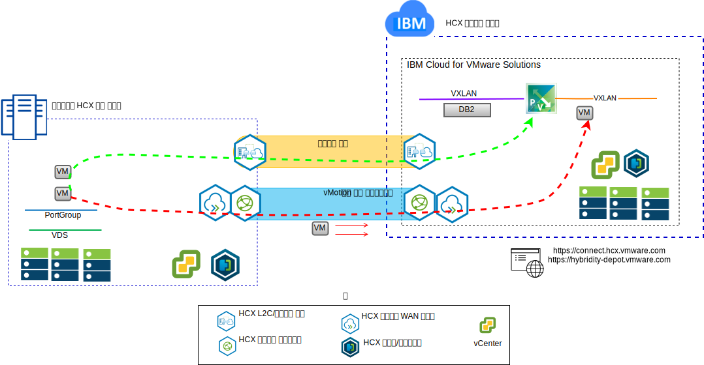

---

copyright:

  years:  2016, 2019

lastupdated: "2019-02-15"

---

# 유스 케이스
{: #vcsnsxt-usecases}

## IBM Cloud로 VMware 워크로드 마이그레이션
{: #vcsnsxt-usecases-wkld-mig}

Acme Skateboards는 온프레미스 VMware SDDC 인스턴스를 {{site.data.keyword.cloud}} 인스턴스의 VMware vCenter Server로 원활하게 확장하려고 합니다. 가동 중단 시간을 최소한으로 유지하며 비즈니스를 계속 운영해야 합니다. 클라우드에서 실행하도록 애플리케이션을 다시 구성하는 것은 적절한 솔루션이 아닙니다.

VMware vCenter Server on {{site.data.keyword.cloud_notm}} with Hybridity Bundle을 사용하면
vCenter Server 인스턴스와
온프레미스 VMware 가상 데이터 센터 사이에 원활한 연결을 만들 수 있습니다.

vCenter Server 대상 사이트의 가상 머신(VM)으로 배치되는 VMware HCX 컴포넌트는 피어 온프레미스 소스 사이트에 설치되는 VMware HCX 컴포넌트와 연결할 수 있도록 합니다.

그림 1. VMware Hybrid Cloud Extension 서비스

온프레미스와 {{site.data.keyword.cloud_notm}} 간에 느슨하게 결합된 상호 연결을 통해 다음 기능을 사용할 수 있습니다.
- **간단한 상호 연결** – 공용 인터넷, 사설 VPN 또는 직접 링크를 포함하는 실제 연결에서 논리적 네트워크 연결을 쉽게 설정할 수 있습니다.
- **계층 2 확장** – 온프레미스 서브넷 및 IP 주소 지정을 포함하는 클라우드로 온프레미스 네트워크가 확장됩니다.
- **암호화** – 네트워크 트래픽이 두 사이트 간에 안전하게 암호화됩니다.
- **최적화된 네트워크** – 네트워크 트래픽이 가능한 빠르게 이동할 수 있도록 최상의 연결을 선택하여 효율적으로 연결이 흐르게 합니다.
- **데이터 중복 제거** – 네트워크 트래픽의 50% 만큼 감소할 수 있습니다.
- **지능형 라우팅** – 워크로드가 이동되는 경우 네트워크 트래픽이 대상 사이트 게이트웨이를 사용하고 원래 사이트로 다시 “헤어핀”하지 않도록 근접 라우팅에서 네트워크 경로(즉, 게이트웨이)를 변경할 수 있습니다.
- **무중단 마이그레이션** – vMotion을 사용하여 실행 중인 가상 머신을 클라우드로 이동하거나 클라우드에서 이동할 수 있습니다.
- **예정된 마이그레이션** – 임의의 VM을 대상 사이트에 복제한 후 원래 사이트에서 실행 중인 시스템을 교체하는 지정된 시간에 해당 사이트에서 활성화할 수 있습니다.
- **보안 정책의 마이그레이션** – NSX가 온프레미스에 사용되는 경우 보안 정책, 방화벽 등은 워크로드와 함께 이동됩니다.

## 하이브리드 아키텍처 배치
{: #vcsnsxt-usecases-hybrid-archi-deployment}

Acme Skateboards는 애플리케이션 현대화에 대한 과정을 위해 vCenter Server with Hybridity Bundle 및 {{site.data.keyword.icpfull_notm}}로 구성되는 {{site.data.keyword.cloud_notm}}에 하이브리드 아키텍처를 배치하려고 합니다. 요구사항은 VM에서 데이터베이스를 실행하고, 컨테이너에 있는 앱과 웹 인터페이스를 실행하고, 네트워크 및 보안 관리를 위해 공통 도구 세트를 사용하는 것입니다.

{{site.data.keyword.vmwaresolutions_short}}은 VMware 기술 컴포넌트를 전세계에 있는
{{site.data.keyword.CloudDataCents_notm}}에 배치하는 자동화 기능을 제공합니다. 이 아키텍처는 단일 클라우드 지역으로 구성되며 동일한 데이터 센터 내의 다른 지역 또는 다른 {{site.data.keyword.cloud_notm}} 팟(Pod)에 위치한 여러 클라우드 지역으로 확장하는 기능을 지원합니다.

{{site.data.keyword.icpfull_notm}} 및 CAM(Cloud Automation Manager) 제품은 온프레미스 가상화 플랫폼에 수동으로 배치할 수 있으며 온프레미스 위치에서 클라우드를 관리할 수 있습니다. 또는 {{site.data.keyword.icpfull_notm}} 및 CAM은 기존 또는 새로운 vCenter Server 배치에 대한 서비스 확장으로 제공되며 {{site.data.keyword.cloud_notm}}에서 클라우드를 관리할 수 있습니다.

다음 다이어그램은 vCenter Server 인스턴스에서 실행 중인 {{site.data.keyword.icpfull_notm}}를 나타냅니다. NSX-V는 {{site.data.keyword.icpfull_notm}} 오버레이 네트워크를 위해 전용 스위치/VXLAN, DLR(Distributed Logical Router) 및 ESG(Edge Services Gateway)로 구성됩니다. 라우팅은 언더레이 네트워크에 대한 액세스를 위해 ESG를 통해 설정됩니다.

{{site.data.keyword.cloud_notm}} 자동화를 사용하면, Acme Skateboards에서 vCenter Server를 포함하는 하이브리드 솔루션을 프로비저닝하여 애플리케이션과 프론트 엔드 웹 서비스를 컨테이너에서 실행하기 위해 데이터베이스 VM 및 {{site.data.keyword.icpfull_notm}} on vCenter Server를 실행할 수 있습니다. NSX는 오버레이 네트워크에서 네트워킹 및 보안을 위한 공통 관리 도구 세트를 제공합니다.

NSX-V에 대한 자세한 정보는 [NSX-V 개요](/docs/services/vmwaresolutions/archiref/vcsnsxt?topic=vmware-solutions-vcsnsxt-overview-ic4vnsxv)를 참조하십시오. vCenter Server 및 {{site.data.keyword.icpfull_notm}} 오퍼링에 대한 자세한 정보는 [vCenter Server 및 {{site.data.keyword.cloud_notm}} Private](/docs/services/vmwaresolutions/archiref/vcsicp?topic=vmware-solutions-vcsicp-intro)을 참조하십시오.

그림 2. {{site.data.keyword.icpfull_notm}}">를 사용하는 vCenter Server

온프레미스와 {{site.data.keyword.cloud_notm}} 간에 느슨하게 결합된 상호 연결을 작성하며 다음과 같은 기능을 사용할 수 있습니다.
-	**간단한 상호 연결** – 공용 인터넷, 사설 VPN 또는 직접 링크를 포함하는 실제 연결에서 논리적 네트워크 연결을 쉽게 설정할 수 있습니다.
-	**계층 2 확장** – 온프레미스 서브넷 및 IP 주소 지정을 포함하는 클라우드로 온프레미스 네트워크가 확장됩니다.
-	**암호화** – 네트워크 트래픽이 두 사이트 간에 안전하게 암호화됩니다.
-	**최적화된 네트워크** – 네트워크 트래픽이 가능한 빠르게 이동할 수 있도록 최상의 연결을 선택하여 효율적으로 연결이 흐르게 합니다.
-	**데이터 중복 제거** – 네트워크 트래픽의 50% 만큼 감소할 수 있습니다.
-	**지능형 라우팅** – 워크로드가 이동되는 경우 네트워크 트래픽이 대상 사이트 게이트웨이를 사용하고 원래 사이트로 다시 “헤어핀”하지 않도록 근접 라우팅에서 네트워크 경로(즉, 게이트웨이)를 변경할 수 있습니다.
-	**무중단 마이그레이션** – vMotion을 사용하여 실행 중인 가상 머신을 클라우드로 이동하거나 클라우드에서 이동할 수 있습니다.
-	**예정된 마이그레이션** – 임의의 VM을 대상 사이트에 복제한 후 지정된 시간에 해당 사이트에서 활성화하여 원래 사이트에서 실행 중인 시스템을 교체할 수 있습니다.
-	**보안 정책의 마이그레이션** – NSX가 온프레미스에 사용되는 경우 보안 정책, 방화벽 등은 워크로드와 함께 이동됩니다.

이 솔루션을 사용하면 Acme Skateboards에서 해당 온프레미스 VMware 워크로드를 {{site.data.keyword.cloud_notm}} 에 성공적으로 마이그레이션하여 가동 중단 시간이 없이 애플리케이션을 다시 구성할 필요 없는 요구사항을 충족시킬 수 있습니다. vCenter Server with Hybridity Bundle에 대한 자세한 정보는 [VMware HCX on {{site.data.keyword.cloud_notm}} 솔루션 아키텍처](https://www.ibm.com/cloud/garage/files/HCX_Architecture_Design.pdf)를 참조하십시오.

## 관련 링크
{: #vcsnsxt-usecases-related}

* [vCenter Server on {{site.data.keyword.cloud_notm}} with Hybridity Bundle 개요](/docs/services/vmwaresolutions/archiref/vcs?topic=vmware-solutions-vcs-hybridity-intro)
