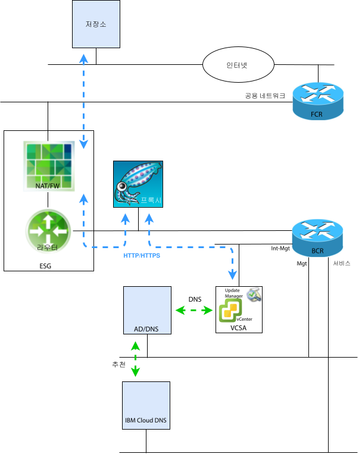

---

copyright:

  years:  2016, 2018

lastupdated: "2018-10-29"

---

# VMware Update Manager 소개

이 문서의 목적은 IBM Cloud for VMware Solutions vCenter Server 인스턴스의 시스템 관리자에게 vCenter Server 환경의 현재성을 유지하도록 VUM(VMware Update Manager)을 구성하는 방법에 대한 지시사항을 제공하는 것입니다.

VUM을 사용하면 VMware vSphere에 대한 자동화된 중앙 집중식 패치 및 버전 관리가 가능하며 VCS 환경에서 다음 태스크를 수행할 수 있습니다.
* vSphere ESXi 호스트 업그레이드 및 패치 적용
* 호스트에 서드파티 소프트웨어 설치 및 업데이트
* 가상 머신 하드웨어, VMware Tools 및 가상 어플라이언스 업그레이드

이 문서에서는 VCS 인스턴스의 다음 컴포넌트를 유지보수하는 프로세스에 대해서도 설명합니다. 
* vCenter Server Appliance
* NSX
* vSAN

이 문서에서는 VUM에서 VMware 저장소에 액세스할 수 있도록 CentOS 및 Squid 기반의 프록시 서버 구현을 사용하는 방법에 대해 설명합니다. VUM이 VMware에 있는 업데이트 서버의 리소스를 요청하면 먼저 요청이 프록시 서버로 전송된 다음 프록시 서버가 ESG(External Services Gateway)를 통해 해당 요청을 업데이트 서버로 전송합니다. 프록시 서버가 리소스를 얻으면 해당 리소스를 VUM으로 전송합니다.

그림 1. 개요 다이어그램

VCS는 현재 vSphere 6.5를 배치합니다. 즉, 이제 VUM이 VCSA(vCenter Server Appliance) 내에 통합되었으며 VUM 클라이언트 컴포넌트는 vSphere Web Client에서 실행되는 플러그인이므로 VCSA 배치 후 자동으로 사용으로 설정됩니다. 그러나 VUM에서는 VMware 저장소에 액세스하기 위해 인터넷에 액세스할 수 없습니다.

이 문서화된 구성에서는 IBM Cloud 공용 네트워크를 사용하여 업그레이드 및 패치를 다운로드하기 위한 인터넷 액세스를 제공하는 인터넷에 연결된 "올인원" VUM 배치 모델을 사용합니다.

대체 인터넷 연결을 사용해야 하는 고객은 이 서적의 범위를 벗어나는 VMware vSphere UMDS(Update Manager Download Service)를 살펴봐야 합니다.

공유 저장소에서 업데이트를 가져오거나 .zip 파일에서 수동으로 패치 및 확장을 가져오도록 VUM을 구성할 수 있지만 이러한 주제는 이 문서에서 논의되지 않습니다.

따라서 vSphere 6.5에서는 별도의 Windows 시스템에 VUM 서버를 설치하는 동안 VUM을 VCSA에 등록하는 것이 더 이상 지원되지 않으므로 VCS 환경 내의 VM에 VUM을 배치할 수 없습니다.

이 문서는 다음 섹션으로 구성되어 있습니다.
* [VMware Update Manager 개요](vum-overview.html) - 이 섹션에서는 VUM 프로세스에 대해 설명하고 도구의 운영 및 UI를 이해하는 데 필요한 주요 용어를 소개합니다. 
* **설치, 구성 및 사용법** - 이 섹션에서는 VCS 인스턴스에서 VUM을 작동하는 데 필요한 단계에 대해 설명합니다.
  - [초기 구성](vum-init-config.html) - 다음을 수행하는 일회성 태스크입니다. 
      - 인터넷에 대한 프록시 서버 액세스를 허용하도록 NSX 네트워킹 구성
      - 프록시 서버를 설치하고 VUM에 대한 인터넷 액세스를 제공하도록 구성
      - 프록시 서버를 사용하도록 VUM 초기 설정
  - [메타데이터 수집](vum-metadata.html) - VUM은 수정할 수 있는 사전 정의된 자동 프로세스를 통해 업그레이드, 패치 또는 확장에 대한 메타데이터를 다운로드합니다. VUM은 구성 가능한 정규 간격으로 VMware 또는 서드파티 소스에 연결하여 사용 가능한 업그레이드, 패치 또는 확장에 대한 최신 메타데이터를 수집합니다.
  - [기준선 작성](vum-baselines.html) - 사전 정의된 기준선 및 기준선 그룹을 사용하거나 사용자 정의 기준선을 작성합니다. 그런 다음 기준선 및 기준선 그룹이 인벤토리 그룹에 연결됩니다.
  - [스캔 및 검토](vum-scanning.html) - 인벤토리 오브젝트를 스캔하고 해당 결과를 검토하여 오브젝트가 기준선과 기준선 그룹을 어떻게 준수하는지 판별합니다. 텍스트 검색, 그룹 선택, 기준선 선택 및 준수 상태 선택에 따라 스캔 결과를 필터링할 수 있습니다.
  - [스테이징 및 조치방안](vum-staging.html) - 호스트에 다운로드되었는지 확인하기 위해 조치방안 전에 패치 및 확장을 선택적으로 스테이징할 수 있습니다. 조치방안 중에 VUM이 패치, 확장 및 업그레이드를 인벤토리 오브젝트에 적용합니다.

이 문서에서는 하나의 기본 VCS 인스턴스가 배치되었거나 다수의 별도 기본 VCS 인스턴스가 있다고 가정합니다. 기본 및 보조 VCS 인스턴스가 배치되고 싱글 사인온(SSO)을 사용 중인 경우 [SSO 링크된 vCenter](vum-updating-vcsa.html)를 참조하십시오.

vSAN을 사용하여 VCS를 배치한 경우 먼저 [vSAN 클러스터 업데이트](vum-updating-vsan.html)를 참조하십시오.

IBM Cloud 인프라 관리 자동화를 업데이트하려면 IBM Cloud for VMware Solutions 콘솔을 사용하십시오.

[IBM Cloud for VMware Solutions 콘솔](https://console.bluemix.net/infrastructure/vmware-solutions/console)을 사용하여 다음 조치를 수행할 수 있습니다.
*	라이센스 업그레이드(예: NSX Base를 다른 버전으로 업그레이드)
*	VCS 플랫폼에 대한 업데이트 시작(예: 버전 2.5로 이동)
*	업데이트 상태 보기
*	설치된 업데이트 보기

이 기능을 사용하면 VCS 인스턴스의 관리 컴포넌트에 대한 자동화된 업데이트만 수행할 수 있습니다. VMware 제품 업데이트는 이 문서에 자세히 설명된 프로시저를 사용하여 적용되어야 합니다.

### 관련 링크

* [VMware HCX on IBM Cloud 솔루션 아키텍처](https://www.ibm.com/cloud/garage/files/HCX_Architecture_Design.pdf)
* [VMware Solutions on IBM Cloud 디지털 기술 업무](https://ibm-dte.mybluemix.net/ibm-vmware)(데모)
