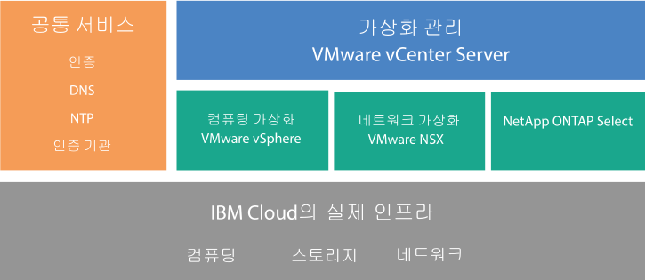
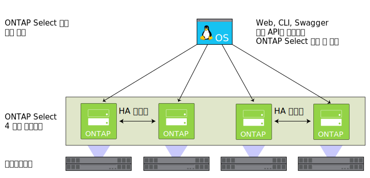

---

copyright:

  years:  2016, 2019

lastupdated: "2019-06-26"

keywords: NetApp ONTAP, NetApp, tech specs NetApp ONTAP

subcollection: vmware-solutions

---

{:external: target="_blank" .external}
{:tip: .tip}
{:note: .note}
{:important: .important}

# NetApp ONTAP Select 개요
{: #np_netappoverview}

{{site.data.keyword.cloud}} 배치 시 NetApp ONTAP Select의 아키텍처 및 컴포넌트를 검토하십시오.

## NetApp ONTAP Select 아키텍처
{: #np_netappoverview-archi}

NetApp ONTAP Select on {{site.data.keyword.cloud_notm}} 오퍼링은 스토리지 가상화 서비스를 제공하여 vCenter Server 배치를 보완합니다.

다음 그림은 NetApp ONTAP Select on vCenter Server 배치의 전반적인 아키텍처를 보여줍니다.

### 실제 인프라
{: #np_netappoverview-physical-infras}

이 계층은 가상 인프라에서 사용할 실제 인프라(컴퓨팅, 네트워크 및 스토리지 리소스)를 제공합니다.

### 가상화 인프라(컴퓨팅, 네트워크 및 NetApp ONTAP Select)
{: #np_netappoverview-virtual-infras}

이 계층은 다음의 VMware 제품 및 NetApp ONTAP Select 제품을 통해 실제 인프라를 가상화합니다.
* VMware vSphere는 실제 컴퓨팅 리소스를 가상화합니다.
* VMware NSX는 논리 네트워킹 컴포넌트 및 가상 네트워크를 제공하는 네트워크 가상화 플랫폼입니다.
* NetApp ONTAP Select on {{site.data.keyword.cloud_notm}}는 4개의 호스트에 대해 4개의 VM으로 구성된 ONTAP Select 클러스터를 배치합니다.

다음 그림은 NetApp ONTAP Select 배치의 컴포넌트를 보여줍니다.

### 가상화 관리
{: #np_netappoverview-virtualization-mgmt}

가상화 관리 계층은 다음 컴포넌트로 구성됩니다.

* 임베디드 PSC(Platform Services Controller)가 포함된 vCenter Server Appliance(vCSA)
* NSX Manager
* 두 개의 NSX ESG(Edge Services Gateway)
* 세 개의 NSX Controllers
* IBM CloudDriver VSI(Virtual Server Instance)

NetApp ONTAP Select는 VMware 클러스터에서 실행되고 호스트의 로컬 스토리지를 가상화합니다. NetApp ONTAP Select는 전용 모델에 배치되며, 여기서 기타 워크로드는 이와의 클러스터 공유가 예상되지 않습니다. 결과적으로 NetApp ONTAP Select on {{site.data.keyword.cloud_notm}} 오퍼링의 하드웨어 구성은 NetApp ONTAP Select의 요구사항에 따라서만 크기가 조정됩니다.

## NetApp ONTAP Select 인스턴스의 기술 스펙
{: #np_netappoverview-specs}

다음 컴포넌트가 NetApp ONTAP Select 인스턴스에 포함됩니다.

표준화된 구성의 가용성 및 가격은 배치에 선택된 {{site.data.keyword.CloudDataCent_notm}}에 따라 달라질 수 있습니다.
{:note}

### 스토리지
{: #np_netappoverview-storage}

* **고성능(중형)**, **고성능(대형)** 및 **고용량** 중에 선택
* 핫 스페어가 포함된 RAID 5
* 두 개의 1-TB SATA 드라이브 ESXi OS – RAID 1
* 관리 데이터 저장소 – 관리 VM용 500GB

### 사전 설정 구성
{: #np_netappoverview-preset-config}

다음의 구성 옵션이 포함된 4개의 {{site.data.keyword.cloud_notm}} {{site.data.keyword.baremetal_short}}가 제공됩니다.
* **고성능(중형)** – 프리미엄 라이센스 / 듀얼 Intel Xeon E5-2650 v4(총 24개의 코어, 2.2GHz) / 128GB RAM / 노드당 22개의 1.9TB SSD 드라이브 용량 / 4 노드 클러스터의 유효한 용량 – 59TB
* **고성능(대형)** – 프리미엄 라이센스 / 듀얼 Intel Xeon E5-2650 v4(총 24개의 코어, 2.2GHz) / 128GB RAM / 노드당 22개의 3.8TB SSD 드라이브 용량 / 4 노드 클러스터의 유효한 용량 – 118TB
* **고용량** – 표준 라이센스 / 듀얼 Intel Xeon E5-2650 v4(총 24개의 코어, 2.2GHz) / 64GB RAM / 노드당 34개의 4TB SATA 드라이브 용량 / 4 노드 클러스터의 유효한 용량 – 190TB

3.8TB SSD(Solid-State Disk) 드라이브는 데이터 센터에서 일반적으로 사용 가능하게 되는 경우 지원됩니다.
{:note}

### 하드웨어
{: #np_netappoverview-hardware}

* 세 개의 RAM 및 디스크 옵션: **고성능(중형)**, **고성능(대형)** 및 **고용량**
* 두 개의 1TB SATA 드라이브 ESXi OS
* 한 개의 RAID 디스크 제어기
* VMware Server Virtualization 6.5

### 네트워킹
{: #np_netappoverview-network}

* 10Gbps 듀얼 공용 및 사설 네트워크 업링크
* 세 개의 VLAN(Virtual LANs): 한 개의 공용 VLAN 및 두 개의 사설 VLAN
* 하나의 안전한 VMware NSX Edge Services Gateway

### Virtual Server 인스턴스
{: #np_netappoverview-vsi}

두 개의 VSI(Virtual Server Instances):
* Microsoft Active Directory(AD) 및 DNS(Domain Name System) 서비스용 VSI
* 인스턴스 배치가 완료된 후 시스템이 종료되는 IBM CloudBuilder용 VSI

### 라이센스 및 요금
{: #np_netappoverview-license-and-fee}

*  네 개의 Premium 또는 Standard Edition NetApp ONTAP Select 라이센스(사용자 제공)
*  VMware vSphere 6.5 Enterprise Plus 에디션
*  VMware vCenter Server 6.5
*  VMware NSX Service Providers Edition(Base, Advanced 또는 Enterprise) 6.4
*  지원 및 서비스 요금(노드당 한 개의 라이센스)

{{site.data.keyword.slportal}} 또는 콘솔 이외의 다른 수단이 아닌, {{site.data.keyword.vmwaresolutions_short}} 콘솔에서만 {{site.data.keyword.cloud_notm}} 계정에 작성되는 {{site.data.keyword.vmwaresolutions_short}} 컴포넌트를 관리해야 합니다. {{site.data.keyword.vmwaresolutions_short}} 콘솔 외부에서 컴포넌트를 변경하는 경우 변경사항은 콘솔과 동기화되지 않습니다.
{:important}

**주의:** {{site.data.keyword.vmwaresolutions_short}} 콘솔 외부에서 {{site.data.keyword.vmwaresolutions_short}} 컴포넌트(인스턴스 주문 시 {{site.data.keyword.cloud_notm}} 계정에 설치된)를 관리하면 환경이 불안정해질 수 있습니다. 이러한 관리 활동에는 다음이 포함됩니다.
*  컴포넌트 추가, 수정, 리턴, 제거 또는 전원 끄기
*  ESXi 서버 추가 또는 제거를 통한 인스턴스 용량의 확장 또는 축소
*  서비스 다시 시작

   이 활동에 대한 예외에는 {{site.data.keyword.slportal}}의 공유 스토리지 파일 공유 관리가 포함됩니다. 이러한 활동에는 공유 스토리지 파일 공유 주문, 삭제(마운트된 경우 데이터 저장소에 영향을 줄 수 있음), 권한 부여 및 마운트가 포함됩니다.

## 방화벽 고려사항
{: #np_netappoverview-firewall-considerations}

방화벽을 사용 중인 경우에는 {{site.data.keyword.IBM}} CloudDriver VSI(Virtual Server Instance) 및 SDDC Manager 가상 머신(VM)의 모든 통신에 대한 규칙을 구성해야 합니다. 이러한 규칙은 모든 프로토콜이 `10.0.0.0/8` 및 `161.26.0.0/16`의 IP 주소에서 통신할 수 있도록 허용해야 합니다. 이러한 방화벽의 예로는 NSX DFW(Distributed Firewall) 또는 Vyatta 방화벽이 있습니다.

## 관련 링크
{: #np_netappoverview-related}

* [NetApp ONTAP Select 인스턴스 계획](/docs/services/vmwaresolutions/netapp?topic=vmware-solutions-np_planning#requirements-and-planning-for-netapp-ontap-select-instances)
* [NetApp ONTAP Select 인스턴스 주문](/docs/services/vmwaresolutions/netapp?topic=vmware-solutions-np_orderinginstances)
* [vCenter Server 개요](/docs/services/vmwaresolutions/vcenter?topic=vmware-solutions-vc_vcenterserveroverview)
* [NetApp ONTAP Documentation Center](http://docs.netapp.com/ontap-9/index.jsp?topic=%2Fcom.netapp.doc.exp-clus-peer%2Fhome.html){: external}
