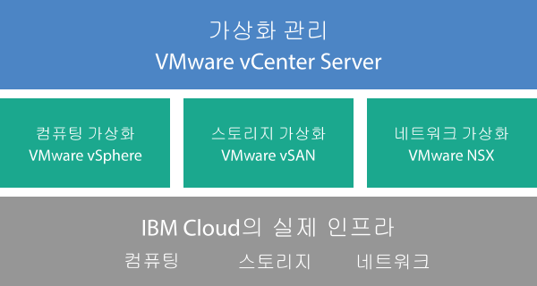

---

copyright:

  years:  2016, 2018

lastupdated: "2018-10-29"

---

{:tip: .tip}
{:note: .note}
{:important: .important}

# Cloud Foundation 개요

VMware Cloud Foundation on {{site.data.keyword.cloud}}를 주문할 때 전체 VMware 환경이 자동으로 배치됩니다. 기본 배치는 통합된 소프트웨어 정의 데이터 센터(SDDC) 플랫폼을 제공하도록 VMware Cloud Foundation 스택이 사전 설치되고 구성된 네 개의 {{site.data.keyword.cloud_notm}} {{site.data.keyword.baremetal_short}}로 구성됩니다. 기본적으로 Cloud Foundation은 VMware vSphere, VMware NSX, VMware Virtual SAN을 통합하고 VMware 유효성 검증 디자인을 기반으로 설계되었습니다.

## Cloud Foundation 아키텍처

다음 그림은 Cloud Foundation 배치의 전체 아키텍처 및 컴포넌트에 대해 설명합니다.

그림 1. Cloud Foundation 아키텍처

### 실제 인프라

이 계층은 가상 인프라에서 사용할 실제 인프라(컴퓨팅, 스토리지 및 네트워크 리소스)를 제공합니다.

### 가상화 인프라(컴퓨팅, 스토리지 및 네트워크)

이 계층은 다른 VMware 제품을 통해 실제 인프라를 가상화합니다.
* VMware vSphere는 실제 컴퓨팅 리소스를 가상화합니다.
* vSAN(VMware Virtual SAN)은 실제 서버의 스토리지에 따라 소프트웨어 정의 공유 스토리지를 제공합니다.
* VMware NSX는 논리 네트워킹 컴포넌트 및 가상 네트워크를 제공하는 네트워크 가상화 플랫폼입니다.

### 가상화 관리

이 계층은 가상화된 환경에 대한 관리 계층을 나타내는 vCenter Server로 구성됩니다. 동일한 vSphere API 호환 도구 및 스크립트는 IBM 호스팅 VMware 환경을 관리하는 데 사용될 수 있습니다.

{{site.data.keyword.vmwaresolutions_short}} 콘솔에서 ESXi 서버 기능의 추가 및 제거를 사용하여 인스턴스의 기능을 확장하고 축소할 수 있습니다. 또한 호스팅된 환경에서 VMware 컴포넌트의 업데이트 및 업그레이드 적용과 같이 라이프사이클 관리 기능도 사용할 수 있습니다.

아키텍처에 대한 자세한 정보는 [솔루션 개요](../archiref/solution/solution_overview.html)를 참조하십시오.

## Cloud Foundation 인스턴스의 기술 스펙

다음 컴포넌트는 Cloud Foundation 인스턴스에 포함됩니다.

하드웨어, 네트워킹, 가상 머신 및 스토리지에 대해 발생하는 비용은 배치에 선택되는 {{site.data.keyword.CloudDataCent_notm}}에 따라 달라질 수 있습니다.
{:note}

### Bare Metal Server

다음 구성 중 하나로 {{site.data.keyword.cloud_notm}} {{site.data.keyword.baremetal_short}}를 주문할 수 있습니다.
*  **Skylake** 또는 **Broadwell**: 선택한 CPU 모델 및 RAM 크기의 {{site.data.keyword.baremetal_short}}   
   * 두 개의 CPU Intel Skylake 세대(Intel Xeon 4100/5100/6100 시리즈)
   * 두 개의 CPU Intel Broadwell 세대(Intel Xeon E5-2600 v4 시리즈)

   vSAN 스토리지를 사용하려는 경우 구성에 4개의 {{site.data.keyword.baremetal_short}}가 필요합니다.
   {:note}
* **사전 구성됨**: 두 개의 CPU Intel Broadwell 세대(Intel Xeon E5-2600 v4 시리즈)
  * **소형**(듀얼 Intel Xeon E5-2650 v4 / 총 24개의 코어, 2.2GHz / 128GB RAM / 12개의 디스크)
  * **대형**(듀얼 Intel Xeon E5-2690 v4 / 총 28개의 코어, 2.6GHz / 512GB RAM / 12개의 디스크)

### 네트워킹

다음 네트워킹 컴포넌트가 주문됩니다.
* 10Gbps 듀얼 공용 및 사설 네트워크 업링크
* 세 개의 VLAN(Virtual LANs): 한 개의 공용 VLAN 및 두 개의 사설 VLAN
* 관리 네트워킹 토폴로지의 일부로 IBM에서 배치되는 아웃바운드 HTTPS 관리 트래픽을 위한 보안 관리 서비스 VMware NSX Edge Services Gateway(ESG). 이 ESG는 자동화와 관련된 특정 외부 IBM 관리 컴포넌트와 통신하기 위해 IBM 관리 가상 머신에서 사용됩니다. 자세한 정보는 [관리 서비스 NSX Edge는 보안 문제점을 발생시킵니까?](../vmonic/faq.html#does-the-management-services-nsx-edge-pose-a-security-risk-)를 참조하십시오.

  사용자는 이 ESG에 액세스할 수 없고 사용할 수 없습니다. 수정하는 경우 {{site.data.keyword.vmwaresolutions_short}} 콘솔에서 Cloud Foundation 인스턴스를 관리하지 못할 수 있습니다. 또한 방화벽을 사용하거나 외부 IBM 관리 컴포넌트와의 ESG 통신을 사용 안함으로 설정하면 {{site.data.keyword.vmwaresolutions_short}}를 사용할 수 없게 됩니다.
  {:important}

* 현재 VMware vSphere 버전에서 지원하는 ESXi 서버를 포함하는 기존 클러스터가 있는 경우에는 EVC(Enhanced vMotion Compatibility) 기능이 자동으로 사용 설정됩니다. EVC는 클러스터 내의 모든 ESXi 서버가 가상 머신에 동일한 CPU 사양 세트를 노출하도록 함으로써 클러스터 내의 모든 ESXi 서버에 vMotion 호환성을 제공합니다. EVC를 사용하면 ESXi 서버 간에 실제 CPU가 서로 다르더라도 가상 머신이 클러스터 내 임의의 ESXi 서버로 마이그레이션할 수 있습니다.

### Virtual Server 인스턴스

다음 VSI(Virtual Server Instances)가 주문됩니다.
* Microsoft Active Directory(AD) 및 DNS(Domain Name System) 서비스용 VSI. VSI는 다중 사이트 구성 지원에 필요합니다. 이 VSI 스펙은 Windows 2012 R2(8GB RAM / 두 개의 CPU 코어 / 100GB 디스크 / 듀얼 1Gbps 사설 업링크)입니다.
* 인스턴스 배치가 완료된 후 시스템이 종료되는 IBM CloudBuilder용 VSI
* (Veeam on {{site.data.keyword.cloud_notm}}가 주문된 경우) Veeam 백업 서비스용 VSI가 주문됨

### 스토리지

선택한 {{site.data.keyword.baremetal_short}} 구성에 따라 다음 스토리지가 주문됩니다.
* 두 개의 1-TB SATA 부트 디스크
* 두 개의 960-GB SSD(Solid-State Disk) 캐시 디스크
* 한 개의 RAID 디스크 제어기
* **Skylake** 및 **Broadwell** 구성의 경우에만, 요구사항에 따라 디스크 드라이브 수 및 디스크 유형과 용량을 설정할 수 있습니다. 또한 고성능 Intel Optane 옵션은 총 10개의 용량 디스크에 대해 2개의 추가 용량 디스크 베이를 제공합니다. 고성능 Intel Optane 옵션은 CPU 모델에 따라 다릅니다.
* **사전 구성됨**, **소형** 구성의 경우에만: 두 개의 1.9TB SSD 용량 디스크
* **사전 구성됨**, **대형** 구성의 경우에만: 네 개의 3.8TB SSD 용량 디스크

### 라이센스(IBM 제공 또는 BYOL) 및 요금

* 네 개의 VMware vSphere Enterprise Plus 6.5u1
* 네 개의 VMware vCenter Server 6.5
* 네 개의 VMware NSX Enterprise 6.3
* 네 개의 VMware vSAN Advanced 또는 Enterprise 6.6
* 네 개의 SDDC Manager 라이센스(IBM 제공만 해당)
* 네 개의 지원 및 서비스 비용

## Cloud Foundation 확장 노드의 기술 스펙

각 Cloud Foundation 확장 노드가 {{site.data.keyword.cloud_notm}} 계정에서 다음 컴포넌트를 배치하고 이에 대한 비용을 부과합니다.

### 확장 노드를 위한 하드웨어

[Cloud Foundation 인스턴스의 기술 스펙](../sddc/sd_cloudfoundationoverview.html#technical-specifications-for-cloud-foundation-instances)에 제시된 구성을 지닌 하나의 {{site.data.keyword.cloud_notm}} Bare Metal Server.

### 확장 노드의 라이센스 및 요금

* 하나의 VMware vSphere Enterprise Plus 6.5u1
* 하나의 VMware vCenter Server 6.5
* 하나의 VMware NSX Enterprise 6.3
* 하나의 VMware vSAN Advanced 또는 Enterprise 6.6
* 하나의 SDDC Manager 라이센스
* 하나의 지원 및 서비스 요금

{{site.data.keyword.slportal}} 또는 콘솔 이외의 다른 수단이 아닌, {{site.data.keyword.vmwaresolutions_short}} 콘솔에서만 {{site.data.keyword.cloud_notm}} 계정에 작성되는 {{site.data.keyword.vmwaresolutions_short}} 컴포넌트를 관리해야 합니다.
{{site.data.keyword.vmwaresolutions_short}} 콘솔 외부에서 컴포넌트를 변경하는 경우 변경사항은 콘솔과 동기화되지 않습니다.
{:important}

**주의:** 인스턴스를 주문했을 때 {{site.data.keyword.cloud_notm}} 계정에 설치된 {{site.data.keyword.vmwaresolutions_short}} 컴포넌트를 {{site.data.keyword.vmwaresolutions_short}} 콘솔 외부에서 관리하면 환경이 불안정해질 수 있습니다. 이러한 관리 활동에는 다음이 포함됩니다.
*  컴포넌트 추가, 수정, 리턴 또는 제거
*  ESXi 서버 추가 또는 제거를 통한 인스턴스 용량의 확장 또는 축소
*  컴포넌트 전원 끄기
*  서비스 다시 시작

   이 활동에 대한 예외에는 {{site.data.keyword.slportal}}의 공유 스토리지 파일 공유 관리가 포함됩니다. 이러한 활동에는 공유 스토리지 파일 공유 주문, 삭제(마운트된 경우 데이터 저장소에 영향을 줄 수 있음), 권한 부여 및 마운트가 포함됩니다.

### 관련 링크

* [Cloud Foundation 소프트웨어 명세서](sd_bom.html)
* [Cloud Foundation 인스턴스 계획](sd_planning.html)
* [Cloud Foundation 인스턴스 주문](sd_orderinginstance.html)
* [VMware vSphere Documentation Center](https://pubs.vmware.com/vsphere-60/index.jsp){:new_window}
* [VMware NSX 6 Documentation Center](https://pubs.vmware.com/NSX-6/index.jsp){:new_window}
* [EVC and CPU Compatibility FAQ](https://kb.vmware.com/s/article/1005764)
