---

copyright:

  years:  2019

lastupdated: "2019-08-06"

keywords: vmware solutions shared, get started shared, tech specs shared

subcollection: vmware-solutions

---

{:external: target="_blank" .external}
{:tip: .tip}
{:note: .note}
{:important: .important}

# IBM Cloud for VMware Solutions Shared의 개요
{: #shared_overview}

{{site.data.keyword.vmwaresolutions_full}} Shared는 시범 오퍼링으로 제공됩니다.
{:note}

VMware 가상 데이터 센터를 사용하면 전문적으로 관리되는 VMware 인프라를 기반으로 VMware 워크로드를 클라우드로 빠르고 원활하게 마이그레이션하거나 배치할 수 있습니다. IBM은 {{site.data.keyword.cloud_notm}}에서 실행 중인 vCloud Director가 있는 셀프 서비스 On-Demand VMware 클라우드 컴퓨팅 플랫폼을 제공합니다. 이 IaaS(Infrastructure as a Service) 종량과금제 오퍼링을 통해 사용자가 필요에 따라 특정 vCPU, 스토리지, vRAM, 네트워크 및 IP를 이용할 수 있습니다.

{{site.data.keyword.vmwaresolutions_short}}에는 세 가지 "IaaS(Infrastructure as a Service)" 구독 서비스 유형이 있습니다.
- 멀티 테넌트 예약 가상 데이터 센터
- 멀티 테넌트 종량과금제 가상 데이터 센터
- 싱글 테넌트 전용 가상 데이터 센터

고객은 {{site.data.keyword.vmwaresolutions_short}} 오퍼링을 사용하여 가상 데이터 센터의 라이프사이클을 관리합니다. 웹 UI 또는 공용 API를 사용하여 다음과 같은 기능이 지원됩니다.
- 가상 데이터 센터 작성
- 가상 데이터 센터 탄력성
- 가상 데이터 센터 삭제
- VMware 서비스 추가 및 제거
- On-Demand Windows 라이센싱
- On-Demand Red Hat 라이센싱

세 가지 모든 {{site.data.keyword.cloud_notm}} 가상 데이터 센터 오퍼링은 NSX Edge Service Gateway에서 5개의 공인 IP 주소를 표준으로 제공하며 공용 네트워크를 통해 무제한 수신됩니다.

가상 데이터 센터에서는 다음 컴포넌트에 대한 비용이 발생합니다.
- 스토리지 성능에 따라 가격이 계층화된 스토리지 할당
- 가상 CPU 사용량
- 가상 메모리 사용량
- 공용 네트워킹에서의 수신
- 사용된 상업용 운영 체제 라이센스
- 선택적 VMware 서비스

## IBM Cloud for VMware Solutions Shared 아키텍처
{: #shared_overview-archi}

다음 그래픽은 {{site.data.keyword.vmwaresolutions_short}} Shared 배치의 상위 레벨 아키텍처 및 컴포넌트에 대해 설명합니다.

### VMware vCloud Director
{: #shared_overview-vcloud-dir}

이 계층은 관리 인터페이스를 나타냅니다. VMware® vCloud Director는 조직의 구성원이 조직의 리소스와 상호작용하여 vApp 및 가상 머신(VM)을 작성하고 관련 작업을 수행할 수 있는 웹 기반 테넌트 포털에 대한 역할 기반 액세스를 제공합니다.

### 조직
{: #shared_overview-org}

조직은 사용자, 그룹 및 컴퓨팅 리소스 콜렉션에 대한 관리 단위입니다. 사용자는 조직 관리자가 해당 사용자를 작성하거나 가져올 때 설정한 인증 정보를 제공하여 조직 레벨에서 인증됩니다. 조직 관리자는 조직 사용자, 그룹 및 카탈로그를 관리합니다.

### 사용자 및 정책
{: #shared_overview-users-policies}

조직에는 임의의 수의 사용자 및 그룹이 포함될 수 있습니다. 사용자는 조직 관리자가 로컬로 작성하거나 LDAP과 같은 디렉토리 서비스에서 가져올 수 있습니다. 조직 내의 권한은 사용자 및 그룹에 권한과 역할을 지정하여 제어됩니다.

### 카탈로그
{: #shared_overview-cat}

조직을 카탈로그를 사용하여 vApp 템플리트 및 미디어 파일을 저장합니다. 카탈로그에 액세스할 수 있는 조직의 구성원은 카탈로그의 vApp 템플리트 및 미디어 파일을 사용하여 고유한 vApp을 작성할 수 있습니다. 조직 관리자는 공용 카탈로그에서 해당 조직 카탈로그로 항목을 복사할 수 있습니다.

### 가상 데이터 센터
{: #shared_overview-vc}

조직 가상 데이터 센터는 조직에 리소스를 제공합니다. 가상 데이터 센터는 가상 시스템을 저장, 배치 및 운영할 수 있는 환경을 제공합니다. 또한 가상 CD 및 DVD 미디어에 대한 스토리지를 제공합니다. 조직에는 여러 가상 데이터 센터가 있을 수 있습니다.

## IBM Cloud for VMware Solutions Shared의 기술 스펙
{: #shared_overview-specs}

다음 컴포넌트가 사용자의 {{site.data.keyword.cloud_notm}}에 포함됩니다.

### 컴퓨팅
{: #shared_overview-specs-comp}

컴퓨팅 처리는 가상 CPU(vCPU) 단위로 증분하여 가상 데이터 센터에 할당됩니다. 각 vCPU 증분은 단일 2.0GHz 코어를 나타냅니다. 컴퓨팅 메모리는 GB 단위로 증분하여 할당됩니다.

### 네트워킹
{: #shared_overview-specs-net}

기본적으로 모든 가상 데이터 센터는 5개의 공인 IP 주소와 1개의 개인 서비스 IP 주소가 있는 하나의 에지 게이트웨이로 구성되어 제공됩니다. 에지 게이트웨이는 고객이 구성 가능하며 사용자 정의할 수 있습니다.

공인 주소는 인바운드 또는 아웃바운드 공용 인터넷 트래픽에 대한 공용 vApp에 사용될 수 있습니다.

서비스 주소는 다음 서비스를 포함하여 IBM Cloud 내부 사설 네트워크의 IBM Cloud 인프라 서비스에 액세스하는 데 사용될 수 있습니다.
- NTP
- Windows OS 라이센싱 및 업데이트
- Red Hat OS 라이센싱 및 업데이트
- Cloud Object Storage

### 스토리지
{: #shared_overview-specs-storage}

vApp 또는 VM을 작성하거나 배치할 때 스토리지 정책이 선택됩니다. 필요한 스토리지 성능에 따라 사용 가능한 네 개의 다른 스토리지 티어가 있습니다.

- NFS Platinum: 최대 처리량이 10IOPS/GB인 스토리지 티어, 가장 높은 성능
- NFS Gold: 최대 처리량이 4IOPS/GB인 스토리지 티어
- NFS Silver: 최대 처리량이 2IOPS/GB인 스토리지 티어
- NFS Bronze: 최대 처리량이 0.25IOPS/GB인 스토리지 티어

## 관련 링크
{: #shared_overview-related}

* [Shared On-Demand 주문](/docs/services/vmwaresolutions/services?topic=vmware-solutions-shared_ordering_ondemand)
* [Shared 예약 주문](/docs/services/vmwaresolutions/services?topic=vmware-solutions-shared_ordering_reserved)
* [{{site.data.keyword.cloud_notm}} for VMware Solutions Shared 관리](/docs/services/vmwaresolutions/services?topic=vmware-solutions-shared_managing)
* [VMware vCloud Director](https://docs.vmware.com/en/vCloud-Director/9.7/com.vmware.vcloud.tenantportal.doc/GUID-74C9E10D-9197-43B0-B469-126FFBCB5121.html){:external}
