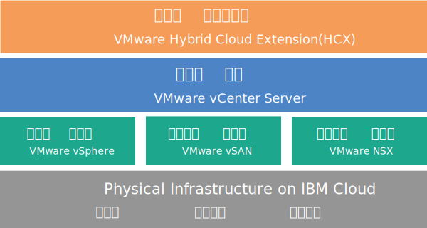

---

copyright:

  years:  2016, 2019

lastupdated: "2019-01-23"

---

{:tip: .tip}
{:note: .note}
{:important: .important}

# vCenter Server with Hybridity Bundle 개요

VMware vCenter Server on {{site.data.keyword.cloud}} with Hybridity Bundle은 V2.3 이상 릴리스에서 사용 가능한 인스턴스입니다. V2.6부터 vCenter Server with Hybridity Bundle 인스턴스를 비즈니스 파트너가 사용할 수 있습니다.

vCenter Server with Hybridity Bundle은 VMware vSphere 스택을 서비스로 제공하는 호스팅된 프라이빗 클라우드입니다. VMware 환경은 네 개의 {{site.data.keyword.cloud_notm}} {{site.data.keyword.baremetal_short}} 위에 빌드되며, 전용 스토리지인 VMware vSAN을 포함하고, VMware NSX를 기반으로 하면서 관리하기 쉬운 로지컬 에지 방화벽의 자동 배치 및 구성을 제공하며, VMware HCX on {{site.data.keyword.cloud_notm}} 서비스를 포함합니다.

대부분의 경우 전체 환경은 하루 내에 프로비저닝할 수 있으며, 베어메탈 인프라는 필요에 따라 신속하고 탄력적으로 컴퓨팅 용량을 늘리거나 줄이도록 스케일링할 수 있습니다.

vSAN 클러스터의 vSAN 기반 스토리지 용량을 늘리기 위해 배치 후 더 많은 ESXi 서버를 추가할 수 있습니다.

사용자는 VMware NSX Advanced 에디션을 Enterprise 에디션으로 업그레이드할 수 있으며, VMware vRealize Operations와 같은 추가 VMware 컴포넌트를 구매할 수 있습니다.

가상화, 게스트 OS 또는 애플리케이션 계층의 일일 오퍼레이션 및 유지보수를 오프로드하려는 경우 IBM 관리 서비스를 추가할 수 있습니다. 또한 {{site.data.keyword.cloud_notm}} Professional Services 팀을 활용하면 마이그레이션, 구현, 계획 및 온보딩 서비스를 사용하여 클라우드로의 이동 속도를 높이는 데 도움이 됩니다.

## vCenter Server with Hybridity Bundle 아키텍처

다음 그림은 3-노드 vCenter Server with Hybridity Bundle 배치의 상위 레벨 아키텍처 및 컴포넌트를 나타냅니다.

그림 1. vCenter Server with Hybridity Bundle 상위 레벨 아키텍처

### 실제 인프라

이 계층은 가상 인프라에서 사용할 실제 인프라(컴퓨팅, 스토리지 및 네트워크 리소스)를 제공합니다.

### 가상화 인프라(컴퓨팅, 스토리지 및 네트워크)

이 계층은 다른 VMware 제품을 통해 실제 인프라를 가상화합니다.
* VMware vSphere는 실제 컴퓨팅 리소스를 가상화합니다.
* vSAN(VMware Virtual SAN)은 실제 서버의 스토리지에 따라 소프트웨어 정의 공유 스토리지를 제공합니다.
* VMware NSX는 논리 네트워킹 컴포넌트 및 가상 네트워크를 제공하는 네트워크 가상화 플랫폼입니다.

### 가상화 관리

이 계층은 vCenter Server Appliance(vCSA), NSX Manager, 2개의 NSX ESG, 3개의 NSX Controller 및 IBM CloudDriver VSI(Virtual Server Instance)로 구성됩니다. CloudDriver VSI는 환경에 호스트 추가 등과 같은 특정 오퍼레이션에 필요하면 요청 시에 배치됩니다.

기본 오퍼링은 최대 400개의 호스트와 최대 4000개의 VM이 포함된 환경을 지원하도록 크기가 조정된 vCenter Server 어플라이언스로 배치됩니다. 동일한 vSphere API 호환 도구 및 스크립트는 IBM 호스팅 VMware 환경을 관리하는 데 사용될 수 있습니다.

기본 오퍼링에는 가상화 관리 계층에 대해 예약된 총 38개의 vCPU와 67GB vRAM이 필요합니다. VM에 남아 있는 호스트 용량은 초과 구독 비율, VM 크기 조정 및 워크로드 성능 요구사항과 같은 여러 요인에 따라 달라집니다.

HCX on {{site.data.keyword.cloud_notm}} 서비스 배치 시의 추가 관리 리소스 요구사항은 [VMware HCX on {{site.data.keyword.cloud_notm}} 개요](/docs/services/vmwaresolutions/services/hcx_considerations.html)를 참조하십시오.

### 인프라 하이브리디티

이 계층은 사용자가 해당 IP 주소와 같은 VM 특성을 변경할 필요 없이 안전하고 쉽게 워크로드를 여기저기로 이동할 수 있도록 온프레미스 사이트와 {{site.data.keyword.cloud_notm}} 사이트 간 리소스의 추상화를 제공합니다.

VMware HCX(Hybrid Cloud Extension)를 기반으로, 온프레미스 및 {{site.data.keyword.cloud_notm}} 사이트 간에 느슨하게 결합된 상호연결을 작성하여 작동 중단 없는 VM의 라이브 vMotion 또는 VM의 대량 마이그레이션을 사용할 수 있습니다.

## vCenter Server with Hybridity Bundle 인스턴스의 기술 스펙

vCenter Server with Hybridity Bundle 인스턴스에는 다음 컴포넌트가 포함됩니다.

표준화된 하드웨어 구성의 가용성 및 가격은 배치에 선택된 {{site.data.keyword.CloudDataCent_notm}}에 따라 달라질 수 있습니다.
{:note}

### Bare Metal Server

4개의 **Skylake** 또는 **Broadwell** {{site.data.keyword.baremetal_short}}는 vCenter Server with Hybridity Bundle 인스턴스 주문에 포함됩니다. 다음 CPU 모델이 사용 가능합니다.
  * 두 개의 CPU Intel Skylake 세대(Intel Xeon 4100/5100/6100 시리즈)
  * 두 개의 CPU Intel Broadwell 세대(Intel Xeon E5-2600/E7-4800 시리즈)

### 네트워킹

다음 네트워킹 컴포넌트가 주문됩니다.
*  10Gbps 듀얼 공용 및 사설 네트워크 업링크
*  세 개의 VLAN(Virtual LANs): 한 개의 공용 VLAN 및 두 개의 사설 VLAN
*  계층 2(L2) 네트워크에 연결된 로컬 워크로드 간의 잠재적인 동쪽-서쪽 통신을 위해 DLR(Distributed Logical Router)이 포함된 하나의 VXLAN(Virtual eXtensible LAN). VXLAN은 VXLAN을 수정하거나 VXLAN에 빌드하거나 VXLAN을 제거할 수 있는 샘플 라우팅 토폴로지로 배치됩니다. 또한 추가 VXLAN을 연결하여 DLR의 새 논리 인터페이스에 보안 구역을 추가할 수 있습니다.
*  두 개의 VMware NSX Edge Services Gateway:
  * 관리 네트워킹 토폴로지의 일부로 IBM에서 배치되는 아웃바운드 HTTPS 관리 트래픽을 위한 보안 관리 서비스 VMware NSX Edge Services Gateway(ESG). 이 ESG는 자동화와 관련된 특정 외부 IBM 관리 컴포넌트와 통신하기 위해 IBM 관리 VM에서 사용됩니다. 자세한 정보는 [고객 관리 ESG를 사용하도록 네트워크 구성](/docs/services/vmwaresolutions/vcenter/vc_esg_config.html#configuring-your-network-to-use-the-customer-managed-nsx-esg-with-your-vms)을 참조하십시오.

    사용자는 이 ESG에 액세스할 수 없고 사용할 수 없습니다. 이를 수정하면 {{site.data.keyword.vmwaresolutions_short}} 콘솔에서 vCenter Server with Hybridity Bundle 인스턴스를 관리하지 못하게 될 수 있습니다. 또한 방화벽을 사용하거나 외부 IBM 관리 컴포넌트와의 ESG 통신을 사용 안함으로 설정하면 {{site.data.keyword.vmwaresolutions_short}}를 사용할 수 없게 됩니다.
    {:important}
  * VPN 액세스 또는 공용 액세스를 제공하도록 사용자가 수정할 수 있는 템플리트로 IBM에서 배치되는 아웃바운드 및 인바운드 HTTPS 워크로드 트래픽을 위한 보안 고객 관리 VMware NSX Edge Services Gateway. 자세한 정보는 [고객 관리 NSX Edge는 보안 문제점을 발생시킵니까?](/docs/services/vmwaresolutions/vmonic/faq.html#does-the-customer-managed-nsx-edge-pose-a-security-risk-)를 참조하십시오.

HCX on {{site.data.keyword.cloud_notm}} 서비스를 배치할 때 주문된 네트워킹 컴포넌트에 대한 자세한 정보는 [HCX on {{site.data.keyword.cloud_notm}} 개요](/docs/services/vmwaresolutions/services/hcx_considerations.html)를 참조하십시오.

### Virtual Server 인스턴스

다음 VSI(Virtual Server Instance)가 주문됩니다.
* IBM CloudBuilder용 VSI는 인스턴스 배치가 완료된 후 취소됩니다.
* 보안 및 강력한 추진력 향상을 위해 하나의 Microsoft Active Directory(AD)용 Microsoft Windows Server VSI 또는 관리 클러스터에 있는 두 개의 고가용성 Microsoft Windows VM을 배치하도록 선택할 수 있습니다.

### vSAN 스토리지

vSAN 스토리지는 디스크 유형과 양에 대한 다양한 옵션을 포함하여 사용자 정의된 구성을 제공합니다.
* 디스크 양: 2, 4, 6 또는 8.
* 스토리지 디스크: 960GB SSD SED, 1.9TB SSD SED 또는 3.8TB SSD SED

  또한 호스트당 960GB의 두 개 캐시 디스크가 주문됩니다.
* 고성능 Intel Optane 옵션은 총 10개의 용량 디스크에 대해 2개의 추가 용량 디스크 베이를 제공합니다. 이 옵션은 CPU 모델에 따라 달라집니다.

### IBM 제공 라이센스 및 요금

vCenter Server with Hybridity Bundle 인스턴스 주문에는 다음 라이센스가 포함됩니다.

* VMware vSphere Enterprise Plus 6.5u1
* VMware vCenter Server 6.5
* VMware NSX Service Providers Edition(Advanced 또는 Enterprise) 6.4
* VMware vSAN(Advanced 또는 Enterprise) 6.6

추가 지원 및 서비스 요금이 적용될 수 있습니다.

## vCenter Server with Hybridity Bundle 확장 노드의 기술 스펙

각 vCenter Server with Hybridity Bundle 확장 노드는 사용자의 {{site.data.keyword.cloud_notm}} 계정에 배치되며 다음 컴포넌트에 대한 비용을 발생시킵니다.

### 확장 노드를 위한 하드웨어

[vCenter Server with Hybridity Bundle 인스턴스의 기술 스펙](/docs/services/vmwaresolutions/vcenter/vc_hybrid_overview.html#technical-specifications-for-vcenter-server-with-hybridity-bundle-instances)에 제시된 구성을 사용하는 하나의 Bare Metal Server.

### 확장 노드의 라이센스 및 요금

* 하나의 VMware vSphere Enterprise Plus 6.5u1
* 하나의 VMware NSX Service Providers Edition(Advanced 또는 Enterprise) 6.4
* 하나의 지원 및 서비스 요금
* VMware vSAN(Advanced 또는 Enterprise) 6.6

{{site.data.keyword.slportal}} 또는 콘솔 이외의 다른 수단이 아닌, {{site.data.keyword.vmwaresolutions_short}} 콘솔에서만 {{site.data.keyword.cloud_notm}} 계정에 작성되는 {{site.data.keyword.vmwaresolutions_short}} 컴포넌트를 관리해야 합니다. {{site.data.keyword.vmwaresolutions_short}} 콘솔 외부에서 컴포넌트를 변경하는 경우 변경사항은 콘솔과 동기화되지 않습니다.
{:important}

**주의:** 인스턴스를 주문했을 때 {{site.data.keyword.cloud_notm}} 계정에 설치된 {{site.data.keyword.vmwaresolutions_short}} 컴포넌트를 {{site.data.keyword.vmwaresolutions_short}} 콘솔 외부에서 관리하면 환경이 불안정해질 수 있습니다. 이러한 관리 활동에는 다음이 포함됩니다.
*  컴포넌트 추가, 수정, 리턴 또는 제거
*  ESXi 서버 추가 또는 제거를 통한 인스턴스 용량의 확장 또는 축소
*  컴포넌트 전원 끄기
*  서비스 다시 시작

   이 활동에 대한 예외에는 {{site.data.keyword.slportal}}의 공유 스토리지 파일 공유 관리가 포함됩니다. 이러한 활동에는 공유 스토리지 파일 공유 주문, 삭제(마운트된 경우 데이터 저장소에 영향을 줄 수 있음), 권한 부여 및 마운트가 포함됩니다.

### 관련 링크

* [vCenter Server 소프트웨어 명세서](/docs/services/vmwaresolutions/vcenter/vc_bom.html)
* [vCenter Server with Hybridity Bundle 인스턴스에 대한 요구사항 및 계획](/docs/services/vmwaresolutions/vcenter/vc_hybrid_planning.html)
* [vCenter Server with Hybridity Bundle 인스턴스 주문](/docs/services/vmwaresolutions/vcenter/vc_hybrid_orderinginstance.html)
* [HCX on {{site.data.keyword.cloud_notm}} 개요](/docs/services/vmwaresolutions/services/hcx_considerations.html)
* [IBM 지원 센터에 문의](/docs/services/vmwaresolutions/vmonic/trbl_support.html)
