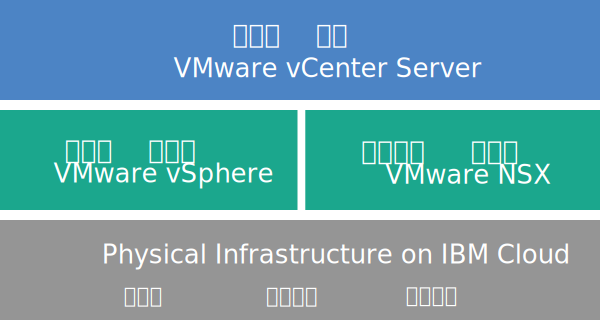

---

copyright:

  years:  2016, 2018

lastupdated: "2018-06-22"

---

# vCenter Server 개요

VMware vCenter Server on {{site.data.keyword.cloud}}는 서비스로 VMware vSphere 스택을 제공하는 호스팅된 프라이빗 클라우드입니다. VMware 환경은 최소 두 개(세 개 권장)의 {{site.data.keyword.cloud_notm}} {{site.data.keyword.baremetal_short}} 맨 위에 빌드되고, 공유 네트워크 연결 스토리지와 전용 소프트웨어 정의 스토리지 옵션을 제공하며, VMware 환경에는 자동화 배치와 VMware NSX로 작동되며 관리하기 쉬운 논리 에지 방화벽의 구성이 포함됩니다.

대부분의 경우 전체 환경은 하루 내에 프로비저닝할 수 있으며, 베어메탈 인프라는 필요에 따라 신속하고 탄력적으로 컴퓨팅 용량을 늘리거나 줄이도록 스케일링할 수 있습니다.

배치 후 {{site.data.keyword.slportal}}에서 추가 NFS(Network File System) 파일 공유를 주문하여 공유 스토리지를 늘릴 수 있고 클러스터의 모든 ESXi 서버에서 해당 파일 공유를 수동으로 연결할 수 있습니다. 전용 스토리지가 필요한 경우 [NetApp ONTAP Select on IBM Cloud](../netapp/np_netappoverview.html)가 고성능(모든 SSD) 및 고용량(모든 SATA) 구성 모두에 제공됩니다.

또한 VMware vSAN은 전용 스토리지 옵션으로도 사용할 수 있습니다. vSAN 클러스터의 vSAN 기반 스토리지 용량을 늘리기 위해 배치 후 더 많은 ESXi 서버를 추가할 수 있습니다.

IBM 제공 VMware 라이센스를 구매한 경우, VMware NSX Base 에디션을 Advanced 또는 Enterprise 에디션으로 업그레이드할 수 있고 VMware vRealize Operations와 같은 추가 VMware 컴포넌트를 구매할 수 있습니다.

가상화, 게스트 OS 또는 애플리케이션 계층의 일일 오퍼레이션 및 유지보수를 오프로드하려면 IBM Managed Services를 추가할 수 있습니다. 또한 IBM Cloud Professional Services 팀은 마이그레이션, 구현, 계획 및 온보딩 서비스를 통해 클라우드로 빨리 전환할 수 있도록 지원합니다.

## vCenter Server 아키텍처

다음 그림은 세 개의 노드 vCenter 배치의 상위 레벨 아키텍처 및 컴포넌트에 대해 설명합니다.

그림 1. 세 개의 노드 클러스터에 대한 vCenter Server 상위 레벨 아키텍처

### 실제 인프라

이 계층은 가상 인프라에서 사용할 실제 인프라(컴퓨팅, 스토리지 및 네트워크 리소스)를 제공합니다.

### 가상화 인프라(컴퓨팅 및 네트워크)

이 계층은 다른 VMware 제품을 통해 실제 인프라를 가상화합니다.
* VMware vSphere는 실제 컴퓨팅 리소스를 가상화합니다.
* VMware NSX는 논리 네트워킹 컴포넌트 및 가상 네트워크를 제공하는 네트워크 가상화 플랫폼입니다.

### 가상화 관리

이 계층은 vCSA(vCenter Server Appliance), NSX Manager, 두 개의 NSX ESG, 세 개의 NSX Controller, PSC(Platform Services Controller) 가상 어플라이언스 및 IBM CloudDriver 가상 머신으로 구성됩니다.

기본 오퍼링은 최대 400개의 호스트와 최대 4000개의 VM이 포함된 환경을 지원하도록 크기가 조정된 vCenter Server 어플라이언스로 배치됩니다. 동일한 vSphere API 호환 도구 및 스크립트는 IBM 호스팅 VMware 환경을 관리하는 데 사용될 수 있습니다.

기본 오퍼링에는 가상화 관리 계층에 대해 예약된 총 38개의 vCPU와 67GB vRAM이 필요합니다. VM에 남아 있는 호스트 용량은 초과 구독 비율, VM 크기 조정 및 워크로드 성능 요구사항과 같은 여러 요인에 따라 달라집니다.

아키텍처에 대한 세부사항은 [{{site.data.keyword.vmwaresolutions_full}} 아키텍처 참조](../archiref/solution/solution_overview.html)를 참조하십시오. 

## vCenter Server 기술 스펙

다음 컴포넌트는 vCenter Server 인스턴스에 포함됩니다.

**참고**: 표준화된 하드웨어 구성의 가용성 및 가격 책정은 배치에 선택된 {{site.data.keyword.CloudDataCent_notm}}에 따라 달라질 수 있습니다.

### Bare Metal Server

다음 구성 중 하나로 세 개 이상의 {{site.data.keyword.baremetal_short}}를 주문할 수 있습니다.
*  **사용자 정의됨**: 사용자가 선택한 CPU 모델 및 RAM 크기를 사용하는 {{site.data.keyword.baremetal_short}}입니다.   
   * 2CPU Intel Broadwell 세대(Intel Xeon E5-2600 v4 시리즈)
   * 2CPU Intel Skylake 세대(Intel Xeon 4100/5100/6100 시리즈)

     **참고:** vSAN 스토리지를 사용하려는 경우 구성에 4개의 {{site.data.keyword.baremetal_short}}가 필요합니다.
*  **사전 구성됨**: 2CPU Intel Broadwell 세대(Intel Xeon E5-2600 v4 시리즈)
   * **소형**(듀얼 Intel Xeon E5-2620 v4 / 총 16개의 코어, 2.1GHz / 128GB RAM / 2개의 디스크)
   * **중형**(듀얼 Intel Xeon E5-2650 v4 / 총 24개의 코어, 2.2GHz / 256GB RAM / 2개의 디스크)
   * **대형**(듀얼 Intel Xeon E5-2690 v4 / 총 28개의 코어, 2.6GHz / 512GB RAM / 2개의 디스크)

### 네트워킹

다음 네트워킹 컴포넌트가 주문됩니다.
*  10Gbps 듀얼 공용 및 사설 네트워크 업링크
*  세 개의 VLAN(Virtual LANs): 한 개의 공인 VLAN 및 두 개의 사설 VLAN
*  계층 2(L2) 네트워크에 연결된 로컬 워크로드 간의 잠재적인 동쪽-서쪽 통신을 위해 DLR(Distributed Logical Router)이 포함된 하나의 VXLAN(Virtual eXtensible LAN). VXLAN은 VXLAN을 수정하거나 VXLAN에 빌드하거나 VXLAN을 제거할 수 있는 샘플 라우팅 토폴로지로 배치됩니다. 또한 추가 VXLAN을 연결하여 DLR의 새 논리 인터페이스에 보안 구역을 추가할 수 있습니다.
*  두 개의 VMware NSX Edge Services Gateway:
  * 관리 네트워킹 토폴로지의 일부로 IBM에서 배치되는 아웃바운드 HTTPS 관리 트래픽을 위한 보안 관리 서비스 VMware NSX Edge Services Gateway(ESG). 이 ESG는 자동화와 관련된 특정 외부 IBM 관리 컴포넌트와 통신하기 위해 IBM 관리 가상 머신에서 사용됩니다. 자세한 정보는 [고객 관리 ESG를 사용하도록 네트워크 구성](../vcenter/vc_esg_config.html#configuring-your-network-to-use-the-customer-managed-nsx-esg-with-your-vms)을 참조하십시오.

    **중요**: 이 ESG에 액세스할 수 없고 ESG를 사용할 수 없습니다. 수정하는 경우 {{site.data.keyword.vmwaresolutions_short}} 콘솔에서 vCenter Server 인스턴스를 관리하지 못할 수 있습니다. 또한 방화벽을 사용하거나 외부 IBM 관리 컴포넌트와의 ESG 통신을 사용 안함으로 설정하면 {{site.data.keyword.vmwaresolutions_short}}를 사용할 수 없게 됩니다.
  * VPN 액세스 또는 공용 액세스를 제공하도록 사용자가 수정할 수 있는 템플리트로 IBM에서 배치되는 아웃바운드 및 인바운드 HTTPS 워크로드 트래픽을 위한 보안 고객 관리 VMware NSX Edge Services Gateway. 자세한 정보는 [고객 관리 NSX Edge는 보안 문제점을 발생시킵니까?](../vmonic/faq.html#does-the-customer-managed-nsx-edge-pose-a-security-risk-)를 참조하십시오.

### Virtual Server 인스턴스

다음 VSI(Virtual Server Instance)가 주문됩니다.
* 인스턴스 배치가 완료된 후 시스템이 종료되는 IBM CloudBuilder용 VSI
* (인스턴스 V2.2 이상의 경우) 보안 및 강력한 추진력 향상을 위해 하나의 Microsoft Active Directory(AD)용 Microsoft Windows Server VSI 또는 관리 클러스터에 있는 두 개의 고가용성 Microsoft Windows VM을 배치하도록 선택할 수 있습니다.
* (인스턴스 V1.9 - V2.1의 경우) 호스트 및 가상 머신이 등록된 인스턴스를 위한 DNS로 작동하는 Microsoft Active Directory(AD)용 Microsoft Windows Server VSI가 배치되고 검색될 수 있습니다.
* (인스턴스 V1.8 이전의 경우) 인스턴스 배치가 완료된 후 계속 실행되는 관리 컴포넌트의 스냅샷 기반 백업용 VSI

### 스토리지

초기 배치 중에 vSAN과 NFS 스토리지 옵션 중에서 선택할 수 있습니다.

vSAN 옵션은 디스크 유형과 양에 대한 다양한 옵션을 포함하여 사용자 정의된 구성을 제공합니다.
* 디스크 양: 2, 4, 6 또는 8
* 스토리지 디스크: 960GB SSD SED, 1.9TB SSD SED 또는 3.8TB SSD SED

  또한 호스트당 960GB의 두 가지 캐시 디스크도 주문됩니다.

  **참고:** 3.8TB SSD(Solid State Disk) 드라이브는 일반적으로 데이터 센터에서 사용 가능할 때 지원됩니다.

NFS 옵션은 크기 및 성능에 대한 다양한 옵션을 포함하여 워크로드의 사용자 정의된 공유 파일 레벨 스토리지를 제공합니다.
* 크기: 1, 2, 4, 8 또는 12TB
* 성능: 2, 4 또는 10IOPS/GB.
* 파일 공유의 개별 구성

NFS 옵션을 선택한 경우 다음 파일 공유가 주문됩니다.
* 관리 컴포넌트용 한 개의 2TB, 4IOPS/GB 파일 공유
* 최대 12TB까지 스케일링할 수 있는 백업용 하나의 2TB 공유 블록 레벨 스토리지. 백업 서비스를 선택하여 백업용 스토리지의 사용 여부를 선택할 수 있습니다.

### 라이센스(IBM 제공 또는 BYOL) 및 요금

* VMware vSphere Enterprise Plus 6.5u1
* VMware vCenter Server 6.5
* VMware NSX Service Providers Edition(Base, Advanced 또는 Enterprise) 6.3
* (vSAN 클러스터의 경우) VMware vSAN Advanced 또는 Enterprise 6.6
* 지원 및 서비스 요금(노드당 한 개의 라이센스)

## vCenter Server 확장 노드 컴포넌트

각 vCenter Server 확장 노드가 배치되고 {{site.data.keyword.cloud_notm}} 계정에서 다음 컴포넌트에 대한 비용이 발생합니다.

### 확장 노드를 위한 하드웨어

[vCenter Server 개요](vc_vcenterserveroverview.html)의 _vCenter Server 기술 스펙_ 섹션에 제시된 구성을 포함하는 하나의 Bare Metal Server.

### 확장 노드의 라이센스 및 요금

* 하나의 VMware vSphere Enterprise Plus 6.5u1
* 하나의 VMware NSX Service Providers Edition(Base, Advanced 또는 Enterprise) 6.3
* 하나의 지원 및 서비스 요금
* (vSAN 클러스터의 경우) VMware vSAN Advanced 또는 Enterprise 6.6

**중요**: {{site.data.keyword.slportal_full}} 또는 콘솔 외부의 다른 방법이 아닌 {{site.data.keyword.vmwaresolutions_short}} 콘솔의 {{site.data.keyword.cloud_notm}} 계정에서만 작성된 {{site.data.keyword.vmwaresolutions_short}} 컴포넌트를 관리해야 합니다. {{site.data.keyword.vmwaresolutions_short}} 콘솔 외부에서 컴포넌트를 변경하는 경우 변경사항은 콘솔과 동기화되지 않습니다.

**주의**: 인스턴스를 주문했을 때 {{site.data.keyword.cloud_notm}} 계정에 설치된 {{site.data.keyword.vmwaresolutions_short}} 컴포넌트를 {{site.data.keyword.vmwaresolutions_short}} 콘솔 외부에서 관리하면 환경이 불안정해질 수 있습니다. 이러한 관리 활동에는 다음이 포함됩니다.
*  컴포넌트 추가, 수정, 리턴 또는 제거
*  ESXi 서버 추가 또는 제거를 통한 인스턴스 용량의 확장 또는 축소
*  컴포넌트 전원 끄기
*  서비스 다시 시작

   이 활동에 대한 예외에는 {{site.data.keyword.slportal}}의 공유 스토리지 파일 공유 관리가 포함됩니다. 이러한 활동에는 공유 스토리지 파일 공유 주문, 삭제(마운트된 경우 데이터 저장소에 영향을 줄 수 있음), 권한 부여 및 마운트가 포함됩니다.

## 관련 링크

* [vCenter Server 소프트웨어 명세서](vc_bom.html)
* [vCenter Server 인스턴스 계획](vc_planning.html)
* [vCenter Server 인스턴스 주문](vc_orderinginstance.html)
* [{{site.data.keyword.cloud_notm}} file and block storage](https://www.ibm.com/cloud/garage/content/architecture/virtualizationArchitecture/shared-storage){:new_window}
