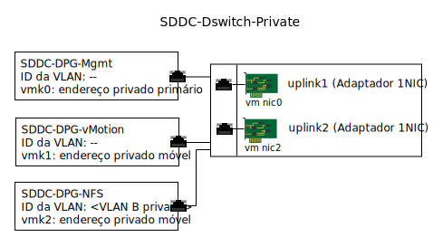

---

copyright:

  years:  2016, 2019

lastupdated: "2019-02-13"

---

{:tip: .tip}
{:note: .note}
{:important: .important}

# Gerenciamento de infra-estrutura de armazenamento anex
{: #storage-infra-mgmt}

Gerenciamento de infraestrutura refere-se aos componentes do VMware que estão gerenciando a infraestrutura do vSphere ESXi.

Para obter mais informações sobre os componentes, veja a Figura 2. Visão geral da rede do NSX Manager em [Design de infraestrutura virtual](/docs/services/vmwaresolutions/archiref/solution?topic=vmware-solutions-design_virtualinfrastructure).

## Design de rede virtual
{: #storage-infra-mgmt-visual-net-design}

A virtualização de rede que é usada nesse design usa o vSphere Distributed Switch (vDS) existente associado à rede privada e especificado na [Arquitetura do {{site.data.keyword.vmwaresolutions_full}}](/docs/services/vmwaresolutions/archiref/solution?topic=vmware-solutions-solution_overview).

## Comutador Distribuído do vSphere
{: #storage-infra-mgmt-vsphere-ds}

Outra VLAN é criada dentro da solução vCenter Server e usada para conectar o ponto de montagem NFS aos hosts ESXi no cluster existente. Como a solução vCenter Server tem um vSphere Distributed Switch associado à rede privada, outro grupo de portas é criado e identificado com o número de VLAN adicional, já que essa VLAN adicional não é nativa.

A tabela a seguir descreve as configurações padrão do novo grupo de portas.

Não mude essas configurações padrão.
{:important}

Tabela 1. Resumo do grupo da porta NFS

| Nome do Grupo da Porta | SDDC-DPG-NFS |
|:--------------- |:------------ |
| Ligação de porta | Estático |
| Tipo de VLAN | VLAN B privada |
| Balanceamento de | Rotear base na porta virtual de origem |
| Uplinks Ativos | Uplink1 e uplink2 |

Além da criação do grupo de portas do vDS para tráfego de armazenamento NFS, uma porta VMkernel é criada em cada host ESXi vSphere durante a implementação e designada ao grupo de portas SDDC-DPG-NFS. Um endereço IP também é designado à porta VMkernel por meio da sub-rede móvel privada que está associada à VLAN do armazenamento conectado, ou seja, a VLAN B privada B e sua MTU é configurada como 9000 para suportar quadros gigantes.

Figura 1. Grupos de portas e uplinks do vDS privado

### roteamento estático do host vSphere
{: #storage-infra-mgmt-vsphere-routing}

Embora o vDS seja configurado com um novo grupo de portas e uma porta VMkernel seja designada ao grupo de portas, a solução cria uma rota estática em cada host do vSphere ESXi na implementação para que todo o tráfego do NFS atravesse a VLAN e a sub-rede para o NFS. A rota estática é criada em `/etc/rc.local.d/local.sh` para que persista em reinicializações do host.

## Links relacionados
{: #storage-infra-mgmt-related}

* [Visão geral da solução](/docs/services/vmwaresolutions/archiref/solution?topic=vmware-solutions-solution_overview)
