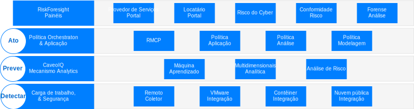
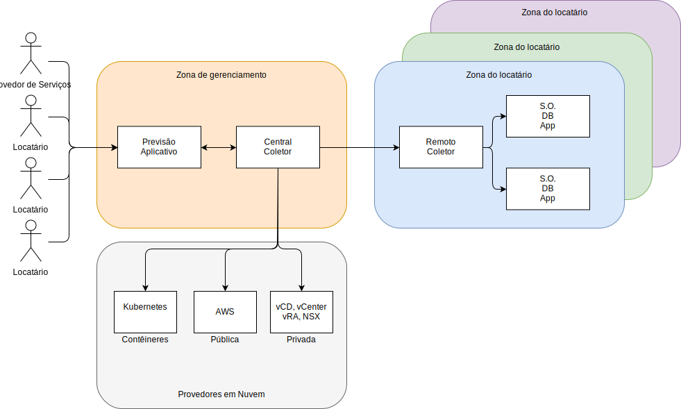

---

copyright:

  years:  2016, 2019

lastupdated: "2019-02-14"

---

# Visão geral da arquitetura para o Caveonix RiskForesight
{: #caveonix-arch}

A arquitetura do Caveonix RiskForesight é mostrada no diagrama a seguir.

Figura 1. Arquitetura do Caveonix RiskForesight

A Caveonix RiskForesight architecture tem quatro camadas:
-	Detectar - O módulo Detectar é totalmente integrado à pilha do VMware e a muitas nuvens públicas. Usando plug-ins, o RiskForesight usa o vCenter e o NSX Manager como Repositórios de ativos, coletando detalhes em máquinas virtuais (MVs), redes e fluxos de rede. Os Remote Collectors varrem cargas de trabalho, sistemas operacionais e aplicativos para permitir uma visualização de "pilha completa" de conformidade e vulnerabilidades.
-	Prever - O módulo Prever usa análise de dados para identificar ativos de risco e etapas de mitigação com modelos de redução de risco para melhorar a postura de risco.
-	Agir - O módulo Agir implementa as etapas de mitigação com base na priorização e nas ações de proteção automatizadas para fornecer proteção proativa de carga de trabalho contra riscos causados por ameaças cibernéticas.
    - RMCP - O Risk Management Control Plane (RMCP) fornece proteção contínua e proativa das cargas de trabalho, monitorando a pilha completa em data centers de nuvem privada, pública e gerenciada.
    - Gerente de política - Atualmente suporta três tipos de tarefas de aprendizado de máquina por organização: Logs do Caveo, Redes do Caveo, Varredura do Caveo. Com base nas anomalias localizadas nos dados, o usuário pode configurar as políticas para agir com base nas condições definidas pelo usuário, selecionar o tipo de tarefa, configurar condições booleanas para a pontuação de Anomalia e definir a ação quando a condição for verdadeira. Por exemplo:
        - Tarefa: a pontuação de Anomalia de "Logs de Caveo" é > 90, então marque o ativo para quarentena e envie uma notificação para o Canal slack.
        - Tarefa: a pontuação de anomalia da "Caveo Network" é > 95, então coloque o ativo em quarentena e envie uma notificação
por e-mail e uma notificação de IU.
- Painéis - Os painéis, por meio de acesso baseado em função, fornecem a capacidade para um provedor de serviços, como um departamento de TI, alocar ativos de TI para locatários ou unidades de negócios. As unidades de negócios, então, designam esses ativos de TI aos aplicativos. Esses aplicativos correspondem aos serviços de negócios e de TI, estão sujeitos a uma Avaliação do impacto nos negócios e estão sujeitos a um regime de conformidade, como: NIST, NESA, PCI, ISO e HIPAA. Esses aplicativos ficam, então, sujeitos a uma série de varreduras, como vulnerabilidade, fluxos de NSX, software e dados de log para produzir visibilidade ao que está em execução e o risco cibernético e de conformidade associado ao aplicativo. Realizando drill down por meio desses painéis, os usuários de conformidade e de segurança podem ver uma lista priorizada de ações a serem minimizadas e ativar ações de cumprimento automatizáveis nos módulos Prever e Agir. O RiskForesight fornece um painel unificado para identificar ativos na nuvem híbrida e uma análise de heat map para riscos cibernéticos, riscos de configuração de conformidade, tendências importantes e métricas de operação de segurança. Ele permite que os usuários determinem rapidamente a natureza e a localização dos riscos e quais ações devem ser executadas, as quais usam uma ferramenta de visualização intuitiva e poderosa. Esses painéis fornecem:
  - Uma visualização priorizada do risco cibernético e dos riscos de conformidade na nuvem híbrida com as visualizações dos painéis Detectar, Prever e Agir.
  - A capacidade de um usuário interagir visualmente com os dados para identificar ativos em risco com rapidez, com base em prioridades de risco.
  - Gráficos, métricas e filtros fáceis de usar para desenvolver insight nos riscos identificados.
  - Drill downs interativos para maior profundidade de informações em fluxos de dados do aplicativo, vulnerabilidades ou problemas de configuração em locais, organizações, aplicativos e ativos.
  - Permitir que o usuário desenvolva um conhecimento completo da pilha operacional, que inclui infraestrutura, plataforma, aplicativo e dados.
  - A capacidade de visualizar e aplicar políticas para segmentação de redes, máquinas virtuais ou aplicativos na nuvem híbrida.

## Zones
{: #caveonix-arch-zones}

O Caveonix RiskForesight tem o conceito de zonas:

Figura 2. Zonas do Caveonix RiskForesight

-	Zona de gerenciamento ou do provedor de serviços - A zona de gerenciamento ou do provedor de serviços inclui os componentes a seguir:
    - Aplicativo RiskForesight - Contém vários componentes e é descrito em detalhes na seção Componentes do aplicativo.
    - Central Collector - Coleta informações dos provedores em nuvem e das zonas do locatário.
- Provedores em nuvem - Essa zona fornece a infraestrutura na qual os aplicativos são hospedados:
    - Privado - VMware on {{site.data.keyword.cloud}} e plataformas de infraestrutura do VMware no local. Essas plataformas são integradas ao RiskForesight por meio do: vCenter, NSX Manager, VMware Cloud Director (vCD) ou vRealize Automation (vRA).
    - Público - Atualmente, o único provedor em nuvem pública suportado é o AWS. O {{site.data.keyword.cloud_notm}}  está disponível em breve.
    - Contêineres - Atualmente, apenas o AWS Elastic Kubernetes Service (EKS) é suportado. O {{site.data.keyword.cloud_notm}} Private e o {{site.data.keyword.cloud_notm}} Kubernetes Services (IKS) estarão disponíveis em breve.
-	Zona de ambiente do locatário ou do cliente - Essas zonas são usadas para segregar locatários, clientes ou unidades de negócios. Existem cargas de trabalho nessas zonas e, portanto, é necessário um Remote Collector. Para uma implementação mínima, é necessário um Remote Collector, mas, para uma implementação geral, é necessário um Remote Collector por locatário/cliente/unidade de negócios.

## Links relacionados
{: #caveonix-arch-related}

*   [VMware vCenter Server on {{site.data.keyword.cloud_notm}} with Hybridity Bundle](/docs/services/vmwaresolutions/archiref/vcs/vcs-hybridity-intro.html)
*   [ Design Detalhado do Caveonix ](/docs/services/vmwaresolutions/archiref/caveonix/caveonix-detailed.html)
