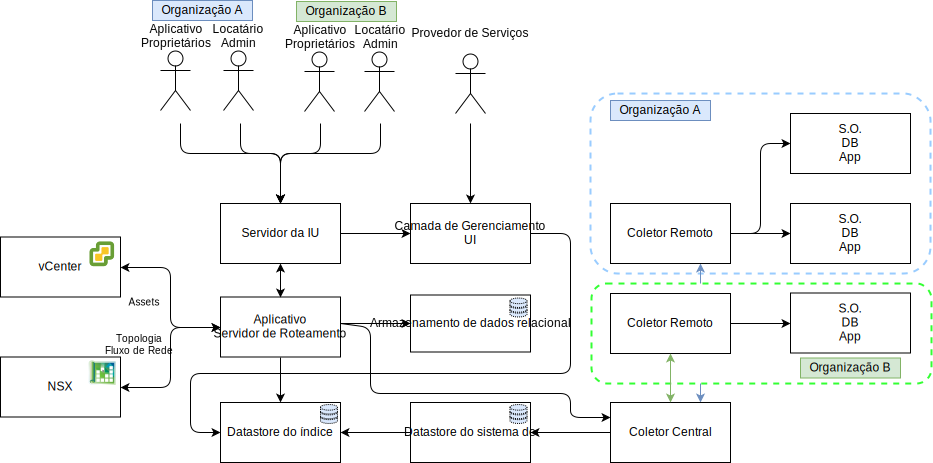

---

copyright:

  years:  2016, 2019

lastupdated: "2019-03-05"

---

# Design Detalhado
{: #caveonix-detailed}

O diagrama e as descrições a seguir fornecem informações sobre os componentes do aplicativo RiskForesight.

Figura 1. Componentes de aplicativo

-	Interface gráfica com o usuário - interface da web que pode ser usada para acessar o aplicativo RiskForesight.
-	Central Collector - Coleta diferentes tipos de carga útil de dados que vêm dos plug-ins e os disponibiliza no armazenamento de sistema de mensagens. O RiskForesight suporta os tipos de cargas úteis a seguir:
    - Varredura
    - Registros
    - Netflows
    - Software
    - Metadados de carga
- Central Router - Gerencia todos os pontos de contato de integração com a camada de Orquestração do VMware. Todos os plug-ins do RiskForesight devem se comunicar com o Central Router para obter autorização para se comunicar com o ecossistema do RiskForesight.
-	API Server- É o middleware do terminal de REST que conecta a GUI e os armazenamentos de dados de back-end. Além disso, ele valida as solicitações de acesso do usuário e gerencia o RBAC.
-	vCenter Data Collector - O plug-in extrai os detalhes da máquina virtual (MV) do vCenter. O plug-in genérico usa as APIs do VMware para se conectar ao vCenter e extrai informações relevantes da carga de trabalho. Após a disponibilização das informações, o plug-in empacotará a carga útil e a enviará para o Coletor central.
-	vCD Data Collector - O plug-in extrai os detalhes da MV do VMware vCloud Director. O plug-in genérico usa as APIs do VMware para se conectar ao VMware vCloud Director e extrai as informações relacionadas à carga de trabalho. Após a disponibilização das informações, o plug-in empacotará a carga útil e a enviará para o Coletor central.
-	vCD Network Data Collector - O plug-in extrai detalhes do Netflow do VMware vCD. O plug-in genérico usa as APIs do VMware para se conectar ao VMware NSX e extrair Rede, FW, Regras de segurança e Grupos de segurança. Após a disponibilização das informações, o plug-in empacotará a carga útil e a enviará para o Central Collector.
-	Network Data Collector - Um plug-in que extrai detalhes do Netflow do VMware vCenter. O plug-in genérico usa APIs do VMware para se conectar ao VMware NSX e extrair informações de rede, de firewall, de regras de segurança e de grupos de segurança. Após a disponibilização das informações, o plug-in empacotará a carga útil e a enviará para o Coletor central.
-	Remote Collector - Reside no ambiente do locatário ou em outro local no qual ele tem acesso de rede a MVs do locatário. Ele manipula toda a conformidade e varredura de risco cibernético.
-	Relational Datastore - mantém os tipos de metadados a seguir:
    - Provedor de serviço de nuvem
    - Locatário
    - Assets
    - Resultados da Varredura
    - Software
    - Conjunto de dados agregados diários ou semanais
- Messaging Datastore - O RiskForesight usa a fila do sistema de mensagens persistente para fornecer perda de dados zero e pressão de retorno de transferência para os componentes.
- Index Datastore - Indexa e armazena os dados brutos recebidos para cada locatário para análise adicional para suportar o recurso de vários locatários.
- Plug-ins - Residem no servidor de roteamento de aplicativo e incluem a configuração e a integração com os componentes do VMware para sincronizar todas as VMs juntamente com suas informações de locatário.

A tabela a seguir mostra as portas e os protocolos necessários para cada componente.

Tabela 1. Portas e protocolos

|Componente	|Protocolo / Portas|
|---|---|
|UI|443|
|API|443, 1337|
|RiskForesight|8082, 8083, 8084|
|Coletor Central (Cluster)|8080|
|Coletor Remoto|8081|
|Armazenamento de Dados Relacional Primário ou Secundário|5432|
|Cluster do Datastore do Sistema de|9092|
|Nós do mestre do armazenamento de dados de índice|9200, 9300, 5601, 443|

O diagrama a seguir mostra a topologia de rede com a sub-rede privada móvel do Caveonix que está associada à VLAN privada A. Você é responsável por gerenciar o espaço de endereço IP dessa sub-rede para que seja possível ampliar manualmente do modelo de implementação "tudo em um" para o totalmente distribuído, por meio do modelo parcialmente distribuído, conforme necessário.

Figura 2. Diagrama de rede  

As designações de VLAN da sub-rede IP são descritas na tabela a seguir.

Tabela 2. VLAN e sub-redes

|VLAN 	|Tipo de sub-rede 	|Descrição|
|---|---|---|
|Pública 	|Primária 	|Designada a hosts físicos para acesso à rede pública. Não usada na implementação inicial.|
|Pública	|Móvel 	|Designada ao uso de uplink e NAT no customer-nsx-esg.|
|Pública	|Móvel 	|Designada ao uso de NAT de uplink no mgmt-nsx-esg.|
|Pública	|Móvel 	|Designada para uso do NAT de uplink no hcx-mgmt-esg, caso o pacote configurável Hybridity seja selecionado.|
|Privada A 	|Primária 	|Designada aos hosts físicos designados pelo {{site.data.keyword.cloud}}. Usada pela interface de gerenciamento para o tráfego de gerenciamento do vSphere.|
|Privada A 	|Móvel 	|Designada a MVs que funcionam como componentes de gerenciamento.|
|Privada A 	|Móvel 	|Designada ao NSX VTEP.|
|Privada A 	|Móvel 	|Designada ao HCX para uso interno, caso o pacote configurável do Hybridity seja selecionado.|
|Privada A 	|Móvel 	|Designada ao uso de uplink no customer-nsx-esg.|
|Privada A 	|Móvel 	|Designada ao HCX, caso o pacote configurável Hybridity seja selecionado.|
|Privada A 	|Móvel 	|Designada ao Zerto VRAs, caso a opção Zerto seja selecionada.|
|Privada A 	|Móvel 	|Designada ao Caveonix RiskForesight, caso a opção Caveonix seja selecionada.|
|Privada B	|Primária	|Não usada na implementação inicial.|
|Privada B 	|Móvel 	|Designado para vSAN, se em uso.|
|Privada B 	|Móvel 	|Designado para o NAS, se em uso.|
|Privada B 	|Móvel 	|Designada ao vMotion.|

## Links relacionados
{: #caveonix-detailed-related}

* [VMware vCenter Server on {{site.data.keyword.cloud_notm}} with Hybridity Bundle](/docs/services/vmwaresolutions/archiref/vcs?topic=vmware-solutions-vcs-hybridity-intro)
