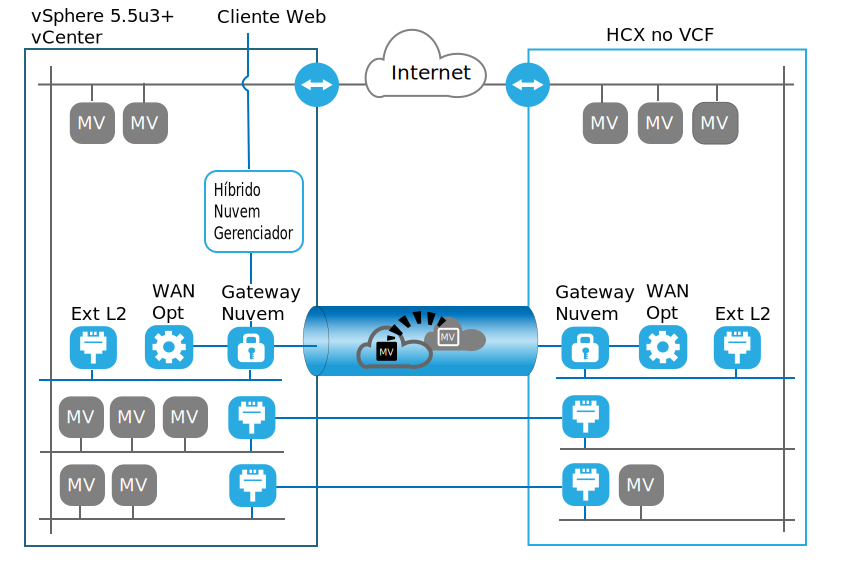

---

copyright:

  years:  2016, 2019

lastupdated: "2019-06-17"

subcollection: vmware-solutions

---
# Introdução ao VMware HCX on IBM Cloud
{: #hcx-archi-intro}

O serviço VMware HCX on IBM Cloud permite a criação de uma conexão contínua entre as instâncias do IBM Cloud for VMware Solutions e um data center virtualizado do VMware no local.

O IBM Cloud for VMware Solutions inclui implementações rápidas e totalmente automatizadas do VMware vCenter Server no IBM Cloud. Essas ofertas complementam a infraestrutura no local e permitem que as cargas de trabalho existentes e futuras sejam executadas no IBM Cloud sem conversão usando as mesmas ferramentas, qualificações e processos que elas usam no local. Para obter mais informações, consulte a [Virtualização para ampliar a nuvem particular virtualizada](https://www.ibm.com/cloud/garage/architectures/virtualizationArchitecture).

O serviço VMware HCX on IBM Cloud usa essa hibridação para a próxima etapa, misturando instâncias do vCenter Server com datacenters virtualizados existentes no local, ativando a criação de extensões de rede contínuas e a migração bidirecional de cargas de trabalho.

Os componentes do VMware HCX on IBM Cloud implementados como máquinas virtuais no site de destino do IBM Cloud VMware permitem o estabelecimento de uma conexão com os componentes do VMware HCX on IBM Cloud instalados no site de origem no local do peer.

Essa conexão cria uma interconectividade fracamente acoplada entre no local e o IBM Cloud e permite recursos, como:
* Interconectividade simples - conexões de rede lógica são estabelecidas facilmente sobre qualquer conexão física, como a Internet pública, a VPN privada ou o link direto.
* Extensão da camada 2 - as redes no local são estendidas para a nuvem. Essas redes incluem sub-redes no local e endereçamento IP.
* Criptografia – o tráfego de rede é criptografado com segurança entre os dois
lados.
* Rede otimizada – seleciona a melhor conexão e faz com que, de maneira eficiente, ela tenha uma sobrecarga a fim de que o tráfego da rede seja movido o mais rápido possível.
* Deduplicação de dados - uma redução de até 50% no tráfego de rede pode ser alcançada no roteamento Inteligente - quando uma carga de trabalho é movida, o roteamento de proximidade pode mudar o caminho de rede (ou seja, gateway) para que o tráfego de rede use o gateway do site de destino e não faça "hairpin" de volta ao site de origem.
* Migração de tempo de inatividade zero - um sistema em execução pode ser movido para e de volta da nuvem usando o vMotion.
* Migração planejada - qualquer número de máquinas virtuais pode ser replicado para o site de destino e, em seguida, ativado nesse site em um horário designado, que substitui os sistemas que estão em execução no site de origem.
* Migração de políticas de segurança - se o NSX for usado no local, quaisquer políticas de segurança ou firewalls serão
movidos junto com a carga de trabalho.

## Links relacionados
{: #hcx-archi-intro-related}

* [Virtualização para ampliar a nuvem particular virtualizada](https://www.ibm.com/cloud/garage/architectures/virtualizationArchitecture)
