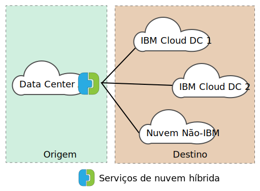
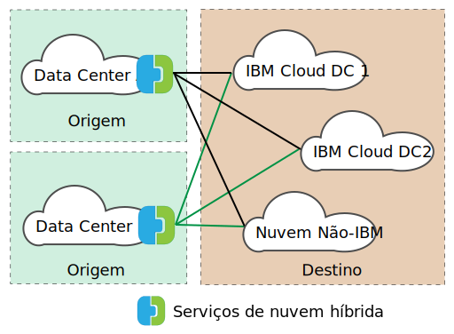

---

copyright:

  years:  2016, 2019

lastupdated: "2019-01-23"

---
# VMware HCX on IBM Cloud Visão Geral

O VMware HCX on IBM Cloud integra de forma contínua as redes do vSphere® vCenter™ no local a implementações do IBM Cloud for VMware Solutions. A rede híbrida amplia as redes do vSphere vCenter no local para o IBM Cloud, suportando a mobilidade bidirecional da máquina virtual (MV).

O HCX possui os processos de criptografia e decriptografia de origem e de destino, garantindo uma segurança consistente e fornecendo admissão para fluxos de trabalho híbridos, como migração da máquina virtual e extensão de rede.

Essa oferta cria uma WAN otimizada, definida por software, para aumentar o desempenho da rede estendida, permitindo o desempenho que se aproxima da velocidade da LAN. O HCX também permite a carga de trabalho bidirecional e a migração de política de segurança do VMware NSX® para o IBM Cloud. O HCX integra-se ao vSphere vCenter e é gerenciado por meio do vSphere Web Client.

## Extensão de rede da camada 2

O HCX permite que um estado existente do vSphere no local estenda com segurança uma rede de seu vCenter no local para um data center do IBM Cloud que executa o VMware Cloud Foundation ou o vCenter Server. Esse recurso é ativado pelos itens a seguir:
* O HCX fornece um dispositivo chamado Layer 2 Concentrator (L2C).
* As redes estendidas são vinculadas aos dispositivos de borda do IBM Cloud NSX implementados no VMware Cloud Foundation ou no vCenter Server.
* É possível implementar múltiplos Layer 2 Concentrators padrão para alcançar a escalabilidade e aumentar o rendimento do vCenter no local.
* As máquinas virtuais migradas por meio do Cloud Gateway e pela Camada 2 estendida podem reter seus endereços IP e de Controle de Acesso à Mídia.

## Migração da máquina virtual

O HCX fornece três métodos de movimento de máquinas virtuais: migração de tempo de inatividade baixo, migração do vSphere vMotion e migração fria.

### Migração baixa de tempo de in

A migração de tempo de inatividade baixo depende do vSphere Replication, que é uma tecnologia distribuída implementada no hypervisor VMware ESX®/ESXi®. A implementação do HCX no local cria uma réplica de uma máquina virtual em tempo real no IBM Cloud e executa uma comutação para desligar a máquina virtual de origem e ligar a máquina virtual migrada.

O caminho de migração é sempre por meio do Cloud Gateway. O transporte pode ser a Internet, uma rede estendida da Camada 2 ou uma linha de Conexão direta.

Uma máquina virtual pode ser migrada várias vezes em qualquer direção.

### Migração do vMotion

As máquinas virtuais em tempo real podem ser transferidas usando a migração do vMotion em uma rede que é estendida para o IBM Cloud. A migração do vMotion também é chamada de migração de tempo de inatividade zero ou vMotion entre nuvens.

### Migração fria

Com a migração fria, é possível transferir uma MV desligada para o IBM Cloud por meio de uma rede estendida que é criada usando o Layer 2 Concentrator.

### Recursos comuns de migração

Outros recursos disponíveis nos três tipos de migração incluem o WAN Optimization definido por software que aumenta o rendimento e a velocidade de migração. Além disso, a migração pode ser planejada para ocorrer em um horário especificado e manter o nome do host, o nome da máquina virtual ou ambos.

## Rede

Os recursos de rede a seguir são construídos no Cloud Gateway e nos Layer 2 Concentrators.

### Roteamento de Fluxo Inteligente

Esse recurso seleciona automaticamente a melhor conexão com base no caminho da Internet, inundando eficientemente a conexão inteira de modo que as cargas de trabalho sejam movidas o mais rápido possível. Quando fluxos maiores, como backup ou replicação, causam a contenção de CPU, fluxos menores são roteados para CPUs menos ocupadas, melhorando o desempenho do tráfego interativo.

### Roteamento de Proximidade

O roteamento de proximidade assegura que o encaminhamento entre máquinas virtuais que estão conectadas a redes estendidas e roteadas, tanto no local quanto na nuvem, seja simétrico. Esse recurso requer o Advanced Networks Services with Dynamic Routing que é configurado entre as instalações do cliente e a nuvem.

Quando os usuários estendem suas redes para a nuvem, a conectividade da Camada 2 é estendida para as redes do IBM Cloud. No entanto, sem a otimização de rota, as solicitações de comunicação da Camada 3 devem retornar para a origem de rede no local para serem roteadas. Essa viagem de retorno é chamada _tromboning_ ou _hairpinning_.

O tromboning é ineficiente porque os pacotes devem viajar entre a origem de rede e a Nuvem, mesmo quando as máquinas virtuais de origem e de destino residem na Nuvem.

Além da ineficiência, se o caminho de encaminhamento incluir firewalls stateful ou outro equipamento sequencial que deva ver ambos os lados da conexão, a comunicação poderá falhar. A falha na comunicação da máquina virtual (sem otimização da rota) ocorre quando o caminho de egresso que sai da nuvem pode ser a rede estendida da Camada 2 ou a Rede roteada da organização. A rede local não conhece o "atalho" de rede estendida. Esse problema é chamado de roteamento assimétrico. A solução é ativar o roteamento de proximidade para que a rede no local possa aprender as rotas por meio do IBM Cloud.

O Cloud Gateway mantém um inventário de máquinas virtuais na nuvem. Ele também entende o estado da MV, que pode ser um dos estados a seguir:
* Transferido para o IBM Cloud com vMotion (migração de tempo de inatividade zero).
* Migrados para a nuvem usando a replicação baseada em host (migração de tempo de inatividade baixo).
* Criado na nuvem (em uma rede estendida).

### Segurança

O Cloud Gateway oferece o AES-GCM com IKEv2 compatível com o Conjunto B, a transferência de AES-NI e o controle de admissão baseado em fluxo. O HCX também possui o processo de criptografia e decriptografia de origem e de destino, garantindo segurança e administração consistentes para fluxos de trabalho híbridos, como migração de máquina virtual e extensão de rede. As políticas de segurança que são definidas e designadas a uma máquina virtual no local podem ser migradas com a máquina virtual para o IBM Cloud.

A migração de política está disponível somente sob as condições a seguir:
* O data center local deve estar executando o NSX 6.2.2 ou superior.
* No vSphere, a política de segurança é uma única Seção NSX que pode conter muitas regras.
* É possível nomear um Conjunto de endereços IP ou endereços MAC para participar da política. O nome do Conjunto MAC ou do Conjunto de IP não pode exceder 218 caracteres.
* As regras suportadas especificam os endereços IP da Camada 3 ou Conjuntos de IPs, ou endereços de Controle de Acesso à Mídia da Camada 2 ou Conjuntos de Controle de Acesso à Mídia como a origem ou o destino.

## Componentes do HCX

O serviço VMware HCX on IBM Cloud implementa quatro dispositivos virtuais que estão instalados e configurados no data center no local e no destino do IBM Cloud. Esta seção descreve cada um dos quatro dispositivos virtuais necessários. Opcionalmente, os dispositivos de borda podem ser necessários, dependendo do design de implementação.

### Gerenciador de HCX

O dispositivo virtual HCX Manager é uma extensão para o vCenter local. Ele é implementado como uma máquina virtual e sua estrutura do arquivo contém os outros dispositivos virtuais de serviço híbrido. O HCX Manager supervisiona a implementação e a configuração do Cloud Gateway, dos Layer 2 Concentrators e do dispositivo virtual WAN Optimization no local e dentro do IBM Cloud.

### Gateway de Nuvem Híbrido

O Hybrid Cloud Gateway (CGW) mantém um canal seguro entre o estado do vSphere no local e o IBM Cloud. O HCX usa criptografia avançada para autoinicialização de uma conexão de site para site com o IBM Cloud.

O canal seguro entre o vSphere e o IBM Cloud evita problemas de segurança de "meia milha" de rede. O Cloud Gateway também incorpora a tecnologia de replicação do vSphere para executar a migração bidirecional.

### Otimização de WAN

O dispositivo WAN Optimization é o componente que executa o condicionamento da WAN para reduzir os efeitos de latência. Ele também incorpora a Correção de erro de encaminhamento para negar cenários de perda de pacote e deduplicação de padrões de tráfego redundantes. Juntos, elas reduzem o uso de largura de banda e asseguram o melhor uso da capacidade de rede disponível para expedir a transferência de dados para o IBM Cloud e a partir dele.

É importante observar que a migração da máquina virtual depende da combinação dos dispositivos Cloud Gateway e WAN Optimization para atingir a mobilidade sem paralelo entre o vSphere no local e o IBM Cloud. Além disso, a extensão da Camada 2 se beneficia da otimização de WAN quando o caminho de dados é roteado por meio do Cloud Gateway.

### Concentradores de Camada 2

Os dispositivos Layer 2 concentrators (L2C) permitem a extensão de uma rede da Camada 2 do data center do vSphere no local para o IBM Cloud. Os Layer 2 Concentrators têm duas interfaces:
* Interface de tronco interno - manipula o tráfego da máquina virtual no local para as redes estendidas, usando um mapeamento de ponte translacional para uma rede estendida correspondente no IBM Cloud.
* Interface de uplink - o HCX usa essa interface para enviar o tráfego de sobreposição encapsulado para e do IBM Cloud. Os dados do aplicativo viajam por meio dessa interface.

## Arquitetura de implementação - conectar-se ao IBM Cloud usando a Internet pública

Esta seção descreve o layout dos componentes do HCX dentro do IBM Cloud e com o cliente no local. Nesse design, a arquitetura especifica um modelo hub-and-spoke que existe entre o ambiente de origem e o IBM Cloud. Desse modo, o estado de origem serve como o hub com conexões para diferentes ambientes do IBM Cloud, conforme mostrado na figura a seguir.

Figura 1. HCX com origem única

A origem também pode ser feita dentro do ambiente do IBM Cloud; os spokes são sempre implementações na nuvem dentro desse design, conforme mostrado na figura a seguir.

Figura 2. HCX com múltiplas origens

### Visão Geral de Uso

As tarefas a seguir são concluídas por meio do vSphere Web Client:
* Implemente os dispositivos virtuais HCX e configure os componentes WAN definidos por software.
* Amplie as redes VLAN e VXLAN no local do vCenter no local para o Cloud (IBM Cloud).
* Migre cargas de trabalho para a nuvem e volte.

### Dependências de design de base

Antes que os componentes sejam descritos em mais detalhes, é imperativo entender a implementação base que é necessária como parte deste design.
* O ambiente de origem deve conter uma implementação do vSphere que é gerenciada por um vCenter Server. O vCenter suportado de 5.5U3 ou vCenter 6.0U2 e superior, com ESXi 5.5 ou superior, é necessário para o Hybrid Cloud Services.
* Se o NSX for usado, versão 6.2.2 ou superior. O NSX é necessário para a migração de política.
* Se o cross-cloud vMotion for desejado, as mesmas restrições de afinidade se aplicarão às nuvens como fazem no local.
* O ambiente de origem deve ter um método para se conectar a ambientes de nuvem. Isso inclui acesso à Internet pública ou conexões privadas usando o link do IBM Cloud Direct. As conexões, diferentes da Internet pública, para outros fornecedores de nuvem não serão discutidas.
* As MVs e as redes do ambiente de origem a serem migradas ou estendidas devem estar em grupos de portas dentro de um Comutador Virtual Distribuído ou Comutador Distribuído Virtual Cisco Nexus 1000v.
* O IBM Cloud deve conter pelo menos uma instância de uma implementação do VMware Cloud Foundation ou do vCenter Server.
* Recursos suficientes para os dispositivos virtuais.
* As redes devem permitir que os dispositivos se comuniquem com os dispositivos virtuais locais e remotos e com outras máquinas virtuais.
* Os Requisitos de acesso à porta (Apêndice A) listam as portas que devem ser abertas para que os dispositivos virtuais do Hybrid Cloud Services possam ser instalados com êxito.
* Uma conta de serviço do vSphere com a função de sistema Administrador do vCenter Server designada a ele.
* Espaço em disco suficiente para instalar o Hybrid Cloud Services e os dispositivos de serviço associados.
* Endereços IP suficientes para as MVs locais provisionadas durante a instalação.
* Se o servidor SSO for remoto, a URL do vCenter, do Servidor de SSO externo ou do Platform Services Controller (PSC) que executa o serviço de consulta externa deverá ser identificada. Quando o serviço HCX é registrado com o vCenter, essa URL deve ser fornecida.

### Links relacionados

* [Introdução ao VMware HCX on IBM Cloud](/docs/services/vmwaresolutions/archiref/hcx-archi/hcx-archi-intro.html)
