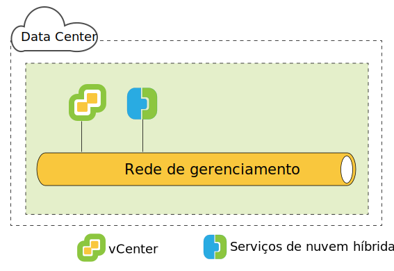
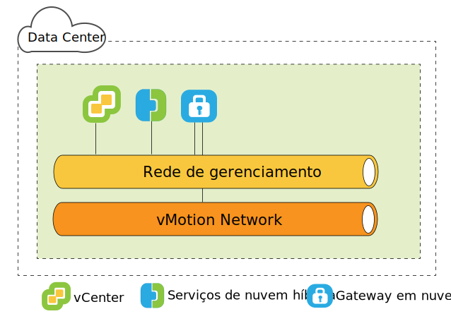
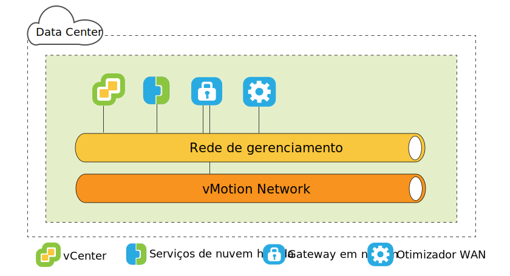
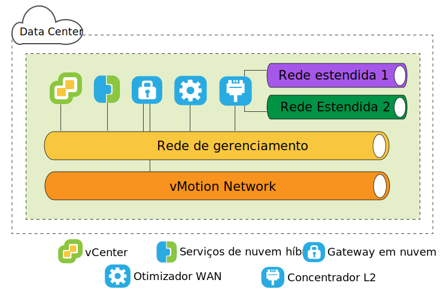
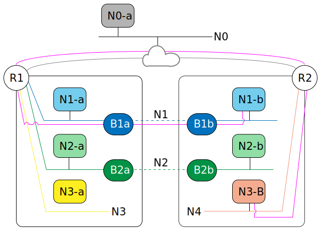

---

copyright:

  years:  2016, 2019

lastupdated: "2019-04-02"

subcollection: vmware-solutions

---

{:tip: .tip}
{:note: .note}
{:important: .important}

# Arquitetura do lado de origem do VMware HCX on IBM Cloud
{: #hcx-archi-source}

Esta seção descreve a arquitetura de cada componente do HCX que é implementado no ambiente de origem.

## Introducing HCX
{: #hcx-archi-source-intro-hcx}

A tecnologia HCX integra de forma contínua as redes vSphere vCenter à plataforma IBM Cloud VCS. A rede híbrida amplia as redes vSphere vCenter no local para o IBM Cloud, suportando a mobilidade bidirecional da máquina virtual (MV).

Esta introdução resume as tarefas que podem ser realizadas e os recursos que suportam e aprimoram a migração e a extensão de rede.

* O HCX possui os processos de criptografia e decriptografia de origem e de destino, garantindo uma segurança consistente e fornecendo admissão para fluxos de trabalho híbridos, como migração da máquina virtual e extensão de rede.
* O HCX cria uma WAN otimizada, definida por software, para aumentar o desempenho da rede estendida, permitindo que o desempenho se aproxime da velocidade da LAN.
* O HCX também permite a carga de trabalho bidirecional e a migração de política de segurança do VMware NSX para os serviços de rede do IBM Cloud.
* O HCX integra-se ao vSphere vCenter e é gerenciado por meio do vSphere Web Client.

## Extensão de rede da camada 2
{: #hcx-archi-source-layer-2-ext}

* Estenda com segurança uma rede de um vCenter para o IBM Cloud.
* O HCX fornece o High Throughput Layer 2 Concentrator (HT L2C).
* As redes estendidas são vinculadas aos dispositivos de borda do IBM Cloud NSX
* Múltiplos Layer 2 Concentrators padrão podem ser implementados para atingir a escalabilidade e aumentar o rendimento.
* As máquinas virtuais migradas por meio do Cloud Gateway e pela Camada 2 estendida podem reter seus endereços IP e de Controle de Acesso à Mídia.

## Métodos de migração da máquina virtual
{: #hcx-archi-source-vm-mig-methods}

### Migração baixa de tempo de in
{: #hcx-archi-source-low-downtime-mig}

A migração de tempo de inatividade baixo depende do vSphere Replication, que é uma tecnologia distribuída implementada no hypervisor VMware ESX/ESXi. O HCX cria uma réplica de uma máquina virtual em tempo real, move-a para o IBM Cloud e executa uma comutação para desligar a máquina virtual de origem e ligar a máquina virtual migrada.
* O caminho de migração é sempre por meio do Cloud Gateway. O transporte pode ser a Internet, uma rede estendida da Camada 2 ou uma linha de Conexão direta.
* Uma máquina virtual pode ser migrada várias vezes em qualquer direção.

### Migração do vMotion
{: #hcx-archi-source-vmotion-mig}

A migração do vMotion usa o vMotion para transferir uma máquina virtual em tempo real em uma rede estendida para o IBM Cloud. A migração do vMotion também é chamada de migração de tempo de inatividade zero ou vMotion entre nuvens.

### Migração fria
{: #hcx-archi-source-cold-mig}

Transfira uma máquina virtual desligada para o IBM Cloud por meio de uma rede estendida.

### Recursos comuns
{: #hcx-archi-source-common-feat}

* O WAN Optimization definido por software opcional, se instalado, aumenta a migração, o rendimento e a velocidade.
* A migração pode ser planejada para ocorrer em um horário especificado.
* Uma máquina virtual migrada pode manter seu nome do host, nome da máquina virtual ou ambos.

## Recursos de rede
{: #hcx-archi-source-net-feat}

Os recursos de rede a seguir são construídos no Cloud Gateway e nos Layer 2 Concentrators.

* Roteamento de fluxo inteligente - Seleciona automaticamente a melhor conexão com base no caminho da Internet, sobrecarregando eficientemente a conexão inteira para que as cargas de trabalho sejam movidas o mais rápido possível. Quando fluxos maiores, como backup ou replicação, causam a contenção de CPU, fluxos menores são roteados para CPUs menos ocupadas, melhorando o desempenho do tráfego interativo.
* Roteamento de proximidade - Assegura que o encaminhamento entre máquinas virtuais que estão conectadas a redes estendidas e roteadas tanto no local quanto na nuvem seja simétrico.
* Segurança - O Cloud Gateway oferece o AES-GCM compatível com o Conjunto B com o IKEv2, a transferência do AES-NI e o controle de admissão baseado em fluxo. O HCX possui os processos de criptografia e decriptografia de origem e de destino, garantindo uma segurança consistente e fornecendo admissão para fluxos de trabalho híbridos, como migração da máquina virtual e extensão de rede.
  Uma política de segurança que é definida no vCenter no local e designada a uma máquina virtual pode ser migrada com a máquina virtual.

## Entendendo o HCX
{: #hcx-archi-source-understand-hcx}

O HCX suporta um relacionamento muitos-para-muitos entre os vCenters no local e o IBM Cloud. O vCenter Server no Modo Vinculado é suportado. Este tópico fornece uma visão geral resumida de como o instalador interage com o data center no local e o IBM Cloud IBM Cloud.

Durante a instalação, o dispositivo virtual HCX Manager é importado e configurado como um plug-in para o vCenter no local. Esse plug-in é então usado para configurar a implementação do serviço WAN definido por software. A configuração automatizada provisiona cada dispositivo de serviço híbrido como uma máquina virtual no vCenter no local e implementa uma máquina virtual correspondente no IBM Cloud.

Uma implementação bem-sucedida requer:
* Recursos Suficientes para os Dispositivos Virtuais
* A rede deve permitir que os dispositivos se comuniquem com os dispositivos virtuais locais e remotos e com outras MVs.

## Visão Geral da Implementação
{: #hcx-archi-source-deployment-ovw}

A máquina virtual do HCX Manager é instalada primeiro e gerencia a instalação de qualquer outro dispositivo de máquina virtual de serviço no local e na nuvem.

A seguir está um resumo das tarefas básicas de instalação:
1. Obtenha o arquivo OVA do dispositivo virtual Hybrid Cloud Enterprise.
2. No vSphere Web Client, instale o dispositivo virtual de serviço do HCX Manager no vCenter no local que se conecta ao IBM Cloud.
3. No vSphere Web Client, registre um terminal do IBM Cloud com o plug-in HCX. O registro estabelece o relacionamento um-a-um entre o HCX no local e a instância do HCX no IBM Cloud.
4. Instale e configure os dispositivos virtuais de serviço.
5. Para cada dispositivo instalado no local, o instalador provisiona um dispositivo virtual de serviço correspondente no IBM Cloud de destino.
6. Após a instalação, o HCX Manager controla os dispositivos virtuais de serviço locais e remotos. No IBM Cloud, o HCX gerencia os componentes WAN Definidos por Software provisionados como um serviço.

### Considerações de desempenho do componente de
{: #hcx-archi-source-perf-consid}

O planejamento de arquitetura inclui as MVs a serem migradas, as redes usadas para o tráfego de máquina virtual e as redes a serem ampliadas. Este tópico resume alguns valores máximo e mínimo para os componentes de implementação.
* vSphere vCenter. O dispositivo HCX Manager deve ser instalado no vCenter que requer serviços híbridos. Pode haver apenas uma implementação do HCX por vCenter. Essa restrição se aplica ao modo vinculado, o dispositivo de gerenciamento HCX é instalado somente no vCenter primário. O HCX suporta até cinco vCenters registrados no modo vinculado.
* Registros de nuvem. O número máximo de terminais de nuvem é dez. Para localizar o número de terminais, o Hybrid Cloud Services rastreia as conexões do vCenter para a nuvem.

### Número máximo de migração e extensão de rede
{: #hcx-archi-source-max-mig-net-extension}

* Máximo de tarefas de migração de tempo de inatividade baixo simultâneas - 15
* Máximo de tarefas de esticamento do L2C simultâneas - 1
* Máximo de tarefas de migração do vMotion simultâneas - 1

### Gerenciamento de HCX Corporativo
{: #hcx-archi-source-hcxme}

O OVA de Gerenciamento de HCX Corporativo é implementado no ambiente de origem e registrado como um plug-in para o vCenter Server que gerencia a infraestrutura do vSphere de origem. Esse plug-in é então usado para configurar os serviços de migração e de rede necessários para ativar a migração entre nuvens e o esticamento da rede L2.

Pode haver apenas uma implementação do HCX por vCenter. Essa restrição se aplica ao modo vinculado: o dispositivo HCX Manager é instalado somente no vCenter primário. O HCX Manager suporta até cinco
vCenters registrados no modo vinculado.
{:note}

Figura 1. Hybrid Cloud Services de origem

### Dispositivos virtuais HCX
{: #hcx-archi-source-hcxva}

O pacote de instalação é um arquivo OVA que contém o plug-in do Hybrid Cloud Services. Esse dispositivo de gerenciamento
do Hybrid Cloud Services é instalado e configurado e, em seguida, usado para configurar as máquinas virtuais de dispositivo de serviço.
* Gerenciador de HCX
* Gateway de Nuvem Híbrido
* Concentradores de Camada 2
* Otimizadores WAN

### Gerenciador de HCX
{: #hcx-archi-source-hcxm}

O plug-in HCX Manager é implementado somente no local. Ele gerencia os dispositivos virtuais de serviço para o SD-WAN. O dispositivo virtual HCX Manager é uma extensão para o vCenter de origem e é implementado como uma máquina virtual. A estrutura do arquivo desse dispositivo contém todos os dispositivos virtuais de serviço híbrido. O HCX Manager supervisiona a implementação e a configuração do Cloud Gateway, dos Layer 2 Concentrators e do dispositivo virtual WAN Optimization no local e na nuvem.

O dispositivo virtual pode ser instalado com thin ou thick provisioning para o disco rígido. Por padrão, os discos rígidos para os dispositivos virtuais de serviço são thin provisioned.

Após a configuração e a implementação do dispositivo virtual de serviço serem feitas, efetue login nessa máquina virtual para usar o Hybrid Cloud Services Management Portal.

### Gateway de nuvem do HCX
{: #hcx-archi-source-hcg}

O HCX Cloud Gateway estabelece e mantém um canal seguro entre o vSphere e o IBM Cloud.

O HCX usa criptografia avançada para autoinicialização de uma conexão de site para site com o IBM Cloud. O canal seguro entre o vSphere e o IBM Cloud atinge a ocupação variada para protocolos do vSphere que não estão cientes do locatário e para evitar problemas de segurança de "meia milha" de rede.

O Cloud Gateway também incorpora a tecnologia de replicação do vSphere para executar a migração bidirecional.

Figura 2. Cloud Gateway de origem

### Otimizador WAN
{: #hcx-archi-source-wan-opt}

O HCX também fornece Otimização WAN definida por software. O dispositivo WAN Optimization é um componente altamente recomendado que executa o condicionamento de WAN para reduzir os efeitos da latência. Ele também incorpora a Correção de erro de encaminhamento para negar cenários de perda de pacote e deduplicação de padrões de tráfego redundantes. Juntos, eles reduzem o uso de largura da banda e asseguram o melhor uso da capacidade de rede disponível para expedir a transferência de dados para e do IBM Cloud.

A migração da máquina virtual depende da combinação dos dispositivos Cloud Gateway e WAN Optimization para atingir a mobilidade sem paralelo entre o vSphere no local e o IBM Cloud.

Figura 3. WAN Optimizer de origem

### Concentrador de Camada 2
{: #hcx-archi-source-layer-2-conc}

O Serviço Network Extension é fornecido pelo Layer 2 Concentrator (L2C). Ele amplia uma rede da Camada 2 do data center do vSphere no local para o IBM Cloud e permite a migração contínua entre o data center e a nuvem. O Layer 2 Concentrator é necessário para estender a rede no local para a IBM.

O dispositivo Layer 2 Concentrator tem duas interfaces:
* Interface de tronco interno: manipula o tráfego de máquina virtual no local para as redes estendidas usando um mapeamento de ponte translacional para uma rede estendida correspondente no IBM Cloud.
* Interface de uplink: o HCX usa essa interface para enviar o tráfego de sobreposição encapsulado para e do IBM Cloud. Os dados do aplicativo viajam por meio dessa interface.

Figura 4. L2 Concentrator de origem

### Apenas migração
{: #hcx-archi-source-mig-only}

A configuração mínima para executar a migração requer somente o HCX Manager e os dispositivos Cloud Gateway. É possível migrar máquinas virtuais sem extensão de rede. Nesse caso, a máquina virtual obtém um novo endereço IP usando o serviço Guest Customization após sua migração.

Para estender uma rede e manter o endereço IP original, um comutador virtual distribuído deve ser configurado no vSphere vCenter no local.

O WAN Optimization pode melhorar a velocidade nas situações descritas; configurar o Cloud Gateway para usar uma linha de alta velocidade (como um Direct Connect) melhora a velocidade, fornecendo um link de largura da banda mais alta para o tráfego otimizado da WAN.

A migração de máquinas virtuais em redes estendidas para o IBM Cloud é vantajosa porque reduz o tempo de inatividade e a configuração não é mudada na máquina virtual. A máquina virtual pode reter os endereços IP, os endereços MAC, os nomes de computadores e os nomes de máquinas virtuais. A retenção dessas propriedades simplifica muito a migração para o IBM Cloud e permite viagens de retorno fácil para o data center no local. O recurso Network Extension requer um vSphere Distributed Switch, que está disponível com o vSphere Enterprise Plus Edition.

### Requisitos de endereço IP
{: #hcx-archi-source-ip-req}

Para implementar o HCX, o número adequado de endereços IP deve estar disponível no local e no
IBM Cloud de destino.

* Endereço do vMotion
  Manter uma rede separada para o vMotion é uma prática comum no data center no local. O Cloud Gateway deve ter acesso à rede vMotion. Se não tiver, um endereço IP extra será necessário para se comunicar com a rede vMotion.

* No local
  * Um endereço IP para o dispositivo HCX Manager.
  * Um para cada Cloud Gateway; inclua um se houver uma rede vMotion separada.
  * Um para cada Layer 2 Concentrator padrão

* IBM Cloud
  * Dois endereços IP por dispositivo HCX Manager conectado ao IBM Cloud. Os endereços podem ser usados para se conectar à Internet ou a uma ou mais linhas do Direct Connect.
  * Inclua um se houver uma conexão de rede vMotion separada.

### Recurso de roteamento de proximidade
{: #hcx-archi-source-prox-routing-feat}

Roteamento de proximidade é um recurso de rede que pode ser ativado quando o Cloud Gateway está configurado.

O Roteamento de proximidade assegura que o encaminhamento entre máquinas virtuais que estão conectadas a redes estendidas e roteadas tanto no local quanto na nuvem seja simétrico. Esse recurso requer que o Dynamic Routing
seja configurado entre as instalações do cliente e a nuvem.

Quando os usuários estendem suas redes para a nuvem, a conectividade da Camada 2 é estendida para o IBM Cloud. No entanto, sem a otimização de rota, as solicitações de comunicação da Camada 3 devem retornar para a origem de rede no local para serem roteadas. Essa viagem de retorno é chamada de "tromboning" ou "hairpinning".

O tromboning é ineficiente porque os pacotes devem viajar entre a origem de rede e a Nuvem, mesmo quando as máquinas virtuais de origem e de destino residem na Nuvem. Além da ineficiência, se o caminho de encaminhamento incluir firewalls stateful ou outro equipamento sequencial que deva ver ambos os lados da conexão, a comunicação poderá falhar. A falha na comunicação da máquina virtual (sem otimização de rota) ocorre quando o caminho de egresso que está saindo da nuvem pode ser a rede da Camada 2 estendida ou por meio do VCS NSX Edge Gateway. A rede local não conhece o "atalho" de rede estendida. Esse problema é chamado de roteamento assimétrico. A solução é ativar o roteamento de proximidade para que a rede no local possa aprender as rotas do IBM Cloud.

Para evitar o tromboning, o HCX usa o gerenciamento de rota inteligente para escolher as rotas apropriadas para o estado da máquina virtual. O Cloud Gateway mantém um inventário de máquinas virtuais na nuvem. Ele também entende o estado da máquina virtual, que pode ser:
* Transferido para a nuvem com o vMotion (migração de tempo de inatividade zero).
* Migrado para a nuvem usando a replicação baseada em host (migração de tempo de inatividade baixo).
* Criado na nuvem (em uma rede estendida).

### Roteamento Assimétrico com Solução de Roteamento de Proximidade
{: #hcx-archi-source-asymm-routing}

No diagrama, os componentes `N*a` à esquerda residem no data center no local, e o componente `N*b` à direita reside na nuvem.

R1 é o gateway padrão para N1-b, portanto, N1-b deve retornar para R1 para rotear o tráfego por meio de R2. Para evitar o roteamento assimétrico, o HCX injeta rotas de host dentro da sobreposição de NSX da implementação do IBM Cloud VCS. Se a máquina virtual tiver sido recém-criada na nuvem ou ela tiver sido movida com migração de tempo de inatividade baixo, a rota de host será injetada imediatamente.

Se a máquina virtual foi transferida usando o vMotion, a rota não será injetada até que a máquina virtual seja reinicializada. Aguardar até após a reinicialização assegura que os dispositivos stateful no local continuem a atender a sessão existente até que a máquina virtual seja reinicializada. Após a reinicialização, as informações de roteamento são consistentes no local e na nuvem.

Ou seja, R1 pode usar o roteamento para atingir uma máquina virtual específica por meio de R2, em vez de usar a Rede estendida conectada localmente. R2 possui totalmente o caminho para outras redes para atingir as máquinas virtuais
com o Roteamento de proximidade ativado.

Figura 5. Roteamento assimétrico com solução de Roteamento de proximidade

### Retenção de endereço MAC
{: #hcx-archi-source-mac-addr-ret}

* A opção para reter o endereço MAC é uma caixa de seleção no assistente de migração. Ela é visível somente para migração baseada em replicação.
* Por padrão, **Reter MAC** será ativado se a máquina virtual de origem estiver em uma rede estendida e desativado quando a rede não for estendida. Se o endereço MAC não for retido, a máquina virtual obterá um novo endereço quando a migração estiver pronta. A decisão de reter um endereço MAC ou adquirir um novo pode causar impacto no processo de migração e no fluxo de tráfego de rede pós-migração.
* A retenção do endereço MAC é necessária pelas razões a seguir:
  * Licenças com base no endereço MAC: alguns softwares emparelha a licença para o endereço MAC da MV. Mudar o endereço MAC de uma máquina virtual invalida a licença.
  * Ordem de NIC do Linux: no Linux, se o endereço MAC for mudado em uma máquina virtual, o número do dispositivo de NIC Ethernet poderá mudar após uma reinicialização. Uma mudança de número do dispositivo pode alterar a ordem de apresentação de NIC dentro do sistema operacional, quebrando aplicativos ou scripts que dependem da ordem de NIC.
  * Menos tempo de inatividade se a rede estiver estendida: se a máquina virtual for migrada por uma rede estendida, a ativação de **Reter MAC** minimizará o tempo de inatividade porque a rede não precisa aprender um novo endereço MAC.
  * A caixa de seleção está na página Selecionar rede de destino durante a operação de migração.

### Migração de política de
{: #hcx-archi-source-sec-policy-mig}

O recurso de Migração de política permite que as regras de firewall distribuídas do NSX sejam movidas de um vCenter no local para uma Nuvem ativada para VCS HCX. A Migração de política é possível ao usar a migração de tempo de inatividade baixo ou o vMotion para mover uma máquina virtual por meio de uma rede estendida com o High Throughput Layer 2 Concentrator.
* O data center local deve estar executando o NSX 6.2.2 ou superior.
* No vSphere, a política de segurança é uma única Seção NSX, que pode conter muitas regras. Pode haver somente uma Seção (política) por vDC de Organização.
* Um Conjunto de endereços IP ou endereços MAC pode ser identificado para participar da política. O nome do Conjunto MAC ou do Conjunto de IP não pode exceder 218 caracteres.
* Todas as regras em uma Seção devem ter um nome exclusivo. Não deixe um nome de regra em branco.
As regras suportadas especificam os endereços IP da Camada 3 ou Conjuntos de IPs, ou endereços de Controle de Acesso à Mídia da Camada 2 ou Conjuntos de Controle de Acesso à Mídia como a origem ou o destino.

As regras que especificam grupos de segurança ou grupos de aplicativos para a origem ou o destino não são migradas.
{:note}

Qualquer mudança na política migrada é propagada para todas as MVs que usam a política.

## Links relacionados
{: #hcx-archi-source-related}

* [ Instalando e configurando na origem ](/docs/services/vmwaresolutions/archiref/hcx-archi?topic=vmware-solutions-hcx-archi-install-cfg-src)
