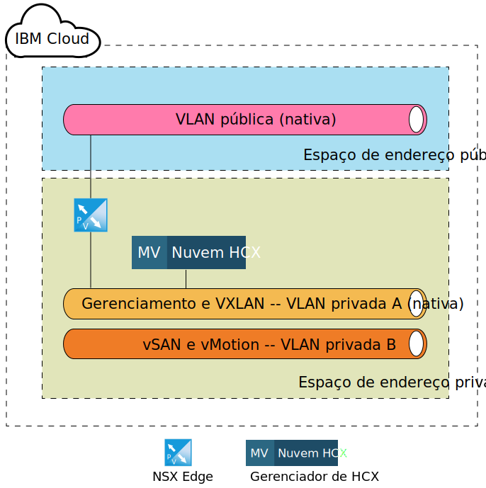
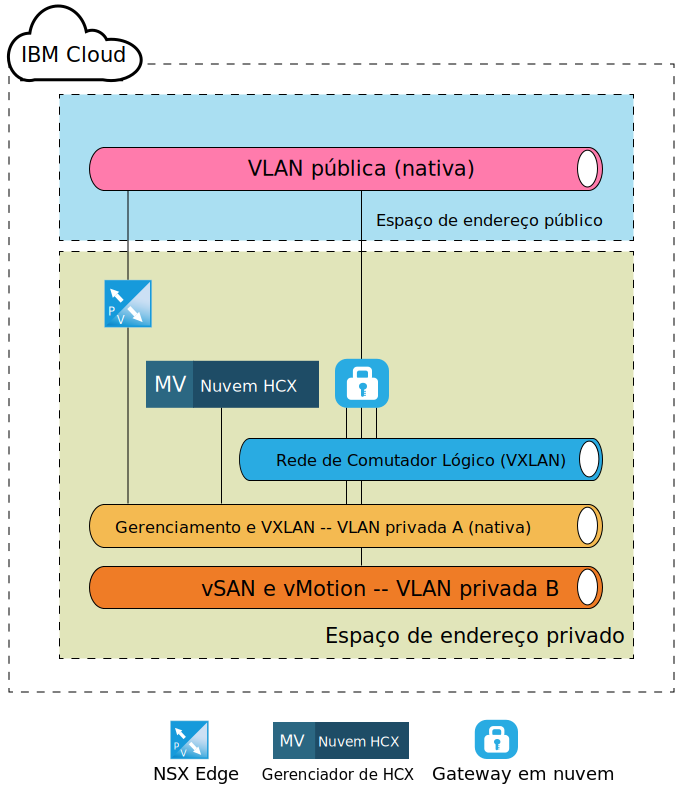
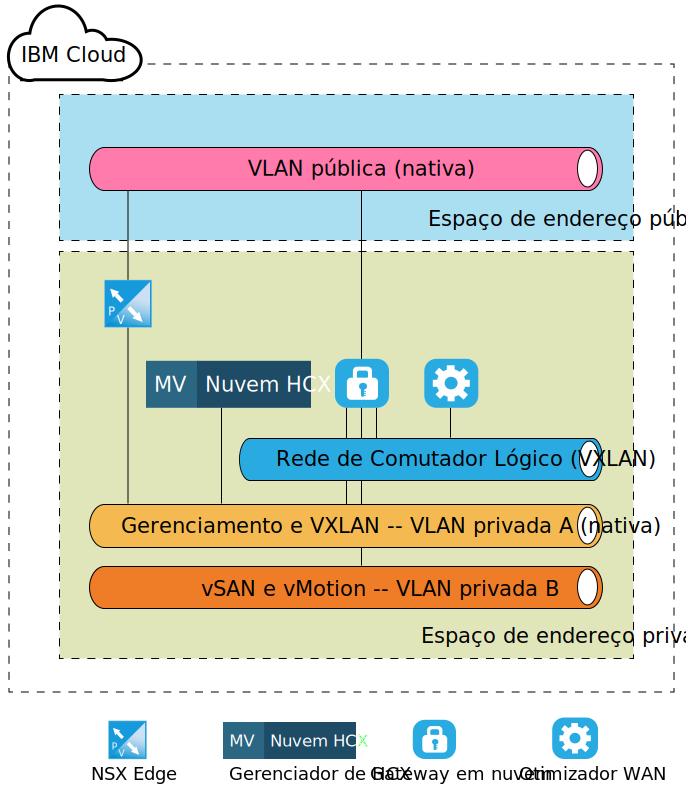
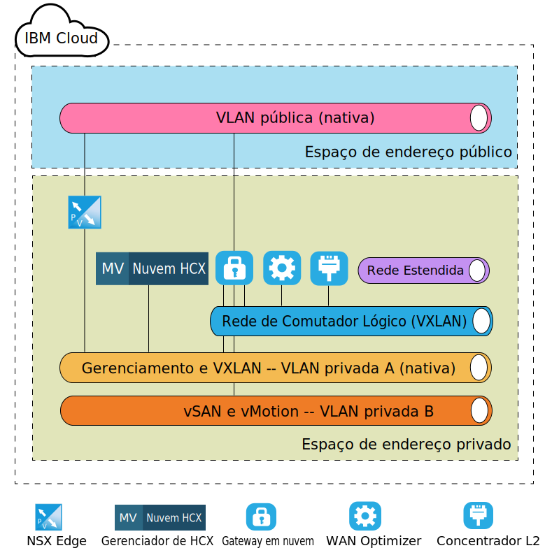

---

copyright:

  years:  2016, 2019

lastupdated: "2019-05-06"

subcollection: vmware-solutions

---
# Arquitetura de destino de nível de componente do VMware HCX on IBM Cloud
{: #hcx-archi-target}

Esta seção descreve a arquitetura de cada componente do HCX que é implementado dentro do ambiente IBM Cloud. O modelo de implementação spoke (destino) dentro do IBM Cloud é discutido.

## NSX Edge
{: #hcx-archi-target-nsx-edge}

O primeiro componente que está configurado dentro do IBM Cloud é um par de máquinas virtuais NSX Edge. É importante observar que todas as implementações do IBM Cloud for VMware Solutions instalam e configuram um dispositivo de borda para a comunicação de saída do IBM CloudDriver. No entanto, embora esse ESG possa ser reutilizado para comunicações do Hybrid Cloud Services, é aconselhável que um novo par seja implementado.

As máquinas virtuais NSX Edge são configuradas como um par Ativo/Passivo de dispositivos X-Large NSX Edge. Esses dispositivos são usados para se conectar ao ambiente do IBM Cloud VMware usando uma conexão de Internet pública. O X-Large NSX Edge foi escolhido para o ambiente interno, uma vez que ele é adequado para ambientes que têm o balanceador de carga com milhões de sessões simultâneas que não requerem necessariamente um alto rendimento. Como parte do processo de configuração, o NSX Edge é conectado à VLAN pública do IBM Cloud e à VLAN privada do IBM Cloud designadas para a infraestrutura de gerenciamento.

Tabela 1. Implementação do NSX Edge

| Componente | Configuração |
|-----------|---------------|
| CPU       | 6 vCPU        |
| RAM       | 8 GB          |
| Disco      | 4,5 GB de VMDK residente no armazenamento compartilhado com troca de 4 GB |

Como os NSX Edges são configurados como ativos/passivos na implementação interna ou dedicada, as regras de antiafinidade do vSphere Distributed Resource Scheduler (DRS) devem ser criadas pelo usuário para assegurar que os NSX Edges não sejam executados no mesmo host que seus respectivos dispositivos peer.

Tabela 2. Regras de antiafinidade do NSX Edge

| Campo     | Valor         |
|-----------|---------------|
| Nome      | Gateway externo do NSX Edge |
| Tipo      | Máquinas virtuais separadas |
| Membros   | NSX Edge 1 |
|           | NSX Edge 2 |

Além dos dispositivos NSX Edge implementados no IBM Cloud, o dispositivo virtual HCX Manager será implementado se o serviço VMware HCX on IBM Cloud for pedido. Após a implementação desse dispositivo, o NSX Edge é ativado para usar o balanceamento de carga e é configurado com perfis do aplicativo que usam um certificado para conexão de entrada por meio da origem. O NSX Edge também é configurado com conjuntos de balanceamento de carga para apontar para os dispositivos HCX Manager, vCenter e PSC. Além disso, um servidor virtual é criado com um endereço IP virtual (VIP) na interface pública com regras que conectam os conjuntos ao VIP. Uma amostra da configuração do servidor virtual e da configuração do conjunto no NSX Edge é mostrada nas tabelas a seguir.

Tabela 3. Configuração de VIP para NSX Edge - Servidores virtuais

| Campo     | Valor         |
|-----------|---------------|
| ID do Servidor Virtual | virtualServer-1 |
| Nome | HCX-VIP |
| Descrição | LB-VIP |
| Conjunto padrão | pool-1 |
| Endereço IP | 254 |
| Protocolo | https |
| Port | 443 |

Tabela 4. Configuração de VIP para NSX Edge - Detalhes do servidor virtual

| Campo     | Valor         |
|-----------|---------------|
| Descrição | LB-VIP |
| Limite de Conexão | 0 |
| Status de Inserção de Serviço | Desativado |
| Perfil do Aplicativo | applicationProfile-1 |
| Limite de taxa de conexão | 0 |
| Status da Aceleração | Desativado |
| Status do Perfil de Serviço |  |

Tabela 5. Configuração de VIP para NSX Edge - Regra

| Campo     | Valor         |
|-----------|---------------|
| ID de Regra | applicationRule-1 |
| Nome | appRule1 |
| Script | acl isHibridity url_beg /hibridity     acl isWebSso url_beg /websso     acl isVCenter url_beg /vsphere-client     use_backend nspPool001 if isHybridity     use_backend vcPool001 if isVCenter     use_backend ssoPool001 if isWebSso |

Tabela 6. Configuração do conjunto para NSX Edge - Resumo do conjunto

| ID do Conjunto | Nome       | Algoritmo   | ID do monitor |
|---------|------------|-------------|------------|
| pool-1  | nspPool001 | ROUND-ROBIN |            |
| pool-3  | ssoPool001 | ROUND-ROBIN |            |
| pool-2  | vcPool001  | ROUND-ROBIN |            |

Tabela 7. Configuração do conjunto para NSX Edge - Detalhes do conjunto

| Campo           | Valor     |
|-----------------|-----------|
| Descrição     |           |
| Transparente     | Desativado  |
| Nome            | HCX-CLOUD |
| Ponderação          | 1         |
| Porta de monitor    | 8443      |
| Conexões Máxim | 0         |
| Min Conexões | 0         |

## Gerenciador de HCX
{: #hcx-archi-target-hcxm}

O componente HCX Manager é o primeiro dispositivo implementado após os dispositivos NSX Edge serem configurados no destino. Esse dispositivo é usado como a interface principal para o ambiente de nuvem para os componentes de origem e fornece uma interface com o usuário de rede abstrata que pode ser usada para incluir, editar e excluir redes, bem como projetar e configurar roteamento sem o uso direto de NSX. Como resultado da integração do vCenter e do NSX, o dispositivo HCX Manager é designado a um endereço IP móvel privado na VLAN de gerenciamento.

Além disso, ele é configurado para acessar o vCenter e o NSX com um usuário específico. É importante observar que o endereço IP do HCX Manager é o mesmo endereço IP que é usado no NSX Edge para balanceamento de carga.

Depois que o componente de nuvem HCX Manager é implementado e configurado, os componentes de origem criam uma conexão com o HCX Manager por meio dos endereços VIP configurados no NSX ESG. Quando essa conexão é feita, os dispositivos Cloud Gateway e o WAN Optimizer são implementados dentro do IBM Cloud.

## Gateway em nuvem
{: #hcx-archi-target-cloud-gateway}

Um dispositivo virtual é implementado após uma conexão ser estabelecida da origem com a nuvem de destino. Esse dispositivo é o Cloud Gateway (CGW) e é usado para manter um canal seguro entre o ambiente vSphere que é designado como a origem e o IBM Cloud. A especificação de dimensionamento do dispositivo CGW que é implementada dentro do IBM Cloud é listada na Tabela 3 Implementação do Cloud Gateway.

Tabela 8. Implementação do Cloud Gateway

| Componente | Configuração |
|-----------|---------------|
| CPU       | 8 vCPU        |
| RAM       | 3 GB          |
| Disco      | 2,0 GB de VMDK residente no armazenamento compartilhado |

Esse Cloud Gateway é implementado configurado para residir na VLAN de gerenciamento (Sub-rede móvel privada), bem como na VLAN do vMotion (Sub-rede móvel privada) da implementação do IBM Cloud for VMware Solutions. Além disso, outra interface está configurada na VLAN pública (móvel pública) para conexões que são feitas por meio da Internet pública. O acesso público não será necessário se houver uma conexão direta (conexão privada no local). A última conexão que está associada ao Cloud Gateway é um comutador lógico criado e configurado no emparelhamento do site.

Esse comutador lógico é uma rede privada não roteável que é usada como um canal de comunicação entre o Cloud Gateway e o WAN Optimizer que é discutido em 4.1.4 WAN (TBD).

A figura a seguir descreve um diagrama de componentes de alto nível do dispositivo Cloud Gateway e as conexões designadas.

## Otimizador WAN
{: #hcx-archi-target-wan-opt}

O segundo componente implementado é o dispositivo WAN Optimization. Embora o dispositivo WAN Optimization seja opcional, ele executa o condicionamento de WAN para reduzir os efeitos de latência. Ele também incorpora a Correção de erro de encaminhamento para negar cenários de perda de pacote e deduplicação de padrões de tráfego redundantes.

Juntos, elas reduzem o uso de largura de banda e asseguram o melhor uso da capacidade de rede disponível para expedir a transferência de dados para o IBM Cloud e a partir dele. O WAN Optimizer é um disco intenso e requer uma quantia suficiente de IOPS para funcionar corretamente. Como resultado, o otimizador WAN reside no armazenamento vSAN, se presente, ou no armazenamento do Endurance com 2.000 IOPS. A especificação de dimensionamento para o dispositivo WAN Optimization é a tabela a seguir.

Tabela 9. Dimensionamento de dispositivo do WAN Optimizer

| Componente | Configuração |
|-----------|---------------|
| CPU       | 8 vCPU        |
| RAM       | 14 GB          |
| Disco      | 30 GB de VMDK + 70 GB de VMDK residentes no armazenamento compartilhado |

Ao contrário do Cloud Gateway, o dispositivo WAN Optimization é conectado a um comutador lógico somente para ativar a comunicação entre si e o Cloud Gateway. Esse dispositivo será necessário se o WAN Optimization estiver em uso no ambiente de origem. Veja a figura a seguir para obter uma visualização do layout de rede.

## Concentrador de Camada 2
{: #hcx-archi-target-layer-2-conc}

O terceiro componente é conhecido como Layer 2 Concentrator (L2C) e faz parte dos Serviços Network Extension. O L2C é a máquina virtual que permite a extensão das redes do data center no local para o IBM Cloud. O L2C estende VLANs e/ou VXLANs no local. Cada L2C pode estender até 4096 VLANs. Cada L2C, quando emparelhado com seu parceiro no local, pode fornecer até 1 Gbps por "fluxo" e até um agregado de 4 Gbps por VLAN (ou VXLAN). A implementação de mais dispositivos L2C será suportada se mais rendimentos de rede forem necessários.

Como parte desse design, o dispositivo L2C é implementado de forma que um cliente possa estender múltiplas VLANs e VLXANs para o IBM Cloud por meio da Internet pública ou por meio da rede privada via Direct Link. A especificação de dimensionamento do dispositivo L2C no IBM Cloud está listada na tabela a seguir.

Tabela 10. dimensionamento de dispositivo HT L2C

| Componente | Configuração |
|-----------|---------------|
| CPU       | 8 vCPU        |
| RAM       | 38 GB          |
| Disco      | 2 GB VMDK no armazenamento compartilhado |

O dispositivo L2C é implementado na VLAN de gerenciamento, bem como na VLAN pública. A interface pública é usada para o tráfego de aplicativo com destino à origem da rede estendida. Mais conexões, como as redes estendidas, são criadas e conectadas ao dispositivo L2C depois que o administrador de origem inicia a extensão de rede para o IBM Cloud. Exemplos dessas redes e conexões são mostrados na figura a seguir.

## Links relacionados
{: #hcx-archi-target-related}

* [ Instalando e configurando na origem ](/docs/services/vmwaresolutions/archiref/hcx-archi?topic=vmware-solutions-hcx-archi-source)
