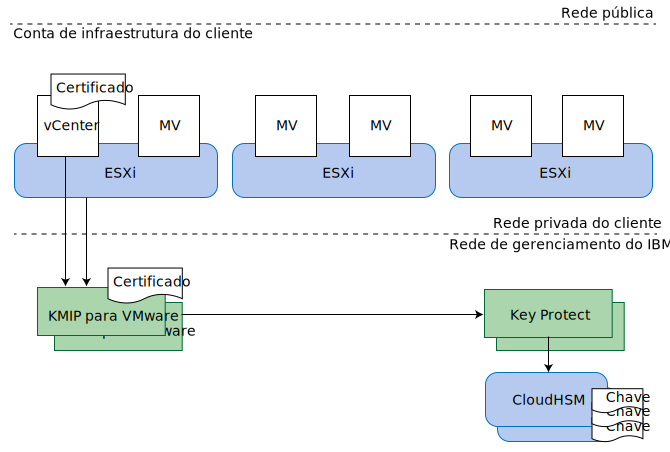

---

copyright:

  years:  2016, 2019

lastupdated: "2019-02-15"

---

{:tip: .tip}
{:note: .note}
{:important: .important}

# Design do KMIP para VMware
{: #kmip-design}

O KMIP for VMware on {{site.data.keyword.cloud}} fornece um serviço de gerenciamento de chave compatível com a criptografia do VMware vSAN e a criptografia do VMware vSphere, usando o [IBM Key Protect](/docs/services/key-protect?topic=key-protect-getting-started-tutorial) para fornecer o armazenamento de chave raiz e de chave de dados.

## Opções de criptografia de armazenamento
{: #kmip-design-storage-options}

O KMIP for VMware é compatível com a criptografia do VMware vSAN e a criptografia do vSphere. Ambas as soluções são implementadas na camada do hypervisor, mas fornecem funções um pouco diferentes. Avalie suas funções de acordo com seus requisitos.

### Criptografia VMware vSAN
{: #kmip-design-vsan-encrypt}

A criptografia do VMware vSAN é aplicável somente a armazenamentos de dados vSAN. Com essa solução, o VMware vCenter e seus hosts VMware ESXi se conectam a um servidor de gerenciamento de chaves, como o KMIP for VMware, para obter as chaves de criptografia. Essas chaves são usadas para proteger unidades de disco individuais usadas para o armazenamento de dados vSAN, incluindo os discos de cache e de capacidade. A criptografia do vSAN é implementada de uma maneira que preserva os benefícios da compactação e deduplicação da vSAN.

Como a criptografia do vSAN opera no nível de armazenamento de dados, seu objetivo primário é evitar a exposição de dados se a perda de unidades de disco físico ocorrer. Além disso, a criptografia do vSAN é totalmente compatível com todas as tecnologias de backup e replicação de máquina virtual, como replicação do vSphere, cross-vCenter vMotion, VMware HCX, Zerto, Veeam e IBM Spectrum Protect Plus.

**Notas**:
* A criptografia do vSAN não criptografa o host para hospedar comunicações de replicação de vSAN em seu cluster.
* A criptografia do vSAN não é aplicável a outras soluções de armazenamento, como o arquivo do {{site.data.keyword.cloud_notm}} Endurance e o armazenamento de bloco.
* A criptografia do vSAN requer a licença do vSAN Enterprise.
* A verificação de funcionamento do vSAN pode emitir avisos periódicos de que ele não é capaz de se conectar ao cluster do KMS por meio de um ou mais de seus hosts vSphere. Esses avisos ocorrem porque a conexão de verificação de funcionamento do vSAN atinge o tempo limite muito rapidamente. É possível ignorar esses avisos.

### Criptografia do vSphere
{: #kmip-design-vsphere-encrypt}

A criptografia do VMware vSphere se aplica a todos os tipos de armazenamento do VMware, incluindo armazenamento vSAN e armazenamento de arquivo e de bloco do {{site.data.keyword.cloud_notm}} Endurance.

Com essa solução, o vCenter Server e seus hosts ESXi se conectam a um servidor de gerenciamento de chaves, como o KMIP for VMware, para obter as chaves de criptografia. Essas chaves são usadas para proteger discos da máquina virtual (MV) individual, de acordo com suas políticas de armazenamento de MV.

A criptografia do vSphere opera no nível do disco da máquina virtual e, assim, ela pode evitar a exposição de dados se ocorrer perda de unidades de disco físico ou de discos da MV. Muitas tecnologias de backup e replicação não podem
fazer backup ou replicar efetivamente porque os dados fornecidos são criptografados.

Portanto, a criptografia do vSphere não é compatível com a replicação do vSphere, cross-vCenter vMotion, VMware HCX, Zerto ou IBM Spectrum Protect Plus. No entanto, quando configurado adequadamente, o Veeam Backup and Replication é compatível com a criptografia do vSphere.

### Mais considerações
{: #kmip-design-considerations}

Quando um dos tipos de criptografia é ativado no cluster do vSphere, o VMware cria uma chave extra para criptografar os core dumps do ESXi, pois esses dumps podem conter dados sensíveis, como credenciais de gerenciamento de chave, chaves de criptografia ou dados decriptografados. É necessário familiarizar-se com a [Criptografia e os core dumps de máquina virtual do vSphere](https://docs.vmware.com/en/VMware-vSphere/6.5/com.vmware.vsphere.security.doc/GUID-63728E8B-810D-418B-B1AA-6A0A2F92AABE.html).

Quando o KMIP for VMware é usado junto com a criptografia do vSAN ou a criptografia do vSphere, várias camadas de proteção de chave existem.

Se você planeja girar chaves, revise as informações a seguir sobre os níveis em que as chaves podem ser giradas:
* Sua customer root key (CRK) protege todas as chaves do VMware. As chaves podem ser giradas na instância do IBM Key Protect que está associada à instância do KMIP for VMware.
* O KMIP for VMware usa sua CRK para proteger as chaves que ele gera e distribui para o VMware. O VMware considera essas chaves como "chaves de criptografia de chaves" (KEKs).
  * Se você estiver usando a criptografia do vSphere, será possível girar as chaves usando o comando PowerShell **Set-VMEncryptionKey**.
  * Se você estiver usando a criptografia do vSAN, será possível girar as chaves na interface com o usuário do vSAN.
* O VMware usa essas KEKs para proteger as chaves reais que ele usa para criptografar unidades de disco e discos da MV. É possível girar essas chaves usando o que o VMware chama de um rechaveamento "detalhado". Essa operação criptografa novamente todos os dados criptografados, portanto, isso pode levar um longo tempo.
  * Se você estiver usando a criptografia do vSphere, será possível executar um rechaveamento detalhado usando o comando PowerShell **Set-VMEncryptionKey**.
  * Se você estiver usando a criptografia do vSAN, será possível executar um rechaveamento detalhado usando a interface com o usuário do vSAN.

## KMIP para VMware
{: #kmip-design-kmip-for-vmware}

A criptografia do VMware vSAN e a criptografia do vSphere são compatíveis com muitos servidores de gerenciamento de chave. O KMIP for VMware fornece um serviço de gerenciamento de chave gerenciado pela IBM que usa o IBM Key Protect para fornecer controle total sobre suas chaves. Outros serviços do {{site.data.keyword.cloud_notm}}, como o Cloud Object Storage, também são integrados ao Key Protect, tornando-o seu ponto central de controle para o gerenciamento de chave no {{site.data.keyword.cloud_notm}}.

### Chaves dentro das chaves
{: #kmip-design-keys}

Os sistemas de gerenciamento de chave normalmente usam uma técnica conhecida como *criptografia de envelope* para agrupar ou proteger chaves com outras chaves. Essas chaves são chamadas de *chaves raiz* ou *chaves de criptografia de chaves* (KEKs). Para acessar uma chave, é necessário decriptografar ou desagrupar a chave usando sua chave raiz correspondente. Destruir a chave raiz é uma maneira efetiva de invalidar todas as chaves que ela protegeu. Essas chaves não precisam ser armazenadas próximas da chave raiz. Controlar o acesso à chave raiz é importante.

O {{site.data.keyword.cloud_notm}} Key Protect fornece esse serviço usando uma *customer root key* (CRK). O Key Protect armazena CRKs exclusivamente no hardware do {{site.data.keyword.cloud_notm}} CloudHSM do qual não podem ser extraídas. Essas CRKs são, então, usadas para agrupar mais chaves de criptografia, como as geradas pelo KMIP for VMware para sua instância do VMware.

O VMware implementa esse mesmo conceito para suas chaves. O KMIP for VMware fornece uma chave para o VMware mediante solicitação e o VMware, por sua vez, usa essa chave como uma KEK para agrupar ou criptografar as chaves finais que são usadas para criptografar suas unidades de disco vSAN ou discos de máquina virtual. Essas chaves finais são chamadas de data encrypting keys (DEKs).

Então, nós acabamos com a cadeia de criptografia a seguir:
* Customer root key (CRK) armazenada permanentemente no IBM Key Protect.
* Chave de criptografia de chaves (KEK) gerada pelo KMIP for VMware e fornecida para o vCenter Server e para os hosts ESXi em sua instância.
* Data encrypting key (DEK) gerada pelo VMware e armazenada junto com o disco vSAN ou disco da máquina virtual.

O KMIP for VMware armazena o formato agrupado das KEKs dentro do IBM Key Protect. Embora as KEKs sejam criptograficamente protegidas pela CRK e não precisem ser armazenadas em um HSM, se você as armazenar no IBM Key Protect, sua presença ficará visível para você e será possível excluí-las se for necessário revogar chaves individuais.

### Autenticação e autorização
{: #kmip-design-authentication}

Três componentes compõem sua solução de criptografia de armazenamento: seu cluster do VMware, sua instância do KMIP for VMware e sua instância do Key Protect.

O VMware vCenter e o ESXi se autenticam com a instância do KMIP for VMware usando certificados que você instala ou gera no VMware vCenter ao criar uma conexão do key management server (KMS). Você instala o certificado público no KMIP for VMware para identificar o cliente ou clientes do vCenter que têm permissão para se conectar. Cada cliente está autorizado a todas as chaves armazenadas na instância do KMIP for VMware.

Sua instância do KMIP for VMware está autorizada para sua instância do Key Protect usando um ID do serviço do {{site.data.keyword.cloud_notm}} Identity and Access Management (IAM) que teve o acesso concedido à sua instância do Key Protect. O ID do serviço deve ter no mínimo acesso de Visualizador de plataforma e acesso de Gerenciador de serviço para sua instância do Key Protect. O KMIP for VMware usa a customer root key (CRK) de sua escolha na instância do Key Protect e armazena todas as KEKs geradas em nome do VMware, em formato agrupado, na instância do Key Protect.

### Topologia
{: #kmip-design-topology}

Figura 1. Componentes do KMIP for VMware on {{site.data.keyword.cloud_notm}}

O KMIP for VMware está disponível em vários multi&ndash;zone regions (MZRs) do IBM Cloud. Para obter a lista completa, veja [Pedindo o KMIP for VMware](/docs/services/vmwaresolutions/services?topic=vmware-solutions-kmip_standalone_ordering).

Dentro de cada MZR, o KMIP for VMware fornece dois terminais em serviço na rede do IBM Cloud Private para alta disponibilidade. Configure ambos os terminais em sua configuração do vCenter key management server (KMS) como um cluster do KMS. Para obter uma lista dos terminais em cada MZR e as assinaturas de certificado do servidor KMIP, veja a [documentação do serviço KMIP for VMware](/docs/services/vmwaresolutions/services?topic=vmware-solutions-kmip_standalone_ordering).

O KMIP for VMware também se conecta ao IBM Cloud Key Protect usando a rede do IBM Cloud Private em vez da Internet pública.

Para acessar o KMIP for VMware sobre a rede privada, sua conta de infraestrutura do IBM Cloud deve ser ativada para virtual routing and forwarding (VRF) e as rotas de terminal em serviço do IBM Cloud devem ser incluídas nas rotas do VRF de sua conta. Para obter mais informações, veja [ativando sua conta para terminais em serviço](/docs/services/service-endpoint?topic=services/service-endpoint-getting-started#cs_cli_install_steps).

## Links relacionados
{: #kmip-design-related}

* [Visão geral da solução](/docs/services/vmwaresolutions/archiref/kmip?topic=vmware-solutions-kmip-overview)
* [ Implementação e gerenciamento ](/docs/services/vmwaresolutions/archiref/kmip?topic=vmware-solutions-kmip-implementation)
* [IBM Key Protect](/docs/services/key-protect?topic=key-protect-getting-started-tutorial)
