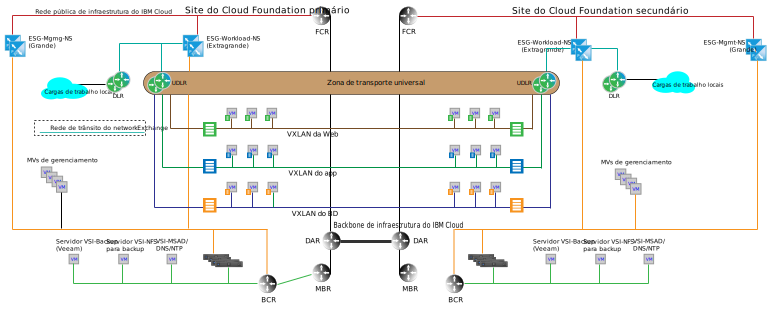

---

copyright:

  years:  2016, 2018

lastupdated: "2018-10-05"

---

# Arquitetura multissite

Um diferenciador principal entre o {{site.data.keyword.cloud}} e outras ofertas de nuvem é a capacidade de provisionar o recurso de computação dedicada em todo o mundo e conectar automaticamente a infraestrutura sob demanda com a rede dentro de sua conta privada do {{site.data.keyword.cloud_notm}}. Os recursos de rede definidos pelo software do VMware vCenter Server e do VMware Cloud Foundation juntos com o {{site.data.keyword.cloud_notm}} fornecem uma infraestrutura global granular que pode ser construída dentro de dias. As seções a seguir descrevem um exemplo de arquitetura multisite do que pode ser obtido com o recurso pronto para utilização do vCenter Server ou do Cloud Foundation.

## Ambiente do cross-vCenter NSX

O recurso cross-vCenter NSX permite a vinculação em um relacionamento primário e secundário de até nove gerenciadores NSX: um primário e oito secundários. Embora não seja necessário ter servidores vCenter em um relacionamento Enhanced Linked Mode (ELM) para que o cross-vCenter NSX funcione, isso fornece os benefícios a seguir:

* Criação simplificada de relacionamento primário e secundário usando credenciais de Conexão Única (SSO)
* A automação do vCenter Server e do Cloud Foundation configura a resolução do nome do DNS para todos os sites que estão vinculados
* Área de janela única de gerenciamento de vidro em todos os sites para as funções normais do vCenter e do NSX

## Exemplo de multissite

O exemplo a seguir inclui uma zona de transporte universal NSX nas topologias de gerenciamento básico e de carga de trabalho discutidas nas seções anteriores, além das características a seguir:

* A zona de transporte universal abrange dois {{site.data.keyword.CloudDataCents_notm}} ou PODs dentro de um {{site.data.keyword.CloudDataCent_notm}}.
* Após a zona de transporte ser incluída, múltiplas VXLANs são incluídas com um Universal Distributed Router que abrange as novas VXLANs.
* Deve-se configurar uplinks para os ESGs de carga de trabalho em ambos os sites. Essa configuração permite que máquinas virtuais (VMs) no site local atravessem seu ESG local.
* Para o tráfego de entrada, é necessário um balanceador de carga global. Veja as ofertas de balanceamento de carga global do {{site.data.keyword.cloud_notm}} para atender a esse requisito.
* Este exemplo requer edição do VMware NSX Enterprise.

Figura 1. Topologia de vários sites

### Links relacionados

* [ Serviços de rede no  {{site.data.keyword.cloud_notm}} ](networking_services.html)
