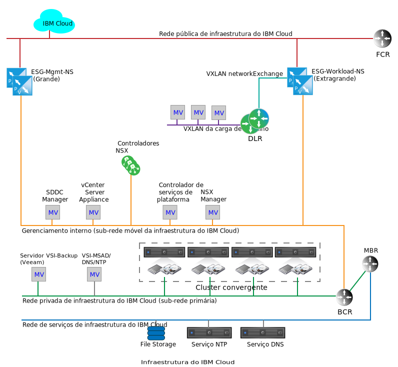
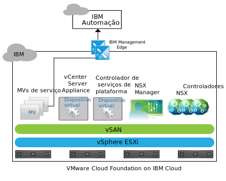
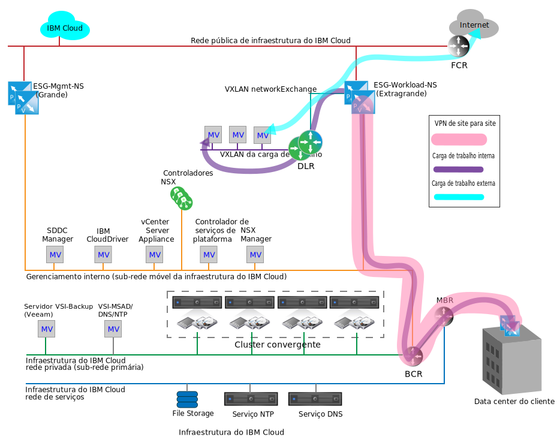

---

copyright:

  years:  2016, 2019

lastupdated: "2019-05-07"

subcollection: vmware-solutions

---

{:tip: .tip}
{:note: .note}
{:important: .important}

# Serviços de rede no IBM Cloud
{: #nsx-networking_services}

Os serviços de rede no {{site.data.keyword.cloud}} consistem em dois pares de Edge Services Gateways (ESGs) do VMware NSX para comunicação entre o {{site.data.keyword.cloud_notm}} e a Internet pública ou a rede no local do cliente por meio de uma Rede Privada Virtual (VPN). Esses ESGs são segregados para suportar a função de gerenciamento interno do {{site.data.keyword.cloud_notm}}, o tráfego egresso e o ingresso do tráfego de rede relacionado ao cliente.

O gráfico a seguir é um diagrama de rede simplificado, que descreve o par de gerenciamento e o par de ESGs de carga de trabalho. Ele também mostra um NSX Distributed Logical Router (DLR) e uma VXLAN de carga de trabalho. Esses componentes são destinados a ser um ponto de entrada inicial para cargas de trabalho do cliente sem requerer o conhecimento específico para configurá-las no NSX. Um DLR é geralmente empregado para rotear o tráfego entre o VMware vCenter Server e o tráfego Leste-Oeste, entre as redes separadas da camada 2 dentro da instância. Esse comportamento é em contraste com um ESG, que funciona para facilitar o tráfego de rede Norte-Sul que atravessa dentro e fora da instância do vCenter Server.

Embora um único ESG possa ser suficiente para o tráfego de carga de trabalho de gerenciamento e do cliente, a separação do tráfego de gerenciamento e do cliente é uma decisão de design feita para evitar a configuração incorreta acidental do ESG de gerenciamento.

A configuração incorreta ou a desativação do ESG de gerenciamento não impede o funcionamento da instância do vCenter Server, mas desativa todas as funções de gerenciamento do portal.
{:note}

## NSX Edge de serviços de gerenciamento IBM
{: #nsx-networking_services-mgmt-serv-nsx-edge}

O ESG de gerenciamento IBM é um cluster dedicado do NSX Edge somente para o tráfego de rede de gerenciamento do {{site.data.keyword.cloud_notm}}. Ele não é destinado à passagem de tráfego de qualquer componente que não seja implementado e gerenciado pela automação do vCenter Server.

O ESG de gerenciamento fornece um caminho de comunicação entre máquinas virtuais (VMs) de serviços complementares que residem em instâncias do vCenter Server e a infraestrutura do IBM Automation no {{site.data.keyword.cloud_notm}}, conforme mostrado para o vCenter Server no gráfico a seguir.

Como resultado da comunicação leve entre determinadas VMs de serviços complementares e seus sistemas de licenciamento e medição correspondentes, os NSX ESGs são dimensionados em uma grande configuração em um par de alta disponibilidade (HA) ativo/passivo e implementados no conjunto de recursos de gerenciamento do cluster do vCenter Server. A tabela a seguir fornece um resumo da implementação do NSX ESG de gerenciamento IBM.

Tabela 1. Especificações do NSX ESG de gerenciamento IBM

| NSX Edge de gerenciamento IBM | vCPU | Memória | Tamanho do disco | Local de armazenamento |
|:----------------------- |:---- |:------ |:--------- |:---------------- |
| NSX ESG de gerenciamento IBM 1 | 2 | 1 GB | 1 GB | Armazenamento de dados vSAN ou Armazenamento conectado compartilhado para gerenciamento |
| NSX ESG de gerenciamento IBM 2 | 2 | 1 GB | 1 GB | Armazenamento de dados vSAN ou Armazenamento conectado compartilhado para gerenciamento |

### Serviços de gerenciamento
{: #nsx-networking_services-mgmt-services}

O acesso de saída é necessário para os serviços a seguir:

* Zerto Virtual Manager. Se instalado, o Zerto on {{site.data.keyword.cloud_notm}} requer acesso de saída para a Internet para ativação de licenciamento e relatório de uso.
* Backup e replicação do Veeam. Se instalado, o Veeam on {{site.data.keyword.cloud_notm}} requer acesso de saída para a Internet para fazer download das atualizações de produto e de licença.
* O FortiGate Virtual Appliance on {{site.data.keyword.cloud_notm}} requer acesso de saída para a Internet para ativação de licenciamento e monitoramento de licenciamento.
* O F5 on {{site.data.keyword.cloud_notm}} requer acesso de saída para a Internet para ativação de licenciamento.

### Interfaces de Edge
{: #nsx-networking_services-edge-interfaces}

A configuração de interfaces ESG define a quais redes L2 o ESG tem acesso. Para o gerenciamento de ciclo de vida do vCenter Server, é necessário que as VMs específicas colocadas na VLAN de gerenciamento tenham permissão para atravessar para a VLAN pública. As interfaces a seguir são definidas na implementação:

Tabela 2. Configuração da interface NSX ESG

| Interface | Tipo de interface | Conectado ao | Descrição |
|:--------- |:-------------- |:------------ |:----------- |
| Uplink público | Uplink | **SDDC-DportGroup-External** | Interface voltada à Internet pública |
| Uplink privado | Uplink | **SDDC-DportGroup-Mgmt** | Interface voltada à rede privada interna |
| Interno | Interno | Workload HA VXLAN | Interface interna usada para pulsação de par de HA do ESG; grupo da porta em **SDDC-Dswitch-Private** |

### Subnets
{: #nsx-networking_services-subnets}

As sub-redes a seguir são usadas para os propósitos do ESG de Gerenciamento:

Tabela 3. Configuração de IP do NSX ESX

| Interface | Tipo de interface | Tipo de sub-rede do IP v4 | Intervalo | Descrição |
|:--------- |:-------------- |:----------------- |:----- |:----------- |
| Uplink público | Uplink | Pública móvel do {{site.data.keyword.cloud_notm}} | /30 – renderiza um endereço IP designável | Interface pública voltada à Internet |
| Uplink privado | Uplink | Privada móvel do {{site.data.keyword.cloud_notm}} (gerenciamento existente) | /26 – renderiza 61 endereços IP designáveis | Interface voltada à rede privada interna |
| Interno | Interno | Link local | 169.254.0.0/ 16 | Interface interna usada para comunicação de pares de HA do ESG |

### Definições de Conversão de Endereço de Rede
{: #nsx-networking_services-nat-definitions}

A Conversão de Endereço de Rede (NAT) é empregada no ESG de Gerenciamento para permitir que o tráfego de rede atravesse entre um espaço de endereço IP e outro. Isso é normalmente feito para conservar endereços IP roteáveis da Internet ou para ocultar endereços IP internos de públicos por razões de segurança. A NAT também é usada para permitir o redirecionamento de porta do Protocolo de Controle de Transmissões (TCP) e User Datagram Protocol (UDP). O tráfego de gerenciamento é sempre iniciado de dentro da instância do vCenter Server, requerendo que somente um NAT (SNAT) de origem seja definida no ESG de Gerenciamento. Um SNAT individual não é criado para cada MV interna que hospeda um serviço que precisa sair da instância.

Tabela 4. Configuração NAT do NSX ESG

| Aplicado na interface | Intervalo IP de origem | IP de origem convertida |
|:-------------------- |:--------------- |:-------------------- |
| Uplink público | Endereços IP individuais no Gerenciamento Móvel /26 | Pública móvel do {{site.data.keyword.cloud_notm}} |

### Roteamento
{: #nsx-networking_services-routing}

Como os serviços dentro de MVs necessários para atravessar o ESG de Gerenciamento também podem precisar chegar aos serviços do {{site.data.keyword.cloud_notm}} dentro da rede privada do {{site.data.keyword.cloud_notm}} do cliente, a configuração a seguir é necessária para alcançar essa comunicação.

Embora seja difícil prever qual intervalo de IPs de destino é necessário como um destino para conexões voltadas à Internet, qualquer serviço implementado e gerenciado pelo {{site.data.keyword.cloud_notm}} aponta para o ESG de Gerenciamento como seu gateway padrão. Uma rota estática é necessária para forçar o tráfego ao longo do BCR do {{site.data.keyword.cloud_notm}} para os serviços que requerem conexões de rede externa.

As configurações a seguir são recomendadas para qualquer serviço que esteja usando o ESG de gerenciamento para atravessar de uma instância do vCenter Server:
* O gateway padrão é um ESG de gerenciamento.
* Uma rota estática é necessária para destinos internos do {{site.data.keyword.cloud_notm}}.

Se houver uma necessidade de o serviço ou a MV acessar o ESG do cliente, as rotas estáticas deverão ser mantidas dentro do serviço ou MV individual e apontadas para o ESG do cliente.

Nenhum protocolo de roteamento automático está configurado para o ESG de Gerenciamento atualmente.

### Definições de VXLAN
{: #nsx-networking_services-vlan-definitions}

O par de alta disponibilidade de gerenciamento requer uma rede para a conexão das interfaces internas, que podem usar um vSwitch, um grupo da porta ou uma VXLAN existente. Para esse design, uma VXLAN dedicada é criada para a comunicação de pulsação de HA do par de HA do ESG de Gerenciamento.

Tabela 5. Definições de VXLAN do NSX ESG

| Definições NSX ESG VXLAN | Zona de transporte | Tipo |
|:------------------------- |:-------------- |:---- |
| Mgmt HA | transport-1 | global |

### Regras de firewall
{: #nsx-networking_services-firewall-rules}

Por padrão, o ESG de Gerenciamento é configurado para negar todo o tráfego.

**Negar:** descartar todo o tráfego sem resposta quando esse tráfego não tiver permissão para atravessar o firewall por qualquer regra ou conjunto de regras anterior (superior no pedido). A geração automática de regras é selecionada para permitir o tráfego de controle para o par ESG.

As regras de firewall a seguir são configuradas, além das regras geradas automaticamente:

Tabela 6. Configuração de firewall NSX ESG

| Serviço | Origem | Destino | Protocolo | Ação |
|:------- |:------ |:----------- |:-------- |:------ |
| Zerto on {{site.data.keyword.cloud_notm}} | Zerto Management MV | Qualquer | Porta 443 | Permitir |
| Veeam on {{site.data.keyword.cloud_notm}} | MV de Backup e Replicação do Veeam | Qualquer | Porta 443 | Permitir |
| FortiGate Virtual Appliance on {{site.data.keyword.cloud_notm}} | MVs de serviço | Qualquer | Porta 443 | Permitir |
| F5 on {{site.data.keyword.cloud_notm}} | MVs de serviço | Qualquer | Porta 443 | Permitir |
| Qualquer | Qualquer | Qualquer | Qualquer | Negar |

## Borda do NSX de carga de trabalho
{: #nsx-networking_services-wkld-nsx-edge}

O ESG de carga de trabalho IBM faz parte de uma topologia simples que é destinada à comunicação de rede de carga de trabalho. A seção a seguir descreve a intenção de design de onde conectar cargas de trabalho a uma rede dentro de uma instância do vCenter Server. Este é um ponto de início para conectar redes no local e espaços de IP a uma instância do vCenter Center específica e é a base para uma verdadeira arquitetura de Nuvem híbrida.

Uma rede do cliente que está conectada às redes pública e privada do {{site.data.keyword.cloud_notm}} permite acesso à carga de trabalho para e do tráfego voltado à Internet, mas também permite que uma VPN de site para site seja criada por meio de redes pública ou privada do {{site.data.keyword.cloud_notm}}. Isso permite diminuir drasticamente o tempo de maturação com relação à conexão com redes no local, pois pode levar meses para criar uma rede de longa distância (WAN) dedicada devido a requisitos de segurança do cliente. No entanto, depois que um link dedicado estiver em vigor, a VPN poderá ser invertida para atravessar esse link sem afetar a rede de sobreposição dentro do túnel VPN ou dentro da instância do vCenter Server. Após isso ser feito, a interface pública para o ESG de carga de trabalho poderá ser removida, se necessário, de uma perspectiva de segurança.

A topologia na figura a seguir consiste nos componentes NSX a seguir:
* Dispositivo NSX Edge (ESG)
* Distributed Logical Router (DLR)
* VXLAN (L2 sobre L3)

### Interfaces Edge para o NSX Edge de carga de trabalho IBM
{: #nsx-networking_services-edge-interfaces-workload}

Assim como com o ESG de gerenciamento, a configuração de interfaces ESG define a quais redes L2 o ESG tem acesso. Parte da intenção de design da topologia de carga de trabalho é alcançar uma sobreposição de rede definida por software (SDN) para isolar cargas de trabalho do espaço de endereço subjacente do {{site.data.keyword.cloud_notm}}. Esse design é a base para alcançar o design de BYOIP. Portanto, as interfaces a seguir são definidas na implementação:

Tabela 7. Configuração da interface do Workload Edge

| Interface | Tipo de interface | Conectado ao | Descrição |
|:--------- |:-------------- |:------------ |:----------- |
| Uplink público | Uplink | SDDC-DportGroup-External | Interface voltada à Internet pública |
| Uplink privado | Uplink | SDDC-DportGroup-Mgmt | Interface voltada à rede privada interna |
| Transit Uplink | Uplink | Workload-Trasit | VXLAN de trânsito entre o ESG da carga de trabalho e o DLR da carga de trabalho |
| Interno | Interno | Workload HA VXLAN | Interface interna usada para pulsação de pares de HA do ESG |

Nesse design, um DLR é empregado para permitir o roteamento Leste-Oeste em potencial entre as redes L2 conectadas da carga de trabalho local. Como essa topologia se destina a ser um exemplo simples, somente uma rede L2 que está destinada a cargas de trabalho é descrita. A inclusão de mais zonas de segurança pode ser alcançada incluindo mais VXLANs conectadas a novas interfaces no DLR. A tabela a seguir mostra as interfaces DLR a serem configuradas:

Tabela 8. interfaces DLR

| Interface | Tipo de interface | Conectado ao | Descrição |
|:--------- |:-------------- |:------------ |:----------- |
| Transit Uplink | Uplink | Workload-Trasit | VXLAN de trânsito entre o ESG da carga de trabalho e o DLR da carga de trabalho |
| Uplink de carga de trabalho | Uplink | Carga de trabalho | VXLAN para conexões de carga de trabalho |
| Interno | Interno | Workload HA VXLAN | Interface interna usada para pulsação de pares de HA do ESG |

### Sub-redes para o NSX Edge de carga de trabalho IBM
{: #nsx-networking_services-subnets-workload}

As sub-redes a seguir são usadas para os propósitos do ESG de Carga de Trabalho:

Tabela 9. Configuração de DLR e de IP do ESG de Carga de Trabalho

| Interface | Tipo de interface | Tipo de sub-rede do IP v4 | Intervalo | Descrição |
|:--------- |:-------------- |:----------------- |:----- |:----------- |
| Uplink Público (ESG) | Uplink | Pública móvel do {{site.data.keyword.cloud_notm}} | /30 – renderiza um endereço IP designável | Interface voltada à Internet pública (o cliente pode pedir mais endereços IP separadamente) |
| Uplink privado (ESG) | Uplink | Privada móvel do {{site.data.keyword.cloud_notm}} (gerenciamento existente) | /26 – renderiza 61 endereços IP designáveis | Interface voltada à rede privada interna |
| Interno (ESG e DLR) | Interno | Link local | 169.254.0.0/ 16 | Interface interna usada para comunicação de pares de HA do ESG |
| Transit Uplink (ESG e DLR) | Uplink | Designado pelo cliente | TBD | Conexão de rede de trânsito de ESG para DLR |
| Carga de trabalho (DLR) | Uplink | Designado pelo cliente | TBD | Sub-rede de carga |

### Definições de NAT para o NSX Edge de carga de trabalho IBM
{: #nsx-networking_services-nat-definitions-nsx-edge}

A NAT é empregada no ESG de Carga de Trabalho para permitir que o tráfego de rede atravesse em um espaço de endereço IP e outro. Para o ESG de carga de trabalho, a NAT é necessária não somente para permitir a comunicação com destinos da Internet, mas também para comunicar-se com qualquer intervalo de IP de origem do {{site.data.keyword.cloud_notm}}. Para esse design, o tráfego de carga de trabalho tem permissão para sair para a Internet, mas não para o gerenciamento ou quaisquer redes do {{site.data.keyword.cloud_notm}}. Como tal, somente uma SNAT precisa ser definida no ESG da Carga de Trabalho. A sub-rede móvel de carga de trabalho inteira é configurada para atravessar o SNAT.

Embora seja possível usar o NAT para permitir a comunicação de carga de trabalho entre múltiplas instâncias do vCenter Server, fazer isso se torna impraticável quando muitas cargas de trabalho precisam ser conectadas entre as instâncias. Para obter exemplos de uso de recursos avançados do NSX para criar uma rede de trânsito de sobreposição L2 nas instâncias do vCeter Server, consulte [Arquitetura multissite](/docs/services/vmwaresolutions/archiref/nsx?topic=vmware-solutions-nsx-multi_site).

Tabela 10. Regras NAT do Workload ESG

| Aplicado na interface | Intervalo IP de origem | IP de origem convertida | NAT Ativado ou Desativado |
|:-------------------- |:--------------- |:-------------------- |:----------------------- |
| Uplink público (Workload ESG) | Definido pelo cliente | IP público móvel do {{site.data.keyword.cloud_notm}} | Definido pelo cliente (padrão desativado) |

### Roteamento para o NSX Edge de carga de trabalho IBM
{: #nsx-networking_services-routing-wkld}

Dentro desse design, o único requisito para cargas de trabalho que atravessam o DLR para o ESG de carga de trabalho é acessar a Internet. O ESG de Carga de Trabalho precisa entender o caminho para a VXLAN de carga de trabalho e quaisquer futuras VXLAN/sub-redes de carga de trabalho criadas por trás do DLR. Embora isso possa ser alcançado por meio de rotas estáticas no ESG, a intenção da topologia de carga de trabalho é a de um design de melhor prática demonstrada. Portanto, o Open Shortest Path First (OSPF) é configurado entre o ESG de Carga de Trabalho e o DLR de recebimento de dados.

Para obter mais informações sobre a configuração, veja [Configurar o protocolo OSPF](https://pubs.vmware.com/NSX-6/index.jsp?topic=%2Fcom.vmware.nsx.admin.doc%2FGUID-6E985577-3629-42FE-AC22-C4B56EFA8C9B.html).

Tabela 11. Roteamento dinâmico

| Área | Tipo de OSPF | IP da interface OSPF | Autenticação OSPF |
|:---- |:--------- |:----------------- |:------------------- |
| 51 | stub | Designar um IP para cada DLR e ESG na rede de RFC1918 de trânsito | Nenhum |

### Regras de firewall para o NSX Edge de carga de trabalho IBM
{: #nsx-networking_services-firewall-wkld}

Por padrão, o ESG de Carga de Trabalho é configurado para negar todo o tráfego.

**Negar:** descartar todo o tráfego sem resposta quando esse tráfego não tiver permissão para atravessar o firewall por qualquer regra ou conjunto de regras anterior (superior no pedido). A geração automática de regras é selecionada para permitir o tráfego de controle para o par ESG.

As regras de firewall a seguir são configuradas, além das regras geradas automaticamente.

Tabela 12. Regras de firewall do Workload ESG

| Serviço | Origem | Destino | Protocolo | Ação |
|:------- |:------ |:----------- |:-------- |:------ |
| Cargas de trabalho | Sub-rede de carga | Qualquer | Qualquer | Permitir |
| Qualquer | Qualquer | Qualquer | Qualquer | Negar |

### Definições de VXLAN para o NSX Edge de carga de trabalho IBM
{: #nsx-networking_services-vxlan-definitions}

Os pares de HA de topologia de carga de trabalho ESG e DLR requerem segmentos L2 (VXLAN) para a conexão das interfaces internas, para o trânsito de dados entre os dois e para cargas de trabalho.

Tabela 13. Interfaces internas do Workload ESG

| Nome do VXLAN | Zona de transporte do vCenter Server | Tipo |
|:---------- |:------------------------------------------------- |:---- |
| Workload HA | transitório -1 | Global |
| Carga de trabalho | transitório -1 | Global |
| Carga de trabalho | transitório -1 | Global |

### Configurações de ESG DLR para o NSX Edge de carga de trabalho IBM
{: #nsx-networking_services-esg-dlr-sett}

Por padrão, a criação de log é ativada em todos os novos dispositivos NSX Edge. O nível de criação de log padrão é NOTICE.

## Links relacionados
{: #nsx-networking_services-related}

* [Design do NSX Edge Services Gateway](/docs/services/vmwaresolutions/archiref/nsx?topic=vmware-solutions-nsx_design)
* [Arquitetura multissite](/docs/services/vmwaresolutions/archiref/nsx?topic=vmware-solutions-nsx-multi_site)
