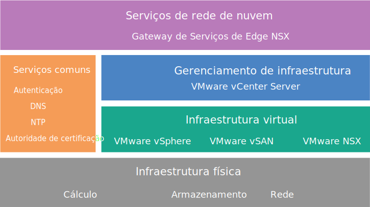

---

copyright:

  years:  2016, 2019

lastupdated: "2019-05-07"

subcollection: vmware-solutions

---

{:tip: .tip}
{:note: .note}
{:important: .important}

# Design do NSX Edge Services Gateway
{: #nsx_design}

A solução NSX Edge Services Gateway on {{site.data.keyword.cloud}} fornece tecnologia VMware que é implementada dentro dos {{site.data.keyword.CloudDataCents_notm}} em todo o mundo. O {{site.data.keyword.vmwaresolutions_short}} fornece duas arquiteturas de solução que estão relacionadas ao NSX Edge Services Gateway.

## Design de arquitetura interna
{: #nsx_design-internal-archi}

A arquitetura interna especifica a implementação dos componentes necessários do NSX Edge em um conjunto de recursos em um cluster do VMware vCenter Server.

O VMware vSAN é opcional na figura a seguir.
{:note}

## Design de arquitetura dedicada
{: #nsx_design-dedicated-archi}

A arquitetura dedicada implementa os componentes necessários do NSX Edge em um cluster do vSphere de dois nós separados que é dedicado ao uso do NSX Edge e fornece interação crítica com a infraestrutura de rede física. A arquitetura dedicada tem as características e funções a seguir:

* Fornece conectividade de via de acesso de entrada e via de acesso de saída para redes físicas. Por exemplo, roteamento Norte-Sul L3 nos dispositivos virtuais NSX Edge.
* Permite a comunicação com dispositivos físicos que são conectados a VLANs nas redes físicas por meio da ponte NSX L2 e hospeda a máquina virtual (MV) de controle para roteamento do Distributed Logical Router (DLR).
* Pode ter serviços lógicos ou físicos centralizados. Por exemplo, um firewall, balanceadores de carga, componentes de monitoramento de Rede Privada Virtual (VPN), MVs do insight de log.
* Os NSX Controllers podem ser hospedados em um cluster Edge quando um vCenter dedicado é usado para gerenciar os recursos de cálculo e de borda.
* Os recursos de cluster do Edge têm um requisito de antiafinidade para proteger a configuração de espera ativa ou para manter a disponibilidade da largura da banda durante a falha.

## Intervalos de endereço IP do IBM Cloud Private e intervalos de endereço de Bring Your Own IP
{: #nsx_design-ip-addr-ranges}

O intervalo de endereço IP privado do RFC1918 reserva especificamente o uso de intervalos de rede para uso interno da organização, nunca para a Internet. A infraestrutura de rede física do {{site.data.keyword.cloud_notm}} usa um espaço de endereço privado do RFC1918 específico, 10.x.x.x/8, em todos os locais do mundo inteiro. Esses intervalos de endereços IP não se sobrepõem às contas do cliente ou dentro de uma conta do cliente do {{site.data.keyword.cloud_notm}}. Dentro de uma conta do cliente, qualquer espaço de endereço IP privado alocado do {{site.data.keyword.cloud_notm}} pode, com o Virtual Routing and Forwarding (VRF) ativado, ser roteado para qualquer outro intervalo de endereço IP privado do {{site.data.keyword.cloud_notm}} em qualquer {{site.data.keyword.CloudDataCents_notm}}.

Embora isso torne simples a configuração de uma infraestrutura conectada mundial dentro de sua conta, o espaço de endereço IP fixo pode ser problemático quando você deseja ampliar seu data center para o {{site.data.keyword.cloud_notm}} por meio do roteamento quando está usando o mesmo espaço de endereço privado que o {{site.data.keyword.cloud_notm}}. A solução é usar o NSX para criar uma topologia de sobreposição na infraestrutura do vCenter Server, isolando seu espaço de endereço Bring Your Own IP (BYOIP) de interagir com o espaço de endereço IP privado designado do {{site.data.keyword.cloud_notm}}. O NSX pode fornecer uma VPN L2 para abranger o espaço de endereço BYOIP interno dentro do túnel em espaços de endereço IP externos, possivelmente sobrepostos.

## Links relacionados
{: #nsx_design-related}

* [Visão geral da solução](/docs/services/vmwaresolutions/archiref/solution?topic=vmware-solutions-solution_overview)
