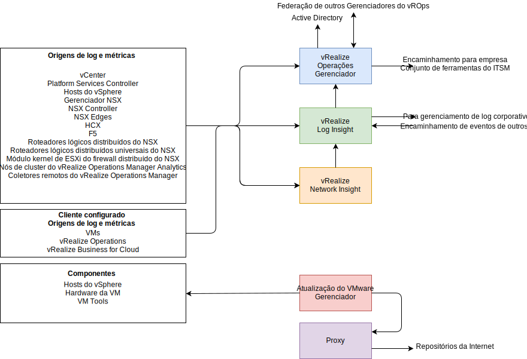
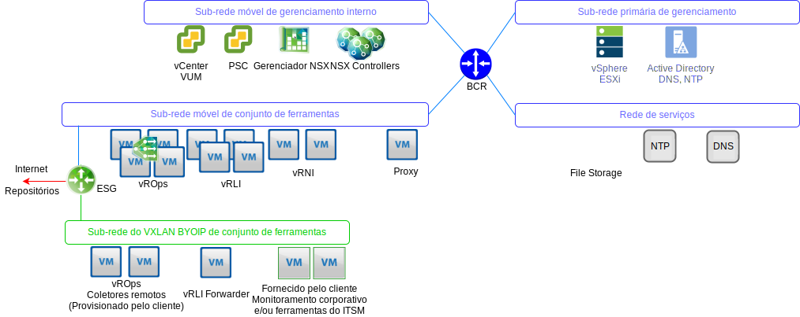

---

copyright:

  years:  2016, 2019

lastupdated: "2019-08-05"

---

# Visão geral da arquitetura de gerenciamento de operações
{: #opsmgmt-arch}
A arquitetura dos produtos na camada de gerenciamento de operações fornece monitoramento centralizado com a criação de log de dados do {{site.data.keyword.vmwaresolutions_full}}. A camada de gerenciamento de operações monitora em tempo real a infraestrutura física, a infraestrutura virtual e, opcionalmente, as cargas de trabalho de cálculo do cliente.

Em um alto nível, as informações a seguir são coletadas:
* Dados de topologia, como cálculo físico e virtual, rede e objetos de armazenamento.
* Dados de monitoramento, como:
  * Métricas - dados estruturados como desempenho e capacidade
  * Logs - dados não estruturados como eventos do sistema

## Fluxos de gerenciamento de operação
{: #opsmgmt-arch-flows}

O diagrama a seguir mostra a interação de chave e a integração das ferramentas de gerenciamento de operações.

O gerenciamento de operações do {{site.data.keyword.vmwaresolutions_short}} consiste nas etapas a seguir:
* Monitoramento - O vRealize Operations Manager (vROps) rastreia e analisa a operação de diversos objetos na arquitetura do {{site.data.keyword.vmwaresolutions_short}} usando algoritmos analíticos. Esses algoritmos ajudam o vROps a aprender e prever o comportamento desses objetos. Os administradores do sistema acessam essas informações usando visualizações, relatórios e painéis.

  Quando há um problema no ambiente, o vROps gera alertas de três tipos de impacto:
    * Alertas de funcionamento - indicam problemas que afetam o funcionamento do ambiente e requerem atenção imediata.
    * Alertas de risco - indicam problemas que não são ameaças imediatas, mas que precisam ser tratados logo.
    * Alertas de eficiência - informações para melhorar o desempenho ou recuperar recursos.

  Os Alertas do vROps são eventos que ocorrem nos objetos monitorados quando a análise de dados indica desvios de valores de métrica normais ou quando um problema ocorre com um dos componentes monitorados. Os alertas do vROps têm a designação de uma dessas categorias:
    * Crítico - deve ser acionado imediatamente.
    * Imediato - deve ser acionado o mais rápido possível.
    * Aviso - deve ser verificado quando o tempo permitir.

* Criação de log - O vRealize Log Insight (vRLI) fornece gerenciamento de log em tempo real e análise de log com agrupamento inteligente e baseado em machine learning, procura de alto desempenho e resolução de problemas entre os objetos físicos e virtuais na arquitetura do {{site.data.keyword.vmwaresolutions_short}}. O vRLI coleta dados de hosts do vSphere usando o protocolo `syslog`. Ele também coleta dados de eventos, de tarefas e de alarme para outros produtos VMware, como o vCenter Server. Ele integra-se ao vRops para enviar eventos de notificação e permitir a ativação no contexto. Outros objetos na arquitetura do {{site.data.keyword.vmwaresolutions_short}} que podem enviar dados do `syslog` são apontados para o vRLI. Opcionalmente, o cliente pode configurar qualquer sistema que seja capaz de enviar dados de syslog para encaminhar esses dados para o vRLI.

* Funcionamento de rede - O vRealize Network Insight é uma ferramenta de análise focada em ativar proativamente:
  * O monitoramento do desempenho e do funcionamento da rede.
  * Uma resolução de problemas de ponta a ponta.
  * 360° de visibilidade e análise.
  * O gerenciamento de conformidade baseado em microssegmentação.

* Correção e upgrade - O vSphere Update Manager (VUM) fornece gerenciamento centralizado e automatizado de versão e correção para hosts e máquinas virtuais (VMs) do VMware vSphere (não para sistemas operacionais e aplicativos).

## Rede de gerenciamento de operações
{: #opsmgmt-arch-network}

O diagrama a seguir mostra a visão geral da rede.

* Uma sub-rede móvel privada de conjunto de ferramentas é provisionada para fornecer o espaço de endereço IP do {{site.data.keyword.cloud_notm}} usado para o fornecimento inicial das VMs de conjunto de ferramentas. Após o fornecimento, torna-se responsabilidade do cliente gerenciar o espaço de endereço IP para ampliação do conjunto de ferramentas. As VMs nessa sub-rede requerem acesso aos componentes hospedados nas sub-redes de Gerenciamento e de Gerenciamento Interno.
* A sub-rede VXLAN do conjunto de ferramentas é usada para fornecer o espaço de endereço IP do BYOIP usado para o provisionamento inicial das VMs do conjunto de ferramentas, no entanto, torna-se responsabilidade do cliente gerenciar posteriormente o espaço de endereço IP para a ampliação do conjunto de ferramentas. As VMs nessa sub-rede requerem acesso aos componentes hospedados nas sub-redes de Sobreposição. O ESG fornece NAT entre os espaços de endereço do {{site.data.keyword.cloud_notm}} e do BYOIP.
* Os Coletores Remotos do vROps podem ser implementados pelo cliente caso ele queira utilizar o vROps para monitorar suas VMs de cálculo.
* Os Encaminhadores do vRLI retransmitem mensagens de log dos componentes de sobreposição para o cluster vRLI. O cliente também pode configurar suas VMs de cálculo para usar esses encaminhadores, se necessário.
* O VMware Update Manager (VUM) fornece a atualização de hosts do vSphere e de hardware e ferramentas da VM. O VUM usa o Proxy para obter acesso aos repositórios da Internet.

O vROps coleta dados de objetos no ambiente. Cada parte de dados coletada é chamada de observação ou valor de métrica. O vROps usa o adaptador do vCenter para coletar métricas brutas do vCenter. Além das métricas coletadas, o vROps calcula métricas, métricas de capacidade e métricas de badge para monitorar o funcionamento de seu sistema. As definições de alerta são uma combinação de sintomas e recomendações que identificam áreas de problemas e geram alertas com base nos quais você atua para essas áreas.

## Componentes monitorados
{: #opsmgmt-arch-components}

### Monitoramento do vCenter
{: #opsmgmt-arch-components-vcenter}

O monitoramento do vCenter é realizado com o vROps e o VMware SDDC Health Management Pack. O vRLI coleta os dados de log do vCenter, que são compreendidos pelo Content Pack for vSphere que envia alertas para o vROPs.

O VMware SDDC Health Management Pack monitora a pilha de Gerenciamento do SDDC e fornece badges para funcionamento e alertas relacionados à configuração e à conformidade dos componentes do produto SDDC, incluindo o vCenter.

### Monitoramento de hosts do vSphere
{: #opsmgmt-arch-components-hosts}

O monitoramento dos hosts do vSphere é realizado com o vROps, por meio do vCenter, e a coleta de logs é realizada por meio do vRLI.

### Monitoramento do vSAN
{: #opsmgmt-arch-components-vsan}

Para monitorar o vSAN, vROps e vRLI são usados. No vCenter, há um conjunto extra de Verificações de funcionamento do vSAN que podem ser usadas. A instalação do Management Pack for vSAN fornece mais painéis para auxiliar com o monitoramento do vSAN.

O vROps gera um alerta caso um problema ocorra nos componentes do produto SDDC, na rede da área de armazenamento que o adaptador do VMware vSAN está monitorando. Um alerta relacionado à conformidade e funcionamento da configuração é passado por meio do pacote de gerenciamento do VMware SDDC Health Solution do VMware vSAN Management Pack. O vSAN é monitorado com o vROps vSAN Management Pack por meio do dispositivo vCenter usando um adaptador vSAN. O intervalo de coleta padrão é de cinco minutos e o adaptador do vSAN também coleta as métricas do Health Check Service e do Performance Service por meio de objetos do vSphere. O intervalo do Health Check Service é configurado na interface do vSphere e é de 60 minutos por padrão.

Para certificar-se de que o adaptador do vSAN possa coletar todos os dados de desempenho, o serviço de desempenho do vSAN deverá ser ativado no vSphere.

### Monitoramento do NSX for vSphere
{: #opsmgmt-arch-components-nsxv}

Para monitorar o NSX, as ferramentas a seguir são implementadas:
* vRealize Operations Manager (vROps)
* vRealize Log Insight (vRLI)
* vRealize Network Insight (vRNI)

Isso permite que os administradores de sistema monitorem, gerenciem e solucionem problemas do VMware NSX. O vROps Management Pack for VMware NSX fornece visibilidade sobre a topologia de rede. Os painéis do NSX fornecem uma visão geral rápida do ambiente do NSX e do funcionamento de seus componentes. A correlação entre objetos do NSX e do vSphere permite uma resolução fácil de problemas.

O vROps usa o pacote de gerenciamento para pesquisar no VMware NSX os dados de configuração, desempenho e suporte. Em nome do vROps, o Management Pack converte as solicitações de pesquisa em chamadas da API de REST para recuperar os dados necessários do NSX Manager.

Os componentes do NSX precisam ser configurados para enviar syslog para o vRLI.

* Gerenciador do NSX - [Especificar o servidor syslog](https://pubs.vmware.com/NSX-6/topic/com.vmware.nsx.admin.doc/GUID-EA70974C-07F8-469D-8A9D-0ED54F0C8F34.html#GUID-EA70974C-07F8-469D-8A9D-0ED54F0C8F34){:new_window}.
* Controladores do NSX - [Configurar controladores do NSX](https://kb.vmware.com/s/article/2092228){:new_window}.
* NSX Edge - [Configurar servidores syslog remotos](https://pubs.vmware.com/NSX-6/topic/com.vmware.nsx.admin.doc/GUID-9C25E097-E2CC-461A-9DA6-E8118D16EE62.html#GUID-9C25E097-E2CC-461A-9DA6-E8118D16EE62){:new_window}.
* Firewall - Deve-se configurar o servidor syslog remoto para cada cluster que tenha o firewall ativado. O servidor syslog remoto é especificado no atributo `Syslog.global.logHost`.

O NSX Flow Monitoring pode ser usado no gerenciador do NSX para determinar quais fluxos são aprovados e quais são bloqueados. Se necessário, o espelhamento de porta poderá ser configurado para um Comutador Distribuído do vSphere.

### Monitoramento do NSX-T
{: #opsmgmt-arch-components-nsxt}

Para monitorar o NSX-T, as ferramentas a seguir são implementadas:

* vRealize Operations Manager (vROps)
* vRealize Log Insight (vRLI)

O VMware SDDC Health Management Pack monitora os componentes a seguir:
* Comutadores lógicos - Monitora o estado administrativo dos comutadores lógicos.
* Cluster do controlador - Monitora a contagem de nós do cluster implementado para a alta disponibilidade e mantém o quorum.
* Nós do controlador - Monitora a conectividade do nó com o cluster do controlador e o nó do gerenciador.
* Nós de borda - Monitora o estado de execução do nó de borda e sua conectividade com o cluster do controlador e os nós do gerenciador.
* Serviços de gerenciamento do NSX-T.
* Serviço de roteador T0 - Monitora a rota estática, o NAT, o BGP, o BFD e roteia serviços de redistribuição.
* Serviço de roteador T1 - Monitora a rota estática, o NAT e roteia serviços de propaganda.

### Monitoramento do vRealize Operations Manager
{: #opsmgmt-arch-components-vrops}

O VMware SDDC Health Management Pack possui definições de Alerta para os eventos a seguir:
* O dimensionamento atual dos nós do vRealize Operations Manager não é suficiente para a carga fornecida.
* A configuração do nó do cluster não segue a diretriz de dimensionamento do vRealize Operations Manager.
* O dimensionamento atual do Coletor Remoto não é suficiente para a carga fornecida.
* A configuração do Coletor Remoto não segue a diretriz de dimensionamento do vRealize Operations Manager.
* O Cluster do vRealize Operations excedeu o número recomendado de nós de análise.

### Monitoramento do vRealize Log Insight
{: #opsmgmt-arch-components-vrli}

O vRLI suporta alertas que acionam notificações sobre seu funcionamento e gera notificações quando ocorre um evento importante no sistema, por exemplo, quando o espaço em disco está quase esgotado e o vRealize Log Insight deve começar a excluir ou arquivar arquivos de log antigos.

## Requisitos do sistema
{: #opsmgmt-arch-requirements}

O design usa a quantidade e o tamanho a seguir de dispositivos:

Tabela 1. Requisitos do sistema do resumo do conjunto de ferramentas de operação

||vROps|vRLI|vRNI|Proxy|
|---|---|---|---|---|---|
|Qtd de VM|4|4|1+1|1|
|vCPU|8|8|4 + 8|4|
|GB de RAM|32|16|12 + 32|0,5|
|GB de disco|254|1042|158 + 1000|80|

## Versões de software
{: #opsmgmt-arch-versions}

Tabela 2. Versões de software do conjunto de ferramentas operacionais

|Nome do produto|Versão|
|---|---|
|VMware vRealize Operations Manager Advanced ou mais recente|7.0|
|vRealize Operations Management Pack for NSX for vSphere|3.5.2|
|vRealize Operations Management Pack for Storage Devices|7.0.0|
|vRealize Operations Management Pack for Site Recovery Manager|8.1.1|
|VMware vRealize Log Insight|4.7|
|vRealize Log Insight Content Pack for NSX for vSphere|3.8|
