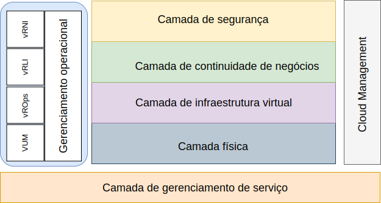

---

copyright:

  years:  2016, 2019

lastupdated: "2019-08-05"

---

# Introdução
{: #opsmgmt-intro}

Essa arquitetura de referência destina-se a guiar e restringir as instanciações de arquiteturas do {{site.data.keyword.vmwaresolutions_full}}.

Ela também:
* Fornece uma linguagem comum para as diversas partes interessadas.
* Fornece consistência de implementação de tecnologia para resolver problemas.
* Suporta a validação de soluções com relação à arquitetura de referência comprovada.
* Encoraja a adesão a padrões e especificações comuns.

O objetivo primário dessa arquitetura de referência é documentar o recurso Gerenciamento de operações para fornecer monitoramento e alerta do ambiente do {{site.data.keyword.vmwaresolutions_short}} implementado para o cliente. O conjunto de ferramentas foi configurado com parâmetros e limites de melhores práticas para uso pela equipe de operações do cliente.

O design permite que o cliente conclua as tarefas a seguir:
* Amplie ou reduza o dimensionamento, conforme necessário.
* Instale o seu próprio conjunto de ferramentas de monitoramento corporativo, conforme exigido por suas políticas operacionais.
* Integre o conjunto de ferramentas à sua própria plataforma corporativa de Gerenciamento de Serviço de TI (ITSM).

## Gerenciamento de operações
{: #opsmgmt-intro-opsmgmt}

O {{site.data.keyword.vmwaresolutions_short}} é baseado nas camadas arquiteturais a seguir:

* Camada física - A camada mais baixa da arquitetura é a camada física, que consiste no cálculo, na rede e nos componentes de armazenamento aproveitados do {{site.data.keyword.cloud_notm}}:
  * {{site.data.keyword.baremetal_short}} que executam as cargas de trabalho de gerenciamento, de borda e de cálculo.
  * A rede do {{site.data.keyword.cloud_notm}} que consiste em VLANs, sub-redes, Frontend e Backend Customer Routers (FCR/BCR).
  * Armazenamento vSAN, que é um armazenamento de dados consolidado dos SSDs no armazenamento do {{site.data.keyword.baremetal_short}} ou do Endurance.

* Camada de infraestrutura virtual - A camada de infraestrutura virtual é executada sobre os componentes da camada física. A camada de infraestrutura virtual controla o acesso à infraestrutura física subjacente e controla e aloca recursos para as cargas de trabalho de gerenciamento e cálculo. As cargas de trabalho de gerenciamento consistem em elementos na própria camada de infraestrutura virtual, além de elementos nas camadas de gerenciamento de nuvem, gerenciamento de serviço, continuidade de negócios e segurança.

* Camada de continuidade de negócios - Essa camada contém elementos para suportar a continuidade de negócios, fornecendo backup de dados, restauração e recuperação de desastre. Para obter mais informações, consulte a arquitetura de backup e restauração do {{site.data.keyword.vmwaresolutions_short}}, as arquiteturas de referência de recuperação de desastre do Veeam, do IBM Spectrum Protect Plus e do Zerto.

* Camada de segurança - essa camada contém os elementos para reduzir o risco e aumentar a conformidade. Para obter mais informações, consulte as arquiteturas de referência do Fortinet, do F5, do NSX, do HyTrust e do Caveonix.

Este documento está incluindo a camada a seguir na arquitetura do {{site.data.keyword.vmwaresolutions_short}}:

* Camada de Gerenciamento de operações - A arquitetura da camada de gerenciamento de operações inclui componentes de gerenciamento que fornecem suporte para as camadas físicas e virtuais e, opcionalmente, as cargas de trabalho de cálculo em tempo real. A camada de gerenciamento de operações entende a topologia do {{site.data.keyword.vmwaresolutions_short}}, ou seja, os recursos físicos, virtuais, de cálculo, de rede e de armazenamento. A camada de gerenciamento de operações consiste principalmente em funções de monitoramento e criação de log.

  As informações são coletadas das seguintes formas:
    * Métricas - dados estruturados como desempenho e capacidade
    * Logs - dados não estruturados como eventos do sistema

A Camada de Gerenciamento de Operações consiste nas seguintes ferramentas:

* vRealize Operations Manager (vROps) - O vROps usa os dados coletados dos recursos do sistema (objetos) para identificar problemas nos componentes do sistema monitorado e para auxiliar em diversos problemas, sugerindo ações corretivas a serem tomadas para corrigi-lo. Para problemas mais desafiadores, o vROps oferece ferramentas ricas de análise para revelar problemas ocultos, investigar problemas técnicos complexos, identificar tendências ou realizar drill down para avaliar o funcionamento de um único objeto.
* vRealize Log Insight (vRLI) - O vRLI fornece um gerenciamento de log inteligente para infraestrutura e aplicativos em qualquer ambiente. Essa solução de gerenciamento de log altamente escalável fornece painéis intuitivos e acionáveis, análises sofisticadas e ampla extensibilidade de terceiros em ambientes físicos, virtuais e de nuvem.
* vRealize Network Insight (vRNI) - O vRNI fornece operações inteligentes para rede e segurança definidas por software. Ele permite a visibilidade em redes virtuais e físicas, fornecendo visualizações operacionais para gerenciar e dimensionar as implementações do NSX e acelerando o planejamento e a implementação de microssegmentação.
* VMware Update Manager (VUM) - O VUM permite o gerenciamento centralizado e automatizado de versão e correção para o VMware vSphere e oferece upgrade e correção de hosts do vSphere, instalação e atualização de software de terceiros em hosts e upgrade de hardware da VM, Ferramentas do VMware e dispositivos virtuais.

Para obter uma arquitetura empresarial completa, as camadas a seguir podem ser necessárias, mas estão fora da arquitetura do {{site.data.keyword.vmwaresolutions_short}}:

* Camada de gerenciamento de nuvem - A camada de gerenciamento de nuvem é a camada superior da arquitetura de nuvem. Ela solicita recursos e orquestra as camadas inferiores por meio de uma interface com o usuário ou interface de programação de aplicativos (API). O vRealize Automation permite a automação de nuvem no {{site.data.keyword.cloud_notm}}. Para obter mais informações, consulte [Arquitetura de referência do vRealize Automation (vRA)](https://www.ibm.com/cloud/garage/files/IBM_Cloud_for_VMware_Solutions_VRA_Architecture_v1.pdf){:new_window}.

Para obter mais informações sobre como essa arquitetura pode ser estendida com a integração do Chef, consulte [Arquitetura de referência da integração do vRA com o Chef](https://www.ibm.com/cloud/garage/files/IBM_Cloud_for_VMware_Solutions_VRA_Chef_Integration_Architecture.pdf){:new_window}.

* Camada de gerenciamento de serviços - Essa camada se concentra no ciclo de vida completo do ambiente de TI e é normalmente implementada no nível corporativo, combinando entradas de todos os silos de tecnologias e Operações de TI. Essa camada tem sido tradicionalmente arquitetada em estruturas de Gerenciamento de Serviço de TI (ITSM), como a Information Technology Infrastructure Library (ITIL) e a ISO/IEC 20000, que são estruturas de melhores práticas para a entrega de serviços de TI por meio dos processos e estágios do ciclo de vida do serviço de TI. Em um nível de produto, o ITSM é tipificado por um sistema de gerenciamento de fluxo de trabalho centralizado para a manipulação de incidentes, solicitações de serviço, problemas, mudanças e conhecimento conectados a um banco de dados de gerenciamento de configuração.
