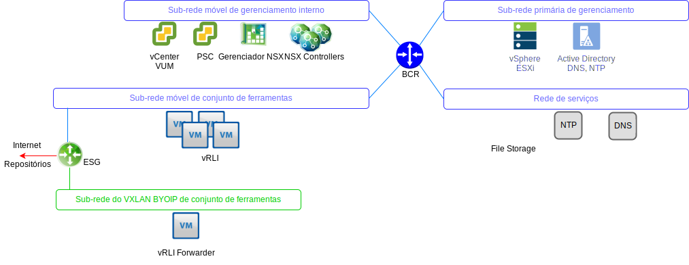
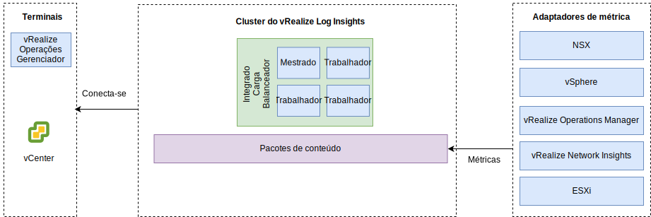

---

copyright:

  years:  2016, 2019

lastupdated: "2019-07-01"

---

# vRealize Log Insights
{: #opsmgmt-vrli}

O ambiente do vRealize Log Insight (vRLI) consiste em quatro máquinas virtuais (VMs) com um Balanceador de Carga integrado.

Esse padrão suporta:
* 30.000 VMs
* Ingestão de log de 75 Gbs por dia
* 5.000 eventos por segundo

O vRealize Log Insight (vRLI) permite a criação de log em tempo real para componentes no ambiente do {{site.data.keyword.vmwaresolutions_full}}. O design implementa um cluster do vRLI que consiste em quatro nós em cada instância. Essa configuração fornece a disponibilidade contínua e taxas de ingestão de log aumentadas.

Nesse design, cada local tem um cluster vRLI independente que é implementado no Cluster de gerenciamento. O cluster vRLI é implementado na sub-rede do conjunto de ferramentas usando endereços IP móveis do {{site.data.keyword.cloud_notm}}. Isso facilita a comunicação com todos os componentes transmitidos do espaço de endereço RFC1918 do {{site.data.keyword.cloud_notm}}. Eles incluem: hosts do vSphere, o vCenter, o Platform Services Controller, o Gerenciador NSX e os Controladores NSX. Um cluster do vRLI contém um Nó Principal e pelo menos dois Nós do Trabalhador com um Balanceador de Carga Integrado.

* Nó Principal - Nó inicial necessário no Cluster. O Nó Principal é responsável pela ingestão de consultas e logs. A IU da web do Nó principal é o único painel de controle para esse vRealize Log Insight Cluster. Todas as consultas com relação a dados são direcionadas ao principal, que, por sua vez, distribui a carga de trabalho para os Trabalhadores.
* Nó do trabalhador - são necessários três nós mínimos para formar um cluster com a capacidade de incluir mais Trabalhadores para ampliação. Um Nó do trabalhador alimenta logs e armazena-os localmente.
* Balanceador de carga integrado - Isso fornece alta disponibilidade usando a configuração de balanceamento de carga proprietária (não é necessário nenhum balanceador de carga externo).
* Encaminhador do Log Insight – É implementado para receber logs dos componentes de sobreposição do NSX. Além disso, pode ser utilizado por um cliente que deseje enviar logs de VMs de cálculo. O Encaminhador do Log Insight é um Nó Principal único do vRealize Log Insight usado como um agregador de syslog remoto para encaminhar alertas para o cluster do vRLI. Como os endereços suportados por VXLAN estão fora do espaço de endereço BYOIP, as regras NAT devem ser implementadas no NSX ESG.

Os tamanhos a seguir estão disponíveis e o apropriado é selecionado:
* Pequeno - 2.000 eventos por segundo
* Médio - 5.000 eventos por segundo
* Grande - 15.000 eventos por segundo

O vRLI coleta logs para fornecer informações de monitoramento sobre o ambiente de um local central.

O vRLI coleta eventos de log da infraestrutura virtual e dos componentes de gerenciamento de nuvem a seguir (clientes de criação de log):
* vCenter
* Hosts ESXi
* Gerenciador NSX
* NSX Controllers
* Gateways de serviços do NSX Edge
* Instâncias do roteador lógico distribuído NSX
* Roteadores lógicos distribuídos universais do NSX
* Módulo kernel de ESXi do firewall distribuído do NSX
* Coletores remotos e nós do cluster de Analítica do vRealize Operations Manager
* Instância do vRLI em outras instâncias como resultado do encaminhamento de eventos

Os clientes de criação de log a seguir são suportados, mas não estão integrados nesse design:
* Dispositivo do Realize Automation
* vRealize Orchestrator (integrado no vRealize Automation Appliance)
* Servidor da web do vRealize IaaS
* Servidor de gerenciamento do vRealize IaaS
* vRealize IaaS DEM
* Agentes de proxy do vRealize IaaS
* Servidor de negócios do vRealize
* Coletor de dados de negócios do vRealize

## Requisitos do sistema
{: #opsmgmt-vrli-requirements}

Para acomodar todos os dados de log das origens de log no ambiente, os nós do vRLI precisam ser dimensionados corretamente. Esse design é baseado no dispositivo de tamanho Médio:

Tabela 1. Configurações do sistema do Nó Principal e de Réplica do Log Insight

| Atributo                | Especificação                     |
| ------------------------ | --------------------------------- |
| vCPU                     | 8                                 |
| Memória                   | 18 GB                             |
| Disco (thick provisioned) | 530 GB (490 GB para armazenamento de evento) |

Cada dispositivo virtual do vRLI tem três discos virtuais padrão e pode usar mais discos virtuais para o armazenamento.
* Disco rígido 1 - 20 GB para o sistema de arquivos raiz
* Disco rígido 2 - 510 GB para a implementação de médio porte e contém duas partições:
  * /storage/var - para logs do sistema
  * /storage/core storage - para logs coletados (aproximadamente 475 GB de espaço em disco disponível)

## Rede
{: #opsmgmt-vrli-network}

A implementação do dispositivo do vRLI requer três endereços IP da sub-rede móvel privada do conjunto de ferramentas. O vRLI requer acesso a:
* Dispositivo do vCenter
* Dispositivo vRealize Log Insight
* Dispositivos NSX-V/T
* VXLAN de expansão de conjunto de ferramentas
* Redes do cliente
* Servidor NTP (`time.services.softlayer.com`)
* Active Directory/DNS do {{site.data.keyword.vmwaresolutions_short}}
* Os Coletores remotos requerem regras NAT no NSX ESG para ativar a conectividade com o Nó principal, a Réplica do nó principal e os Nós de dados

## Portas
{: #opsmgmt-vrli-ports}

Tabela 2. Portas do Log Insight

| Descrição                                                   | Port       | Protocolo |
| ------------------------------------------------------------- | ---------- | -------- |
| Tráfego de syslog de saída configurado como um destino do Encaminhador | 514        | TCP, UDP |
| Dados do syslog sobre SSL                                          | 1514, 6514 | TCP      |
| API de ingestão de insight de log                                     | 9000       | TCP      |
| API de ingestão de insight de log sobre SSL                            | 9543       | TCP      |
| Acesso SSH ao dispositivo                                       | 22         | TCP      |
| Interface com o usuário                                                | 80, 443    | TCP      |
| NTP                                                           | 123        | UDP      |
| SMTP                                                          | 25         | TCP      |
| DNS                                                           | 53         | UDP      |
| LDAP/LDAPS                                                    | 389, 636   | TCP      |
| LDAP GC                                                       | 3268/3269  | TCP      |
| vCenter                                                       | 443        | TCP      |
| Dispositivo do vRealize Operations Manager                         | 443        | TCP      |

## Autenticação
{: #opsmgmt-vrli-auth}

O Gerenciamento de Usuário para o vRLI requer o VMware Identity Manager (vIDM), que se integra ao Active Directory. As contas de serviço são usadas para comunicação de aplicativo a aplicativo do vRealize Operations Manager para os adaptadores a seguir com o conjunto mínimo de permissões necessárias para coleta de métrica e mapeamento de topologia.
* Gerenciador NSX
* vCenter
* vSAN

## Pacotes de conteúdo no vRealize Log Insight
{: #opsmgmt-vrli-content}

Os pacotes de conteúdo fornecem monitoramento mais granular na infraestrutura virtual e permitem que os logs sejam recuperados, extraídos e analisados em um formato legível. Dessa forma, o vRLI salva consultas e alertas de log e painéis podem ser usados para um monitoramento eficiente.

Os seguintes são instalados por padrão:
* Geral
* VMware vSphere
* VMware vSAN
* VMware vROps

Esse design também instala:
* VMware NSX for vSphere
* vRealize Network Insight

Outros Pacotes de Conteúdo podem ser obtidos em [Pacote de conteúdo do vRealize Log Insight](https://marketplace.vmware.com/vsx/?contentType=2&listingStyle=table){:new_window}.

## Links relacionados
{: #opsmgmt-vrli-related}

* [Visão geral do vCenter Server on {{site.data.keyword.cloud_notm}} with Hybridity Bundle](/docs/services/vmwaresolutions/archiref/vcs?topic=vmware-solutions-vcs-hybridity-intro)
* [Dimensionando o dispositivo virtual do vRealize Log Insight](https://docs.vmware.com/en/vRealize-Log-Insight/4.6/com.vmware.log-insight.getting-started.doc/GUID-284FC5F4-B832-47A7-912E-D407A760CAE4.html){:new_window}
* [vRealize Log Insight](https://docs.vmware.com/en/vRealize-Log-Insight/index.html){:new_window}
