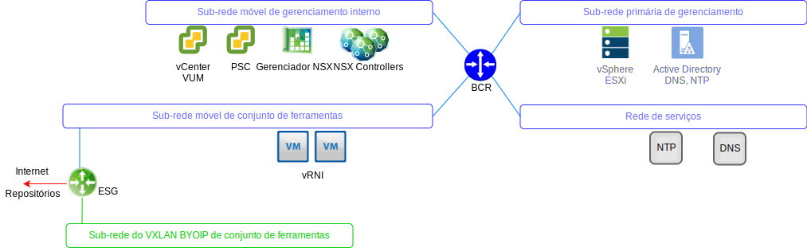
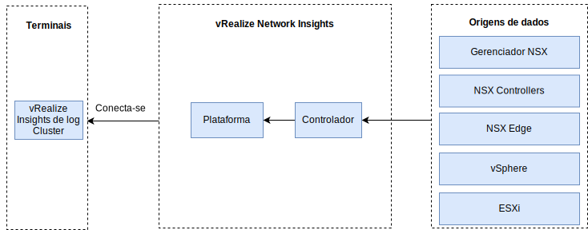

---

copyright:

  years:  2016, 2019

lastupdated: "2019-05-31"

---

# vRealize Network Insight
{: #opsmgmt-vrni}

O ambiente vRealize Network Insight (vRNI) consiste em duas máquinas virtuais (VMs), uma Plataforma (IU) e um Nó do controlador.

O dispositivo vRNI Platform fornece a analítica, a interface com o usuário e o gerenciamento de dados e se conecta ao Dispositivo do controlador, que coleta de várias origens de dados, como NSX Edges e vCenter. Todos os componentes do vRNI usam endereços IP móveis do {{site.data.keyword.cloud}} Private. O vRLI é configurado como o servidor syslog para o vRNI.

## Requisitos do sistema
{: #opsmgmt-vrni-requirements}

Essa arquitetura suporta 3000 VMs usando um tamanho de tijolo Médio.

Tabela 1. Requisitos do sistema para o Network Insight Platform

| Atributo | Especificação |
|---|---|
| vCPU | 8 |
| Memória | 32 GB |
| Disco (thin provisioned) | 1 TB |

Tabela 2. Requisitos do sistema para o Network Insight Collector

| Atributo | Especificação |
|---|---|
| vCPU | 4 |
| Memória | 12 GB |
| Disco (thin provisioned) | 200 GB |

## Rede
{: #opsmgmt-vrni-network}

A implementação do dispositivo vRNI requer dois endereços IP da sub-rede móvel privada do Conjunto de ferramentas. Conectividade de rede à qual o vRNI solicita o acesso:
* Dispositivo do vCenter
* Dispositivo vRealize Log Insight
* Dispositivos NSX-V/T
* VXLAN de expansão de conjunto de ferramentas
* Redes do cliente
* Servidor NTP (`time.services.softlayer.com`)
* Active Directory/DNS do {{site.data.keyword.vmwaresolutions_short}}

## Portas
{: #opsmgmt-vrni-ports}

Tabela 3. Portas do Network Insight

| Descrição |Port | Protocolo |
|---|---|---|
| Comunicação entre as VMs do vRealize Network Insight | 443 | HTTPS |
| Serviços que requerem acesso à Internet svc.ni.vmware.com support2.ni.vmware.com reg.ni.vmware.com|443|HTTPS
| API de ingestão de insight de log | 9000 | TCP |
| API de ingestão de insight de log sobre SSL | 9543 | TCP |
| Interface com o usuário | 80,443 | TCP |
| NTP |123 | UDP |
| SMTP | 25 | TCP |
| DNS| 53 | UDP |
| LDAP/LDAPS | 389, 636 | TCP |
| ESXi | 2055 | TCP |
| VMware vSphere / NSX | 443 | TCP |

## Autenticação
{: #opsmgmt-vrni-auth}

A autenticação do usuário do vRNI é diretamente com um Servidor do Active Directory.

## Links relacionados
{: #opsmgmt-vrni-links}

* [Visão geral do vCenter Server on {{site.data.keyword.cloud_notm}} with Hybridity Bundle](/docs/services/vmwaresolutions/archiref/vcs?topic=vmware-solutions-vcs-hybridity-intro)
* [vRealize Network Insights](https://docs.vmware.com/en/VMware-vRealize-Network-Insight/index.html){:new_window}
