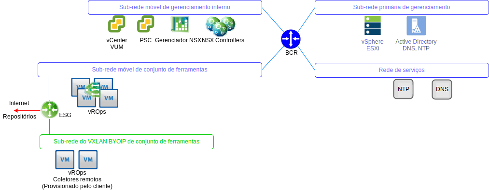
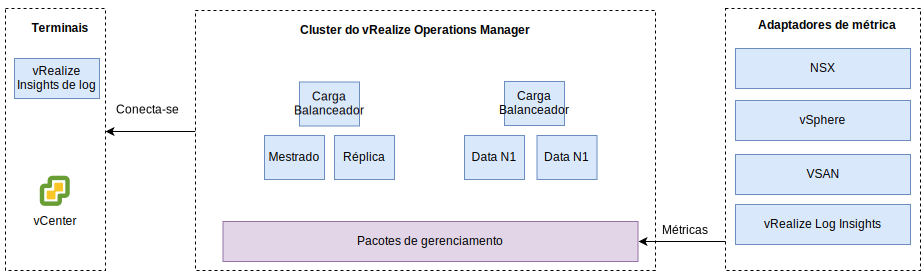

---

copyright:

  years:  2016, 2019

lastupdated: "2019-05-17"

---

# Design do vRealize Operations Manager
{: #opsmgmt-vrops}

O Cluster de Analítica do vROps contém os nós que analisam e armazenam dados dos componentes monitorados e, nesta implementação, são implementados quatro nós e dois Balanceadores de Carga NSX. Esse tamanho permite o monitoramento de até 30.000 VMs e 9.000.000 métricas a serem coletadas.

O cluster de analítica de 4 nós consiste no seguinte:
* Nó principal – O nó Principal é o nó inicial em um cluster do vROps. Em um grande ambiente, esse nó gerencia todos os outros.
* Réplica do nó principal – Esse nó permite a alta disponibilidade do nó principal.
* Nós de dados – O nó de dados permite dimensionar o vROps em ambientes maiores e, nesse design, dois são implementados.

Além disso, o design usa os Nós do Coletor Remoto que atuam como um servidor proxy/de retransmissão apenas para coletar dados e encaminhá-los aos Nós Principais/de Dados. Nós de Dados e de Coletores Remotos podem ser incluídos para o dimensionamento, dependendo do tamanho do ambiente. O posicionamento de componentes do vROps em VLANs/VXLANs é mostrado no diagrama a seguir.

* O Nó Principal, a Réplica do Nó Principal e os Nós de Dados são implementados na sub-rede do conjunto de ferramentas usando os endereços IP Móveis do {{site.data.keyword.cloud_notm}} para facilitar a comunicação com todos os componentes que são transmitidos do espaço de endereço RFC1918 do {{site.data.keyword.cloud_notm}}, incluindo hosts do vSphere, o vCenter, o Platform Services Controller, o Gerenciador NSX e os Controladores NSX. Um Balanceador de Carga NSX é usado com um VIP para alta disponibilidade.
* Como as cargas de trabalho do cliente usam o endereçamento IP do espaço de endereço BYOIP, esse design usa Coletores Remotos hospedados em uma VXLAN. Esses coletores remotos não são configurados como parte da automação do {{site.data.keyword.vmwaresolutions_full}} e devem ser implementados manualmente pelo cliente.

O Cluster de Analítica do vROps é acessado por meio de uma interface com o usuário de gerenciamento ou de uma API e integra-se aos seguintes:
* vCenter
* vRealize Log Insight

O cliente pode realizar a integração manual nos produtos a seguir, caso tenham sido implementados:
* vRealize Automation
* vRealize Business

O vROps coleta dados dos seguintes:
* vSphere - vCenter, Platform Services Controller, hosts do vSphere
* NSX - Gerenciador do NSX, Controladores do NSX e NSX Edges
* vRLI

O cliente pode configurar manualmente o vROps para coletar dados do vRealize Automation e do vRealize Business for Cloud.

## Requisitos do sistema
{: #opsmgmt-vrops-requirements}

O cluster de analítica consiste em um nó principal, um nó de réplica principal e dois nós de dados para permitir a alta disponibilidade e o dimensionamento. Nós de dados adicionais são incluídos para o dimensionamento. O cluster de analítica pode ser escalado para um máximo de 8 nós de tamanho médio.

Tabela 1. Configurações do sistema para o Nó Principal/de Réplica do Operations Manager

| Atributo | Especificação |
|---|---|
| vCPU | 8 |
| Memória | 32 GB |
| Disco (thick provisioned) | 254 GB |

Tabela 2. Configurações do sistema para o Nó de Dados do Operations Manager

| Atributo | Especificação |
|---|---|
| vCPU | 8 |
| Memória | 32 GB |
| Disco (thick provisioned) | 254 GB |

Se o monitoramento das VMs de cálculo for necessário, o cliente deverá instalar dois nós do coletor remoto em uma VXLAN. O tamanho de um Dispositivo Virtual do Coletor Remoto Padrão é de 2 vCPU com 4 GB de RAM e o tamanho do VMDK de dispositivo padrão é suficiente. Os nós do coletor remoto são implementados com discos thin-provisioned, pois não executam operações de análise ou armazenam dados.

Tabela 3. Configurações do Balanceador de Carga do Operations Manager

| Configuração | Balanceador de carga 1 | Balanceador de carga 2|
|---|---|---|
| Nome | vrops-ui | vrops-data |
| Intervalo | 30 | 5 |
| Tempo limite | 5 | 15 |
| Máx. de novas tentativas | 3 | |
| Tipo | HTTPS | TCP |
| Método | Obter | -- |
| URL | /suite-api/api/deployment/node/status | -- |
| Recebimento | ON-LINE | -- |
| Algoritmo | ROUND-ROBIN | LEASTCONN |
| Conjunto | 4 nós de vROPs | 4 nós de vROPs |

Para obter mais informações, consulte [Balanceamento de carga do vRealize Automation Load Balancing (PDF)](https://docs.vmware.com/en/vRealize-Automation/7.5/vrealize-automation-load-balancing.pdf){:new_window}.

## Rede
{: #opsmgmt-vrops-network}

A implementação do dispositivo do vROps requer seis IPs da sub-rede móvel privada do Conjunto de ferramentas. O vROps de conectividade de rede requer acesso a:
* Dispositivo do vCenter
* Dispositivo vRealize Log Insight
* Dispositivos NSX-V/T
* VXLAN de expansão de conjunto de ferramentas
* Redes do cliente
* Servidor NTP (time.services.softlayer.com)
* Active Directory/DNS do {{site.data.keyword.vmwaresolutions_short}}
* Os Coletores remotos requerem regras do NAT no NSX ESG para ativar a conectividade com o Nó principal, a Réplica do nó principal e Nós de dados

## Portas
{: #opsmgmt-vrops-ports}

Tabela 4. Portas do Operation Manager

| Componente | Protocolo | Port |
|---|---|---|
| vCenter | TCP | 443 |
| DNS | TCP/UDP | 53 |
| LDAP/LDAPS | TCP | 389/636 |
| LDAP GC | TCP | 3268/3269 |
| NTP | UDP | 123 |
| SMTP | TCP | 25 |
| SNMP | UDP | 161 |

### Autenticação
{: #opsmgmt-vrops-auth}

O Gerenciamento de Usuário para o vROps requer o VMware Identity Manager (vIDM), que se integra ao Active Directory. Contas de serviço são usadas para a comunicação de aplicativo a aplicativo do vRealize Operations Manager com os seguintes adaptadores a seguir, com o conjunto mínimo de permissões necessárias para a coleção de métricas e o mapeamento de topologia:

* Gerenciador NSX
* vCenter
* vSAN

## Pacotes de gerenciamento
{: #opsmgmt-vrops-management}

Os Pacotes de Gerenciamento para o vROps estendem os recursos de gerenciamento operacional da plataforma do vROps para fornecer alertas e painéis específicos do produto.

Os Pacotes de Gerenciamento a seguir são instalados no vROps por padrão:
* Management Pack for VMware vCenter Server
* Management Pack for vRealize Log Insight
* Management Pack for vSAN
* Management Pack for vRealize Automation
* Management Pack for vRealize Business for Cloud

Os componentes a seguir são instalados pelo {{site.data.keyword.vmwaresolutions_short}}:
* VMware SDDC Health Management Pack
* Management Pack for NSX for vSphere
* vRealize Operations Federation Management pack
* Management Pack for Hybrid Cloud Extension (HCX)

Outros pacotes de gerenciamento podem ser instalados pelo cliente. Para obter mais informações, consulte [Pacotes de gerenciamento no VMware Exchange](https://marketplace.vmware.com/vsx/?contentType=1&listingStyle=table){:new_window}.

### Management Pack for VMware vCenter Server
{: #opsmgmt-vrops-management-vCenter}

Esse Pacote de Gerenciamento padrão estende a funcionalidade do vROps para o vCenter, permitindo a coleta de objetos, métricas e alertas.

### Management Pack for vRealize Log Insight
{: #opsmgmt-vrops-management-vrli}

Esse Pacote de Gerenciamento padrão estende a funcionalidade do vROps para o vRLI, permitindo o monitoramento do ambiente vRLI e a integração de eventos e alertas do vRLI no vROps.

### Management Pack for vSAN
{: #opsmgmt-vrops-management-vsan}

O vRealize Operations Management Pack for vSAN permite que os painéis específicos do vSAN avaliem, gerenciem e otimizem o desempenho de objetos vSAN e objetos ativados para vSAN.

### VMware SDDC Health Management Pack
{: #opsmgmt-vrops-management-sddc}

O VMware SDDC Health Management Pack for vROps monitora a pilha de gerenciamento do SDDC e fornece métricas codificadas por cor para o funcionamento e a eficiência dos diferentes componentes presentes como parte da pilha de gerenciamento do SDDC. Com os painéis no VMware SDDC Health Management Pack, é possível monitorar os componentes a seguir da instância do vCenter Server e do conjunto de ferramentas de gerenciamento:
* vRealize Operations Manager
* NSX for vSphere/VMware NSX-T
* VMware vSAN
* vRealize Log Insight
* vCenter Server

Além disso, se os seguintes tiverem sido instalados, poderão ser monitorados:
* vRealize Automation
* vRealize Orchestrator
* vRealize Business for Cloud
* VMware Site Recovery Manager

O VMware SDDC Health Management Pack fornece os painéis a seguir:
* Painel de visão geral do SDDC Management Health - É possível usar o painel de visão geral do SDDC Management Health para visualizar e analisar os problemas específicos do aplicativo nos componentes do SDDC.
* Painel de tendência histórica de funcionamento do SDDC - O VMware SDDC Health Management Pack consiste no painel de tendência histórica de funcionamento do SDDC, que exibe a tendência de funcionamento para cada componente na pilha do SDDC.
* Painel de dimensionamento do SDDC vRealize Operations Manager - O painel de dimensionamento do SDDC vRealize Operations Manager fornece capacidade de cluster do vRealize Operations Manager para processar objetos e métricas.

Os plug-ins no VMware SDDC Health Management Pack coletam métricas para tipos de objetos contidos neles. O Pacote de Gerenciamento coleta as métricas de funcionamento para os seguintes:
* vCenter Server
* Management Pack for NSX for vSphere
* vRealize Automation
* vRealize Operations Manager
* vRealize Business
* vRealize Log Insight
* VMware Site Recovery Manager
* vCenter HA
* vMware vSAN Health
* Serviços no vCenter Server Appliance
* Dimensionamento do vRealize Operations Manager
* vRealize Orchestrator

### Management Pack for NSX-T
{: #opsmgmt-vrops-management-nsxt}

O pacote de gerenciamento do NSX-T amplia os recursos de análise principal, correlação, capacidade preditiva e visualização do vROps para redes virtuais. O pacote inclui o seguinte:
* Garantia de configuração
* Saúde
* Desempenho
* Capacidades
* Resolução de problemas em objetos do NSX-T

### Management Pack for NSX for vSphere
{: #opsmgmt-vrops-management-nsxv}

O pacote de gerenciamento do NSX for vSphere oferece cobertura de gerenciamento de operações para implementações das tecnologias NSX de rede virtual do VMware. Esse pacote de gerenciamento estende recursos de análise principal, correlação, capacidade preditiva e visualização do vROps para redes virtuais. A cobertura inclui a garantia de configuração, o funcionamento, o desempenho, a capacidade e a resolução de problemas para comutadores lógicos, roteadores lógicos, serviços de borda, firewall distribuído e balanceadores de carga NSX.

O pacote de gerenciamento do NSX for vSphere está fortemente integrado ao vROps e os dados de host do vSphere estão correlacionados aos serviços NSX em execução nesses hosts. Com a integração de log por meio de vRLI, as condições de erro e indisponibilidade, acionadas por meio de mensagens de log, são alertadas dentro das janelas de objeto e problema do pacote de gerenciamento.

### vRealize Operations Federation Management Pack
{: #opsmgmt-vrops-management-federation}

O vRealize Operations Federation Management Pack permite uma implementação multissite do vROps em uma única área de janela de vidro. Ele permite uma implementação do vROps com a capacidade de receber métricas de chave para objetos especificados de implementações do vROps.

### Management Pack for Hybrid Cloud Extension (HCX)
{: #opsmgmt-vrops-management-hcx}

O vRealize Operations Management Pack for HCX estende os recursos de Operations Management do vROps para recursos híbridos apresentados pelo HCX. Com o pacote de gerenciamento, é possível coletar métricas, eventos de mudança e informações de topologia de recurso do HCX. Ele permite o monitoramento, o isolamento e a resolução de gargalos de desempenho nas cargas de trabalho Protegidas, de Migrações e de Interconexões do HCX.

## Links relacionados
{: #opsmgmt-vrops-management-links}

* [Visão geral do vCenter Server on {{site.data.keyword.cloud_notm}} with Hybridity Bundle](/docs/services/vmwaresolutions/archiref/vcs?topic=vmware-solutions-vcs-hybridity-intro)
* [Diretrizes de dimensionamento do vRealize Operations Manager 7.0](https://kb.vmware.com/s/article/57903){:new_window}
* [Documentação do vRealize Operations Manager](https://docs.vmware.com/en/vRealize-Operations-Manager/index.html){:new_window}
* [Management Pack for vSAN](https://marketplace.vmware.com/resources/vsx/product_files/31742/original/Management-Pack-for-vSAN-Guide6d2a8895b022a5f626a86e8e84b031b5.pdf){:new_window}
* [Revise as instruções de atualização do cluster vSAN em](https://cloud.ibm.com/docs/services/vmwaresolutions/archiref/vum/vum-updating-vsan.html#updating-vsan-clusters){:new_window}
* [Management-Pack-for-vSAN-Guide](https://marketplace.vmware.com/resources/vsx/product_files/31742/original/Management-Pack-for-vSAN-Guide6d2a8895b022a5f626a86e8e84b031b5.pdf){:new_window}
* [Informações de verificação de funcionamento do vSAN](https://kb.vmware.com/s/article/2114803){:new_window}
* [Operacionalizando o VMware NSX](https://www.vmware.com/content/dam/digitalmarketing/vmware/en/pdf/products/nsx/vmware-operationalizing-nsx.pdf){:new_window}
* [Guia de Operações do NSX](https://communities.vmware.com/servlet/JiveServlet/previewBody/30079-102-2-40474/NSX-Operations-Guide-v6.1.pdf){:new_window}
