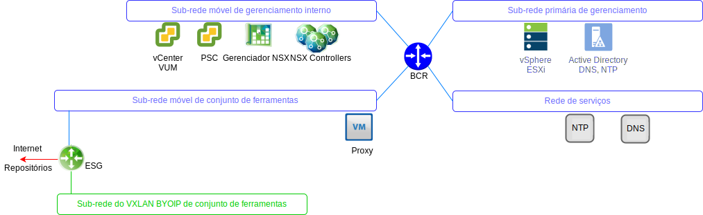

---

copyright:

  years:  2016, 2019

lastupdated: "2019-05-16"

---

# VMware Update Manager
{: #opsmgmt-vum}

O VMware Update Manager (VUM) permite o gerenciamento de versão e correção automatizado e centralizado para o VMware vSphere e permite concluir as seguintes tarefas no ambiente do VMware vCenter Server on {{site.data.keyword.cloud}}:
* Fazer upgrade e corrigir os hosts do vSphere ESXi
* Instalar e atualizar o software de terceiros nos hosts
* Fazer upgrade do hardware da máquina virtual (VM), das Ferramentas do VMware e dos dispositivos virtuais

Para obter o design detalhado do VMware Update Manager, consulte [Introdução ao VMware Update Manager](https://cloud.ibm.com/docs/services/vmwaresolutions/archiref/vum/vum-intro.html#vmware-update-manager-introduction){:new_window}.

## Links relacionados
{: #opsmgmt-vum-links}

* [Visão geral do vCenter Server on {{site.data.keyword.cloud_notm}} with Hybridity Bundle](/docs/services/vmwaresolutions/archiref/vcs?topic=vmware-solutions-vcs-hybridity-intro)
* [VMware Update Manager](https://docs.vmware.com/en/VMware-vSphere/6.5/com.vmware.vsphere.update_manager.doc/GUID-F7191592-048B-40C7-A610-CFEE6A790AB0.html){:new_window}
