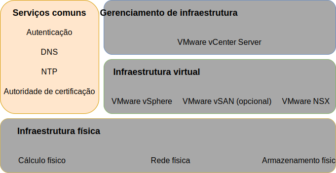
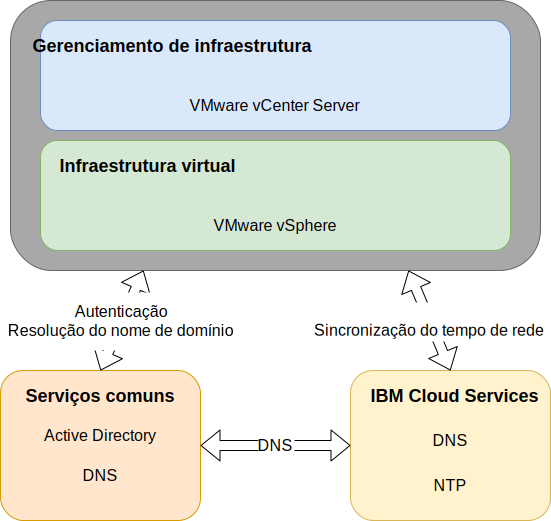

---

copyright:

  years:  2016, 2019

lastupdated: "2019-03-19"

subcollection: vmwaresolutions

---

{:tip: .tip}
{:note: .note}
{:important: .important}

# Design de serviços comuns
{: #design_commonservice}

Os serviços comuns fornecem os serviços que são usados por outros serviços na plataforma de gerenciamento de nuvem. Os serviços comuns da solução incluem serviços de identidade e acesso, serviços de nomes de domínio, serviços NTP, serviços SMTP e serviços de autoridade de certificação.

Figura 1. Serviços comuns 

## Serviços de identidade e de acesso
{: #design_commonservice-identity-access}

Nesse design, o Microsoft Active Directory (MSAD) é usado para o Gerenciamento de identidade. O design implementa uma ou duas máquinas virtuais do Active Directory como parte da automação de implementação do vCenter Server. O vCenter está configurado para usar a autenticação do MSAD.

### Microsoft Active Directory
{: #design_commonservice-msad}

Por padrão, uma única VSI do Active Directory é implementada na infraestrutura do {{site.data.keyword.cloud}}.

O design também fornece a opção de implementar dois servidores do MSAD altamente disponíveis como VMs do Windows Server dedicadas no cluster de gerenciamento.

Se você escolher a opção com dois servidores do MSAD altamente disponíveis, será responsável por fornecer o licenciamento e a ativação da Microsoft.
{:note}

O Active Directory serve para autenticar acessos somente para gerenciar a instância do VMware e não para hospedar usuários das cargas de trabalho nas instâncias implementadas. O nome de domínio-raiz da floresta do Active Directory Server é igual ao nome de domínio do DNS especificado. Esse nome de domínio será especificado somente para a instância primária do vCenter Server se múltiplas instâncias estiverem vinculadas. Para instâncias vinculadas, cada instância contém um servidor Active Directory que fica no anel de réplica raiz da floresta. Os arquivos de zona do DNS também são replicados nos Active Directory Servers.

### Domínio SSO do vSphere
{: #design_commonservice-vsphere-sso}

O domínio de Conexão Única (SSO) do vSphere é usado como o mecanismo de autenticação inicial para uma única instância ou múltiplas instâncias vinculadas. O domínio de SSO também serve para conectar uma instância do VMware ou múltiplas instâncias vinculadas ao servidor do MSAD. A configuração de SSO a seguir é aplicada:  
* O domínio de SSO de `vsphere.local` é sempre usado
* Para instâncias do VMware que estão vinculadas a uma instância existente, o PSC integrado é unido ao domínio de SSO da instância existente
* O nome do site de SSO é igual ao nome da instância

## Domain name services
{: #design_commonservice-dns}

Os Domain name services (DNS) nesse design destinam-se somente aos componentes de gerenciamento de nuvem e de infraestrutura.

### Instância primária do vCenter Server
{: #design_commonservice-primary-vcs}

A implementação do vCenter Server usa as VSIs do AD implementadas como servidores DNS para a instância. Todos os componentes
implementados (vCenter com hosts do PSC, NSX, ESXi incorporados) são configurados para apontar para o AD como o seu DNS padrão. Será possível customizar a configuração da zona
do DNS se ela não interferir na configuração dos componentes implementados.
- Esse design integra serviços do DNS nas VSIs do AD na configuração a seguir:
- A estrutura de domínio é especificada pelo usuário. O nome de domínio pode ser qualquer número de níveis até o máximo que todos os componentes do vCenter Server manipulam, assegurando que o nível mais baixo seja o subdomínio para a instância.
    - O nome de domínio do DNS que você fornece é usado como o nome de domínio da floresta raiz do AD implementado do vCenter Server. Por exemplo, se o nome de domínio do DNS for cloud.ibm.com, a raiz de floresta do domínio do AD será cloud.ibm.com. O domínio do DNS e o domínio do AD são os mesmos em todas as instâncias federadas do vCenter Server.
    - Selecione um nome extra como o subdomínio da instância do vCenter Server. Esse nome de subdomínio deve ser exclusivo em todas as instâncias vinculadas do vCenter Server.
- Os servidores do DNS do AD são configurados para serem autoritativos para o domínio do DNS e o espaço de subdomínio.
- Os servidores do DNS do AD são configurados para apontar para os servidores do DNS do {{site.data.keyword.cloud_notm}} para todas as outras zonas.
- Quaisquer regiões de nuvem secundárias que são integradas à primeira região de nuvem implementada ou de destino devem usar a mesma estrutura de nome do DNS acima do subdomínio.
- Opcionalmente, implemente servidores do DNS redundantes dentro do cluster do vCenter Server. Dois servidores do AD/DNS são configurados sem licença. É responsabilidade do usuário fornecer licenças para os sistemas operacionais Windows para esses servidores.
- Se um único site for provisionado com apenas um servidor do AD/DNS, todos os componentes do vCenter Server configurados deverão ter APENAS esse IP único como uma entrada do DNS.

### Instâncias secundárias do vCenter Server
{: #design_commonservice-secondary-vcs}

Para redundância de instância cruzada, quando a primeira instância secundária do vCenter Server for incluída em uma instância primária existente do vCenter Server ou em uma instância independente atual do vCenter Server, esse endereço IP do servidor do DNS do AD da instância primária será usado na instância secundária do vCenter Server e qualquer entrada de "DNS secundário" da instância secundária subsequente do vCenter Server para todos os componentes que requeiram uma entrada do servidor do DNS. Por exemplo, o gerenciador do ESXi, do vCenter e do NSX. Isso inclui componentes complementares, como o HCX, o Zerto e o Veeam. A entrada do DNS secundária do site primário é, então, mudada para o primeiro endereço IP do AD/DNS de instâncias secundárias do vCenter Server.

## Serviços NTP
{: #design_commonservice-ntp}

Esse design utiliza os servidores NTP de infraestrutura do {{site.data.keyword.cloud_notm}}. Todos os componentes implementados são configurados para utilizar esses servidores NTP. Ter todos os componentes dentro do design usando o mesmo servidor NTP é crítico para que os certificados e a autenticação do Active Directory funcionem corretamente.

Figura 2. Serviços do NTP e do DNS 

## Serviços de autoridade de certificação
{: #design_commonservice-cas}

Por padrão, o VMware vSphere usa certificados TLS que são assinados pela VMware Certificate Authority (VMCA), que reside no dispositivo VMware Platform Services Controller. Esses certificados não são confiáveis pelos dispositivos ou navegadores do usuário final. A melhor prática de segurança é substituir certificados voltados ao usuário por certificados que são assinados por uma autoridade de certificação (CA) de terceiro ou corporativa. Os certificados para comunicação máquina a máquina podem permanecer como certificados assinados pela VMCA, no entanto, é recomendado seguir as melhores práticas para sua organização, que geralmente envolvem o uso de uma CA corporativa identificada.

É possível usar os servidores Windows AD dentro desse design para criar certificados que são assinados pela instância local. No entanto, também é possível escolher configurar os serviços de CA, se necessário.

## Links relacionados
{: #design_commonservice-related}

* [ Design da infraestrutura física ](/docs/services/vmwaresolutions/archiref/solution?topic=vmware-solutions-design_physicalinfrastructure)
* [ Design de infraestrutura virtual ](/docs/services/vmwaresolutions/archiref/solution?topic=vmware-solutions-design_virtualinfrastructure)
* [ Design de gerenciamento de infraestrutura ](/docs/services/vmwaresolutions/archiref/solution?topic=vmware-solutions-design_infrastructuremgmt)
