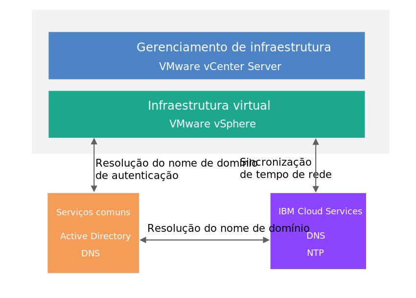

---

copyright:

  years:  2016, 2018

lastupdated: "2018-10-29"

---

{:tip: .tip}
{:note: .note}
{:important: .important}

# Design de serviços comuns

Os serviços comuns fornecem os serviços que são usados por outros serviços na plataforma de gerenciamento de nuvem. Os serviços comuns da solução incluem serviços de identidade e acesso, serviços de nomes de domínio, serviços NTP, serviços SMTP e serviços de autoridade de certificação.

## Serviços de identidade e de acesso

Nesse design, o Microsoft Active Directory (AD) é usado para o Gerenciamento de Identidade. O design implementa uma ou duas máquinas virtuais do Windows Active Directory como parte da automação de implementação do Cloud Foundation e do vCenter Server. O vCenter é configurado para usar a autenticação do AD.

### Microsoft Active Directory

Por padrão, uma única VSI do Active Directory é implementada na infraestrutura do {{site.data.keyword.cloud}}. O design também fornece a opção de implementar dois servidores Microsoft Active Directory altamente disponíveis como VMs dedicadas do Windows Server no cluster de gerenciamento.

Você será responsável por fornecer o licenciamento e a ativação da Microsoft se escolher essa opção.
{:note}

O Active Directory serve para autenticar acessos somente para gerenciar a instância do VMware e não para hospedar usuários das cargas de trabalho nas instâncias implementadas. O nome de domínio-raiz da floresta do Active Directory Server é igual ao nome de domínio do DNS especificado. Esse nome de domínio será especificado somente para a instância primária do Cloud Foundation e do vCenter Server se múltiplas instâncias estiverem vinculadas. Para instâncias vinculadas, cada instância contém um servidor Active Directory que fica no anel de réplica raiz da floresta. Os arquivos de zona do DNS também são replicados nos Active Directory Servers.

### Domínio SSO do vSphere

O domínio de Conexão Única (SSO) do vSphere é usado como o mecanismo de autenticação inicial para uma única instância ou múltiplas instâncias vinculadas. O domínio de SSO também serve para conectar uma instância do VMware ou múltiplas instâncias vinculadas ao Microsoft Active Directory Server. A configuração de SSO a seguir é aplicada:  
* O domínio de SSO de `vsphere.local` é sempre usado
* Para instâncias do VMware que estão vinculadas a uma instância existente, o PSC é unido ao domínio SSO da instância existente
* O nome do site de SSO é igual ao nome da instância

## Domain Name Services (DNS)

O DNS neste design é somente para os componentes de gerenciamento de nuvem e de infraestrutura.

### VMware vCenter Server

A implementação do vCenter Server usa os Active Directory Servers implementados como os servidores DNS para a instância. Todos os componentes implementados (hosts do vCenter, PSC, NSX e ESXi) são configurados para apontar para o Active Directory Server como seu servidor DNS padrão. É possível customizar a configuração de zona do DNS se a sua configuração não interfere na configuração dos componentes implementados.

Esse design integra serviços do DNS nos Active Directory Servers por meio da configuração a seguir:
* É possível especificar a estrutura de domínio. O nome de domínio pode ser qualquer número de níveis (até o máximo que os componentes do vCenter Server podem manipular). O nível mais baixo é o subdomínio para a instância.
   * O nome de domínio DNS especificado é usado como o nome de domínio da floresta raiz do Active Directory. Por exemplo, se o nome de domínio do DNS for `cloud.ibm.com`, o nome de domínio-raiz da floresta do Active Directory será `cloud.ibm.com`. Esse nome de domínio do DNS e do Active Directory é o mesmo em todas as instâncias vinculadas do vCenter Server.
   * Além disso, é possível especificar um nome de subdomínio para a instância. O nome de subdomínio deve ser exclusivo em todas as instâncias vinculadas do vCenter Server.
* Os servidores DNS do Active Directory são configurados para serem autorizados para o domínio do DNS e o espaço do subdomínio.
* Os servidores DNS do Active Directory são configurados para apontar para os servidores DNS do {{site.data.keyword.cloud_notm}} para todas as outras zonas.
* Qualquer instância a ser integrada a uma instância de destino existente deve usar o mesmo nome de domínio que a instância primária.

### VMware Cloud Foundation

A implementação do Cloud Foundation usa a automação do VMware Cloud Foundation, que usa seu próprio servidor DNS que reside dentro do componente de VM SDDC Manager. Os componentes do Cloud Foundation que são gerenciados pelo SDDC Manager, incluindo hosts do vCenter, PSC, NSX e ESXi, são configurados para usar o endereço IP da VM do SDDC Manager como seu DNS padrão por design.

Como o SDDC Manager gera e mantém os nomes de host para os componentes que ele gerencia, não é recomendado corromper seu arquivo de zona do DNS diretamente para incluir e remover hosts.

Esse design integra serviços do DNS nos Active Directory Servers com a VM do SDDC Manager na configuração a seguir:
* É possível especificar a estrutura de domínio. O nome de domínio pode ser qualquer número de níveis (até o máximo que os componentes do Cloud Foundation manipularão).
* O nível mais baixo é o subdomínio para o qual o SDDC Manager está autorizado.
* O nome de domínio DNS especificado será usado como o nome de domínio da floresta raiz do Active Directory. Por exemplo, se o nome de domínio do DNS for `cloud.ibm.com`, a raiz da floresta do domínio do Active Directory será `cloud.ibm.com`. Esse domínio DNS e o domínio do Active Directory são os mesmos em todas as instâncias do Cloud Foundation vinculadas.
* Além disso, é possível especificar um nome de subdomínio para a instância. O nome de subdomínio deve ser exclusivo em todas as instâncias vinculadas do Cloud Foundation.  
* A configuração do DNS do SDDC Manager é alterada para apontar para os Active Directory Servers para todas as zonas, exceto para a zona pela qual ele é responsável.
* Os servidores DNS do Active Directory são configurados para ser autoritativos para o espaço de domínio do DNS no subdomínio da instância do SDDC Manager e do Cloud Foundation.
* Os servidores DNS do Active Directory são configurados para apontar para o endereço IP do SDDC Manager para a delegação de subdomínio da zona para a qual o SDDC Manager é autorizado.
* Os servidores DNS do Active Directory são configurados para apontar para os servidores DNS do {{site.data.keyword.cloud_notm}} para todas as outras zonas.
* Qualquer instância secundária que deva ser integrada à primeira instância ou à instância de destino deve utilizar a mesma estrutura de nome do DNS no subdomínio do SDDC Manager.

## Serviços NTP

Esse design utiliza os servidores NTP de infraestrutura do {{site.data.keyword.cloud_notm}}. Todos os componentes implementados são configurados para utilizar esses servidores NTP. Ter todos os componentes dentro do design usando o mesmo servidor NTP é crítico para que os certificados e a autenticação do Active Directory funcionem corretamente.

Figura 1. Serviços NTP

## Serviços de autoridade de certificação

Por padrão, o VMware vSphere usa certificados TLS que são assinados pela VMware Certificate Authority (VMCA), que reside no dispositivo VMware Platform Services Controller. Esses certificados não são confiáveis pelos dispositivos ou navegadores do usuário final. A melhor prática de segurança é substituir certificados voltados ao usuário por certificados que são assinados por uma autoridade de certificação (CA) de terceiro ou corporativa. Os certificados para comunicação máquina a máquina podem permanecer como certificados assinados pela VMCA, no entanto, é recomendado seguir as melhores práticas para sua organização, que geralmente envolvem o uso de uma CA corporativa identificada.

É possível usar os servidores Windows AD dentro desse design para criar certificados que são assinados pela instância local. No entanto, também é possível escolher configurar os serviços de CA, se necessário.

### Links relacionados

* [ Design da infraestrutura física ](design_physicalinfrastructure.html)
* [ Design de infraestrutura virtual ](design_virtualinfrastructure.html)
* [ Design de gerenciamento de infraestrutura ](design_infrastructuremgmt.html)
