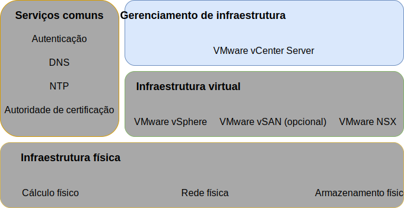

---

copyright:

  years:  2016, 2019

lastupdated: "2019-05-07"

subcollection: vmware-solutions

---

{:tip: .tip}
{:note: .note}
{:important: .important}

# Design de gerenciamento de infraestrutura
{: #design_infrastructuremgmt}

O gerenciamento de infraestrutura se refere aos componentes que estão gerenciando a infraestrutura do VMware.
* O vCenter Server com um Platform Services Controller (PSC) integrado é a plataforma centralizada para gerenciar ambientes do vSphere e é um dos componentes fundamentais nessa solução.
* O PSC é usado nesta solução para fornecer um conjunto de serviços de infraestrutura, que incluem o VMware vCenter Single Sign On, o serviço de licença, o serviço de consulta e a autoridade de certificação do VMware.

Esse design usa uma função do PSC que é integrada a uma instância do vCenter Server. O PSC e o vCenter Server são alojados dentro da mesma máquina virtual (VM).

O PSC localizado na instância primária é designado ao domínio de SSO padrão de `vsphere.local`.

## Design do vCenter Server
{: #design_infrastructuremgmt-vcenter}

O vCenter Server com um PSC integrado é instalado em uma sub-rede móvel na VLAN privada que está associada a VMs de gerenciamento. Seu gateway padrão é configurado para o endereço IP designado no BCR para essa sub-rede específica. O dispositivo virtual é configurado com as especificações na tabela a seguir.

Tabela 1. Especificações do vCenter Server Appliance

| Atributo                    | Especificação                       |
|------------------------------|-------------------------------------|
| vCenter Server               | Dispositivo Virtual                   |
| Tamanho da instalação do dispositivo  | Grande (até 1.000 hosts e 10.000 VMs) |
| Platform Services Controller | Integrado                            |
| Número de vCPUs              | 16                                   |
| Memória                       | 32 GB                               |
| Disco                         | 990 GB no armazenamento de dados local (Implementação de disco grande) |
| Tipo de disco                    | Thin provisioned                    |

### Banco de dados do vCenter Server
{: #design_infrastructuremgmt-vcenter-db}

A configuração do vCenter Server usa um banco de dados PostgreSQL local e integrado que é incluído com o dispositivo. O banco de dados integrado é usado para remover qualquer dependência e licenciamento de bancos de dados externos.

### Especificação de cluster do vCenter Server
{: #design_infrastructuremgmt-vcenter-cluster}

Com esse design, é possível agrupar os hosts vSphere ESXi que são provisionados por meio da solução. No entanto, antes que os clusters possam ser criados, um objeto de data center é criado, que significa o local dos hosts vSphere ESXi, bem como o pod dentro do data center. Um cluster é criado após a criação do objeto data center. O cluster é implementado com o VMware vSphere High Availability (HA) e o VMware vSphere Distributed Resource Scheduler (DRS) ativados.

### Planejador de Recurso Distribuído do vSphere
{: #design_infrastructuremgmt-vsphere-drs}

Esse design usa o vSphere Distributed Resource Scheduling (DRS) no cluster inicial para colocar MVs e usa o DRS em clusters adicionais para migrar dinamicamente as MVs para alcançar clusters balanceados. O nível de automação é configurado para totalmente automatizado para que as recomendações iniciais de posicionamento e migração sejam executadas automaticamente pelo vSphere. Além disso, o limite de migração é configurado para moderado para que o vCenter aplique recomendações de prioridade 1, 2 e 3, para alcançar pelo menos uma melhoria decente no balanceamento de carga do cluster.

O gerenciamento de energia por meio do recurso **Distributed Power Management** não é usado neste design.
{:note}

### Alta Disponibilidade do vSphere
{: #design_infrastructuremgmt-vsphere-ha}

Esse design usa o vSphere High Availability (HA) no cluster inicial e clusters extras para detectar falhas de cálculo e recuperar MVs que são executadas dentro de um cluster. O recurso vSphere HA neste design é configurado com as opções **Monitoramento do host** e **Controle de admissão** ativadas no cluster. Além disso, o cluster inicial reserva os recursos de um nó como a capacidade sobressalente para a política de controle de admissão.

Você será responsável por ajustar a política de controle de admissão quando o cluster for expandido ou contraído posteriormente.
{:note}

Por padrão, a opção **Prioridade de reinicialização da VM** está configurada como média e a opção **Resposta de isolamento do host** está desativada. Além disso, o **Monitoramento de VM** está desativado e o recurso **Pulsação de armazenamento de dados** está configurado para incluir qualquer um dos armazenamentos de dados do cluster. Essa abordagem usará os armazenamentos de dados NAS se eles estiverem presentes.

### Compatibilidade de vMotion aprimorada
{: #design_infrastructuremgmt-evc}

Para simplificar a compatibilidade do vMotion entre os nós do cluster com recursos potencialmente diferentes de CPU, o modo Enhanced vMotion Compatibility (EVC) é ativado em um nível do Skylake para assegurar a compatibilidade do vMotion entre os nós do cluster quando os processadores mais novos chegam dentro do inventário do {{site.data.keyword.cloud_notm}} e permite a expansão do cluster no futuro caso os servidores do processador Skylake não estejam no inventário.

## IBM CloudDriver
{: #design_infrastructuremgmt-cloud-driver}

O fundamento dessas soluções é a automação. A automação reduz a complexidade da implementação, reduz drasticamente o tempo de implementação e assegura que a instância do VMware seja implementada de uma maneira consistente.

O IBM CloudBuilder é uma instância de servidor virtual (VSI) da VM do {{site.data.keyword.cloud_notm}} efêmera que
funciona para criar uma nova instância do VMware e executar funções de gerenciamento de ciclo de vida. Ele é implementado quando o gerenciamento de instância do vCenter Server geral é necessário e é destruído quando o processo é concluído.

O IBM CloudDriver é uma instância de servidor virtual (VSI) efêmera da VM do {{site.data.keyword.cloud_notm}} que é implementada, conforme necessário, para operações do dia 2, como incluir hosts, clusters ou serviços complementares para sua instância do VMware.

O CloudBuilder e o CloudDriver são implementados somente na rede privada conectando-se ao plano de gerenciamento IBM por meio de uma fila de mensagens privadas. Eles são componentes desenvolvidos pela IBM, não são acessíveis ao usuário e têm os atributos e as funções a seguir:
* Implementação e configuração da instância do vCenter Server dentro da conta do usuário.
* Inclusão e remoção de hosts dos clusters do vCenter Server.
* Inclusão e remoção de clusters de instâncias do vCenter Server.
* Inclusão e remoção de serviços ou funções complementares em instâncias do vCenter
Server.

### Fluxo de automação
{: #design_infrastructuremgmt-auto-flow}

O seguinte descreve a ordem de eventos quando você usa o console do {{site.data.keyword.vmwaresolutions_short}} para pedir uma instância do VMware:
1. Pedindo VLANs e sub-redes para rede do {{site.data.keyword.cloud_notm}}.
2. Pedindo o  {{site.data.keyword.cloud_notm}} {{site.data.keyword.baremetal_short}}  com o vSphere Hypervisor instalado.
3. Pedido da Microsoft Windows VSI para servir como controlador de domínio do Active Directory.
4. Implementação da VSI do Driver de nuvem.
5. Validação da rede e do hardware implementado.
6. Se aplicável, a configuração inicial da vSAN de nó único.
7. Implementação e configuração do vCenter (com o PSC integrado) e do NSX.
8. Armazenamento em cluster de nós ESXi restantes, expansão de vSAN se aplicável e configuração de componentes NSX (VTEP).
9. Validando a instalação e a configuração do ambiente.
10. Implementação de serviços opcionais, como servidor de backup e armazenamento.
11. Remoção da VSI do Driver de nuvem.

## IDs e senhas
{: #design_infrastructuremgmt-ids-pwd}

A infraestrutura de gerenciamento do IC4V armazena todos os IDs e senhas contidos no vCenter Server criptografados dentro do plano de gerenciamento do {{site.data.keyword.cloud_notm}}. Qualquer mudança nessas senhas pelo usuário pode interromper os recursos de automação dentro do vCenter Server.

É possível fornecer senhas mudadas no portal de soluções do IC4V para que a automação possa processar funções ininterruptas. O portal de soluções permite, opcionalmente, a verificação das senhas inseridas.

## Links relacionados
{: #design_infrastructuremgmt-related}

* [ Design da infraestrutura física ](/docs/services/vmwaresolutions/archiref/solution?topic=vmware-solutions-design_physicalinfrastructure)
* [ Design de infraestrutura virtual ](/docs/services/vmwaresolutions/archiref/solution?topic=vmware-solutions-design_virtualinfrastructure)
* [ Design de serviços comuns ](/docs/services/vmwaresolutions/archiref/solution?topic=vmware-solutions-design_commonservice)
