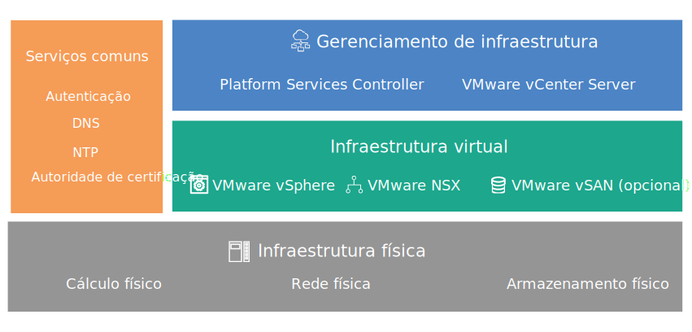

---

copyright:

  years:  2016, 2018

lastupdated: "2018-07-10"

---
# Visão geral do design

O {{site.data.keyword.vmwaresolutions_full}} fornece automação para implementar componentes de tecnologia VMware no {{site.data.keyword.CloudDataCents_notm}} em todo o mundo.

## Ofertas de solução

As ofertas de solução incluem os produtos do VMware vSphere a seguir dentro de um cluster implementado e configurado automaticamente:
* VMware Cloud Foundation: vSphere ESXi, Platform Services Controller (PSC), VMware vCenter Server Appliance, SDDC Manager, VMware NSX e VMware vSAN.
* VMware vCenter Server: vSphere ESXi, Platform Services Controller (PSC), vCenter Server Appliance, NSX e opcionalmente vSAN.

Nesse design, uma instância é implementada em um único pod de um {{site.data.keyword.CloudDataCent_notm}} na ordem inicial. Após a implementação inicial, é possível ampliar seu ambiente virtual em outros pods dentro do mesmo data center ou em outros data centers.

O design também permite expansão e contração automatizadas de capacidade virtual em uma instância do Cloud Foundation ou do vCenter Server.

## VMware em componentes do IBM Cloud

Figura 1. Componentes do VMware no {{site.data.keyword.cloud_notm}}

### Links relacionados

* [ Design da infraestrutura física ](design_physicalinfrastructure.html)
* [ Design de infraestrutura virtual ](design_virtualinfrastructure.html)
* [ Design de serviços comuns ](design_commonservice.html)
* [ Design de gerenciamento de infraestrutura ](design_infrastructuremgmt.html)
